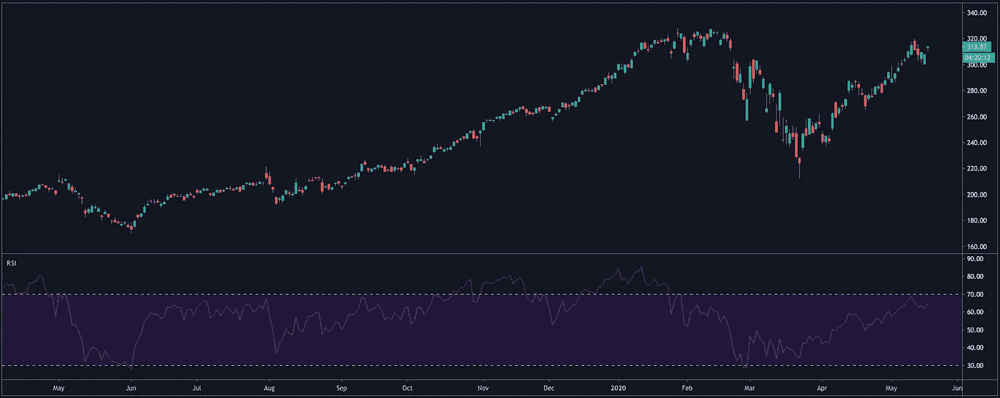
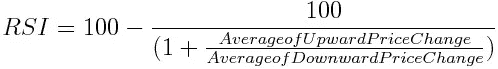
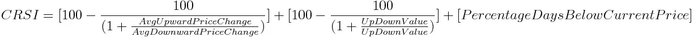

# 交易者的指标:相对强弱指数

> 原文：<https://medium.datadriveninvestor.com/indicators-for-traders-relative-strength-index-rsi-b01400f0199b?source=collection_archive---------2----------------------->

从这个故事系列开始，我将向你介绍各种技术指标，帮助你在交易中获得统计优势。这个月我们将分析相对强弱指数(RSI)。

RSI 被归类为动量或趋势振荡器。这意味着它通过在图表下方振荡来检测趋势的可能开始。

The RSI indicator. — The image has been taken from [https://www.tradingview.com/](https://www.tradingview.com/chart/1itBig6J/)

# 威尔斯·怀尔德的相对力量指数

1978 年，J. Welles Wilder Jr .出版了一本名为《技术交易系统新概念》的书。里面有一个新的技术指标，叫做“相对强弱指数”，简称“RSI”。

J. Welles Wilder Jr. — Image has been taken from [https://sacredtraders.com/j-welles-wilder-jr/](https://sacredtraders.com/j-welles-wilder-jr/)

作者出生于大萧条时期(1930 年中期)的美国田纳西州。他曾是海军的机械工程师，后来涉足房地产生意。在他的合伙人买下前者后，他开始了在商品市场的职业生涯，他专注于数学公式的开发，这将帮助他在交易中获得统计优势。

他计算的主要函数如下:

我们称之为平均值的时间范围可以由用户更改。起点是 **14 天**。怀尔德用简单移动平均线计算了上述 14 天。

作者将超过 **70 的结果描述为超买，低于 30 的结果描述为超卖**，50 表示没有趋势。

交易商可能会更改上述所有数字。有些交易者用 80 和 20 作为门槛，而不是 70 和 30。

每一个高于 70 的数值都被认为是超买，它表明可能开始下跌。低于 30 的值被认为超卖，上升趋势开始的可能性很大。

 [## 投资区块链前要问的三个简单问题(也是一个困难的问题)|数据…

### 现在是了解区块链的最佳时机。不同货币之间的增长率，比如…

www.datadriveninvestor.com](https://www.datadriveninvestor.com/2020/03/12/three-simple-questions-and-one-difficult-one-to-ask-before-investing-in-a-blockchain/) 

当我们有一个上升趋势，但是 RSI 显示超卖，我们就有一个背离。**多头背离**是指价格创出较低的低点，但 RSI 创出较高的高点。这种背离是一个可能的买入机会。当价格创出更高的高点，RSI 指标创出更低的低点时，我们就有了**看跌背离**，这是一个可能的卖出机会。

Andrew Cardwell 是 RSI 的早期适应者，他认为 RSI 对交易者来说是一个有价值的工具，他继续研究这个指标。他的观察结论是，RSI 指标和价格之间的背离应该被用作趋势确认，而不一定是反转指标。

# 拉里·康纳斯的相对实力指数(CRSI)

相对强度指数的另一个版本被称为康纳斯相对强弱指数。资深金融家拉里·康纳斯(Larry Connors)曾任美林证券(Merrill Lynch)副总裁，并为许多出版物撰稿，包括《华尔街日报》、《纽约时报》、《彭博》、雅虎财经等。

Laurence (Larry) Connors — Image has been taken from [https://www.linkedin.com/in/larry-connors-a044036/](https://www.linkedin.com/in/larry-connors-a044036/)

劳伦斯从怀尔德那里获得了基本的 RSI 公式，并将其用于他的方程的三个组成部分中的两个。他的公式有三个变量，用户可以修改，这三个变量是每三个组成部分的天数。

**第一个模块**通常是 3 天的短期 RSI。**第二个模块**将天数作为输入，它计算价格收盘高于前一天或收盘低于前一天的天数。然后对这些值应用短期 RSI，通常是 2 天。**第三个模块**将过去的天数作为输入，然后以百分比的形式测量收盘低于当日价格变化百分比的天数。

该等式生成 0 到 100 之间的值。90 以上超买，10 以下超卖。

# 随机相对强度指数

伯顿·马尔基尔谈到了“漫步华尔街”。他在某种意义上说，资产的价格看似随机波动。随机是数学和统计学中处理随机数据的一个领域。金融家使用随机指标来表示资产价格的随机变动。

图沙德·钱德和斯坦利·克罗利用了前面提到的领域，提出了一个相对强弱指标的新变化，随机相对强弱指标

Tushard Chande 是专业的商品交易者和顾问，也是《股票和商品技术分析》杂志的编辑。斯坦利·克罗是著名的商品交易者，自 1970 年以来，他一直是资金管理者。

Tushard Chande and Stanley Kroll

该指标的**超买和超卖水平分别位于 0.80 和 0.20** 。

通过在传统的 RSI 计算中增加一个随机因素，我们在计算中又增加了一个因素，这就降低了反应速度。随机 RSI 倾向于产生更多的信号，其中很大一部分是噪音。

# 摘要

重要的一点是，任何指标都不是圣杯。一个交易者应该使用许多指标，并把它们结合起来以获得更好的结果。另一个提高指标精确度的因素是它与价格行为的结合。

RSI 指标的上述所有变化都有其默认配置。交易者应该回溯测试，找到自己的水平。一些交易者使用斐波那契数列。

*来源*

1.  罗伯特 w 科尔比的技术市场指标百科全书
2.  [https://www.investopedia.com/terms/r/rsi.asp](https://www.investopedia.com/terms/r/rsi.asp)
3.  [https://en.wikipedia.org/wiki/Relative_strength_index](https://en.wikipedia.org/wiki/Relative_strength_index)
4.  [https://www . fidelity . com/learning-center/trading-investing/technical-analysis/technical-indicator-guide/RSI](https://www.fidelity.com/learning-center/trading-investing/technical-analysis/technical-indicator-guide/RSI)