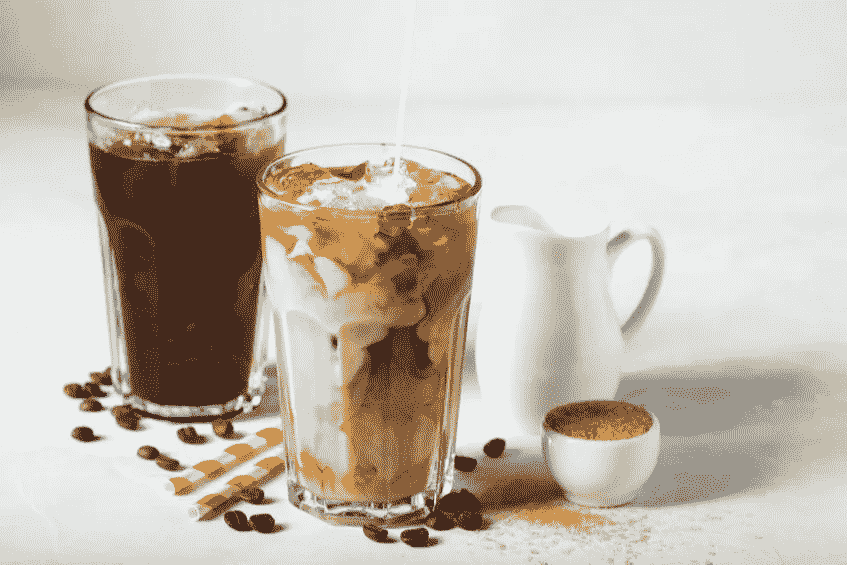
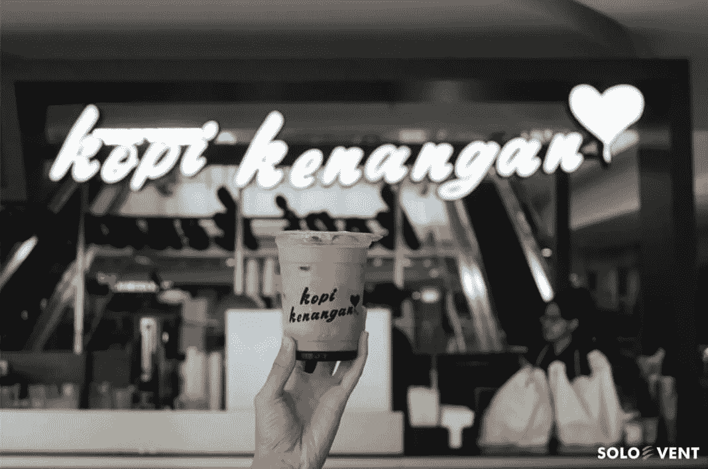
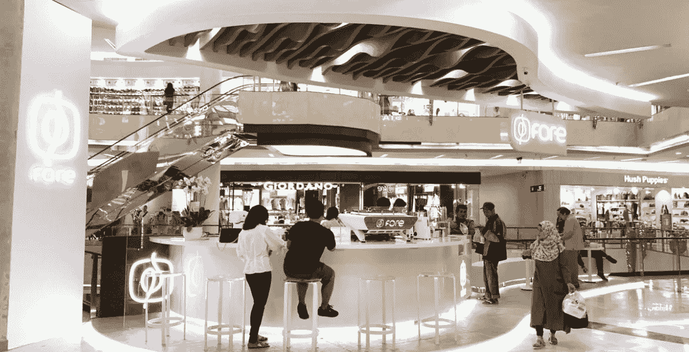
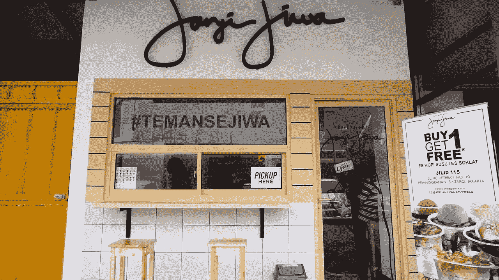
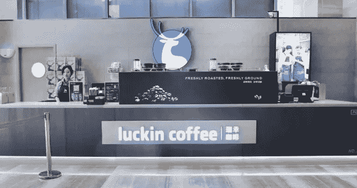
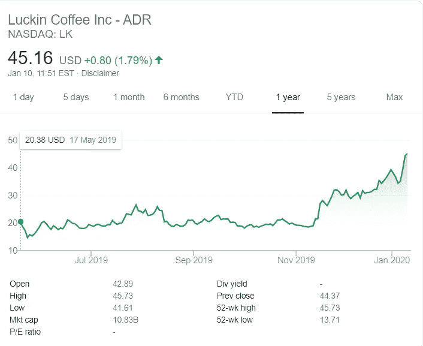
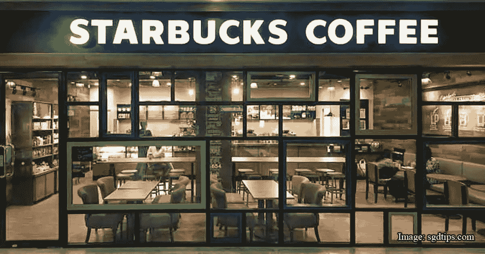
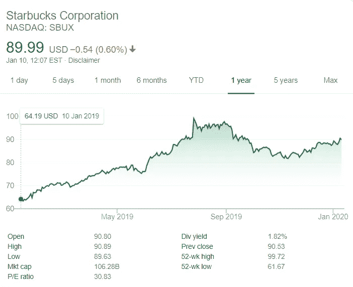
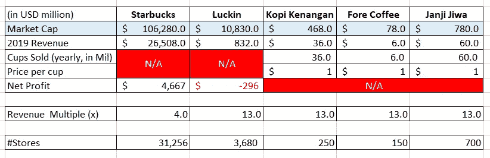

# 印尼创业公司分析:牛奶咖啡将诞生新独角兽。

> 原文：<https://medium.datadriveninvestor.com/indonesian-startup-analysis-milk-coffee-will-give-birth-to-a-new-unicorn-c96e61bcb2e0?source=collection_archive---------2----------------------->

2020 年 1 月 10 日

## “时髦的牛奶咖啡”

Indonesian trendy milk coffee (Kopi susu kekinian).

2019 年，“第三波咖啡”袭击了群岛。小咖啡店如雨后春笋般出现在城市的各个角落。穿着极简现代的设计，他们中的大多数为他们的品牌和菜单使用一个雄辩的名字。辞职的办公室职员和刚毕业的学生开始追随他们的热情酿造和分享印度尼西亚咖啡遗产。来自不同地区的单一产地咖啡通过独特的酿造技术供应，每杯价格仅为 1-3 美元。

然而，有一份菜单被认为是“大众最爱”，那就是牛奶咖啡，或巴哈萨语中的 Kopi Susu。牛奶、咖啡和液化棕榈糖是这种又甜又苦的成瘾物质的主要成分。每杯售价约 1 美元，是印尼第三次浪潮咖啡的真正支柱。对于这个国家来说，它是如此巨大和独特，我个人认为它应该被归类为第三波以上的额外夹层波。你怎么想呢?

## 新零售玩家

***Kopi Tuku***

President Joko Widodo visiting Kopi Tuku outlet.

Kopi Tuku 被认为是这股时尚牛奶咖啡浪潮的引领者。2017 年，佐科·维多多总统和家人参观了他们在 Cipete 的简陋商店，并将其发布在他的[视频博客](https://www.youtube.com/watch?v=IBfYSVqkUTw&feature=emb_logo.)。他在推广他们的招牌品牌“Kopi Susu Tetangga”的同时，对创始人推广本土品牌的勇气表示赞赏。像野火一样，喝这种咖啡的趋势突飞猛进，现在它是一种常见的舒适饮料，特别是对于午餐休息后(或之前，完全没问题)的白领工人。

除了 Tuku，Kopi Kenangan、Fore Coffee 和 Janji Jiwa 等知名品牌也主导着牛奶咖啡市场。然而，与竞争对手不同的是，Tuku 并没有积极开拓新的分支机构，与同行相比增长缓慢。据创始人称，采取这一举措是为了确保质量，并更加重视咖啡师和咖啡爱好者之间的互动，尽管特许经营的需求很大。

***Kopi Kenangan***

[Kopi Kenangan outlet.](http://soloevent.id/enggak-cukup-sekali-menikmati-kopi-kenangan/)

Kopi Kenangan 是发展最快的连锁企业之一，在筹集风险资本方面非常活跃。截至 2019 年 12 月，他们在主要城市拥有 250 家分店，每月供应 300 万杯，并计划在未来两年内再增加 1000 家分店；也就是说，每天新增 5 家分店。根据尼尔森的调查，他们的品牌在牛奶咖啡类别中排名第一。

 [## 幸福的算法？数据驱动的投资者

### 从一开始，我们就认为技术正在使我们的生活变得更好、更快、更容易和更实用。社交媒体…

www.datadriveninvestor.com](https://www.datadriveninvestor.com/2019/03/08/an-algorithm-for-happiness/) 

他们目前正在资产负债表上开辟新的出路，并不断获得资金以实现目标。在 2019 年 6 月获得 2000 万美元的首轮融资后，t [hey 在年底通过红杉印度](https://finance.detik.com/industri/d-4833027/wow-jay-z-hingga-serena-williams-guyur-modal-ke-kopi-kenangan)的牵头，从 Jay-Z 和 Serena Williams 那里获得了另一轮未披露的延期融资。

***福尔咖啡***

Fore Coffee outlet.

Kopi Kenangan 在筹资方面的竞争对手是咖啡。2019 年 6 月，他们从 East Ventures、SMDV、Pavilion Capital、Agaeti Venture Capital、Insignia Ventures Partners 和一些天使投资人那里获得了[850 万美元。](https://e27.co/on-demand-specialty-coffee-startup-fore-coffee-secures-us8-5m-funding-from-east-ventures-20190131/)这家连锁店更加注重高科技和现代外观，并且是首批推出手机应用程序的公司之一。这些应用在 Playstore 上有超过 100 万的下载量，在 App Store 的食品和饮料中排名第三。据副首席执行官称，他们 75%的交易来自他们的应用程序，截至 2019 年 4 月，他们每月售出 30 万杯。2019 年 6 月，他们的目标是开设 100 家门店。

***Janji Jiwa***

Janji Jiwa outlet.

Janji Jiwa 的奥特莱斯通常占据街区中间的一小块空间。截至 2019 年底，该公司已开设 700 多家分店，[被印度尼西亚世界纪录博物馆(MURI)](http://the Indonesian World Records of) 授予年度增长最快连锁店称号。该公司正通过特许经营的方式积极扩张，并未公开获得任何风险投资资金。投资 8500 美元，你就可以成为这家时尚牛奶咖啡店的老板。截至 2019 年 12 月，该公司每月销售 500 万杯，目前正在扩展到烤面包业务，以补充饮料。

## 数字游戏

印尼的优势主要在于人数。在 2.6 亿人口的情况下，一家公司可以通过简单地开设更多的商店、销售更多的杯子来弥补每杯的平均收入，并实现规模经济。

与星巴克和咖啡豆等老牌企业不同，新进入者不需要花费大量资金来开设门店。截至 2018 年，[星巴克在印度尼西亚经营 16 年后，仅拥有 326 家门店](http://www.starbucks.co.id/about-us/our-heritage/starbucks-in-indonesia)。Janji Jiwa 仅在运营两年内就将这一数字翻了一番。他们新门店的固定成本(租金、家具和固定装置)相对较低，因为他们占用的面积较小，并且位于一个不太重要的区域。

顾客通常不会在点餐后坐下来，销售的很大一部分来自在线食品配送，如 Go-Food 和 Grab Food。快速交货和高营业额证明了通过各种付款和交货渠道提供的较低价格和较大折扣的合理性。

假设每家商店每月销售 7000 杯牛奶咖啡，1 美元牛奶咖啡的毛利率为 50%(咖啡和棕榈糖是本地作物，价格便宜)，那么一家商店可以产生 3500 美元的收入，扣除 1000 美元的租金和水电费以及 1000 美元的四名员工工资(雅加达最低工资为 250 美元)，这家商店仍然可以获得 1500 美元的净利润。牛奶咖啡有很好的单位经济效益，预计[趋势将持续到未来五年。](https://today.line.me/id/pc/article/Tren+Es+Kopi+Susu+Diprediksi+Masih+Akan+Bertahan+5+Tahun+Lagi-L7aerV)与电子商务和打车等其他类型的商业模式相比，咖啡店的这种新零售商业模式可以保证更快地实现盈利。

## 全球等效

***陆金咖啡***

Luckin Coffee Outlet

Luckin 成立于 2017 年 10 月。截至 2019 年 11 月，其门店数量已达到 3680 家，第三季度净收入达到 2 . 08 亿美元，平均每月售出 4420 万件商品。商店层面的营业利润率为净收入的 12.5%，但是作为控股公司，该公司仍然净亏损 7440 万美元。

中国的数字绝对盖过了印尼的数字。根据 crunchbase 的数据，Luckin 已经从其 A 轮和 B 轮融资中筹集了超过[5.5 亿美元的资金，并于 2019 年 5 月在纳斯达克上市。该公司股票代码为 LK。截至 2020 年 1 月，其股价已翻了一番，达到每股 45 美元，市值为 100 亿美元。](https://www.crunchbase.com/organization/luckin-coffee#section-funding-rounds)

Luckin Coffee Stock Price

***星巴克咖啡***

Starbucks Coffee Outlet

你的第三个家，第二波咖啡的榜样，好喝的星巴克咖啡。它的 31，256 家商店遍布世界各地，2019 财年净收入为 260 亿美元，净收入为 35 亿美元。这个庞然大物以 1060 亿美元的市值雄踞咖啡零售业务之首。该公司不想落后，并开设了名为星巴克储备的新店，以涉足第三次浪潮咖啡行业。

Starbucks Corporation Stock Price

## **快速&脏估值(收益倍数)**

根据现有的数据，我们可以得出这样的结论:Luckin 作为这个街区的新成员，目前的交易价格是星巴克收入的三倍以上(13 比 4)。

Quick and Dirty Valuation through Revenue Multiple

此外，假设我们的印度尼西亚咖啡店 2019 年收入的运行率(RR)和每杯 1 美元作为唯一价格，我们可以使用与 Luckin 和星巴克估值类似的逻辑来推断他们的市值。唯一没有答案的信息是，它们将以什么样的收益倍数进行交易。

再次假设这个早期阶段的公司以 1 倍的 Luckin 倍数交易(好吧，老实说，这只是一个随机数字，没有坚实的逻辑基础，但让我们称之为“有根据的猜测”)。我们可以推导出 Kopi Kenangan、Fore Coffee 和 Janji Jiwa 的估值。通过比较收到的资金进行健全性检查；Kopi Kenangan 的 2000 万美元和 Fore Coffee 的 850 万美元，可能会让我们相信，我们计算出的快速而肮脏的估值仍在大致范围内。

## 新零售的未来

新潮的牛奶咖啡潮流几乎不会被遗忘。咖啡和糖很容易上瘾。此外，便宜的价格，方便的订购和喝这种诗意咖啡时的兴奋感会让你不断回来。

我的预测是，印尼三大咖啡零售巨头之一将在未来 2 到 3 年内达到 Luckin 的 1/6 规模；大约 15 亿美元的估值(将 14 亿中国人口缩减为 0.26 亿印尼人口)。这意味着印度尼西亚的下一个独角兽将来自新的零售领域，时尚的牛奶咖啡将是其诞生的基础。

感谢您的阅读。预言会实现吗？哪个咖啡品牌会成为下一个十亿美元公司？我遗漏了什么，应该包括什么？你最喜欢哪个品牌？请让我知道你的评论，如果你觉得这篇文章有用，请重新分享。你可以在 linkedin.com/in/erikhormein/[和我联系。](https://www.linkedin.com/in/erikhormein/)