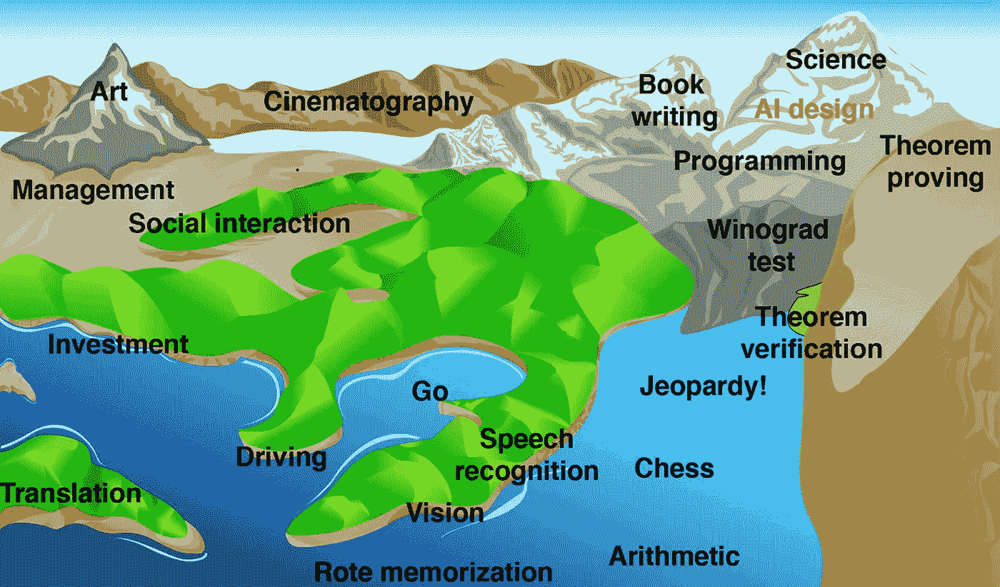

# 人工智能产业将在未来 20 年内掀起一场革命

> 原文：<https://medium.datadriveninvestor.com/industries-ai-is-poised-to-revolutionize-in-the-next-20-years-3064cb58b1f4?source=collection_archive---------7----------------------->

随着人工智能及其应用以越来越快的速度增长，让我们探索一下在我们接近 2040 年时这对关键行业意味着什么。

Photo by [Drew Beamer](https://unsplash.com/@drew_beamer?utm_source=medium&utm_medium=referral) on [Unsplash](https://unsplash.com?utm_source=medium&utm_medium=referral)

现在是 2016 年。

专家表示，人工智能至少还需要十年才能在围棋上击败世界级的人类棋手。这种古老的游戏有 10 种⁷⁰可能组合，比已知宇宙中的原子数量还要多，并且是一种古戈尔棋——数字 1 后面跟着 100 个 0——比国际象棋复杂两倍。

那一年的 3 月 9 日，DeepMind 公司的计算机程序 AlphaGo 在五局系列赛的第一局中击败了 18 届围棋世界冠军 Lee Sedol，创造了历史。这个令人难以置信的高级程序使用搜索树和深度神经网络来选择下一步行动，并根据棋盘的当前状态预测游戏的获胜者。几天后，AlphaGo 以四比一赢得了比赛。

在世界各地，2 亿人惊讶地看着计算机程序违背传统智慧下了现在著名的 37 步棋，这是 AlphaGo 在系列赛中打出的许多令人难以置信的创造性胜利棋之一，甚至让 Lee Sedol 感到惊讶:

> “我认为 AlphaGo 是基于概率计算的，它只是一台机器。但是当我看到这个举动的时候，我改变了主意。毫无疑问，AlphaGo 是有创造力的。”

然而，仅仅一年多之后，DeepMind 发布了 [AlphaZero](https://deepmind.com/research/case-studies/alphago-the-story-so-far#alphazero) ，“一个从头开始自学如何掌握国际象棋、五子棋和围棋的单一系统，在每种情况下都击败了一个世界冠军程序。”

我们正处于人工智能发展的转折点，它从能够完成狭窄范围的任务——比如下棋或下围棋——转向越来越广泛的技能组合，这将真正改变世界。到目前为止，人工智能所能做的仅仅是个开始。

The “Landscape of Human Competence” by Hans Moravec. Creative tasks and original work are highest.

如果我们把大部分人类任务放在地形上，提高到代表计算机的难度，那么人工智能的能力就是一个上升的海平面，如上图所示。已经被淹没的是几个低洼的高原，而水拍打着驾驶、投资和翻译的山麓小丘的底部。

即便如此，在我们真正开始谈论人工智能之前，我们首先必须定义智能。物理学家、麻省理工学院教授马克斯·泰格马克在他的书《生活 3.0》中定义智力不是人类独有的，而是 T2“完成复杂目标的能力”。正如试图划定一条线将智力归类为要么全有要么全无的特征是徒劳的一样，我们必须将智力视为一个由实现不同目标的能力程度决定的光谱——一个可以从一种语言翻译成另一种语言的系统比一个会下棋的系统更聪明。

请继续阅读未来几十年将被人工智能彻底改变的三个主要行业，以及我们如何实现这一目标。

Photo by [Javier Allegue Barros](https://unsplash.com/@soymeraki?utm_source=medium&utm_medium=referral) on [Unsplash](https://unsplash.com?utm_source=medium&utm_medium=referral)

# 卫生保健

在美国，十大死亡原因中有九个是由可预防的原因引起的，如心脏病、糖尿病或癌症。在全球范围内，**4300 万**人受到医疗错误的影响，低收入国家迫切需要更先进的医疗服务，尤其是在全球疫情的背景下。

借助人工智能，我们将能够利用大数据获得对许多不同疾病和状况的独特和迄今为止未见的见解，利用机器学习进行更准确的诊断，并使用个性化医疗为个人量身定制治疗，以及更快和更有成效的药物开发流程。更重要的是，与智能可穿戴设备集成将允许对健康进行实时监控，例如，如果糖尿病患者的血糖水平超过某个阈值，就会向其发出警告。

已经取得了很多进展。在哈佛大学教学医院，医生们正在使用人工智能增强显微镜来扫描血液样本中的有害细菌，如大肠杆菌，速度比人工扫描更快，准确率高达 95%。

肺癌每年导致超过 170 万人死亡，使其成为全球最致命的癌症和全球第六大常见死亡原因。不幸的是，它在所有癌症中存活率最低，因为当治疗不太成功时，它通常被发现得太晚了。2019 年，谷歌健康发表了[研究](https://blog.google/technology/health/lung-cancer-prediction/)表明，与放射科医生相比，通过使用人工智能模型，他们可以多检测 5%的癌症病例，同时减少超过 11%的假阳性。

在将人工智能应用于乳腺癌检测时，病理学家能够将他们发现淋巴结中小转移灶所需的平均时间减少一半。此外，该程序能够在 99% 的时间内正确区分患有转移癌的载玻片和没有癌症的载玻片，同时能够“准确定位每张载玻片内癌症和其他可疑区域的位置，其中一些区域太小，病理学家无法一致检测”([来源](https://ai.googleblog.com/2018/10/applying-deep-learning-to-metastatic.html))。

就在最近，2020 年 11 月，DeepMind 透露，他们的 [AlphaFold 2](https://deepmind.com/blog/article/alphafold-a-solution-to-a-50-year-old-grand-challenge-in-biology) 人工智能系统已经有效地解决了蛋白质折叠问题——这是一个可以追溯到 50 年前的生物学挑战。据估计，任何一种蛋白质都有 10 种⁰⁰可能的构象，这意味着需要数百万年来模拟所有的可能性。利用深度学习和近 20 万种结构已知的蛋白质，AlphaFold 2 可以通过模拟科学家仍在努力确定其结构的蛋白质，将其预测与研究人员进行比较。

在 1-100 分的范围内，人工智能取得了令人瞩目的 92.4 分的中值，被认为与一组人类研究人员相当，尽管明显更快——几天比几年。最终，这将导致更快的药物发现，甚至专门的蛋白质设计。DeepMind 的首席执行官戴密斯·哈萨比斯评论 AlphaFold 2 的成功:

> “就对现实世界的影响而言，我确实认为这是我们做过的最有意义的事情。”

显然，人工智能和医疗保健的交叉领域正在发生许多令人难以置信的发展，这为更健康的未来和每年拯救数百万人的生命提供了很多希望。

然而，在人工智能发挥其全部潜力之前，还有一些挑战和问题需要解决。首先，由于机器学习模型需要大量的患者数据来进行有效的训练，医院和政府监管机构都需要解决数据隐私和所有权的问题。作为一名患者，如果你接受治疗，你能选择不将你的医疗记录和健康信息上传到一个可以被人工智能模型访问的数据库吗？如果你的基因信息使你处于患某些疾病的高风险中，你的保险公司有权知道吗？如果是的话，他们提高你的保费是否道德？

另一个严峻的挑战是责任问题。如果医院使用人工智能程序来帮助诊断你或使用算法来确定你的治疗，也许第一次出错就是在那一刻——如果是医疗事故，责任在哪里？

要让人工智能进入世界主流医疗保健系统，需要回答这些问题，虽然我们不会在这里讨论潜在的解决方案(我将在另一篇文章中写一些)，但重要的是我们要理解人工智能的前景和风险。

Photo by [Sharon McCutcheon](https://unsplash.com/@sharonmccutcheon?utm_source=medium&utm_medium=referral) on [Unsplash](https://unsplash.com?utm_source=medium&utm_medium=referral)

# 金融

除了股票市场，人工智能还有很多机会改变我们与金钱互动和管理金钱的方式。

无论是促进良好的信用，还是更准确地评估服务不足的少数群体社区，为大公司提供管理风险和检测欺诈的工具，或者为日益在线的世界提供个性化的银行服务，未来几年都将转向一个互联和可访问的金融系统，这在一定程度上是由人工智能带来的。

使用机器学习来评估几乎没有信用信息或历史的借款人， [Zest AI](https://zest.ai/product) 减少了损失，同时更准确地预测风险。通过采用他们的产品，银行能够发放更多的贷款，同时将违约率降低 30%以上——这对双方和整个经济都有利。

 [## 医疗保健太便宜，无法计量|数据驱动的投资者

### "当世界末日来临时，每个人都将独自购买医疗保健."戴夫“ePatient”德布朗卡特掉了这个…

www.datadriveninvestor.com](https://www.datadriveninvestor.com/2020/11/02/healthcare-too-cheap-to-meter/) 

[Kavout](https://www.kavout.com/) 是一家成立于 2015 年的初创公司，它使用人工智能来识别金融市场的实时模式，并将大量非结构化数据浓缩成股票的数字排名。在过去的五年里，其顶级股票的表现超过标准普尔 500 指数将近一倍。

传统的银行体验非常缺乏人情味，金融咨询聊天机器人等新工具正在利用人工智能创造更好、更个性化的客户体验。省钱助手 Trim 取消浪费金钱的订阅，寻找更具成本效益的服务，如保险或手机计划，甚至协商账单——平均每人每年节省近 1500 美元。

当然，由于我们的日常金融活动有如此多是在网上进行的，欺诈检测对于金融机构来说通常是一个非常耗时的过程。Shape Security 保护的账户免受欺诈的数量超过了世界上所有其他金融安全公司的总和。美国大多数大银行使用的软件是在**数十亿**的互动中训练出来的，允许它使用机器学习来区分真正的客户和机器人。

尽管考虑到该领域的严格监管，这些公司(以及其他公司)迄今所做的工作非同寻常，但它们只是向未来金融体系过渡的一部分。中央银行和金融机构将逐渐变得不那么突出，因为贷款甚至信贷将变得部分众包或在区块链上(很快会有更多的介绍)。 [Kiva](https://www.kiva.org/) 就是一个很好的例子，它将 77 个不同国家的 350 多万借款人与 190 万贷款人联系起来，迄今为止已经提供了超过 15 亿美元的零利率贷款。

Photo by [Radek Kilijanek](https://unsplash.com/@radek_blackseven?utm_source=medium&utm_medium=referral) on [Unsplash](https://unsplash.com?utm_source=medium&utm_medium=referral)

# 运输

仅在美国，每年就有超过 38，800 人死于车祸。

另有 440 万人伤势严重，需要医疗救助。

根据 NHTSA 的数据，一年就是 8710 亿美元。

解决自动驾驶汽车的问题是一项道德责任。在创建一个成熟的自动驾驶系统以减少道路事故的过程中，人工智能发挥了至关重要的作用——能够从汽车周围获取数据，并对其进行实时分析，以确定某个情况是否需要某种反应或继续行驶。此外，平均每个人每年在交通上浪费 54 个小时——如果这些时间可以用在更有成效的事情上呢？

然而，从长远来看，人类真的很擅长驾驶。2018 年，每 1 亿英里驾驶中约有 1.22 人死亡，大约是地球到太阳距离的四分之三。对于一个人工智能驱动的系统来说，要对每年因车祸导致的死亡人数产生有意义的影响，它必须更好。正如自动驾驶汽车先驱巴斯蒂安·特龙所说:

> “要(制造一辆自动驾驶汽车)解决日常驾驶中遇到的 90%的问题，实际上可以在一个周末完成，完成 99%的问题可能需要一个月，然后还剩 1%[……]一直持续到你达到那 0.01%，然后就很难了。”

那么这种人工智能技术有什么进步呢？

被誉为“驾驶未来”的特斯拉[自动驾驶](https://www.tesla.com/en_CA/autopilot)功能，由于结合了摄像头、超声波传感器和雷达，有望在不久的将来实现完全的自动驾驶能力。为了实现这一非凡的壮举，特斯拉使用了一个神经网络，他们训练该网络以最佳状态模拟人类驾驶，使用超过 30 亿英里的驾驶数据。今天，Autopilot 使汽车能够在其车道内自动转向、加速和刹车，并在停车场内召唤司机。新的升级允许变道和根据目的地进行高速公路交换或出口。通过无线软件更新，特斯拉能够随着时间的推移逐步改善其自动驾驶功能。

谷歌的自动驾驶项目，现在被称为 [Waymo](https://waymo.com/tech/) ，采取了一种不同的方法，首先绘制出详细的地图，上面有道路轮廓、人行道、车道标志、交通灯和停车标志等信息。它没有将摄像头和传感器集成到汽车中，而是将它们添加到它使用的汽车上。Waymo 的软件已经使用人工智能生成的图像在模拟中行驶了数十亿英里，目前正在运营两项处于测试和有限阶段的服务:way mo One——一项自动驾驶汽车出租车服务——和 way mo Via——一项运输服务。

其他公司如[戴姆勒](https://www.daimler.com/innovation/case/autonomous/automated-driving-daimler-trucks.html)、 [Embark](https://embarktrucks.com/) 和 [TuSimple](https://www.tusimple.com/) 已经将无人驾驶卡车投入道路测试。特斯拉计划生产一款名为 [Semi](https://www.tesla.com/en_CA/semi) 的全电动自动卡车，它节省的燃料足以在两年内收回卡车的全部成本。

自动运输行业可能经历了最多的炒作，这反映在飙升的股价和不断膨胀的公司估值上。然而，人工智能自动驾驶汽车中存在的**潜力**以及它们可能产生的影响——很可能——将在未来几十年成为现实。

Photo by [Aaron Burden](https://unsplash.com/@aaronburden?utm_source=medium&utm_medium=referral) on [Unsplash](https://unsplash.com?utm_source=medium&utm_medium=referral)

# 这对我们人类意味着什么？

许多人担心人工智能行业的崛起将导致人类就业机会的迅速减少。例如，仅在美国就有超过 350 万人担任卡车司机——一旦自动卡车运输成为主流，他们的工作会发生什么变化？那些肿瘤识别角色将被高级机器学习系统取代的放射科医生呢？

如果你预见到未来人类的就业前景黯淡且不断萎缩，那么你只是看到了硬币的一面。当然，会有很多工作岗位消失，但这不会在一夜之间发生。另一方面，将创造的就业机会数量可能会带来更多的技术进步——想象一下 100 多万计算机科学家或工程师能为世界做些什么。

人工智能在未来几年和几十年将带来的变化只会强调当前和未来几代人需要成为**多技能**，拥有宝贵的学习能力，然后在持续的循环中再学习，这将持续一生。如果你对这种重新创造的艺术感兴趣，我鼓励你阅读历史学家兼作家尤瓦尔·诺亚·哈拉里的这篇[文章](https://forge.medium.com/yuval-noah-harari-21-lessons-21st-century-what-kids-need-to-learn-now-to-succeed-in-2050-1b72a3fb4bcf)。

Photo by [Benjamin Davies](https://unsplash.com/@bendavisual?utm_source=medium&utm_medium=referral) on [Unsplash](https://unsplash.com?utm_source=medium&utm_medium=referral)

# 摘要

简而言之，人工智能将在未来 20 年彻底改变整个世界，不仅改变我们与之互动的系统，甚至改变我们的日常生活。我们看了三个关键行业，让我们对未来有所了解:

*   **医疗保健:**利用大数据洞察不同的疾病，利用机器学习进行更准确的诊断，使用个性化医疗来定制治疗，并加快药物研发
*   **金融:**促进个人的良好信用，为大公司管理风险和检测欺诈，并提供个性化的银行服务
*   **交通:**减少道路上成千上万的致命事故，节省人们的时间

无论未来二十年发生什么变化，你都可以肯定这将是一个激动人心的快速变化的时代。人类将需要新一代的问题解决者、创造性思想家和实干家来克服人类历史上最大的挑战。我们对未来唯一确定的事情是变化本身是唯一确定的。

我希望你准备好了。

## 访问专家视图— [订阅 DDI 英特尔](https://datadriveninvestor.com/ddi-intel)