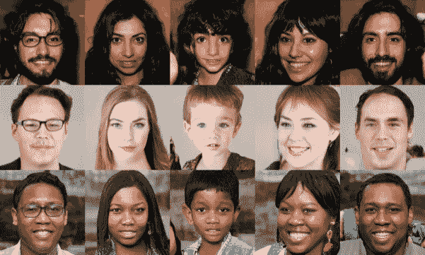

# 后新冠肺炎时代的工业、技术和创新趋势

> 原文：<https://medium.datadriveninvestor.com/industry-technology-and-innovation-trends-for-the-post-covid-19-era-af4e8659b5d7?source=collection_archive---------24----------------------->

Industry, Technology, and Innovation Trends for The Post COVID-19 Era

最近，我应邀在 **IEEE** **Globecom 2020 应对新冠肺炎**通信与网络技术专题研讨会上发言。这个虚拟研讨会的演讲者都是杰出的个人，涵盖的主题广泛而深刻，从接触追踪到智能设备，从检测&缓解到数据隐私&在线讲座到智能健康服务的 AR/VR 等。这让我想起了

> SmartAvatar B.V .的首席技术官 Neeli Prasad 博士在一次虚拟活动中表示,“社会理所当然地认可我们的急救人员、医生、护士、供应链、物流、超市员工等做出的巨大贡献。但忘记了认可或承认使互联网和通信成为可能的信息和通信工程师，没有他们，就不会有任何在线合作、在线学校、远程医疗、社交媒体、流媒体服务、电子商务等。”

这个特别的工作坊让我想起了是什么驱使我从事工程和创业。

 [## SWS:关于应对新冠肺炎会议的通信和网络技术特别讲习班

### 返回技术项目页面>>美国普林斯顿大学传记:H. Vincent Poor 是迈克尔·亨利的战略专家…

globecom2020.ieee-globecom.org](https://globecom2020.ieee-globecom.org/program/technical-program/sws-special-workshop-communications-and-networking-technologies-responding-covid-19) 

我的演讲集中在“后新冠肺炎时代的技术和创新趋势”。以下是我演讲的摘要:

> *由疫情新冠肺炎疫情引发的全球经济低迷成为一种催化剂，进一步推动了新技术和创新的采用，超过了我们在过去二十年中所习惯的速度。亚马逊、阿里巴巴、优步 Eats、Zoom 等平台公司似乎已经很清楚了。正在更大程度上主导着市场。* ***公司将进一步加快投资，通过互联网远程开展业务，以更好地应对未来潜在的封锁。我的演讲讨论了后新冠肺炎时代的产业、技术和创新趋势。***

Industry Trends Post COVID-19 Technology & Innovation

上面列出的行业趋势在过去几年中已经开始出现。然而，新冠肺炎将加速这些转变。新冠肺炎将政府、公司和社会推到了技术临界点，并永远改变了这些行业趋势。

*本博客将探讨人工智能、机器人、数字化转型的作用，以及这些趋势将如何影响医疗保健、教育、电子商务、媒体&娱乐、连接和工业 4.0 人工智能决策等行业。*

Post COVID-19 Technology & Innovaqtion

Healthcare Post COVID-19 Technology & Innovation

2018 年，美国医疗保健支出约为 3.6 万亿美元，人均 11，172 美元，是世界上人均最高的。在疫情之前，11%的美国非老年人口，大约 3000 万人，没有保险或保险不足。据估计，由于导致经济封锁的新冠肺炎就地安置措施，以及政府持续缺乏财政支持，又有 800 万人陷入贫困。

Telehealth Surge Under COVID-19

新冠肺炎使得远程医疗的使用大幅增加。随着消费者用远程医疗取代他们取消的医疗保健就诊，消费者的接受度急剧上升。2019 年，美国消费者使用远程医疗的比例为 11%。然而，现在 46%的消费者正在使用远程医疗服务。根据麦肯锡的一项调查，医疗服务提供商迅速扩大了服务范围，通过远程医疗服务就诊的患者数量是以前的 50 到 175 倍。

> 随着消费者和提供商加速采用远程医疗以及将远程医疗扩展到虚拟紧急护理之外，目前美国每年可节省高达 2500 亿美元的医疗支出，这大约是医疗保险、医疗补助和商业保险支出的 20%。仅这一项节省就能让保险公司将医疗保险覆盖范围扩大到未投保和投保不足的公民。

Higher Education Post COVID-19 Technology & Innovation

新冠肺炎改变了教育方式，我在女儿就读于荷兰阿姆斯特丹大学时就直接注意到了这一点。2020 年春天，许多学校和高等教育机构对第一次封锁以及州长和市长发出的留在家中或就地避难的命令措手不及。学校和教师不得不在一夜之间彻底改造自己，学习如何有效地开展虚拟课堂，通过聊天小组、视频会议、安排视频会议、投票、分配作业、文档共享等方式与学生进行有效互动。它测试了高等教育机构对确保所有学生接受教育的承诺，以及如何远程解决问题。

> 大多数学生希望回到现场和面对面的课堂，与他们的同学和朋友交往，但他们也发现与导师和教授在线交流和互动更容易。有研究表明，一般学生在网上学习时能多记住 25%到 60%的材料，而在课堂上只需要 8%到 10%的时间。

> 简而言之，有了网络课程，学生们可以按照自己的节奏学习，随心所欲地反复学习，跳过或加快课程内容。高等教育机构已经注意到了这一点，并在未来期望他们提供跨混合模式(现场和在线课程的混合)的高效学习体验，将教育质量置于模式之上。

e-Commerce Post COVID-19 Technology & Innovation

新冠肺炎改变了零售的面貌，成为一家完整的在线增强现实(AR)零售店，采用创新的方法来改善客户的购物体验，减少客户退货的产品数量，并简化整体购买流程。

> 鞋履品牌匡威(Converse)推出了一款名为 [The Sampler](https://www.freshnessmag.com/2010/12/07/the-sampler-by-converse-augmented-reality-iphone-app/?utm_source=about&utm_medium=blog&utm_campaign=ar-retail) 的 iPhone 增强现实应用，允许用户虚拟试穿鞋子。只需将摄像机对准他们的右脚，用户就可以看到鞋子在现实生活中的样子。这也有助于简化购买流程，因为顾客有机会通过应用程序直接购买他们喜欢的鞋子。
> 
> **宜家**将人工现实与他们名为 [Place](https://highlights.ikea.com/2017/ikea-place/?utm_source=about&utm_medium=blog&utm_campaign=ar-retail) 的应用整合在一起。购物者现在可以使用智能手机的摄像头在他们的周围虚拟放置不同的家具。该程序允许用户与投影图像互动，并想象他们在不同空间的样子。这有助于顾客找到完美的家具，而不必退回他们认为合适的物品。
> 
> Warby Parker 的 iPhone 应用程序有了新的更新，它使用了苹果的 Face ID 和 AR 技术，让顾客在购买前可以在应用程序中虚拟试戴眼镜。 **Warby Parker 的**虚拟试穿功能依赖于苹果的 ARKit 和 True Depth 功能，因此只能在 iPhone X、XR 和 XS 手机上使用。
> 
> 另一个巧妙运用 AR 技术的例子是来自 [**Gap**](https://www.crunchbase.com/organization/gap?utm_source=about&utm_medium=blog&utm_campaign=ar-retail) 的[试衣间 app](https://www.engadget.com/2017/01/30/gap-augmented-reality-dressing-rooms/?utm_source=about&utm_medium=blog&utm_campaign=ar-retail) 。购物者可以向应用程序提供一些关于他们身体的基本信息。然后，该程序根据用户的测量结果创建一个 3D 模型。有了这个模型，用户可以虚拟试穿衣服，看看它们看起来怎么样。这只是公司在网上购物时缩小误差的另一种方式。

> 基于增强现实的在线购物将实现个性化体验，能够以类似于亲身购物体验的方式测试和探索产品。

Media & Entertainment Post COVID-19 Technology & Innovation

Deepfake 是一种合成数据，其中现有的数据、语音、图像和/或视频被替换为其他人的肖像。Deepfake 还能够生成逼真的图像，即使人类也无法识别它是否真实。Deepfake 技术还用于生成合成数据，以平衡算法偏差数据集，用于机器学习和深度学习模型的监督训练，以提高整体模型准确性。

These People are NOT Real. These Images were Produced by StyleGAN

网络罪犯正在利用这种技术的力量来吸引更多的受害者。缩略图和标题让受害者对视频内容非常好奇，所以他们点击“点击诱饵”。一旦他们导航到该网站，他们的计算机就会暴露在恶意软件面前，如[勒索软件](https://www.hornetsecurity.com/en/knowledge-base/ransomware/)、键盘记录器或间谍软件。如果他们没有足够的网络安全措施，他们的计算机就会被感染，他们必须处理后果。

 [## 新冠肺炎期间股票交易的 9 个教训|数据驱动的投资者

### 在你浏览之前，让我告诉你一些关于我自己的情况。我是…

www.datadriveninvestor.com](https://www.datadriveninvestor.com/2020/12/09/9-lessons-learned-about-stock-trading-during-covid-19/) 

2020 年 12 月 25 日，英国广播公司和英国独立电视台播出了伊丽莎白女王年度圣诞演讲的搞笑数字修改版。

Deepfake Queen: 2020 Alternative Christmas Message

山寨版的英国女王伊丽莎白二世多次抨击王室成员，女王甚至还跳了一支 Tik Tok 舞。所有这些都是为了警告错误信息在数字时代的传播。

> 相信并核实什么是真实的，什么不是。在这个充斥着错误信息和虚假信息的媒体时代，它可能会严重威胁到我们习以为常的民主价值观和我们的生活方式。

推动发达经济国家进行更大规模的 5G 投资和更快的市场采用将主要受到 5G 连接预期带来的潜在经济繁荣和对国家 GDP 贡献的推动。到 2035 年，5G 将在全球销售活动中创造 13.1 万亿美元的价值。

> 增强型移动宽带(eMBB)将通过授权和免授权频谱扩展 5G 覆盖范围和容量

5G Use Cases (Source: Ericsson)

> 海量机器类型通信(mMTC)将扩大物联网(IoT)应用的规模，并提高物联网设备的电池寿命。
> 
> 超可靠低延迟通信(URLLC)支持的关键任务应用将支持公共安全、应急响应和其他智能工业安全关键用例及服务，例如自动驾驶汽车、远程手术、无线制造控制等。变得平常。

> 5G 和 5G 以外的连接不仅会在每个行业创造新的就业机会，还会释放新的价值流，帮助每个人发展全球经济。所有行业领域的企业都将受益于 5G 相对于 4G 的独特功能。

Artificial Intelligence (AI) Decision Making Post COVID-19 Technology & Innovation

作为工业 4.0 的一部分，许多公司已经采用数据驱动的方法进行运营决策。数据驱动的方法可以改善决策，但它需要合适的处理器“人”来从中获得最大收益。然而，为了获得数据中包含的最大价值，公司需要将人工智能(AI)引入他们的工作流程。将人从工作流中移除并不意味着人被淘汰，有些业务决策不仅仅依赖于结构化数据，例如战略、创造力、企业文化、同理心、情感和其他形式的非数字沟通。这些信息对于人工智能来说是不可访问的，并且与商业决策极其相关，例如人工智能可以确定对数字营销的投资将导致最高的投资回报；然而，一个公司可能会为了提高产品质量而决定放慢增长速度。

AI-Driven Decision Making Combined with Human Judgement

**工业 5.0 是指人类与机器人和智能机器并肩工作。这是人机融合的时代。**工业 5.0 旨在支持而不是取代人类。新冠肺炎证明了这一点，没有人类的参与，制造业无法独立运作。工业 5.0 将自动化平凡的任务，并将工人从体力劳动中解放出来，以便工人可以专注于创造性的手工艺，并专注于其他任务。

> 工业 5.0 专注于创造财务结果之外的价值。它不仅寻求改善有关人员的生活质量，而且寻求改善整个社会的生活质量。

## 获得专家视图— [订阅 DDI 英特尔](https://datadriveninvestor.com/ddi-intel)