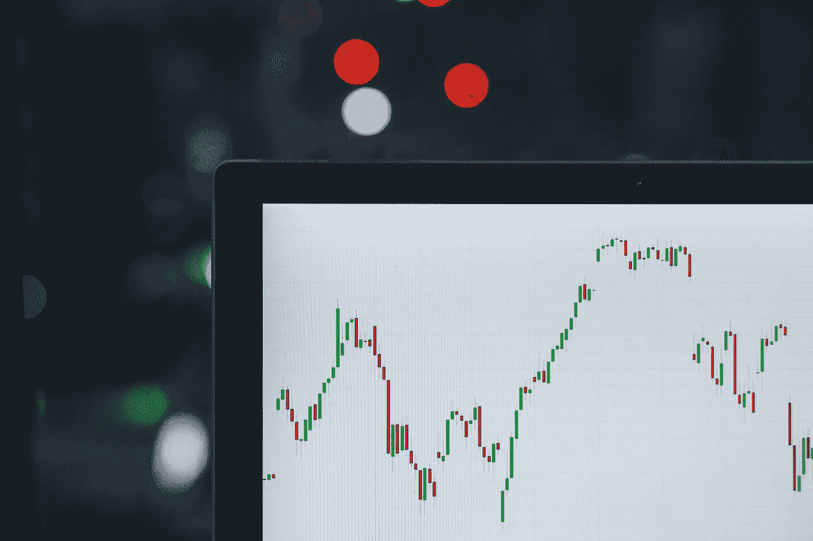
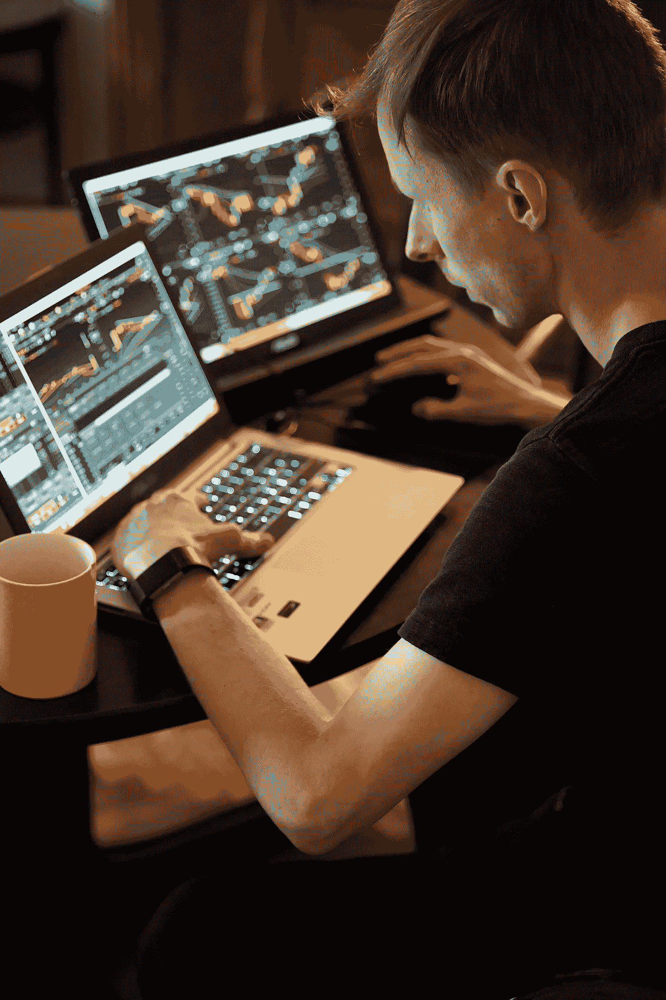

# 没有经验的交易者被应用程序和有影响力的人所吸引

> 原文：<https://medium.datadriveninvestor.com/inexperienced-traders-are-being-lured-by-apps-and-influencers-4ca990063c56?source=collection_archive---------19----------------------->

## 难道不应该比发个 DM 更难进入市场吗？

Image: [Unsplash](https://unsplash.com/@m_b_m)

我不能假装了解股票市场。买卖、点数和指数基金对我来说没什么意义，由于我的无知，为了安全起见，我完全避免了它们。

很长一段时间以来，股票市场对我来说一直是伦敦和纽约豪华办公室里的有钱银行家的日常工作。

到了晚上，我想象着他们和高端脱衣舞娘一起吹箫，在私人俱乐部的黑暗角落里沉溺于肮脏的活动。

诚然，我的很多参考点可能来自华尔街之狼。

但我一路上也发现了一些趣闻。

我知道许多人在市场上发了财。我知道它可能不稳定。我知道这是给有钱人玩的，不是给像我这样的工人阶级玩的。

第一次有人认真地和我讨论交易发生在六年前，当时我去西班牙山区拜访一个朋友，做短暂的休息。

他最近刚开始交易，认为以我的分析头脑(翻译:强迫症)，我可能会很擅长。

所以他给我看了一些系统，图形和图表。没有什么是有意义的，但我专注地听着，当我离开时，他给我发了一些后续信息。

我很快就忘记了。

虽然在接下来的几年里我没有听到多少，但最近交易已经以惊人的速度回到了我的意识中。

最近在浏览 Instagram 时，我发现一位美女在推销一位外汇交易员的服务，这位交易员可以帮助新手在市场中导航。

影响者通常都是关于化妆和时尚的，所以刚开始在她的页面上看到这种赞助内容是很奇怪的。

出于好奇，我决定仔细阅读这位先生的页面。

无意冒犯，这个男孩看起来大约 17 岁。从他驾驶门廊和揽胜的照片来看，他明显老了一点，但也就一两年。

Instagram 页面；照片上散落着昂贵的假期、汽车、珠宝、科技产品和小狗——这让我有些震惊。

每条有意吸引人的帖子都有一个标题，大意是“我不为钱工作……钱为我工作”或“迈出这一步，今天就投资，这样你就能过好明天！”

我不得不承认，在我最初的翻白眼之后，我感觉自己被拉了进去。

哇，我想，也许这终究是有道理的！他显然非常年轻而且非常富有。他说他一天只工作五分钟，车库里总有新车，所以…？

在 Instagram 上给一个青少年转账通常不是明智之举，所以我开始研究一些适合初学者的交易应用。

Image: [Unsplash](https://unsplash.com/@adamaszczos)

而且市面上也有不少。

Wealthsimple、肉豆蔻、罗宾汉、eToro、IG 等等。

Robinhood 尤其引起了我的注意，因为尽管它在英国还没有上市，但据说你可以花 1 英镑投资像可口可乐、谷歌和 Snapchat 这样的大公司。

在这一点上，我的兴趣被激起了，所以当我遇到我可能喜欢使用的公司或服务时，我做了我通常会做的事情。

我查了负面报道。

## 天哪，我震惊了。

在谷歌上快速搜索罗宾汉发现了一个骇人听闻的故事，就在搜索结果的最上方。

一个新手交易者，在看到他的罗宾汉账户上有超过 700，000.00 美元的负余额后，悲惨地结束了自己的生命。

不知何故，新手亚历克斯·卡恩斯(Alex Kearns)通过一个应用程序轻松获得了近百万美元的资金。

他只有二十岁。

亚历克斯留下的一张纸条(福布斯[获得)写道，“一个 20 岁没有收入的人怎么可能被分配到价值近百万美元的杠杆？”](https://www.forbes.com/sites/sergeiklebnikov/2020/06/17/20-year-old-robinhood-customer-dies-by-suicide-after-seeing-a-730000-negative-balance/#58b4b0e65928)

罗宾汉联系了这家人，但拒绝向媒体透露账户的任何细节，也拒绝透露债务最初是如何积累的。

这个故事特别令人心碎，但不幸的是并不是孤立的。

其他例子可能没有亚历克斯的例子那么极端，但它们表明了作为一个业余爱好者的股市的危险。

另一个最近的例子讲述了一个名叫[的年轻人 Richard Dobatse](https://apple.news/ACfIp-c8xQJ-A1KyLZE02xw) 的故事，他发现自己[被应用程序的“铃铛和口哨”吸引住了，这些应用程序“让炒股感觉像是一场游戏”。](https://apple.news/ACfIp-c8xQJ-A1KyLZE02xw)

理查德在 Robinhood 应用程序上大赚了一笔，但在使用房屋净值贷款和信用卡为他的账户提供资金后，最终失去了一切。

这不仅给新手带来了问题。缺乏经验的交易者正在市场上引起波动，这不一定是积极的。

来自[彭博](https://www.bloomberg.com/news/articles/2017-03-20/rookie-currency-traders-are-causing-trouble-at-crucial-moments)2017 年的一份报告提到了市场中的常见问题，这些问题是由初出茅庐的交易员在“关键时刻”做出错误反应造成的

天空新闻最近的一份报告也强调了在封锁期间日间交易者出现的大量上涨，以及为什么这是一个问题。

无聊和在家的额外时间的问题，加上我们触手可及的简单交易应用程序的增加，正导致人们把股市当成一个在线赌场。

对于我们大多数人来说，在这样一个金融不安全的困难时期，试图在一个他们一无所知的动荡市场中大捞一笔的新人是在危险的冰上滑冰。

阿历克斯·卡恩斯的堂兄[比尔·布鲁斯特](https://apple.news/AktRtBHfsT_WkyU_cqucCww)说得好，*他说:“我会鼓励人们理解他们在做什么，不要把市场当成赌场，因为如果你把房子当成赌场，房子总是赢家。”。*

人们很容易认为，一粒小小的现金种子，经过几个巧妙的翻转，就能长成一棵大橡子树，但那句老话肯定是对的。钱不会长在树上。