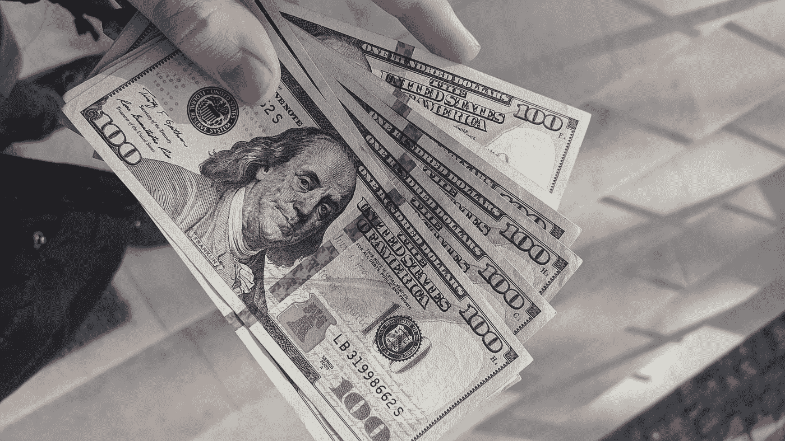

# 通货膨胀——以及如何抵御通货膨胀！

> 原文：<https://medium.datadriveninvestor.com/inflation-and-how-you-protect-yourself-against-it-f0f23d0feb83?source=collection_archive---------9----------------------->

通货膨胀的话题几乎每天都出现在媒体上，而且不仅仅是政治家喜欢谈论这个话题。通货膨胀也是经济和金融市场中反复出现的话题。但是，究竟什么是通货膨胀，它是如何发生的，你能保护自己不受它的影响吗？

Photo by [Frederick Warren](https://unsplash.com/@carnations?utm_source=medium&utm_medium=referral) on [Unsplash](https://unsplash.com?utm_source=medium&utm_medium=referral)

# 什么是通货膨胀？

当商品和服务的价格水平上升时，我们就谈到了通货膨胀。当这种情况发生时，它只意味着钱比以前少了。因此，我们可以用同样多的欧元买到更少的东西。

例如，如果一勺冰淇淋过去值 50 美分，今天值 1 欧元，随着时间的推移，欧元已经失去了一半的购买力。正是这种效应被称为通货膨胀。通货膨胀这个术语也有其他的名称，如购买力下降或货币贬值。

 [## 现金为王，比我们想象的更强大|数据驱动的投资者

### 2020 年 3 月 12 日，在川普总统宣布新冠肺炎进入国家紧急状态的前夕，纽约时报报道…

www.datadriveninvestor.com](https://www.datadriveninvestor.com/2020/03/26/cash-is-king-more-potent-than-we-think/) 

# 如何确定通货膨胀？

通货膨胀的问题在于，你不可能记住所有商品和服务的过去价格。换句话说，一个人对通货膨胀没有真正的感觉，只是主观认为某些东西变得更贵了。

这就提出了一个问题，那就是我们如何才能发现通货膨胀有多高。在德国，通货膨胀是由威斯巴登的联邦统计局测量的。

联邦统计局的官员为此创建了一个购物篮，显示一个德国家庭的平均消费。

然而，由于一个普通的德国家庭由 2.3 名成员组成，并且没有考虑个人偏好和生活条件，因此这个购物篮只应被视为一个普遍的参考值。

# 统计购物篮

统计购物车可以分为三个不同的类别。第一类包括日常产品，如日常生活中需要的食品或药店产品。

另一类包括耐用品，如汽车、电脑、家用电器或服装。

最后，还有一个服务类别的购物篮。例如，这一类别包括保险费或去理发店。

联邦统计局的官员每个月都会比较这一篮子商品的价格，并研究价格如何发展。然后你可以在所谓的消费价格指数中读到这一进展。例如，如果篮子的价格在 2017 年为 100 欧元，在 2018 年为 103 欧元，那么这个代表性篮子的通货膨胀率为 3%。

# 统计购物篮的意义

由于人们有不同的需求和生活方式，购物篮只能被视为一个整体的参考价值。例如，如果你住在城市，没有汽车，汽油价格的上涨对你的影响将远远小于每天需要汽车的通勤者。

由于当局意识到了这一点，你会在联邦统计局的网站上找到一个计算器，你可以用它来计算你的通货膨胀率。你也可以点击这里。

# 通货膨胀的原因

例如，价格上涨可能是由于货币供应量的增长快于商品数量的增长。这意味着有更多的钱在流通，但提供的产品数量不变。

在这种情况下，将不得不为货物支付更多的钱。流通中的货币供应量可能会增加，例如，由于欧洲央行的扩张性货币政策。

生产成本上升也可能是价格上涨的一个原因，从而导致通货膨胀。如果原材料变得更贵，员工的工资就会更高，公司会将这些更高的成本转嫁给客户。最终，这将提高商品和服务的价格。

# 通货膨胀周期

通货膨胀周期经常发生在好的财政年度。当公司获得丰厚利润时，他们通常会让员工分享利润。这样员工就有更多的钱可以支配，可以消费更多。

这种消费的增加反过来又刺激了经济，在这一点上，由于需求上升，公司达到了生产极限，并再次提高价格。然而，只要货币贬值保持在 2%的水平，强劲经济阶段的通货膨胀并不总是一件坏事。

# 通货膨胀水平

原则上，通货膨胀分为三个不同的水平。第一个层次是缓慢的通货膨胀。这个阶段包括高达 5%的通货膨胀率。

第二阶段是所谓的恶性通货膨胀，代表高达 20%的通货膨胀率。如果通货膨胀率超过 50%，这最终被称为恶性通货膨胀。

尽管缓慢的通货膨胀并不总是坏事，但急剧的通货膨胀和恶性通货膨胀仍然是危险的。

# 德国的恶性通货膨胀

德国在 1914 年至 1923 年间经历了恶性通货膨胀。这种恶性通货膨胀引发了巨大的经济衰退，并伴随着高度的政治不稳定。例如，在这一阶段，面包的价格高达几百万马克，纸币的价值低于墙纸，这就是为什么它们被贴在墙上的原因。

## 通货膨胀对你意味着什么？

原则上，通货膨胀对债务人有利，因此债务人的债务减少，对投资者不利，因为投资的钱会贬值。这就是投资者区分名义利率和实际利率的原因。

## 名义利率和实际利率

名义利率是你从投资中获得的未经通货膨胀调整的利率。例如，如果你以 5%的利率投资 100 欧元一年，那么年底你得到的金额是 105 欧元。

然而，如果今年的通货膨胀率为，比如说，3%，你将不得不从你的最终金额中扣除这个值来计算实际利率。

投入资本:100 欧元
名义利率:5%。
到期后资本:105 欧元
通货膨胀率:3
实际利率:2%

在我们的例子中，即使对通货膨胀进行调整，你的投资仍然产生正回报。不幸的是，在现实中，情况并非总是如此。**许多金融产品，如储蓄存折或每日津贴账户，有时会提供如此低的利率，以至于扣除通胀后你会遭受损失。**

# 作为通胀保护的有形资产投资

为此，投资者需要投资无形资产。有形资产是可以被描述为抗通货膨胀的物品。例如，这包括股票、房地产和基于这些实物资产的类似产品，如股票基金、房地产基金或 ETF。

# 投资无形资产的优势

股份公司的优势在于能够对通货膨胀做出反应。如果总体价格水平上升，公司本身可以应对涨价。

持有这些股票的投资者随后将从该公司的反应中受益。通过投资广泛多样化的长期股票投资组合，你可以从通货膨胀中获利，通常总是产生正回报。

这意味着你通过投资获得了购买力。

# 债务人如何从通货膨胀中获利？

如上所述，债务人受益于通货膨胀，因为货币价值下降，他们的债务负担，以购买力衡量，也减少了。

出于这个原因，高负债国家在保持高通胀上有既得利益。对他们来说，通过积极印刷更多的货币来影响通胀率相对容易。你应该记住这个事实，尤其是在购买债券的时候。

债券只不过是债务，它对通货膨胀有同样的反应，也会贬值。

# 结论

近年来，德国的通货膨胀率一直是温和的，可以接受的。因此，没有必要把通货膨胀视为一个幽灵，并被它吓倒。

所谓的财务顾问经常试图向他们的客户推销被认为特别能抵御通货膨胀的产品。我们认为，人们不应该因为一种商业产品可以抵御通货膨胀或纯粹出于经济原因而购买它，而仅仅是因为它是正确的产品。

我在每月一期的 [**简讯中分享了更多私密的想法，你可以在这里**](https://mailchi.mp/bf8f8e8ed697/keep-in-touch-with-lukas) 查看。请在评论中告诉我，并在各种社交媒体平台上加入我:

[**推特**](https://twitter.com/WiesfleckerL)●[**insta gram**](https://www.instagram.com/lukaswiesflecker/)●[**脸书**](https://www.facebook.com/lukaswiesfleckerr)●[**Snapchat**](https://www.snapchat.com/add/luggooo)**●[**LinkedIn**](https://www.linkedin.com/in/lukas-wiesflecker-1b11251a5/)**

**无论你做什么，都要带着爱和激情去做！**

****访问专家视图—** [**订阅 DDI 英特尔**](https://datadriveninvestor.com/ddi-intel)**