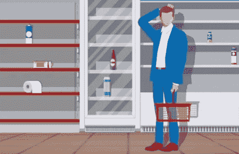
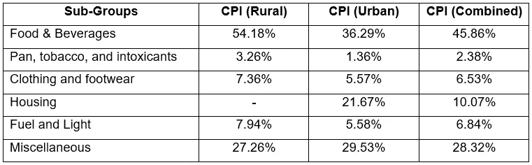

# 日冕时代的通货膨胀

> 原文：<https://medium.datadriveninvestor.com/inflation-in-the-times-of-corona-820db084dd3?source=collection_archive---------5----------------------->

Credit: ShutterStock

几乎没有一项经济统计数据像通货膨胀一样重要，但却被如此误解。最简单的形式，通货膨胀代表了一篮子常用商品和服务的价格变化。理想情况下，篮子里的商品应该代表普通人的支付水平，因此篮子的构建考虑到了人们的消费模式。例如，消费更多乳制品的人群将会看到乳制品在其通胀篮子中所占的比例更大。由于同一国家不同地区的消费习惯也不同，城市和农村人口的通货膨胀篮子也不同。让事情变得复杂的是两种流行的通胀指标——批发价格指数(WPI)和消费者价格指数(CPI)。要理解它们，我们必须记住两者之间的以下区别:

1.  WPI 计算的是批发点*的一篮子商品的价值，而 CPI 计算的是零售点*即消费者手中的一篮子商品的价值。**
2.  **此外，虽然 WPI 只考虑了商品价格的变化，但 CPI 计算了商品以及*服务*的价格变化。**

**在所有国家中，消费者价格指数(CPI)无疑是更受欢迎的指标。即使在印度，虽然 WPI 和 CPI 都是按月估算的，但中央银行——印度储备银行(RBI)——主要跟踪 CPI 的变化，并接受货币政策的目标[是保持价格稳定。具体来说，RBI 的目标是 4%的 CPI，可接受的公差上限为 6 %,公差下限为 2 %,即目标利率两侧的偏差不得超过 2%。](https://www.rbi.org.in/scripts/FS_Overview.aspx?fn=2752)**

** [## 如果资本主义失败了，那么还有什么选择呢？数据驱动的投资者

### 在当前政治领域的修辞之旅中，我们都可以面对面地接触到流行词汇，如…

www.datadriveninvestor.com](https://www.datadriveninvestor.com/2020/03/16/if-capitalism-is-a-failure-then-what-is-the-alternative/) 

由于本文讨论的是通货膨胀，所以讨论仅限于 CPI，这两个词可以互换使用。以下内容希望抓住变量的重要性及其子成分的趋势，目的是理解危机时期的通货膨胀。

# **分解通货膨胀**

我们现在知道，通货膨胀只是一篮子商品的价格变化。篮子的价值就是它的各个部分的总和，也就是它所包含的物品的价值总和。因此，为了形成对未来通货膨胀的预期或预测未来通货膨胀，了解其中的子项目组就显得很重要。

Source: Ministry of Statistics & Programme Implementation (MOSPI)

> 上表强调了农村和城市居民消费价格指数篮子中每个分组的权重，以及综合消费价格指数统计数据——更专业地称为 ***总体通货膨胀*。**

*根据权重和趋势，分析的重点将放在三个分组上:*

食品和饮料在我们日常支出中的重要性怎么强调都不为过。谷物&产品、牛奶&产品、蔬菜、豆类&产品和香料的零售价格的任何变动都会极大地影响印度人口的购买力，尤其是在低收入的农村地区。

下一个引人注目的小组是**燃料和灯**。一是由于其价格的高度波动性；第二，由于其价格变化的外生性。能源部门的状况以及全球燃料价格是这个分组中任何价格变化的两个重要决定因素。

最后，焦点将转向住房、服装和鞋类行业。与上述两个子群体相比，这些细分市场的价格历来较为稳定。有趣的是，这些构成了另一个零售通胀指标的重要组成部分，称为*核心通胀*，它类似于 CPI，但在其计算中不包括*食品和燃料*成分。由于食品和燃料价格的变化通常是由大规模的暂时性供应冲击造成的，关注核心通胀让我们更好地了解潜在通胀(即更具结构性和永久性的价格上涨)的走向。** 

# ****科维德困境****

**经济学 101 告诉我们，需求和供给的相互作用决定了市场的价格。简单地说，如果对商品的需求过剩，商品的价格就会上涨，如果供给过剩，价格就会下跌。应对疫情的封锁影响了卖家的供应链和买家的收入，扰乱了需求和供应。因此，价格出现了不可预测的涨跌。**

**对于每个分组，我确定了价格趋势和相关事件，在此基础上，我们可以形成关键的通胀预期。**

## ****1。食品&饮料:供应链断裂****

**对旅行和转移的限制给资金、人员和医疗保健的供应链设置了许多障碍，但最大的干扰可能是食品供应链。当我们进入封锁期时，拉比作物已接近收获。我们最终收获了大部分，但由于地区边界被封锁，缺乏跨州贸易，农场和市场出现了大范围的作物损失。同样令人关切的是，由于对移徙农场工人行动的限制，农场劳动力短缺。幸运的是，由于粮食储备足够养活穷人一年半的时间，印度开始锁定有利位置。然而，在你庆祝之前，糟糕的供应基础设施意味着食物储备正在迅速耗尽。**

**此外，与耐用品和非必需品的需求不同——由于封锁，对耐用品和非必需品的需求急剧下降，对食品的需求则相反。由于人们对未知的恐惧而恐慌购买和囤积食物，对食物的需求似乎缺乏弹性。因此，在基本食品供应有限而必需品需求不变的情况下，我们可以预期同样的资金会追逐更少的商品——在短期内推高食品价格。**

**然而，对于穷人和低收入受薪阶层来说，这一代价将更大，他们将减少对非必需品的消费。更糟糕的是，一些人可能不得不为此付出更低的食物消费，从而减少营养摄入。对工人的健康和生产力的后果可能是灾难性的。盘子里的食物越来越少——毫无疑问，轻微和有组织的犯罪将会急剧上升。**

****

**Source: Ministry of Statistics & Programme Implementation (MOSPI)**

**上图已经显示了供应瓶颈的影响，零售食品通胀趋势逆转。由于恢复常态还需要几个月的时间，我们可能会看到数字阵痛，并在这段时间内保持在 10%以上。这将对已经受到影响的印度人口收入造成沉重负担。**

***然而，食品和饮料价格仍有乐观的理由:***

1.  **印度气象局(IMD)预测，今年的季风将是长期平均值的 100%，即一个完全正常的季风。这一点很重要，因为从六月开始的四个月季风期占全年总降雨量的 60-90 %,对数百万陷入困境的家庭来说，这可能是挨饿与否的关键。**
2.  **第二，有一个对农民特别有利的监管发展。《基本商品法》(ECA)解除对农产品的管制，给了农民更多定价和销售农产品的空间，从中长期来看，这将使农民的产品获得更好的价格。**

> **面对潜在的不利的食品价格上涨，政府能做些什么？**

****(A)** **警惕食品保护主义:**野村证券(Nomura)的一份[报告](https://www.nomuraconnects.com/focused-thinking-posts/preparing-for-the-next-surge-in-food-prices/)指出，保护主义的传统贸易政策可能会导致已经上涨的食品价格飙升。野村证券(Nomura)的食品脆弱性指数(NFVI)将印度列为 110 个受食品价格波动影响较大的国家中的第 44 位，印度政府最好让民族主义情绪远离这些领域。**

****(B)** **重新配置农民供应链**:应该为农民提供直接向餐馆、酒店、杂货店等销售的设施，而不是批量批发。这将让他们实现更高的收入，降低对中间商的依赖，提高供应链的效率。这一直是争论的焦点，而这场危机提供了加速这一行动的绝佳机会。**

## ****2。燃料和照明:需求不足导致价格暴跌****

***燃料和照明*分组的价格变化严重依赖于电力和液化石油气的价格，这两种价格约占总价格的 81%。由于在封锁期间对几乎所有商品和服务的需求下降，能源需求预计每年将减少 30 %,这是二战以来最大的降幅。这主要是由于工业和商业用电量下降，尽管家庭用电量上升。不幸的是，这可能是对已经陷入困境的配电公司的最后一击，他们现在正在应对现货市场上不断下跌的电价(T21)。由于工业机械预计要到年底才会全面投产，我们可以预计中期价格也会有所回落。**

**液化石油气的情况类似，它占燃料和照明子组的 32%。随着全球能源需求的下降，本月地铁价格下降了 20%。虽然恐慌性购买导致 4 月和 5 月液化石油气钢瓶的销售增加，但液化石油气价格主要是国际液化石油气基准价格以及美元和卢比汇率的函数，而不仅仅是国内销售的函数。随着这两个变量的作用，推动液化石油气价格下降，我们可以预计液化石油气价格将在未来几个月继续在同一方向。**

**总的来说，在巨大的需求下滑的带领下，这一分组描绘了一幅价格疲软的画面，预计不会很快推高我们口袋里的价格压力。**

## ****3。核心通货膨胀:住房，衣服和鞋类被延迟购买****

**住房、服装和鞋类是通货膨胀中波动较小的组成部分，可以被称为相对非必需品。正如经济危机期间发生的那样，非必需品和非必需品的消费已经安全地退居二线。**

**房地产机构也在附和同样的论调——房地产销售将在近期暂停。虽然 1 月至 3 月季度的住房已经下降了 26%，但封锁肯定会使情况变得更糟。即使有延期偿付、税收减免和低利率，随着住房项目交付的延迟和全球收入的下滑，住房贷款预计也会下降。低需求和由此产生的库存积累会导致房地产价格暴跌 20 %,尽管有些人认为价格不会有什么变化。不管是哪种情况，普通家庭因住房而承受的通胀压力都会很低。对于拥有安全现金储备的潜在购房者来说，这甚至可能是一个在低点买入房产的好机会。**

**另一方面，对于纺织、服装、皮革和鞋类(TCLF)行业来说，销售额正在快速下降。虽然由于缺乏劳动力导致的供应中断无处不在，但需求进一步下降，预计本财年将下降 50%。加剧销售下降的因素是贸易渠道关闭，以及主要经济体的需求预计将减少，尽管贸易壁垒正在慢慢降低。**

**鉴于上述趋势，核心通货膨胀看起来很可能达到接近零到百分之一的数字。许多其他研究报告也做出了同样的估计。这总结了三个关键的重要分组的趋势。**

# ****太长，没看:总结和最后的话****

**在强调了构成通货膨胀篮子的主要分组之后，我研究了每个分组的需求和供给力量的行为——在此基础上，预期的价格趋势得到了认可。趋势再次总结如下:**

1.  **生产和分销中断预计会比需求下降对零售食品通胀造成更大的压力，需求下降是由于商品的*本质而受到限制。因此，过度需求可能会推动食品通胀，并使其在几个月内保持在 10%以上，直到供应链再次运转起来。***
2.  **闭门造车的工业和商业用电的缺乏正在推低现货市场的电价，由于全球基准利率下降和印度卢比贬值，4 月和 5 月地铁站的液化石油气价格下降了约 20%。在封锁结束之前，需求低迷预计不会消失，因此，我们可以预计*灯和燃料*子群的价格将保持疲软，甚至出现负增长。**
3.  **最后，需求的大幅下降主要发生在住房、纺织品、服装、皮革和鞋类(TCLF)等相对非必需品的购买上，个人在不确定性面前推迟了购买。房地产价格预计将出现 20%的调整，而劳动力的缺乏和贸易渠道的封闭导致 TCLF 产品价格预计下降 50%。**

**有理由相信，我们可能会在短期内看到通货紧缩(价格下跌或负通胀)，总需求将压倒经济中的总供应中断。但是，由于食品通胀在整个篮子中所占的比重约为 45%,供应链中断的可能性以及不断威胁的恶劣季风，我们必须警惕零售食品通胀压倒其余部分并侵蚀我们的购买力。这将特别麻烦，因为在危机期间，食品占据了我们消费的很大一部分，而政府转向了传统贸易壁垒的民族主义言论，进一步加剧了通胀。所以要密切关注！**

**不管怎样，我希望这个小练习能给你提供信息。请随时在下面的回复中留下任何反馈！**