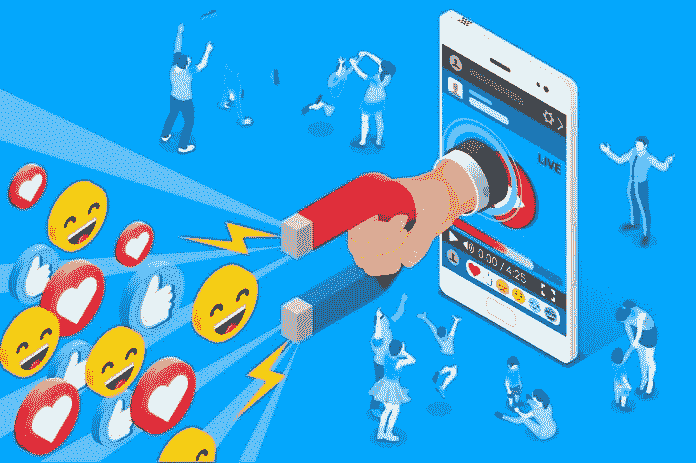

# 有影响力的人在聚光灯下表演

> 原文：<https://medium.datadriveninvestor.com/influencers-perform-in-the-spotlight-2d3703b611e4?source=collection_archive---------17----------------------->

## 找那些令人难忘的专家，留下好印象

影响力营销是一种脱颖而出的游戏。结果是与产品或服务建立了令人难忘且可信的联系。

这就是[玛格达·乌尔巴尼亚克](https://twitter.com/Meg_Urbaniak)发挥作用的地方。无论是在会议上还是在网上，公关和营销策略师都不会在谈判桌上留下任何影响。

乌尔巴尼克与社交媒体管理公司的数字营销专家[马德琳·斯克拉尔](https://twitter.com/MadalynSklar)和[尼克·马丁](https://twitter.com/AtNickMartin)一起，研究了如何利用有影响力的人并留下好的、持久的形象。

 [## 让你的整个个人资料成为你最好的一面

### 你表现得越好，你获得的关注就越多

blog.markgrowth.com](https://blog.markgrowth.com/make-your-entire-profile-your-best-side-ddf7ae75307a) 

大多数在网上的人通过他们的 Twitter 个人资料创造印象。马丁说，人们现在可以做一些事情来突出自己的形象:

*   有一张高质量的个人资料照片和封面照片。
*   有详细的传记。给我们讲讲你吧。
*   定期发微博。当我们点击您的个人资料时，我们希望看到您确实处于活动状态。

Hootsuite 在其文章[*“Twitter 营销:商业完全指南”中做了更详细的介绍*](https://blog.hootsuite.com/twitter-marketing/%C2%A0)

“如果你想确保吸引到合适的人，让他们点击‘关注’按钮，你需要保持更新，”Sklar 说。

她在她的文章中做了更深入的研究，文章名为 [*“让你的 Twitter 个人资料脱颖而出的 11 个技巧。”*](https://madalynsklar.com/2019/12/make-your-twitter-profile-stand-out/)

 [## 影响力越来越大

### 寻找晋升机会和更深层次的关系

medium.datadriveninvestor.com](/winging-to-ever-greater-influence-8bc65070d4f7) 

如果影响者不太强势，影响者营销就会奏效。理想的情况是在普通观众中既被认为是权威的，又被认为是合适的。

“只要我们在寻找权威，这种营销就会奏效——不管我们现在如何定义它们，”乌尔巴尼克说。“我们希望追随那些我们觉得有趣、值得倾听的专家或有魅力的人。我们的大脑喜欢这样。参见[恰尔迪尼的影响法则](https://medium.com/@alyjuma/the-6-principles-of-influence-how-to-master-persuasion-2f8c581da38b)。

“推荐也节省时间，”她说。“我们不必在名为互联网的海洋中寻找信息或产品。我们把它放在银盘里。影响者营销只要运行正确就会奏效，Twitter 和其他任何平台一样好。”

# 智慧和美貌

尽管影响者营销可能很好，但它不是灵丹妙药。

“影响者营销是不够的，”乌尔巴尼克说。"*聪明的*影响者营销，有适当的计划，包括策略和目标——可能会奏效。

“它可以在每一个利基市场运作，但我不会仅仅因为它在一般情况下运作，就向我的[客户](https://www.datadriveninvestor.com/glossary/client/)推荐与有影响力的人合作，”她说。“每个品牌都有不同的需求和挑战。”

依赖统计数据可能是一个危险信号。

“大量的追随者只是一个数字，”乌尔巴尼克说。"你必须恰当地参与，并且知道如何教育和娱乐你的观众."

 [## 购买有影响力的产品时，买家要小心

### 他们待人接物的方式反映了影响者的真实影响力

medium.datadriveninvestor.com](/shopping-for-influencers-buyer-beware-632ad1b6b2fe) 

与成功的影响者一起工作将会让你了解影响是如何起作用的。成功不是偶然的，而是计划的结果。

“作为品牌，我们直接接触我们的观众，”乌尔巴尼克说。“我们不必像传统营销和公共关系多年来一直做的那样建立品牌意识。今天，我们可以“利用”已经拥有它的人的兴趣、喜欢和信任。

“这是影响者营销最强大的部分，”她说。“请记住，正如每一个超级大国一样，必须明智地使用它。*制胜战略*

影响者和品牌必须有共同的愿景和价值观。像任何关系一样，双方需要达成一致。

“与有影响力的人合作的每个阶段都有陷阱，”乌尔巴尼克说。“首先，找到合适的合作对象很有挑战性。你想要一个真正有影响力的人，而不是跟随者。

“其次，我们必须注意已经在特定个人资料上发布的内容，”她说。“检查它是否与你的品牌价值产生共鸣——确保影响者不会否认你的品牌所传达的信息。”

不管与影响者的关系如何，企业家不应该认为他们的联系是理所当然的。

乌尔巴尼克说:“永远要核实有影响力的人发布的关于你公司的内容的外观。”“大多数情况下，项目都做得很好，但我看到许多有影响力的人显然不在乎合作。

“找到合适的影响者是影响者营销最具挑战性的两个部分之一，”乌尔巴尼克说。"这是基于研究和我自己的经验."

# 研究第一

这种经历是首先找到正确的影响者的关键之一。

“很容易认为你有合适的人，但事实上你没有，”Sklar 说。“那样的话，你的品牌会受损。在与有影响力的人合作之前，花时间研究和跟踪他们是很重要的。百分百确定它们与你的品牌和受众完全一致。”

寻找那些积极参与并对他人有帮助的人。他们*获得*影响力，而不是追逐它。

“使用 Twitter 的[高级搜索](https://twitter.com/search-advanced)来寻找有影响力的人，”Sklar 说。“还可以在 Twitter 上列出那些有希望的人，这样你就可以密切关注他们的反馈。称该列表为潜在影响者。”

了解技术捷径有助于提高搜索影响者的效率。

“尽可能自动化这个过程，”乌尔巴尼克说。“使用像[upflow](https://twitter.com/Upfluence/)、 [NeoReach](https://twitter.com/NeoReach/) 或 [TapInfluence](https://twitter.com/tapinfluence/) 这样的平台。他们会帮你找到几十个适合你的人。值得检查一下社交媒体监测工具，如 [Brand24](https://twitter.com/brand24/) 或 [BuzzSumo](https://twitter.com/BuzzSumo/) 。

“尽管如此，你永远不能自己跳过最后的检查，”她说。“你应该检查什么？内容的质量和类型，以及真实或虚假的追随者。这方面也有工具。”

 [## 你从你的个人网络中获得了多少意义？

### 在帮助他人的同时提升你的影响力

medium.com](https://medium.com/an-idea/how-much-meaning-do-you-gain-from-your-personal-network-c431e8ba21e2) 

这些工具包括[I audit](https://twitter.com/search?q=%23IGaudit)、 [HypeAuditor](https://twitter.com/search?q=%23HypeAuditor) 、 [FakeCheck](https://twitter.com/search?q=%23fakecheck) 和 [similarWeb](https://twitter.com/search?q=%23similarWeb) ，它们将显示独立用户的估计数量。

与其追求宏大的规模，不如寻找那些近距离工作的人。

“微影响者是拥有 1000 到 100 万粉丝的个人，”Sklar 说。"他们被认为是各自领域的专家。"

乌尔巴尼克补充说，这些有影响力的人经常活跃在网上。

“它们提供新鲜、原创和有趣的内容，根据来源和定义，拥有不到 1 万名粉丝或订户，”她说。

# 一起工作

无论是微观还是宏观，抓住一个满足公司需求的有影响力的人。这种影响——专注的或不专注的——与特定的营销策略相吻合。

“我认为有几个理由来选择微影响者，”乌尔巴尼克说。“微影响者可能较小，但似乎同样或甚至更投入——因为感觉与社区‘更接近’。

“其次，当你的预算相对于创造力而言相当有限时，与微小影响者合作是一个不错的选择，”她说。“你可以抓住有影响力的人的注意力，并在 [exchange](https://www.datadriveninvestor.com/glossary/exchange/) 中要求宣传，以获得金钱以外的利益。"

 [## 权力影响者照亮影响者营销

### 营销人员在成为有影响力的人方面受到了错误的教育

blog.markgrowth.com](https://blog.markgrowth.com/power-influencer-shines-light-on-influencer-marketing-6837a2d597dc) 

事实证明，有影响力的人脑子里想的可能不仅仅是钱。

“微观影响者通常更积极、更乐意与品牌合作，”乌尔巴尼克说。“欣赏这种合作，提供更好的内容——更有创意、更复杂、更新颖。”

Sklar 也认为小型运营商正在取得成功。

“现在是使用微影响力的时候了，”她说。"它们具有很强的针对性，通常成本要低得多."

影响者营销已经发展了多年。

“在过去的五年里，它一直在疯狂增长，”乌尔巴尼克说。“它更专业，这是肯定的。企业和有影响力的人更知道如何不失去信誉和兴趣。美国、英国和德国引入的法律法规肯定有所帮助。

“尽管如此，仍有改进的空间，”她说。“我们可以看到品牌和影响者完全不知道如何开展影响者营销活动。这有时会导致无效行动、浪费预算和尴尬局面。”

此外，观众开始意识到赞助内容。

“是的，当内容只是一个硬促销，没有任何好的和聪明的想法来展示品牌或产品时，观众会看到，”乌尔巴尼克说。“我们所有人——有影响力的人和品牌——都必须更努力、更好地工作。”

熟悉感促进了增长。

“影响者营销现在变得越来越受欢迎，品牌正在了解微影响者的力量，”Sklar 说。“它们更容易获得，成本也更低。

“过去，当它是一个通用术语时，感觉只有大男孩才能负担得起影响者，”她说。

# 社会苦难

除了面对面的收获，影响者营销也影响了社交媒体。不幸的是，当影响者滥用系统，用户不能确定什么是真实的或虚构的时，这是真的。

“影响者营销改变了影响者与观众沟通的方式，”乌尔巴尼克说。“影响者与品牌合作和创建内容的方式对我们今天在社交媒体中看到的东西有着巨大的影响。

“一方面，这种关系真的很好——品牌更加人性化，”她说。“他们中的许多人已经学会了如何与有影响力的人合作并从中受益。商业——公共关系和销售——获利颇丰。

 [## 社会公共关系:称之为因果报应

### 网络和社交技术构建了商业社区

medium.datadriveninvestor.com](/social-public-relations-call-it-karma-1f21101ddfe5) 

这更加强调了维护信誉的重要性。

“观众不再相信那些更专注于追逐下一个合作安排的有影响力的人，”乌尔巴尼克说。“很明显，他们想把自己的社交媒体档案变成广告栏。”

**关于作者**

吉姆·卡扎曼是[拉戈金融服务公司](http://largofinancialservices.com/)的经理，曾在空军和联邦政府的公共事务部门工作。你可以在[推特](https://twitter.com/JKatzaman)、[脸书](https://www.facebook.com/jim.katzaman)和 [LinkedIn](https://www.linkedin.com/in/jim-katzaman-33641b21/) 上和他联系。

*原载于 2020 年 1 月 15 日 https://www.datadriveninvestor.com***。**