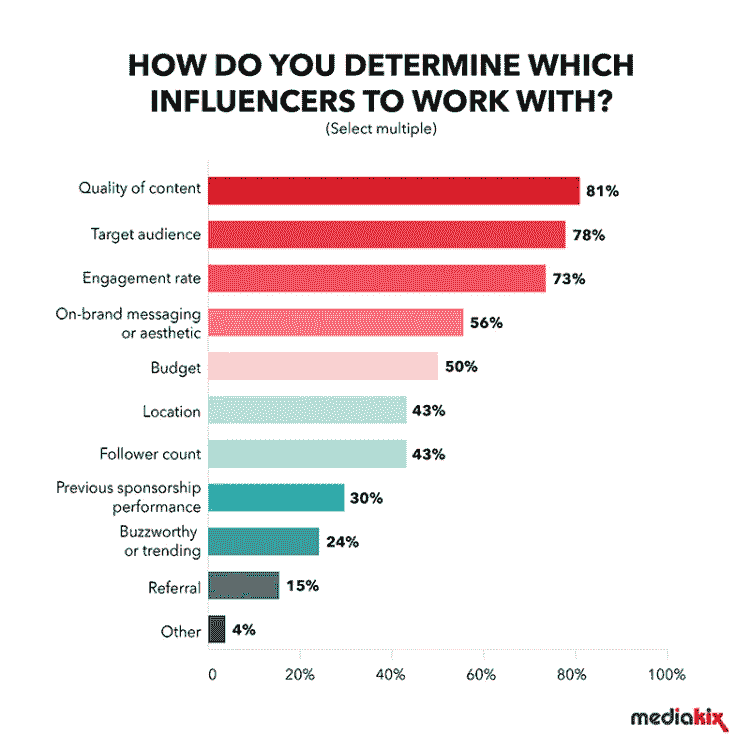
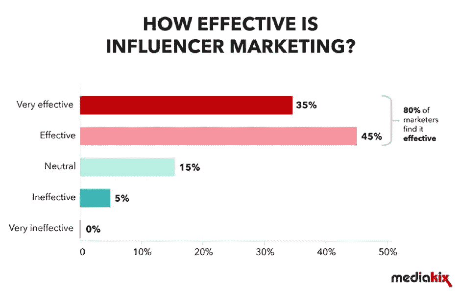
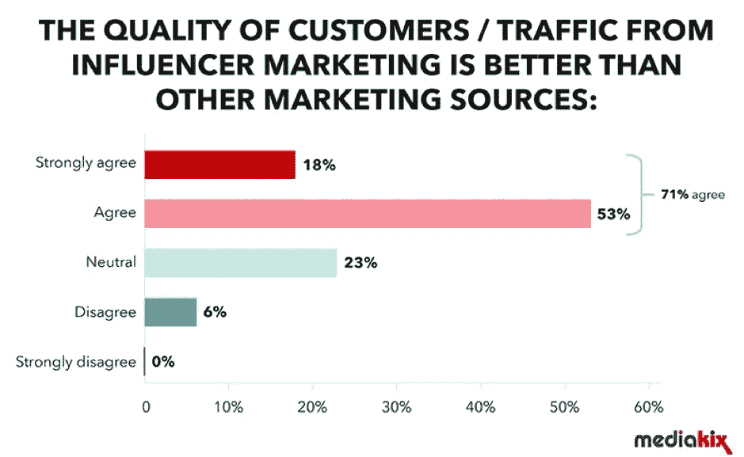

# 影响者拯救濒临破产的公司

> 原文：<https://medium.datadriveninvestor.com/influencers-rescue-companies-on-the-brink-c2359ee77737?source=collection_archive---------12----------------------->

## 最好的人建立关系，创造高质量的线索

Photo by Teemu Paananen on Unsplash

尽管经济时代要求大力支持寻求发展的企业。[口碑](https://blog.markgrowth.com/talk-triggers-spark-word-of-mouth-2d83a7c5813b?source=friends_link&sk=b921da50b23893a3c9b5d74f2cf2344e)是无价的财富，很少有人比有影响力的人更会歌颂。

虽然他自己不是一个有影响力的人， [Kudzanai Thondhlana](https://twitter.com/WenyuDutch/) 知道如何找到这些[企业啦啦队](https://blog.markgrowth.com/company-cheerleaders-shout-your-praises-b0b24ca1014c?source=friends_link&sk=b483a1421ba1b7085ffa14a7bb758e0c)。商业咨询公司 Wenyeji Afrika 的联合创始人，他在非洲推特聊天中解释了影响者营销的艺术。

影响者营销利用第三方的力量——有时以最低成本或零成本——向消费者展示你最好的一面。

Thondhlana 说:“根据你的业务目标，有许多好处。“关键因素包括更好地渗透目标市场的能力、[与受众建立关系](https://blog.markgrowth.com/put-relationships-back-into-business-marketing-b9c8a9d58704?source=friends_link&sk=5b7244e01e72a682f7150fa21a9bc068)、[产生高质量的销售线索](https://www.datadriveninvestor.com/2019/03/18/lead-generation-starts-from-day-1/)、增加收入和降低获取客户的成本。

“品牌也可以直接从消费者那里获得重要的反馈，”他说。“如果做得好，影响者活动还可以产生口碑营销，受益于影响者与其受众之间的信任和关系。”

 [## “战略性社交倾听是真实的生活”

### 获得洞察力以抓住机会

medium.com](https://medium.com/datadriveninvestor/strategic-social-listening-is-real-life-90c8a07b7c3f) 

你可以从社交倾听中找到有影响力的人。例如，编辑 Twitter 列表，看看谁在你感兴趣的对话中领先或活跃。然后与他们互动，建立可能会产生影响者合作关系的关系。

Thondhlana 说:“如果你的预算很低或有限，你可以通过搜索人、话题或地点来研究社交平台上的影响者。”“你也可以使用像 [Followerwonk](https://twitter.com/followerwonk/) 、 [Klear](https://twitter.com/klear_com/) 和 [Kred](https://twitter.com/Kred/) 这样的工具来更好地了解潜在的有影响力的合作伙伴。

“有了更灵活的预算，你可以使用像 [CreatorIQ](https://twitter.com/creatoriq/) 或 [Meltwater](https://twitter.com/Meltwater/) 这样有影响力的营销软件，”他说。“您还可以联系影响者代理机构或市场，帮助您发现影响者，包括筛选和联系影响者。”

当有影响力的人在线时，像关注潜在追随者一样关注他们的参与情况。不要只是广播——没有参与的单向交流——而是寻找对话。理想的影响者知道如何与人互动。

# **刚好合适**

Thondhlana 说:“品牌应该考虑一些标准，如影响者的利基、影响范围、参与率、内容质量、他们的活跃程度以及他们的观众人口统计数据。”“你要确保他们的受众和你的目标市场是一致的。”

参与是影响者的宝石。一个由 10 名追随者组成的订婚团体，比 1000 名仅仅为了人数而聚集在一起、没有投资回报的人更有价值。

“数字还是参与——这是一个古老的问题，”Thondhlana 说。“这真的取决于你的目标。如果你想要知名度，那么高影响力的人会更适合你的活动。它们提供了接触更多潜在受众的途径。

“对于销售线索和销售人员来说，参与度较高的影响者会更理想，”他说。“更高的参与度意味着影响者与受众的关系更好，更受信任，这增加了潜在的销售线索和转化。”

 [## 购买有影响力的产品时，买家要小心

### 他们待人接物的方式反映了影响者的真实影响力

medium.com](https://medium.com/datadriveninvestor/shopping-for-influencers-buyer-beware-632ad1b6b2fe) 

然而，一看到大群的追随者，就有一种催眠般的吸引力。

“这是一个艰难的对话，因为大数字是性感的，”Thondhlana 说。"但是从长远来看，一个积极参与的观众更有价值."

在达成交易之前，与影响者会面，充分了解你们的共同利益和共同目标。如果对齐，请继续。如果不是，你有一个朋友，但不是一个有影响力的人。

Thondhlana 说:“与品牌合作的影响者必须是该品牌瞄准的利基市场，并且在声音、价值观和真实性方面与该品牌相匹配。”“关键是要确保你的影响者以真实的方式将你与正确的受众联系起来。”

# **共享股份**

让有影响力的人参与内容创作会让他们在游戏中更加活跃。他们会更有动力去传播信息。一个警告:确保信息是你的，而不是他们的。

“品牌和影响者必须在内容创作过程中合作，以确保互利，”Thondhlana 说。

“对于有影响力的人来说，这是他们的观众，他们知道如何与他们交谈，”他说。“品牌应该利用这些见解和影响力带来的优势来创造内容。以这种方式合作将产生更有效、更真实的活动。”

 [## 权力影响者照亮影响者营销

### 营销人员在成为有影响力的人方面受到了错误的教育

blog.markgrowth.com](https://blog.markgrowth.com/power-influencer-shines-light-on-influencer-marketing-6837a2d597dc) 

任何关系都不能保证一定会有好结果。

“许多品牌更喜欢给有影响力的人分享内容，以确保它在品牌上，但它有时会导致宣传活动与观众失之交臂，”Thondhlana 说。

基于之前商定的[关键绩效指标](https://medium.com/datadriveninvestor/digital-charm-brings-benefits-347a289e926a?source=friends_link&sk=eae6b04f3c3235efe0459847182e85a4)，您可以有效地衡量与您何时开始影响者活动相关的投资回报。Thondhlana 传达了这个总结:

*   意识:影响和印象
*   考虑因素:点击率和参与度
*   销售转化:销售线索生成和销售

有时，如果来自错误的目标受众，指标和点击率是不准确的。

Thondhlana 说:“这意味着在选择和锁定有影响力的人方面存在问题。”“浏览分析报告，专注于那些能产生正确受众的内容。这可以是一个学习的过程。”

# **成本更低，转化率更高**

当你不方便出门时，影响者是消费者的生命线。它们对于在困难时期保持你的品牌形象是无价的。

Thondhlana 说:“随着品牌更加关注数字，有影响力的人提供了一个成本更低、转化率更高的渠道。”“人们可能会抵制在线广告。可信来源的推荐会影响他们的购买决策。”

他绘制了影响者营销的效果图。

Thondhlana 说:“影响者为品牌提供了有针对性的进入目标市场的途径，以及利用对影响者的信任来培养与该市场的真实关系的能力。”“这是一个很大的价值主张，品牌必须利用它。”

这体现在客户的素质上。

“如果你适应每一个直接影响你业务的变化，你永远不会出错，”Thondhlana 说。

**关于作者**

吉姆·卡扎曼是[拉戈金融服务公司](http://largofinancialservices.com/)的经理，曾在空军和联邦政府的公共事务部门工作。你可以在[推特](https://twitter.com/JKatzaman)、[脸书](https://www.facebook.com/jim.katzaman)和 [LinkedIn](https://www.linkedin.com/in/jim-katzaman-33641b21/) 上和他联系。