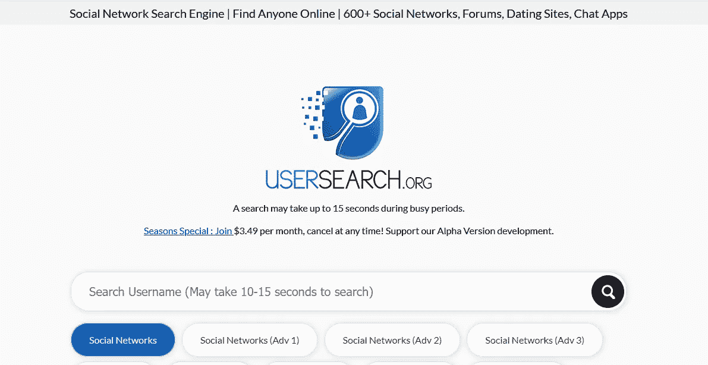

# 信息收集:黑客如何不用编码就能找到你

> 原文：<https://medium.datadriveninvestor.com/information-gathering-how-hackers-look-you-up-without-having-to-code-2fc6e56a9080?source=collection_archive---------15----------------------->

## 在网上搜索数据很容易，你所需要的只是知道你在找什么，以及如何搜索。

Image by Wallace Chuck from Pexels

信息收集决定了你应该走哪条路，现在在网上找一个人并不困难，互联网给了我们翅膀，隐私也因此受到了很大的损害。

**社交媒体**

Image by Pixabay from Pexels

随着社交媒体平台的出现，我们的生活变得越来越不私密。但是，在指责这些网络之前，请记住，你和我都有责任。我们自己铺床，相信我，我们在网上分享了太多的生活。你的个人资料本身就是一个故事，如果你的不是，那么你伴侣的个人资料就是。

我们中的一些人试图隐姓埋名，但我们的大多数家庭成员不这样做，结果我们的这种行为没有起到应有的作用。就像电影里看到的那样，如果你联系不上我，试着找一个和我亲近的人。这对黑客非常有利。

你可能会在大部分写作中使用笔名，在所有社交媒体资料和电子邮件地址中使用假名，但你的伴侣可能会做完全相反的事情，比如在你生日的时候在帖子上分享你的全名，分享你的结婚照，你儿子或女儿的出生月份，以及其他一些我们没有考虑到的事情，这些事情应该太私人了，不能放在网上，但现在不是，至少不再是了。

你的生日，你孩子的生日，你结婚的那天，你开始约会的时候，你分手的时候，你的周年纪念日所有这些都在一个平台上。社交媒体是让你了解最新信息的最好地方，但它不是寻找某人的唯一途径。上 LinkedIn，看看人们是以什么为生的，它很有魅力。

**谷歌搜索**

author screenshot Google Search Engine

与社交媒体平台相比，谷歌获得了更多的结果，因为它不是单一的个人资料，而是你在搜索中可以找到的所有资料，更不用说社交媒体的个人资料也会在谷歌上被索引。所以，你应该从简单的谷歌搜索开始。

author screenshot

我在谷歌上搜索自己，它给我带来了 17，000，000 个结果。显然，并不是所有找到的东西都与我或灵媒有关，前 3 到 4 页是有用的。我没有为这个搜索使用任何特殊的参数，因为它不是真正必要的，因为精确的谷歌黑客结果[阅读](https://samwritessecurity.medium.com/lookup-anything-and-anyone-online-do-it-like-a-pro-36d5d4056a0f)这个。

通过简单的搜索，我在第一页找到了我的个人资料、评论、脸书页面和 Instagram 页面。一切都在几秒钟内完成。我的电子邮件是我个人简历的一部分，所以它也显示出来了。想象一下，如果你的家庭住址和电话号码必须出现在你的简历上，只需一次搜索，任何人都可以知道你的一切。

我假设你不是以在网上找人为生的，既然如此，付费的寻人工具就没有必要了，社交媒体平台和搜索引擎，如谷歌或必应，也不是你唯一可以用来在网上找人的免费资源，你也可以试试；

[Usersearch.org](https://www.usersearch.org)

author screenshot [https://usersearch.org/index.php](https://usersearch.org/index.php)

用户名搜索是一个社交媒体搜索引擎，有 600 多个网站可供搜索。这个反向搜索工具使用用户名、电子邮件和电话号码。Usersearch.org 也非常适合在加密论坛上搜索。|

该网站使用 SSL 加密来确保您在网站上的搜索是安全的。基于他们的“关于”页面，搜索在内存中实时运行，每 4 分钟擦除一次以提高性能，你可以在这里阅读更多关于这个[的内容。这些是人们不需要使用暴力攻击就能找到你的许多方法中的一些。注意安全！](https://www.usersearch.org/features.php)