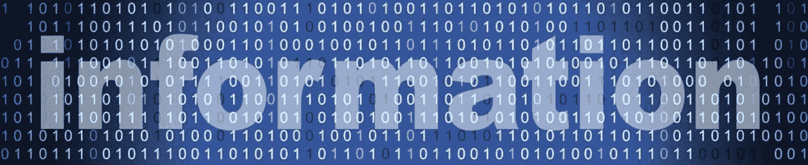
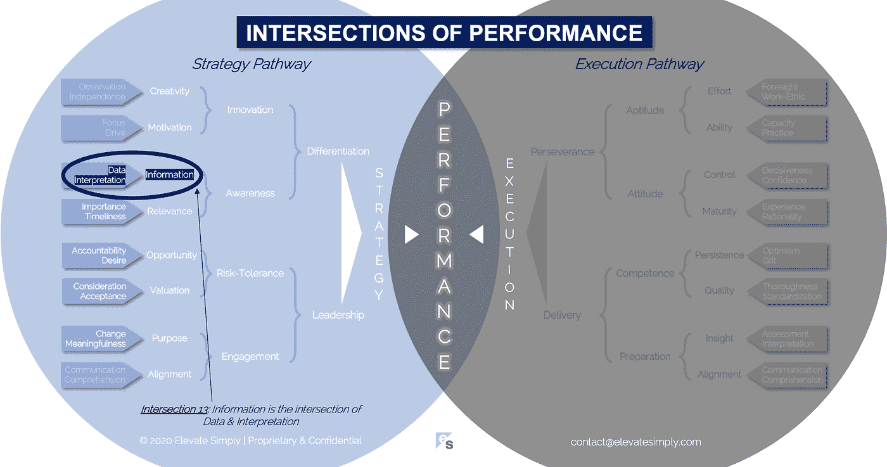

# 13.信息:数据和解释的交叉点

> 原文：<https://medium.datadriveninvestor.com/information-the-intersection-of-data-interpretation-62acc94ba8bf?source=collection_archive---------12----------------------->

Image by 123rf.com

信息，名副其实，告知我们生活的方方面面。在商业上，它是全球每个公司、行业和经济的命脉。许多公司都有专门的 it 团队，高管的头衔包括首席信息官(CIO)或首席信息安全官(CISO)。虽然首席信息官已经存在了很长时间，但 CISO 的角色是较新的。它的创立是为了认可保护公司信息的竞争优势。

信息就是力量。控制方面的权力…财富方面的权力…影响力方面的权力…创新方面的权力…成功方面的权力。难怪信息如此令人向往。

“权力越大，责任越大”。这句话因蜘蛛侠漫画而流行开来，据说起源于 19 世纪初的英国议会。在信息时代，这句话可以修改为:“拥有信息的同时也肩负着如何明智/安全/恰当/有益地使用它的重大责任”。另一方面，出于更邪恶的原因获取或使用信息的诱惑也可能是强大的。因此需要管理和保护它。

为了更好地理解信息，我们需要探索它是如何产生的。

**什么是信息交集？**

信息是数据和解释的交集*(见下图交集 13)*。信息的生命始于数据。然后，它经过一个被称为解释的转换过程，成为信息。信息是否有用是每个最终用户面临的决定。是否应该使用它，如果应该，如何使用？

*数据*

每天每秒钟产生的数据量是惊人的。似乎有人或一些公司正在跟踪几乎所有发生的事情。这种连续的数据创造有时是有意义的，有时是无意义的。

拉进来=拉出去。这个简单的短语强调了使用数据的挑战之一。如果输入是坏的，那么输出也是坏的。理想情况下，当数据集生成时，在发布到世界上供人们使用之前，它会受到关键考虑因素的影响。这些考虑因素包括:

*   来源
*   准确(性)
*   有效期
*   纯洁
*   及时
*   清洁
*   关联
*   质量
*   完全
*   有效性
*   易接近
*   可报道性
*   可用性
*   重要

有了数据，你得到的是原始的，通常是不可用的格式，没有上下文，价值极小。然而，有了上下文，数据价值的可能性是无限的。

交集 13:信息=数据+解读

Image by [Brett Simpson](https://medium.com/u/191cf90a65d7?source=post_page-----62acc94ba8bf--------------------------------)

*解读*

解释是使数据变得有价值的上下文。它既是一门科学，也是一门艺术。将数据转化为信息可以像音乐家创作音乐或艺术家创作艺术一样令人印象深刻。

解释是回答问题、做出决定和定义选项的过程。解释是围绕数据“是什么”的“为什么”和“如何”。

根据我的经验，从有用的数据中过滤出无用的数据是至关重要的。数据世界中的噪音，只能通过解释来消除。

一旦被解释，信息就变成了度量、统计、KPI、基本原理、理由、借口、输入、变量等。解释不保证准确性、质量、有效性等等。更确切地说，这只是向有用或无用靠近了一步。

**领导者能做什么？**

领导者必须意识到数据和信息之间的区别。他们还必须投资于能够准确解释数据的人员或工具。

没有数据就没有信息。没有解释，数据几乎没有任何用处。领导者使用如上所列的考虑因素来评估数据，然后为了利益相关者的利益来解释数据。

最好的领导者会教他们团队中的人也这样做。

**总结&下一个**

信息是权力的货币。货币的价值来自于一种普遍的认知。就信息而言，这种对价值的认可需要基础数据和相应的解释。

下次我们将考察绩效的第 14 个交叉点，也就是**动机交叉点**。

在这一系列文章中，我们探索了性能的交叉点，共有 30 个。绩效的交叉点*框架基于*[*Brett Simpson*](https://www.linkedin.com/in/brettjsimpson/)*[*董事总经理*](https://www.linkedin.com/company/elevatesimply/) *的经验和见解，以及他作为企业家、顾问和投资者在大大小小的组织中 20 多年的领导经验。**

***绩效-文章链接的交集***

*1.[绩效:策略的交集&执行](https://medium.com/the-innovation/1-performance-the-intersection-of-strategy-execution-2bf06329f8d4)*

*2.[战略:领导力的交叉点&分化](https://medium.com/the-innovation/2-strategy-the-intersection-of-leadership-differentiation-a568b17731ab)*

*3.[领导:参与的交集&风险承受能力](https://medium.com/the-innovation/3-leadership-the-intersection-of-engagement-risk-tolerance-f8c887e6c1d3)*

*4.[差异化:创新的交叉点&意识](https://medium.com/@brettjsimpson/4-differentiation-the-intersection-of-innovation-awareness-a21d053ecf12)*

*5.[订婚:目的的交集&对齐](https://medium.com/@brettjsimpson/5-engagement-the-intersection-of-purpose-alignment-953747437c26)*

*6.[风险承受能力:机会的交汇点&估值](https://medium.com/@brettjsimpson/6-risk-tolerance-the-intersection-of-opportunity-valuation-29cf4d9a0ac)*

*7.[认知:信息的交集&关联性](https://medium.com/@brettjsimpson/7-awareness-the-intersection-of-information-relevance-f0fd5322bcb7)*

*8.[创新:创造力的交汇点&动机](https://medium.com/@brettjsimpson/8-innovation-the-intersection-of-creativity-motivation-7c1a12e0d5e2)*

*9.[目的:变化的交集&意义的交集](https://medium.com/@brettjsimpson/9-purpose-the-intersection-of-change-meaningfulness-9f12b0153e1)*

*10.[估价:对价的交集&验收](https://medium.com/@brettjsimpson/valuation-the-intersection-of-consideration-acceptance-eebe7b15e763)*

*11.[机会:欲望的交汇&责任](https://medium.com/the-innovation/opportunity-the-intersection-of-desire-accountability-7e81adb1e195)*

*12.[相关性:重要性的交集&及时性](https://medium.com/@brettjsimpson/relevance-the-intersection-of-importance-timeliness-56cc748eb066)*

*13.[信息:数据的交集&解读](https://medium.com/@brettjsimpson/information-the-intersection-of-data-interpretation-62acc94ba8bf)*

*14.[动力:焦点的交汇&驱动](https://medium.com/@brettjsimpson/14-motivation-the-intersection-of-focus-drive-d9ebd3ca9951)*

*15.[创造力:观察的交集&独立性](https://medium.com/@brettjsimpson/15-creativity-the-intersection-of-observation-independence-57f7294acb2b)*

*16.执行力:毅力与交付的交集*(即将推出！)**

*17.交付:准备与能力的交集*(即将推出！)**

*18.毅力:天资与态度的交汇*(即将推出！)**

*19.准备:洞察与对齐的交集*(即将推出！)**

*20.能力:坚持与质量的交汇点*(即将推出！)**

*21.态度:控制与成熟的交汇点*(即将推出！)**

*22.资质:努力和能力的交汇*(即将推出！)**

*23.洞察力:评估与解释的交汇点*(即将推出！)**

*24.质量:彻底性和标准化的交汇点*(即将推出！)**

*25.坚持:乐观与勇气的交汇*(即将推出！)**

*26.成熟:经验与理性的交集*(即将推出！)**

*27.控制:果断与自信的交集*(即将推出！)**

*28.能力:能力与实践的交集*(即将推出！)**

*29.努力:远见和职业道德的交集*(即将推出！)**

*30.对齐:传播与综合的交汇点*(即将推出！)**

*在[**Data Science/AI/ML/DL**](https://app.ddichat.com/category/data-science-ai-ml-dl)**:**中安排 DDIChat 会话*

* [## 专家-数据科学/ AI / ML / DL - DDIChat

### DDIChat 允许个人和企业直接与主题专家交流。它使咨询变得快速…

app.ddichat.com](https://app.ddichat.com/category/data-science-ai-ml-dl) 

在这里申请成为 DDIChat 专家。
与 DDI 合作:[https://datadriveninvestor.com/collaborate](https://datadriveninvestor.com/collaborate)
点击此处订阅 DDIntel [。](https://ddintel.datadriveninvestor.com/)*