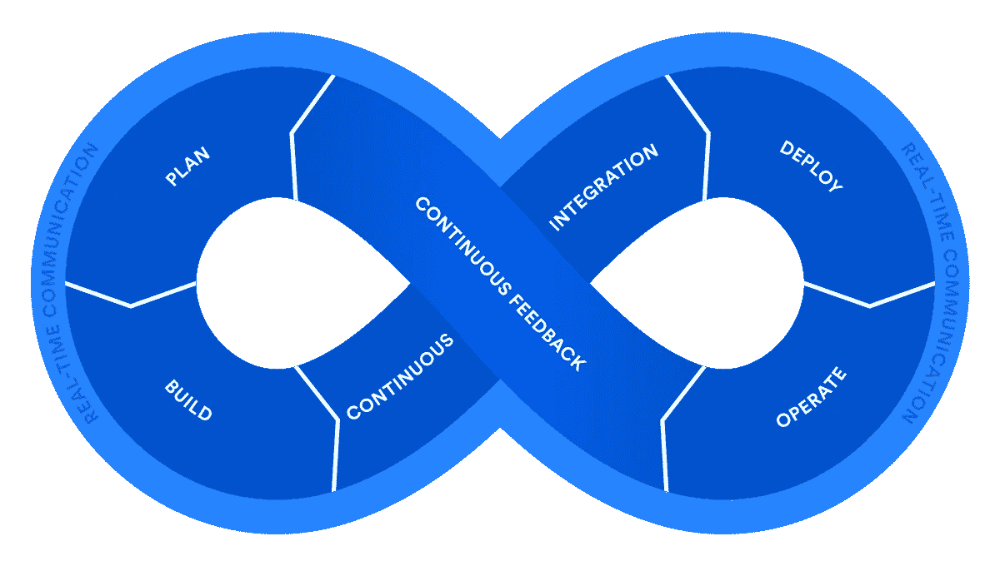
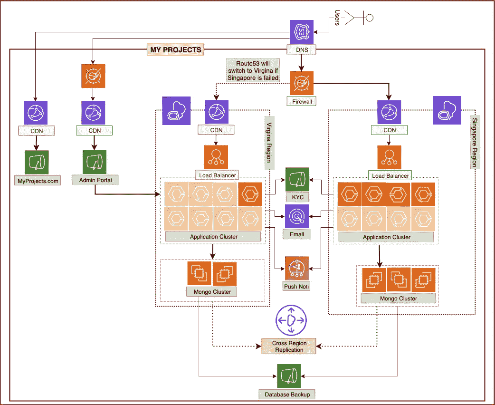

# 基础设施是 DevOps 生活中的代码

> 原文：<https://medium.datadriveninvestor.com/infrastructure-as-code-in-devops-life-50761d7bec21?source=collection_archive---------15----------------------->

在讨论任何关于作为代码(IaC) 的**基础设施之前，我们首先要考虑什么是 DevOps，它的文化是什么。正如我在一些提到 DevOps 的网站上发现的，下面是如何描述其文化的座右铭。**

> [DevOps 文化强调小的、多学科的团队，他们自主工作，并对实际用户如何体验他们的软件承担集体责任。](https://docs.microsoft.com/en-us/azure/devops/learn/what-is-devops-culture)



Image source: [https://www.atlassian.com/devops](https://www.atlassian.com/devops)

根据我之前的经验，我总是手动设置 AWS、GCP 和 Heroku 的所有基础设施。与此同时，我觉得自己在观看 YouTube、Udemy、Edx 等网站时，配置起来很容易，也很健壮。不幸的是，当首席技术官或老板告诉你在另一个地区配置相同的基础设施作为灾难恢复计划( **DRP** )或新环境，如 Staging 或 UAT，然后会让你头痛地回忆起你以前做过的事情，如 IAM 角色、策略、安全组、EC2 中的软件包安装等等。

仍然可以为小组资源手动配置环境，并配置到另一个区域或新环境。但对于大规模的资源量和多区域复制这样的重型基础设施来说，这将是一场噩梦，而不是我们年轻时听过的童话。

> 那时，被称为**基础设施代码(IaC)** 的主角是管理大规模、分布式系统和面向服务的架构。基础设施作为代码的概念类似于编程脚本，用于自动化 IT 流程。然而，脚本主要用于自动化一系列静态步骤，这些步骤必须在多个服务器上重复多次。基础架构代码使用更高级或描述性语言来编写更加通用和适应性更强的配置和部署流程。

好吧，我们长话短说。下面是我基于 AWS 为我们的新钱包项目建议的基础设施图，我应该做什么。



my wallet infrastructure

如上图所示，已经提供了很多工具来用代码构建整个架构。在它们之中，我应该选择云层结构或地形结构。因为它在 AWS 中，难怪我要选择 Cloudformation 而不是 Terraform，因为假定的云提供商是 AWS。

在做任何事情之前，想一想我需要使用哪种云形成策略。然后我意识到，我应该基于每个服务创建解耦的多个 Cloudformation 模板作为嵌套模板，而不是像**敏捷方法**那样创建单个模板。你可能需要问为什么我需要创建这么多的模板而不是一个。

> 这是因为嵌套堆栈风格提供了保持一切敏捷和维护多种环境，成本效益，可靠的方式和可重复使用。

但是使用 Cloudformation 嵌套堆栈有好处也有坏处。

> 我不强烈推荐嵌套栈，因为更新它是危险的，并且如果你不能很好地控制并且缺乏经验，可能会破坏一些复杂程度的服务。

在这里，我将根据堆栈来分割模板。

*   创建所有必需的 IAM 角色
*   用 Cloudfront 创建静态的两个网站
*   创造 VPC
*   为这两个静态网站创建管道
*   使用 ALB 创建 ECS Fargate 服务
*   为跨区域灾难恢复的 Fargate 服务创建管道
*   在 EC2 实例中创建 mongo 集群
*   使用晶圆创建路径 53

好，我们现在就开始吧。嗯，我将展示使用 Cloudformation 嵌套栈的基本概念，其中包含示例信息，而不是完整的 Cloudformation 模板。

> 为了减少空间和时间，我将用 IAM 策略中的 ***** 创建所有策略文档。

**创建所有必需的 IAM 角色**

```
AWSTemplateFormatVersion: '2010-09-09'
Description: >
  That CloudFormation template is to create required IAM Roles to all AWS services used in PPS.Resources:PPSAPIRole:
    Type: AWS::IAM::Role
    Description: Lambda Function Role.
    Properties:
      RoleName: PPSAPIRole
      AssumeRolePolicyDocument:
        Version: 2012-10-17
        Statement:
          - Action:
              - "sts:AssumeRole"
            Effect: Allow
            Principal:
              Service:
                - lambda.amazonaws.com
      Policies:
        - PolicyDocument:
            Version: 2012-10-17
            Statement:
              - Effect: Allow
                Action:
                  - logs:*
                  - logs:CreateLogStream
                Resource: "*"
              - Effect: Allow
                Action:
                  - dynamodb:*
                Resource: "arn:aws:dynamodb:*:*:*"
              - Effect: Allow
                Action:
                  - lambda:InvokeFunction
                Resource: "*"
          PolicyName: "PPSPolicy"**Outputs:
  PPSAPIRole:
    Description: PPSAPIRole to use PPS Backend Stacks
    Value: !GetAtt [PPSAPIRole, Arn]**
```

上述模板将被命名为 **iam.yml** ，以创建整个项目所需的所有 iam 角色。在上面的代码片段中，您会注意到突出显示的文本显示了需要使用另一个 Cloudformation 模板的**输出**部分。目的是为另一个 Cloudformation 输出创建的 IAM 角色，名为 **PPSAPIRole** 。

让我们继续创建另一个后端服务。

```
AWSTemplateFormatVersion: '2010-09-09'
Description: >
  That CloudFormation template is to setup Backend NodeJS API of PPS.**Parameters:
  PPSAPIRole:
    Type: String
    Description: The name of role for Lambda**Resources:
  PPSLambdaLogs:
    Type: AWS::Logs::LogGroup
    Properties:
      LogGroupName: "/aws/lambda/PPSLambdaBackend"
      RetentionInDays: 90
  PPSLambdaBackend:
    Type: AWS::Lambda::Function
    DependsOn:
      - PPSLambdaLogs
    Properties:
      Code:
        ZipFile: |
          exports.handler = (event) => {
            const response = {
                statusCode: 200,
                body: JSON.stringify('Hello from Lambda!'),
            };
            return response;
          };      
      Description: "PPS Backend NodeJS API of PPS"
      FunctionName: PPSLambdaBackend
      Handler: index.handler
      MemorySize: 2048
      **Role: !Ref PPSAPIRole**
      Runtime: nodejs10.x
      Timeout: 900
```

好的，再次命名为 **api.yml** 。在上面的模板中，你会再次注意到 **PPSAPIRole** 在 **PPSAPIRole** 部分，这是在 Lambda 函数中使用高亮文本所必需的。

如果不使用嵌套栈，我们可能需要先上传 **iam.yml** 。然后复制那个 IAM 角色的 ARN，上传后粘贴为第二个 **api.yml** 模板的参数段。很方便吧？这就是为什么我要使用 Cloudformation 的嵌套特性，称为**AWS::cloud formation::Stack**。

首先，我们可能需要先在 S3 桶中上传这两个堆栈。然后复制下载 S3 公共网址的那两个栈，保存在别的地方。

```
AWSTemplateFormatVersion: '2010-09-09'Description: >
  That CloudFormation template is to setup PPS architecture that all AWS Services stacks used in PPS Project.Resources:
  **IAMRoleStacks**:
    Type: AWS::CloudFormation::Stack
    Properties:
      TemplateURL: "[https://cf.s3-us-east-1.amazonaws.com/iam.yml](https://cf-templates-pps.s3-ap-southeast-2.amazonaws.com/iam.yaml)"
  **BackendStacks**:
    Type: AWS::CloudFormation::Stack
    Properties:
      TemplateURL: "[https://cf.s3-us-east-1.amazonaws.com/api.yml](https://cf-templates-pps.s3-ap-southeast-2.amazonaws.com/backend.yaml)"
      Parameters:
        **PPSAPIRole: !GetAtt IAMRoleStacks.Outputs.PPSAPIRole**
```

在上面的代码片段中，你会注意到 **iam.yml** 模板被嵌入为 **IAMRoleStacks。**同样 **api.yml** 模板被嵌入为 **BackendStacks** 并接受从 **IAMRoleStacks** 创建的 IAM 角色作为 **PPSAPIRole** 参数作为**！GetAtt iamrolestacks . outputs . ppsapirole .**

> ！GetAtt { Stack name } . Output . { Stack-Output-Parameter }

希望你能理解嵌套栈是如何敏捷地工作的，它提供了使用模块来避免复杂和大的模板。

**向所有人致敬……**