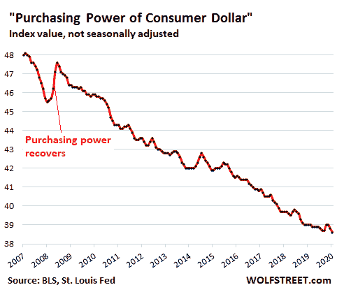
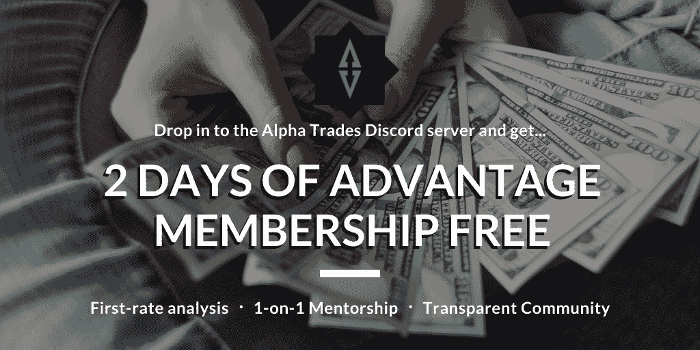

# 注入市场——FAANG 将继续驾驭这种永久的能量

> 原文：<https://medium.datadriveninvestor.com/injection-for-the-market-faang-continues-to-ride-that-perma-bull-energy-b1ac5b88e089?source=collection_archive---------18----------------------->

## **DDI 市场&经济简讯| 8 月 24 日当周 Alpha 交易**

FAANG 股票在 FDA 对 COVID 等离子治疗紧急绿灯的消息下拉高了市场。在一周的失业数据再次破裂后，市场和疫情向投资者发出了复杂的信号。

# DDI 更新

感谢阅读:我们希望听到你的声音。

DDI 发展迅速，打破常规，我们认为这是一件好事。但是我们很想知道您到目前为止对时事通讯和我们出版物的体验。

[在这里让我们知道](https://stoneba1992.typeform.com/to/gkpWMtS1)。

需要一个推动力来启动这个杀手级应用吗？我们希望为初创公司和有大创意的个人获得资金。

位于 **DDI 愿望清单**顶端的是:自动化交易软件和策略。

今天就联系我们的研究团队，我们会看看你是否合适。

**DDI 会员角|** 我们希望在时事通讯和我们的主要网站上刊登来自我们投稿人的一流报道。

DDI 会员角将展示我们社区与全球 60k+用户和观众的深度对话。

你在大数据、人工智能、物联网、创业文化或其他任何与技术相关的领域挖掘出了什么惊人的东西吗？请[给我们发一份草稿](mailto:members@datadriveninvestor.com)。

**最新 DDI 问题:**

*   [加密货币](https://www.datadriveninvestor.com/2020/08/20/crypto-rollercoaster-trouble-on-the-eth2-0-testnet-volatile-markets-the-fed-talks-cbdcs/)
*   [市场&经济](https://www.datadriveninvestor.com/2020/08/18/close-but-no-cigar-stock-market-targets-record-highs-amidst-stalled-covid-relief/)
*   [技术](https://www.datadriveninvestor.com/2020/08/13/rocky-start-for-reels-global-tech-splinters-5g-gets-a-boost/)

(注:如果你喜欢这封邮件，请考虑把它转发给某个会从中获益匪浅的人。如果有朋友给你发了这封邮件，你可以 [*订阅 DDI 简讯*](https://www.datadriveninvestor.com/about/) *这样你就不会错过任何一个节拍。)*

# DDI 编写器亮点

在每一期中，我们喜欢从展示一些来自 DDI 社区的发人深省的故事开始。我们需要更多特定主题的内容，所以现在是您将您的作品展示在我们 23.4k 订户面前的最佳时机。[在这里提交你的最佳表现](https://datadriveninvestor.com/mainsubmission)。

[如何以交易为生](https://www.datadriveninvestor.com/2020/08/17/how-to-trade-for-a-living/)

"没有游戏计划，你只是在赌博."-阿莫尔·加特

[如何不做傻钱](https://www.datadriveninvestor.com/2020/08/19/how-not-to-be-dumb-money/)

“在你的能力范围内，一代人中很少有一两次机会能让你感觉自己像 1974 年的巴菲特。那就是你下大注的时候。”莱斯特·戈登

[股票捐赠:须知](https://www.datadriveninvestor.com/2020/08/03/stock-donations-what-to-know/)

“好处是显而易见的:你不必纳税，而且慈善机构收到的钱比其他方式要多。”-亚历克斯·钟

[金融犯罪、合规和新冠肺炎](https://www.datadriveninvestor.com/2020/08/20/financial-crimes-compliance-and-covid-19/)

“非法行为者利用全球经济压力的脆弱性和新冠肺炎疫情造成的供应链中断，有效地制造了一场欺诈计划和洗钱的完美风暴。”安吉拉·哈比比

[无论如何，政府在自由世界中的地位会是怎样的？](https://www.datadriveninvestor.com/2020/08/20/what-would-governments-place-in-a-free-world-look-like-anyway/)

“虽然大脑命令身体的其他部分采取行动，并会毫不犹豫地牺牲手臂，但我们的管理机构会向每个成员提供关于情况和权衡的准确信息。”穆罕默德·西迪基

# 推销

[**恐惧&贪婪指数**](https://money.cnn.com/data/fear-and-greed/)**:**【72:贪婪】(截至 2020 年 8 月 24 日)

**发生了什么:**市场对 [FDA 针对恢复期血浆 COVID–19 治疗的紧急使用授权](https://www.fda.gov/news-events/press-announcements/fda-issues-emergency-use-authorization-convalescent-plasma-potential-promising-covid-19-treatment)有所上升。美国卫生与公众服务部部长阿莱克斯·阿扎尔(Alex Azar)称这一消息是“川普总统努力从新冠肺炎拯救生命的里程碑式成就”

# 方型复苏。

虽然 S&P 保持着历史高点，但没有前五名，S&P 今年仅上涨了约 2%。而包括 FAANG 在内，涨幅超过 35%。这是自 20 世纪 80 年代以来对前 5 名最大规模的比例估值。

对大型科技公司加倍下注:日本控股公司软银[斥资约 39 亿美元](https://www.bloomberg.com/news/articles/2020-08-18/softbank-bets-3-9-billion-on-u-s-giants-from-amazon-to-tesla)购买了 25 家大型科技公司的股票，包括亚马逊和特斯拉。

根据美国银行的数据，对冲基金在 FAANG 股票中的空头头寸比例处于[创纪录的低点 1%](https://www.businessinsider.com/stock-market-crash-end-of-tech-rally-valuation-causes-impact-2020-8#:~:text=A%20Wall%20Street%20investment%20chief,could%20trigger%20a%2040%25%20drop) 。

**放大:**特斯拉首次收于 2000 美元以上，市值超过沃尔玛。今年早些时候，该公司成为世界上最大的汽车制造商。该公司正准备在本月进行 5:1 的股票分割，同时有传言称它将进入标准普尔 500 指数。

**这是巨大的:**在同一个俱乐部中，苹果[成为市值达到 2 万亿美元的美国公司的第一名](https://www.cnbc.com/2020/08/19/apple-reaches-2-trillion-market-cap.html)。

他们也有流动资产来抵消多次的债务发行。他们以 2.6%的利率发行了 40 年的债券，这甚至赶不上实际通货膨胀的调整速度。

对于一家今年在 S&P 回报率上有所作为的大公司来说，这是一次稳健的融资。

**如何解读:**对于标准普尔指数和 FAANG 来说，苹果进军债券发行可能是一个看涨信号。

考虑到前 5 名股票与 S&P 中排名最低的 380+股票具有相同的美元对美元的投入，或许这些都不会对该指数中的小型股产生实质性影响。

相反，沃伦·巴菲特，一个不需要介绍的人，上个季度购买了一家金矿公司的股票。大约 20 年来，巴菲特一直对黄金不感兴趣，但也许这些不确定的时期改变了他的想法。在当前的经济条件下，随着金价在一段时间内突破 2000 美元，这位传奇投资者可能会看到被低估的矿业公司的不祥之兆。

今年早些时候，巴菲特先生和 T2 向陷入困境的航空业挥手告别。

# 经济

**解脱在哪里？**特朗普政府看到了一条向民主党领导层妥协的道路。该一揽子计划总额将达到 5000 亿美元，并且只包括双方都能同意的提议。([彭博](https://www.bloomberg.com/news/articles/2020-08-19/trump-team-sees-path-to-pared-down-500-billion-stimulus-deal?srnd=premium&sref=DWzi38c2))

随着美国经济复苏放缓，首次申领失业救济金人数攀升至 140 万。美国国税局预计，数百万失去的工作在几年内不会恢复。根据美国国税局的说法，这些工作中的许多将被临时工取代。

保持冷静，吃披萨:来自多米诺披萨等公司的消息似乎与美国国税局预测的 UberEats 式工作激增相吻合。比萨连锁店计划再雇佣 20，000 名员工来满足世界对比萨外卖的巨大需求。

**聊胜于无:**然而，川普的行政命令创建了一个拨款项目，提供高达 400 美元的失业救济金。由于该计划的成本分摊结构，许多州选择不支付他们的 25%的交易，所以一些居民只收到 300 美元。

一些好消息:随着经济状况的改善，美联储结束了与各国央行为期一周的美元互换。([路透社](https://www.reuters.com/article/us-fed-swaps/fed-to-cut-one-week-dollar-swap-operations-with-major-central-banks-idUSKCN25G0R7))

没关系:在另一端，美元的购买力本月跌至历史最低点。

Purchasing Power of Consumer Dollar; Source: BLS, St. Louis Fed

**2020 年不放假…等着吧。**

T2 25%的酒店面临丧失抵押品赎回权的风险。与此同时，美国航空公司继续削减，国内运力减少 46%，总体减少 56%。([求阿尔法](https://seekingalpha.com/news/3606183-u-s-airlines-keep-cutting-capacity-business-travel-almost-non-existent?utm_source=feed_news_all&utm_medium=referral))

Source: US Census Bureau, [fred.stlouisfed.org](https://www.google.com/url?q=http://fred.stlouisfed.org&sa=D&ust=1598287452091000&usg=AFQjCNFz88nCIj_40MPJ3YF8JZHJVUFupw)

**房地产繁荣与萧条的结合:**从 6 月到 7 月，随着销量逐月增长，现有房屋的销量跃升了 24.7% ，而市场上的总供应量却下降了 21.1%。随着疫情事件后消费者欲望的转变，涌入郊区的城市居民之间的竞价大战开始点燃，我们可能会发现自己正处于房地产市场的下一个繁荣周期。

# 冠状病毒

来自印度的报告表明，随着欧洲和韩国面临新病例的又一次激增，该国可能正在快速接近群体免疫。

此外，科学家们看到了对新冠肺炎的持久免疫力。如果是这样的话，这可能会减轻公共卫生官员所谓的“双流行”的压力，在这种情况下，严重的流感季节与持续的冠状病毒疫情混合在一起。

# 中国

**高等教育。压力之下:**美国国务院警告大学放弃捐赠基金中的中国股票，以防中国公司被交易所摘牌。([金融邮报](https://financialpost.com/news/fp-street/u-s-warns-colleges-to-divest-china-stocks-over-delisting-risk))

数十亿美元的撤资可能会对美中关系产生重大影响。今年，美国监管机构敦促美国证券交易所改变针对涉嫌普遍欺诈行为的中国公司的规则。

**抖音，仍然是一个热门话题:**川普表示，技术重量级的甲骨文将是接管抖音美国业务的特殊选择。( [BBC](https://www.bbc.com/news/business-53830533) )

本月早些时候，总统命令抖音的所有者字节跳动在 90 天内出售其美国分公司，否则将被扫地出门。微软和 Twitter 都在与 TikTik 就潜在的收购进行谈判。

**如需详细分析，**请阅读“伟大的技术分离就在这里。”( [Axios](https://www.axios.com/the-great-tech-decoupling-is-here-a98b2d78-c239-4267-b25b-159a21034ff9.html) )

**贫富长城:**中国在从 COVID 复苏的过程中，面临着日益扩大的贫富差距。北京的重点一直是刺激投资和发展，而不是将刺激措施交到消费者手中。([金融时报](https://www.ft.com/content/e0e2940a-17cb-40ed-8d27-3722c9349a5d)

豪华车在中国的销售势头迅猛。与此同时，失业率居高不下，中低收入人群消费减少。

**伏笔:**随着该国遭遇创纪录的洪水，超过 10 万人被迫[撤离](https://www.aljazeera.com/news/2020/08/china-floods-100000-yangtze-evacuated-leshan-buddha-risk-200819054517217.html)。许多人担心三峡大坝将无法阻挡长江。

# 当人们问“比特币是如何工作的？”我们推荐这本书。

比特币被一些人誉为“数字黄金”，被另一些人誉为“纯粹的货币”，对许多人来说，它意味着许多东西。 [**比特币基础知识:比特币入门**](https://www.amazon.com/dp/B08FBP9W4Y) 帮助你开启比特币之旅。

这本书将帮助你对构成比特币的**基本概念**感到舒服，无论你是寻求被告知还是准备好亲自参与比特币。**了解比特币网络的关键特征**，解释如何将比特币从一个人转移到另一个人，深入研究**比特币的历史**，等等。

# 其他新闻

**加州着火了:**由于加州[的野火](https://www.marketwatch.com/story/fire-ravaged-northern-california-braces-for-high-wind-lightning-that-could-worsen-the-situation-2020-08-23)导致 6 万居民打包回家，数千个家庭面临危险。在有史以来最致命的热浪过后。

**民主党:**参议员卡玛拉·哈里斯在巴拉克·奥巴马、希拉里·克林顿和[伯尼·桑德斯](https://www.dailymail.co.uk/news/article-8637317/Sanders-warns-authoritarianism-taken-root-asks-supporters-vote-Biden.html)的支持下接受了副总统提名。( [NPR](https://www.npr.org/2020/08/20/904116552/historic-kamala-harris-accepts-vice-presidential-nomination) )

**一个巨大的错误:** 40%的英国学生看到他们的成绩下降，因为政府实施了一种算法，这种算法不成比例地影响了弱势学生。([美国消费者新闻与商业频道](https://www.cnbc.com/2020/08/21/computer-algorithm-caused-a-grading-crisis-in-british-schools.html))

在学生抗议后不久，政府取消了分数，因为该算法复制了英国教育系统中存在的不平等。

**呜呜:**花旗集团因一项 10 亿美元的错误提起第三起诉讼。该公司在意外地向露华浓公司的债权人送去一大笔现金后，正在与十几家公司竞争

**出人意料的转折:**在旅游业陷入低迷之际，价值 180 亿美元的 AirBnB 已经正式[申请首次公开募股](https://www.businessinsider.com/airbnb-confidentially-filed-for-an-initial-public-offering-2020-8)。该公司在 Q2 的收入下降了 67%。

**大家在线:**说到惊喜，Target 报告说[从几个方面来看都是最强劲的季度之一](https://techcrunch.com/2020/08/19/target-sets-sales-record-in-q2-as-same-day-services-grow-273/)。这家零售巨头的数字销售飙升 195%，当天服务跃升 273%。

在 2020 年的前六个月，该公司获得了 1000 万数字客户和另外 50 亿美元的市场份额。与沃尔玛一样，塔吉特百货也从政府的刺激计划中受益匪浅，这意味着随着疫情的消退，该公司的增长可能会放缓。

**缩小:**电子商务正在蓬勃发展，Q2 的销售额占美国零售总额的份额超过 16.1%，高于 Q1 的 11.8%([@ stlouisfed](https://fred.stlouisfed.org/graph/?g=unh2&utm_source=twitter&utm_medium=SM&utm_content=stlouisfed&utm_campaign=36d2c793-1904-4e45-bb55-6aab2b73c29d))

# 观看表演

我们在 [Alpha Trades](https://twitter.com/the_alphatrades) 的朋友这一周都在深入研究市场、密码和经济。通过最新剧集找到您的优势:

[比特币:未来一周充满变数|关注空头与多头的水平](https://www.youtube.com/watch?v=TjvPrYad1_g)

[比特币为什么会区间，哪些 alt 币会爆发！](https://www.youtube.com/watch?v=hBd6LKhbdW0)

[我们为什么做空科技股|观察名单:XLK，AAPL，TSLA，XLV，MRVL，COUP，OKTA，TSM](https://www.youtube.com/watch?v=i1yhP4Q8Xgw&t=5s)

[2020 年 8 月 24 日当周美国股市讨论](https://www.youtube.com/watch?v=dXicLLvJUd0&t=482s)

[订阅 Alpha Trades Discord 服务器](https://bit.ly/2KJ1oor)学习技术分析以及如何投资获利。询问 2 天的高级会员试用！

**注意，订阅者:**你们中的一些人可能已经订阅了 DDI 的媒体出版物简讯和主要网站的简讯。我们欣赏粉丝，但两个简讯是同一只野兽。

如果你在这种情况下，我们建议坚持使用主网站。你会注意到正确的一个缺乏媒体品牌。如果您有任何问题，[发送电子邮件给我们](mailto:members@datadriveninvestor.com)。

# 放弃

数据驱动投资者(DDI)提供的信息不用于做出任何金融决策，也不是购买、持有和/或出售特定证券或金融工具的请求或建议。

Alpha Trades，LLC 提供的信息不用于制定任何财务决策，也不是购买、持有和/或出售特定证券或金融工具的请求或建议。

访问 Alpha Trades 的完整服务条款:[https://bit.ly/3faVeeV](https://bit.ly/3faVeeV)