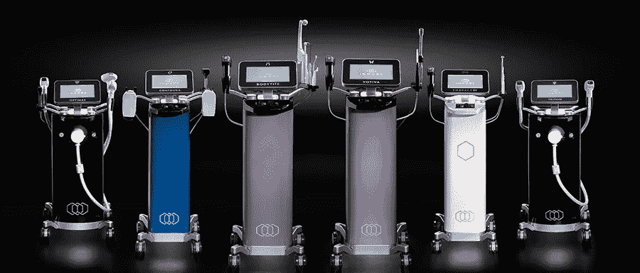
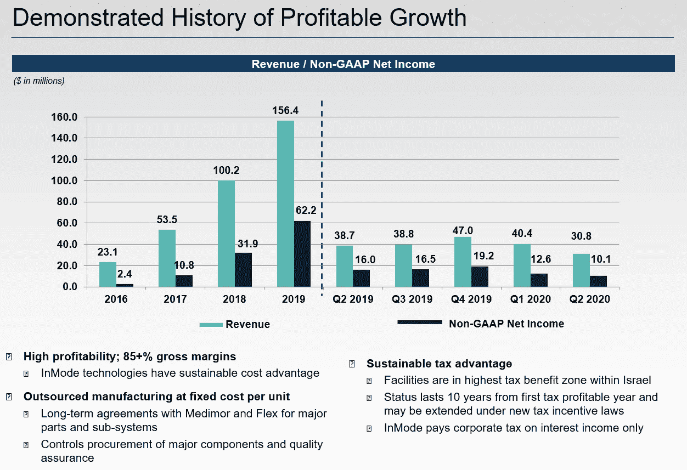

# in mode Surgical(INMD)——每股 32 美元的强力买入

> 原文：<https://medium.datadriveninvestor.com/inmode-surgical-inmd-a-strong-buy-at-32-share-dc0a698a5e18?source=collection_archive---------6----------------------->

一年多前，InMode Ltd 首次公开募股，是一家年轻的健康科技公司，由其创始人运营，在美国开发微创外科美容和医疗解决方案。其革命性的专利产品和解决方案旨在满足面部和身体塑形、医疗美容和女性健康等领域对微创、有效且价格合理的治疗的需求。鉴于其目前的竞争优势、诱人的财务状况和巨大的增长潜力，我相信 in mode Ltd(“INMD ”)将成为医疗美容领域的下一个领导者，以目前的价格来看，这是一项伟大的长期投资。

Next Generation of Beauty Clinical Technology by InMode Ltd

> “内置设备正在成为全国整容手术的标准项目。这是因为 InMode 美学提供了安全、有效且易于使用的激光工具。他们的产品实现了与其他激光技术相同的目标，但痛苦更少，不舒服，见效更快。”- [海塞姆·马斯里博士](https://www.healthgrades.com/physician/dr-haitham-masri-3dcpc)

**关键指标和财务快照:**

*   **股票代码:INMD**
*   目前交易价格为 31.81 美元
*   **基本目标价:48.35 美元，41%的潜在回报率**
*   市值:10.8 亿英镑
*   稀释每股收益(TTM): 1.24
*   **同比增长 56%(2018 年至 2019 年)，2019 年收入 1.564 亿美元**
*   市盈率:26
*   铅比率:5.3
*   **持续毛利率:85%**
*   股息率:0%
*   自由现金流:110 万英镑
*   该公司目前在 53 个国家开展业务，但大部分收入来自美国。
*   **医疗美容市场价值 105 亿美元，预计到 2025 年市场增长将达到 222 亿美元，CAGR 增长率为 11.5%(**[**2018**](https://meticulousblog.org/top-10-companies-in-medical-aesthetics-market/)**)。**

Page 25 of 2020 Second Quarter Presentation

**疫情的影响**

在 2020 年第二季度的业绩中，InMode 报告的收入为 3080 万美元，与 2019 年第二季度相比下降了 21%，这主要是由于全球新冠肺炎疫情的影响。然而，毛利率仍保持在 85%左右，该股已从 3 月份的低点反弹了 110%。

此外， [InMode management 最近宣布了一项高达 100 万股普通股的股票回购计划](https://www.prnewswire.com/news-releases/inmode-announces-share-repurchase-program-of-up-to-1-million-shares-301122431.html)。“鉴于我们有利可图的扩张，我们认为我们的股票是一个有吸引力的投资机会。InMode 首席财务官 Yair Malca 指出:“InMode 将继续利用其强劲的现金流和资产负债表来支持未来的增长，并实现股东价值最大化。

**比赛**

InMode Ltd 目前面临来自 Allergan(一家年收入超过 160 亿美元的全球制药公司)和 Sisram Medical Ltd(一家开发基于能源的手术和医疗美容解决方案的以色列公司)等公司的中等竞争。

然而，InMode 的合作伙伴关系和来自医生的产品评论、专利技术和 85%的高毛利率代表了尚未被这些竞争对手阻碍的重要护城河。谨慎的投资者可能会继续关注该股，直到该公司报告称需求已恢复正常，财务业绩符合目前的预测。

**结论**

由于缺乏对中小市值空间的覆盖以及股票的流动性，股票似乎被错误定价，因为市场在疫情期间超卖，并且没有将 InMode 技术的真正潜力和在该空间的地位或最近宣布的股票回购计划正确纳入股价。虽然目前这个时间点可能代表公司的相对低点，对投资者来说是一个很好的买入机会，但美国经济和竞争对手的压力等外部因素肯定会最大限度地减少潜在的上涨空间，并在短期内推动股价下跌。

由于 InMode Ltd 的专利和强大的品牌认知度带来的竞争优势，其盈利增长的历史证明，以及由其创始人领导的拥有丰富科技经验和专业知识的成熟管理，我相信 in mode Ltd 将在未来 3-5 年内成为医疗美容行业的主导者，并将成为中长期个人投资的绝佳股票。

— — — — — — — — — — — — — — — — — — — — — — — — —

**披露:**我是龙 INMD。这篇文章是我自己写的，它表达了我自己的观点。我没有因此得到任何补偿。我和这篇文章中提到的股票的任何公司都没有业务关系。

这篇文章是我将在 Medium 上发表的许多“3 分钟”股票建议中的第一篇，它更多的是让我跟踪我的建议和我的思维过程，而不是给出实际的投资建议。在做出任何投资决定之前，请做好自己的分析和研究。然而，我总是愿意进一步讨论或联系一般的职业目的。请直接联系 bou@bowdoin.edu 的 ***。由*** [***布莱恩欧***](https://www.linkedin.com/in/brianjennou/) ***撰写。***