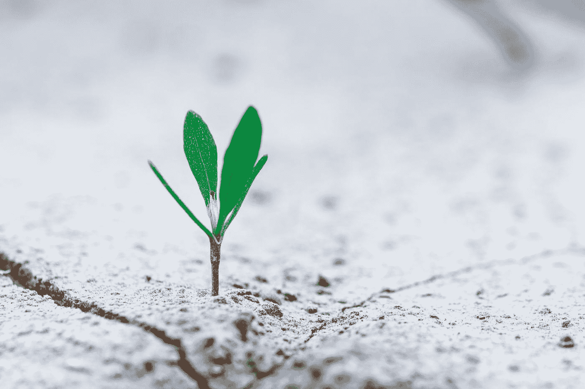
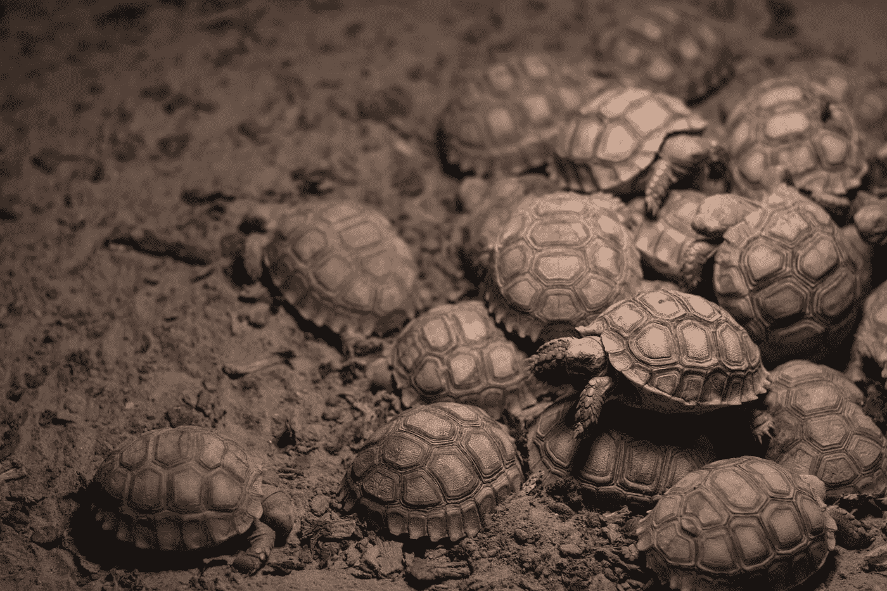
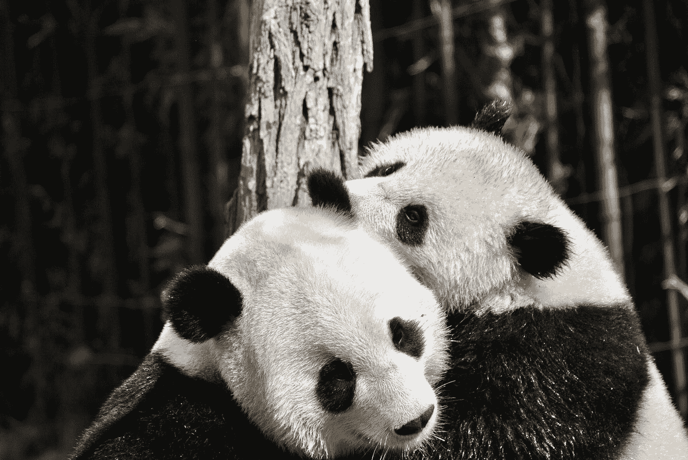

# 自然中的创新:改变企业的生活史战略方法

> 原文：<https://medium.datadriveninvestor.com/innovation-in-nature-a-life-history-strategy-approach-to-change-your-business-61fba67242f7?source=collection_archive---------9----------------------->

## 是时候问问大自然如何跟上变化的步伐了。被疫情放大的数字挑战正在创造新的赢家和输家。从重新想象我们的生活，到重新评估个人和职业层面的成本，我们需要有效的方法来抵御威胁和抓住机会。

Photo by [Stanislav Kondratiev](https://unsplash.com/@technobulka?utm_source=medium&utm_medium=referral) on [Unsplash](https://unsplash.com?utm_source=medium&utm_medium=referral)

在我们这个时代，每个人都以谷歌、亚马逊或苹果为例谈论创新。在这些会谈中，创新等于破坏、裁员、打折、不承认创造“新”东西所需的所有增量工作。

当我们主要感知物质变化时，我们不太重视生命的进化方面，它是渐进的，并围绕适应环境的成功和失败而优化。突发事件会改变生态系统和有机体的平衡，而它们没有能力改变这种平衡。

几十年来，**知识产权排他性和监管法律**一直是许多行业追求和资助创新的关键，为组织带来了繁荣和发展。对这些不可逾越的障碍充满信心，在这些组织中，创新过程变得如此沉重，以至于当新的初创企业出现时，削弱了它们的反应；科技巨头或其他大型组织已经开始蚕食业务，征服角色，进化和融合他们的生态系统。

为了赢得他们的数字挑战，无论规模大小，无论行业如何，组织都需要高飞，寻找可能创造今天和明天业务的机会。他们将不得不放弃自己钻法规空子的做法，并将整个行业推向新的合作水平。

# 理解生活史策略

简而言之，生活史策略是生物体重复繁殖自身并在生态系统中成功生存的具体方法。在这个选择过程中，生态系统扮演着重要的角色。一个生态系统始于被迫分享同一个空间的生物，它们靠自己生活:当外部因素增加压力时，(气候变化或新的生物进入空间)，它们开始在决斗或特定的竞技场上以竞争或合作的模式相互交战:经过几次迭代，将达到平衡的生物将发展或调整自己的生活策略，成为或保持生态系统的组成成员。

> 考虑到其他物种而优化投资的生物将在进化的生态系统中生存；其他人会灭亡。

## 创新并行

如果我们将创新视为实现“生活化”理念的过程，我们可以寻找与生活史策略类似的创新策略:

> 由于生命战略强烈依赖于生态系统，创新战略也需要考虑生态系统和能够产生变化的相关因素。

Photo by [Anne Nygård](https://unsplash.com/@polarmermaid?utm_source=medium&utm_medium=referral) on [Unsplash](https://unsplash.com?utm_source=medium&utm_medium=referral)

在自然界中，如果一个生物在后代和父母的能量投资之间找到了正确的平衡，它就会在生态系统中生存下来:后代少意味着父母的能量投资高，而大的后代则携带低的能量投资。这就是它的设置方式。

在任何生活史策略的基础上，都有一个基本的“数量与质量”的问题。**没有对错。最好的生活史方法是适合生态系统的方法。**

这适用于动物、植物和生殖之间的类比，因为推广“生命”的想法，它可以扩展到产品和服务创新。

在这种“ ***数量 vs .***质量”的困境下，乌龟和熊猫代表了两个象征性的极端:

> 海龟的生活史方法更注重数量而不是质量，产卵多，几乎没有父母的投资。
> 
> 熊猫的生活史方法是相反的，父母对每一个后代都有奉献和精力投入。

同样的道理也适用于创新，在组织下一次黑客马拉松或创新实验室之前，值得做一点数学计算，并对照“生态系统”进行现实检查，以验证投资将带来一些东西的可能性有多大。

 [## COVID19 和风险投资|数据驱动的投资者

### 当分析一家初创公司，尤其是处于早期阶段的公司时，投资者关注三个主要因素:团队、市场和…

www.datadriveninvestor.com](https://www.datadriveninvestor.com/2020/07/23/covid19-and-venture-capital/) 

## 应用于创新的“海龟生活史策略”

在创意需要有限投资才能生存的市场，组织可以使用“海龟”的生活史策略来创新。
这种思想“后代会在‘靠自己’之后离开，很少会独立生存下来并成为新的产品或服务。对于他们中的每一个人来说，可能性都很小，尽管自然选择会起到部分作用。

这种方法最适合将创意产品直接注入市场。

Photo by [Matt Antonioli](https://unsplash.com/@antoniolio?utm_source=medium&utm_medium=referral) on [Unsplash](https://unsplash.com?utm_source=medium&utm_medium=referral)

生活史海龟在 facts 中的策略要求想法一旦成形，将独立成长为产品:**谷歌、亚马逊、阿里巴巴或三星**使用这种方法，很容易支持新想法，让客户验证他们的用例，如果产品和服务不成功，也很容易淘汰它们。

“海龟的方法”(许多小父母投资的蛋)在创新实验室和黑客马拉松中效果最好。原因很简单:这些想法需要有一个短的监管旅程，快速上市，没有隐性成本。赢得一场黑客马拉松可以让一个新想法获得足够的知名度，甚至在进入市场之前就引起风险投资(或科技巨头)的注意。投资者可能有多种兴趣:增加一种新产品，扩展现有产品的功能，或者只是“买凶杀人”，这是为了避免与自己的产品竞争。不过，最重要的一点是，随着创新成果得到统计管理，失败已嵌入投资过程:如果一个想法失败，没有人会丢掉工作，因为没有一份工作与一个想法相关联。

> 海龟生活策略的成功超越了个体后代，它是一个统计结果。

生物技术、保险技术或互联网领域的初创企业可以充分利用这一战略，因为它们可以获得风险资本家的早期关注，风险资本家可以在进入监管之旅之前推动它们的 IPO 或收购它们。

# 外卖:

> 在创意需要非常有限的投资才能生存的领域，组织可以使用黑客马拉松或孵化器来促进创新。
> 
> 高扩散率保证了整体投资的回报。
> 
> 这种策略对于直接注入市场的产品来说是理想的，只需要最少的投资。
> 
> 想法不一定是有机的，可以在不影响核心功能的情况下扩大组织
> 
> 如果利益没有实现，它们可以很容易地退役

## 应用于创新的“熊猫生活史策略”

在 R&D 支出大、监管强的行业，“熊猫”生活史策略会更有效。培养有限的思想后代，研究已确定的趋势并投入大量精力，这需要大量的父母关爱:这些有机体有效地投资于每个后代的生存。

Photo by [Ilona Froehlich](https://unsplash.com/@julilona?utm_source=medium&utm_medium=referral) on [Unsplash](https://unsplash.com?utm_source=medium&utm_medium=referral)

这非常适用于保健基础行业、生命科学和保险，在这些行业，创新是大量投资的结果，需要遵守非常严格的法规才能成为产品或服务。

在这个领域，亚马逊、联合健康集团、沃尔玛都收购了一些已经成型并发挥作用的东西，利用它们的领域知识来拦截需求。

**我们从中学到了什么？**

创新来自领域、功能和运营知识的结合。很少有组织同时具备这三种能力，大多数组织需要通过利用战略合作伙伴关系找到合适的组合。当内部视角确定“需求”时，最佳结果就会出现，功能视角来自最了解其他人在该领域所做工作的咨询公司，而运营知识来自“客户环境的监管者”，也就是系统集成商，他们将在保持房屋整洁的需要的激励下，为客户提供新的服务和产品。

战略伙伴关系需要时间，用我们的比喻来说，“父母关爱”概括起来就是时间和奉献。最好的设置是有独立于技术的创新部门，他们花时间将想法变成现实，重新加工它们，合并感知的需求和由此产生的理解。

这种设置不能外包，如果使用不当，可能会导致服务失败和更高的维护成本。

想想一个从黑客马拉松得到的商业功能，这是一个由精品初创公司开发的非常小众的应用程序，开发标准和合规性都很低。扩展到数以千计的销售代理时，这可能会因为高容量而崩溃，或者如果没有实施足够的安全性，它可能会被利用来造成数据泄露。

# 外卖:

> 拥有大量 R&D 支出和严格监管的行业，他们应该利用他们的领域知识，直接从市场中选择可行的新想法，并提供父母的照顾，直到新产品能够独立生存。
> 
> 要做到有机，创新需要围绕业务核心展开，理解主要需求，并在企业层面进行投资，给予适当的“关注”。
> 
> 创新应该为更多的精算师和科学家服务，以满足他们的需求，并利用他们的能力来改变业务，而不是次要功能来降低成本
> 
> 营销方面应该用来在内部解释价值和保存领域知识，因为想法应该在已经能够存活的时候到达市场。

# 结论

创新战略需要考虑生态系统和能够产生变化的相关因素，并做出相应的调整。

被疫情放大的数字挑战正以前所未有的速度改变着我们的商业和个人生活。新材料、新设备、新概念、新的交流方式会产生威胁或机遇，这取决于我们利用其潜力的能力。

这在本质上并不新鲜。在自然自我创新方式的基础上，有一个基本的“数量与质量”评估，目标是最大化生存几率。这种困境的答案受到环境的强烈影响，如果环境改变，反应也可以改变。

例如，随着科技巨头进入医疗保健领域，优惠正在转向成为患者之前、期间和之后的客户:这正在催生一个新的生态系统，“健康护理”和更多不同规模的参与者(从沃尔玛到生物技术和金融科技初创企业)正在寻找有利可图的有效方式加入生态系统。

因此，为了理解这一点如何适用于进化中的现有生态系统，有必要看一看*有机体、外部因素、新兴领域以及它们前面的竞争或合作模式*。记住所有这些，一个成功的*创新历史战略*就会随之而来。

在同一个生态系统中，不同的组织会采取不同的策略，他们的成功将取决于他们找到空白空间的能力。

例如，拥有大量 R&D 支出的组织将需要采用“熊猫的生活史战略”，利用其领域知识进行内部创造或直接从市场中选择可行的新想法，并提供父母的照顾，直到新产品能够独立生存。

与此同时，风险投资家和大型组织(从亚马逊到沃尔玛)将利用“海龟的生活史策略”四处搜寻想法，对初创企业给予早期关注，推动它们的 IPO，创造新的报价。

这不会是一个容易的转变，需要在各部门之间达到新的合作水平，打破十年一遇的障碍。

# 我关于创新的其他文章

[超越冲突和变革塑造创新的三种力量](https://medium.com/datadriveninvestor/three-forces-that-shape-innovation-beyond-conflict-and-change-ed063519f25e)

[创新农场和先锋精神:所有组织(和你)都需要在未来拥有发言权](https://medium.com/datadriveninvestor/innovation-farm-and-a-pioneers-spirit-all-organization-and-you-need-to-still-have-a-say-in-the-df6dc9424967)

[成功创新者的三个基本特征](https://medium.com/datadriveninvestor/the-three-essential-traits-of-successful-innovators-692abeb47a19)

# 我关于健康护理的其他文章

[“健康护理”的诞生:医药和保险机构的长期数字战略](https://medium.com/datadriveninvestor/the-birth-of-wellcare-a-long-term-digital-strategy-for-pharma-and-insurance-organizations-b801e5210f49)

[“健康护理”新路径:探究亚马逊颠覆、引诱和征服医疗和保险机构的数字战略](https://medium.com/datadriveninvestor/the-wellcare-new-trail-8f354fd78c19)

[Wellcare 正在围绕网上药店竞争形成:这是怎么回事！](https://medium.com/illumination/wellcare-is-shaping-around-online-pharmacy-competition-this-is-how-effba812189)

**访问专家视图—** [**订阅 DDI 英特尔**](https://datadriveninvestor.com/ddi-intel)