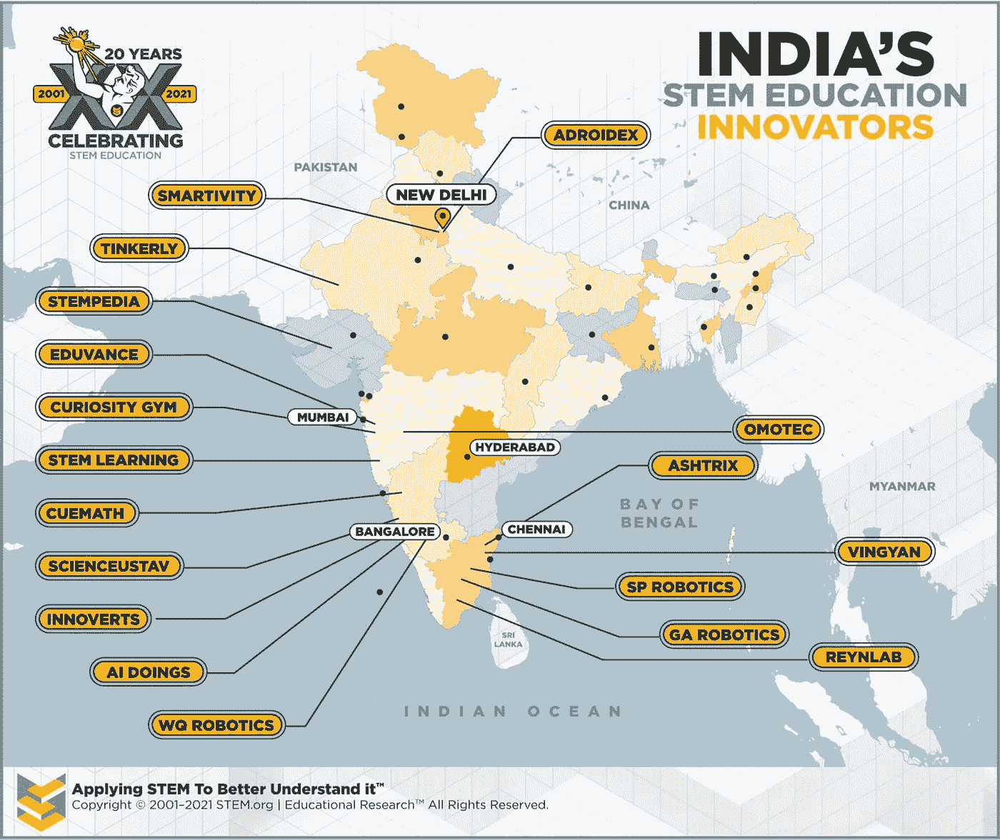

# STEM 教育创新是印度成功的关键

> 原文：<https://medium.datadriveninvestor.com/innovation-in-stem-education-is-critical-to-make-in-indias-continued-success-b3ab81c38ad9?source=collection_archive---------4----------------------->

## 对国家科学、技术、工程和数学教育资产的分析

Image: Getty# 861234452 / Young Boy On A Laptop

*作者:* [*安德鲁·b·劳普*](https://medium.com/u/d8c8d333927a?source=post_page-----bc7b73a1ac7b----------------------)*/*[*@ stem CEO*](https://twitter.com/stemceo)

于 2014 年启动的[印度制造](https://www.makeinindia.com/about)计划旨在重建印度经济，摆脱对服务业的严重依赖，并向创建全球制造业和创新中心迈进。对于世界上最大、最有活力的国家之一来说，这是一项巨大的努力，需要大量的基础设施和投资。

印度也在努力通过寻求投资和吸引投资者离开在中国的工厂，转向更具创新性和关税更低的海岸，转向后 COVID 世界。像苹果这样的公司注意到了这一点，并且已经开始将生产转移到印度。这一切都是在 STEM 工作整体大幅增长的背景下发生的。从 2016 年到 2019 年，印度的科技工作岗位增加了 44%。

但是这个国家会有足够的有能力的工人来响应这个号召吗？印度制造要想获得持续的成功，需要的不仅仅是投资者。它还需要拥有在高科技行业工作所需的教育和技能的人口。

幸运的是，有一批企业家、教育家和创新者听到了响亮而清晰的呼声，正在投资 STEM 教育以培养本土人才。

STEM 组织准备让印度成为一个制造商之国

Image: Getty# 681063154 / Indian Couple Viewing Tablet

印度从服务型经济向制造业经济转型最令人兴奋的一个方面是该国对 STEM 教育越来越多的承诺。有几十个充满活力的组织正在努力确保印度学生获得他们在科学、技术、工程和数学方面所需的技能，以便他们不仅准备在制造业工作，还准备通过创办自己的企业来推动经济增长，为市场带来创新。

让我们来看看一些令人难以置信的组织，它们让印度各地强大的 STEM 教育成为可能:

*   **Adroidex:** 除了成人的持续培训和教育，他们还与 Discovery Education 合作提供在线 STEM 课程。Adroidex 还提供了一系列儿童友好型机器人，以一种社交化和无障碍的方式为年轻学习者带来编码和机器人教育
*   **AI doings:**[AI doings](https://www.aidoings.ai/)正在利用人工智能(AI)令人难以置信的力量，通过早期阅读障碍检测来支持教育。他们的创新项目利用家族史数据，以及对眼球运动和阅读情绪反应的测量，来确定孩子患阅读障碍的可能性，以便在孩子在学校落后之前获得他们需要的支持。
*   **ash trix:**ash trix 在 20 个国家拥有超过 14，000 名学生， [Ashtrix](https://ashtrix.in/) 通过互动课程和个人关注，使机器人和人工智能领域的 STEM 学习民主化。学生们学习构建聊天机器人，设计识别图像的程序，开发有用的 Android 应用程序，同时为驱动我们未来的技术打下坚实的基础。
*   如果你曾经在数学课上挣扎过，你就会知道在这门重要的学科中，好的教学是多么重要。通过在线直播课程， [Cuemath](https://www.cuemath.com/) 为所有年级提供了基于研究的数学课程。专家指导的重点是教孩子形象化概念，创建心理模型，并用逻辑和数学思维解决现实世界的问题。

 [## 剖析 STEM |数据驱动型投资者中的性别差异

### 女性仅占 STEM 领域劳动力的 28%。在 2020 年，STEM 劳动力不应该是这样的…

www.datadriveninvestor.com](https://www.datadriveninvestor.com/2020/08/05/dissecting-the-gender-divide-in-stem/) 

*   **好奇心健身房:**像所有伟大的 STEM 项目一样，[好奇心健身房](https://www.curiositygym.com/)完全专注于体验式学习。他们与学校合作，提供“创新中心”，让孩子们体验各种制作的实践课程。他们还提供一系列强大的在线课程，包括编码、机器人等。也许最令人兴奋的是他们独特的一对一导师模式，用于一系列高科技学科的个性化学习。
*   **edu vance:**[edu vance](https://eduvance.in/)明白支持 STEM 的不仅仅是产品——尽管他们有很好的产品，包括无人机和 DIY 全息图。他们还提供研讨会、课程，并促进与行业的合作关系，将学习实验室和技术直接带到需要帮助的学校，以启动如此大的投资。

Graphic: Andrew B. Raupp STEM.org Education Research™ / India STEM Inventory Map Q4 2020 v1.4

*   **GA Robotics:**[GA Robotics](https://garobotics.in/)知道学生需要时间来克服对枯燥、基于教科书的科学课的厌恶。这就是为什么他们提供教师培训和专业知识来设计引人入胜的实验室空间，吸引学生进入令人兴奋的 STEM 世界。该公司为儿童、大学生和希望提高技能的专业人士提供电子、编码、机器学习等课程。
*   **Innoverts Network Private Limited:**[Innoverts Network](http://innovertsnetwork.com)是一家教育技术公司，专注于利用最新的智能技术、实验室的设计/开发以及通过为所有年龄和背景的学生提供未来技能组合机会来增强当前的教育系统。
*   **Omo tec:**Omo tec——是 [OnMyOwnTechnology](https://onmyowntechnology.com/) 的缩写——为所有年龄段的学生带来机器人的乐趣，甚至包括成年工程师。精心设计的课程提供机器人工程方面的深度学习，这些学习来自一个拥有已发表研究成果和两项自有专利的实验室团队。这听起来可能很沉重，但重点在于乐趣，用乐高积木和竞赛来激发创造力。
*   **Otomatiks:**[Otomatiks](http://otomatiks.com)提供最先进的设施，根据学校的需求和预算，将机器人教育作为课外活动或常规教学的一部分。他们的机器人实验室可以为初学者、中级和高级学习者量身定制，他们还提供专注于艺术和创造力的额外课程。
*   **reyn labs:**[reyn labs](https://reynlab.com/)提供技术领域的实践学习，为更多人打开就业机会。电动和混合动力汽车的模拟课程有助于更新机械师的技能，重点是做而不是阅读枯燥的培训手册。随着印度制造业经济的发展，这种针对成年人的高级培训将至关重要。
*   **science usav:**[science usav](https://scienceutsav.com/parent/)致力于实践学习，并肩负着鼓励孩子们“超越所教的去思考”的使命。该组织提供 STEM“修补实验室”和创客空间，以及营地、活动和在线课程，以接触尽可能多的年轻人。学校、企业和个人家庭都可以利用这些服务来帮助尽可能多的孩子。
*   **技能天使:** [技能天使](https://www.skillangels.com/)是一个屡获殊荣的计划，旨在通过一些他们需要掌握的最重要的教育技能来指导孩子。该计划使用人工智能来评估学生的基本理解，并提供个性化的练习。随着孩子在某项技能上变得更好，这个项目的难度和测量结果都会增加。还提供早期儿童和特殊教育项目。

Image: Getty# 1166636196 / Street Vendor’s Indian National Flag Product Assortment

*   **Smartivity:** 浏览 [Smartivity](https://www.smartivity.in/) 网站有点像参观圣诞老人的工作坊——如果小精灵们都是 STEM 老师的话。该公司令人难以置信的木制建筑套件让孩子们在通过实验学习物理基础的同时解决工程问题变得有趣。公司还致力于可持续实践和性别平等 STEM。
*   smart kidz:[smart kidz](https://www.smartkidzs.in/stemkidz/)将自己描述为一家“寓教于乐”的公司，专注于为学生提供机器人和科学教育的乐趣。他们提供机器人、Python、航模和机器人方面的课程，同时通过直接援助努力支持贫困社区。
*   SP Robotic Works:[SP Robotic Works](https://sproboticworks.com/global/en-us)提供机器人在线学习以及安卓应用制作和人工智能。对于成年人来说，还有机器学习和虚拟现实方面的额外课程，旨在提高这些不断增长的领域的技能。该公司还提供一系列机器人竞赛和活动，以创建一个学习者社区。
*   **STEM Learning:**[STEM Learning](https://stemlearning.in/)深知要让深度 STEM 项目成为现实，需要一个村庄的努力。该小组倡导实践学习，并促进公共和私营部门之间的联系，以推动变革。他们的工作包括开发教师培训项目、创客空间、智力竞赛等。
*   **tinkley:**[tinkley](https://tinker.ly/)希望将每一间教室变成 21 世纪的学习实验室，目标是支持孩子们培养技能。Tinkerly 是材料工具包和创客空间设备的绝佳资源，但让它们与众不同的是它们令人难以置信的项目库。从纸飞机的空气动力学课程到复杂的电子产品和物联网项目，你可以在这里找到一切，让孩子们参与其中。
*   **Vingyan Innovations:** 作为一家从农业到制造业都有丰富经验的创新技术公司， [Vingyan Innovations](http://www.vingyan.com/) 知道如何为合作伙伴带来关于数据的创新想法。该公司还致力于将“tecklabs”带到学校，将绿色能源、物联网和人工智能的学习嵌入课程。他们的技术推广活动已经惠及 1000 多名学生，而且人数还在增加！
*   **Wissensquelle Robotics:**[Wissensquelle Robotics](https://www.wissensquelle.com/)已经为印度各地的学校带来了超过 75 个机器人和 3D 打印实验室，为年轻的初学者提供从初中到高中的学习课程。重点是机器人和开放的创造力。该公司还将 3D 打印实验室和人工智能中心带到大学，以支持编程指导和工作培训。

Image: Getty# 1155281861 / Indian Cargo Ship “Made In India”

有了这么多支持印度 STEM 教育的基础工作，这个国家有望实现它的目标。但必须指出的是:如果不进行意义深远的教育改革，让学生为 STEM 职业的未来做好准备,“印度制造”就不可能成功。创建一个成为创新工作者的热情学习者的管道是关键的第一步，我们期待看到印度未来更加关注 STEM 教育。

本文原载于 2020 年 8 月 21 日的*《STEM.org 线人:新闻周刊》*，并于 2020 年 10 月 5 日*更新为*媒体*。*

[安德鲁·b·劳普](https://medium.com/u/d8c8d333927a?source=post_page-----bc7b73a1ac7b----------------------)是创始人/执行董事 [@stemdotorg](https://twitter.com/stemdotorg) 。*“通过健全的政策实践使科学、技术、工程和数学(STEM)教育民主化……应用 STEM 以更好地理解它。”*

## 访问专家视图— [订阅 DDI 英特尔](https://datadriveninvestor.com/ddi-intel)