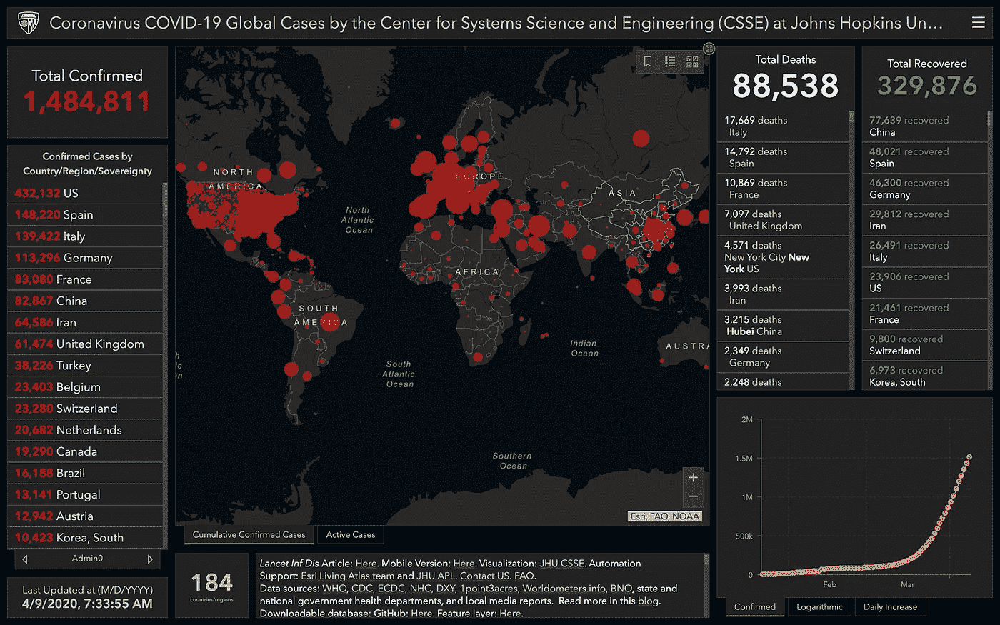

# 2020 年商业分析产品的创新

> 原文：<https://medium.datadriveninvestor.com/innovation-in-your-business-analytics-products-2020-6ea2a2bde95a?source=collection_archive---------14----------------------->

Visualization: JHU CSSE

如今，从学生到企业高管和跨国公司，每个人都需要处理海量数据。特别是在新冠肺炎·疫情袭击我们之后，在研究冠状病毒的模式时，有回顾性数据分析来对抗冠状病毒。没有对数据的正确分析和理解，个人和公司都无法利用他们处理的数据。这就是数据可视化概念介入的地方。数据可视化基本上是指以一种易于理解的图形和图像格式呈现数据，它使用户能够获得更多的洞察力，并使他们的观点对他人更加清晰。

# 用数据驱动的方法制定您的业务决策

随着数据分析现在成为商业生活中不可或缺的一部分，越来越多的公司制定策略来有效地管理数据并充分利用数据。在当今快节奏的商业世界中，智能数据分析工具对于成功管理企业至关重要。我们从来没有像今天这样接触过这么多的信息，也没有接触过这么多的数据收集。原始数据在任何业务中所占的比重都越来越大；它不再被忽视，需要处理。

# 利用免费增值业务数据分析工具发展您的业务

用于这种报告的免费工具可以是 Python with Matplotlib 或 SeaBorn，您可以使用 Qlikview(桌面版),这是完全免费的，不需要试用许可证，您可以使用 R with Shiny 或 Bokeh，您可以使用 Excel(假设数据量较低),您也可以尝试 Pentaho、SpagoBI for free use 和 RapidMiner。Helical Insights 在开源商业智能平台上。

# 定制是时代的需要

效率是商业智能保证的语言，因为它需要通过智能叙事来激发，同时保持对话的智能和相关性。数据分析的麻烦在于，你首先需要知道你想要回答的是什么问题。准备好你需要问的问题，并对你正在建模的数据有一个透彻的理解，这将使你更快地得到你正在寻找的答案。市场上有一些免费的工具，但是大多数功能有限。有些人做得非常好，尽管你仅仅依靠免费的解决方案是不够的。

 [## 2020 年最佳短期投资选择精选资源|数据驱动型投资者

### 投资是增加你净财富的一个好方法。如果你通过遵循一个严格的…

www.datadriveninvestor.com](https://www.datadriveninvestor.com/2020/03/28/handpicked-resources-for-the-best-short-term-investment-options-of-2020/) 

如果你正在寻找一个基于 SQL 的分析平台，你应该看看 Cluvio 或 Datapine。r 是用于统计编程的开源语言，可以使用 RApache 嵌入到 Apache 中，帮助您定制和检查所有关键的性能指标，一目了然。除了 Processing.js，还有大量的 Javascript 库可以支持您的开发过程。先评估 SVG 和 Canvas (ExCanvas for IE)两个选项的优劣再选择试衣库。

## 可视化是任何 BI 分析产品的核心优势

一些人认为可视化本身就是一种有效的交流形式，为高管们提供了提取有价值见解所需的所有信息。如果你有自己的数据集，并希望将它可视化，选项包括从最用户友好的 BI 工具(类似于 [Tableau](http://www.tableau.com/) 的东西)到 [D3](http://www.d3js.org/) ，这给了你最大的控制权，但需要最多的时间和技术能力来制作成品。目前有几种商业智能分析产品被用于数据可视化。在您为商业智能需求选择一个这样的应用程序之前，考虑许可、与现有平台的集成和可用性等因素变得很有必要 ***。***

在这两者之间，您会发现像 Infogram 这样的 web 工具需要您在一些严格的约束条件下工作，或者像 ZingChart 这样的 JavaScript 图表库需要花费一些技术时间为浏览器绘制图表，如上所述，但仍然允许您根据自己的需要定制最终产品。对于简单的事情，如点击几下创建图表，共享，打印或导出到图像，Vizydrop，一个数据可视化软件，也是智能叙事的一个很好的补充。对于复杂的东西，谷歌融合表是完美的。

Roosboard search driven 是一款桌面和手持用户友好的商业智能工具，通过以正确的方式分析业务绩效，推动企业取得重大成功。如果您的数据处于检查状态，并且您只是想要一个可视化引擎，那么 Manyeyes 是相关的。你可以试试基于云的应用 AnswerMiner，它可以在你的浏览器中运行。Inetsoft 为仪表板创建和数据混搭提供了一个拖放界面。Silk 是一个非常强大的 graphDB，上面有一个超级简单的 WYSIWYG 编辑或可视化引擎。Databox 拥有设计精美、功能强大的 Web 应用程序或移动应用程序，并提供多种一键式集成。此外，还有 Quandl，它结合了数据集和 DataViz，但你多少会受制于它们的数据集和主题。

跟着这个:[数据科学课程](https://zorays.co/business-data-pro)

对于现有服务中缺少的特定可视化方法，定制解决方案可能是一个很好的替代方案。D3 . js——众所周知，数据驱动文档是一个很好的数据可视化库。其他一些可视化解决方案有 Protovis、Raphael、Javascript Infovis Toolkit、AnyChart JS 图表、AnyStock 股票/金融 JS 图表、AnyGantt JS 甘特图、AnyMap JS 地图、ZingCharts 和 HighCharts。通过任何好的商业智能分析产品的 SaaS 性质，它可以随时随地实时可用。这是创新的一种形式。有时，通过直观的拖放界面，一种产品可以与另一种产品区分开来。与丰富的数据可视化库集成的引人注目的可定制仪表板也可以嵌入到这些产品中，以带来智能叙述和更深入的业务数据上下文。轻松的数据整合是另一个主要目标。

关键的业务决策者需要及时获得正确的信息。借助创新的商业智能和分析算法，帮助决策者做出决策，企业应该利用直观、易于使用的报告仪表板，从上述可用的定制解决方案中发掘商业智能和大数据分析的强大功能，满足您的所有业务需求。您可以通过智能的叙述使您的业务分析产品与众不同，帮助您轻松比较一段时间内的客户行为，从而发现吸引和留住客户的驱动因素。

结论

最后，业务数据分析有助于定义 KPI 并构建交付它们的报告平台。数据分析师也可能对产品或功能组的特定场景进行特别分析。一些公司为此专门成立了一个小组，通常称为“消费者洞察”,一些公司在产品小组中设有数据分析师，一些公司在公司层级结构中的产品层和管理层之间设有通用业务分析师。BI 系统不应该期望你的组织中有任何特殊技能。