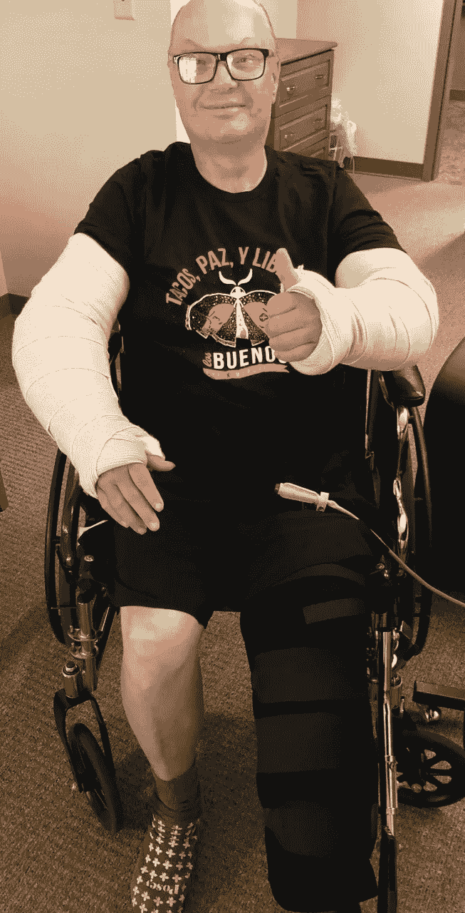

# 创新遇上康复

> 原文：<https://medium.datadriveninvestor.com/innovation-meets-rehab-c23aede557d6?source=collection_archive---------22----------------------->

Steve at rehab

你们当中认识我的人都知道，我经历了一场奇怪的事故，摔断了两个胳膊肘和一个膝盖，已经在康复中心呆了几个星期了(还有更多的时间)。今天早上，当我处理我的身体不像以前那样工作时，我想到这如何适用于商业创新者。

***当你的市场、客户、运营、业务环境或竞争格局发生意想不到的变化时，你的旧方法可能会失效，从而引发变革和创新的需求。***

你的商业解决方案可以从物理康复领域借鉴很多东西。以下是我在改变*我的*行为以应对事故时学到的一些经验。

 [## 不见面就做交易？风投和企业家的 5 个指南|数据驱动…

### 自从 covid 六个月前登陆美国以来，全球的风险投资家和企业家都不得不适应新的现实…

www.datadriveninvestor.com](https://www.datadriveninvestor.com/2020/09/20/doing-deals-without-meeting-in-person-5-guidelines-for-vcs-and-entrepreneurs/) 

**先治愈**

在你开始改变之前，确保你的基础稳固。我的胳膊承受不了重量。我得先治好我的手肘。一旦痊愈，我就可以开始改善我需要的上肢力量。

在你发起新的创新活动之前，你的企业可能需要做一些调整，以使你的运营和财务保持一致。专业人士直觉地知道这一点，他们也知道这对企业主来说在情感上是困难的。但是，如果不先疗伤，试图创新的企业只会让他们的运营变得更糟，就像我会更严重地扭伤胳膊肘一样。

**获得帮助**

目前，我住在康复中心。护理人员照顾我的健康，必要时送我回外科医生那里。助手帮我做我自己不能做的日常活动。理疗师帮我重新启动我断裂的关节。他们都是训练有素的专业人士。他们帮助做最基本的事情(因为我不负重，我自己不能动)，并且以专业的、医学上安全的方式做这些事情。除此之外，他们已经有了计划，他们知道会让我康复。如果我想自己做这些，我会失败的。我没有这方面的知识和经验。

企业也是如此。经验丰富的导师，教练。专业人士可以帮助你。这是他们的工作。获得他们的帮助。

**利用现有资源**

我现在用左手吃饭(我是右撇子)。我的左肘比右肘有更大的活动范围。即使我有专业人士帮助，康复的首要目标是开始为自己做事。最初，当我只能移动手臂几英寸的时候，我被喂饱了。但是到了康复中心，我知道我必须养活自己。很明显，我的右臂不会很快到达那里。所以我开始用我的左手。我用了有用的东西。这并不漂亮也不传统，但很有效。

在你的生意中，你可能需要找到新的方法或变通办法。看看你的周围，找到你拥有的资源，回想一下你早期创业的时候，你没有那么多可用的资源，尝试一些不同的东西。

**拉伸**

我每天都做伸展运动来改善我的肘部和膝盖的活动范围。有时，治疗师会帮助做基本的伸展运动，并发明一些迂回的新练习来伸展我和锻炼我的核心。每天我都走得更远一点。渐渐地，我可以看到这些小小的进步是如何累积起来，让我做了一些昨天做不到的事情。顺便说一句，我的专业助手总能在我之前发现它。

你的企业的实力和灵活性不会在一夜之间发生巨大的飞跃。但是随着时间的推移，巨大的进步会慢慢到来。只要你做了工作，做了延伸，就是这样。尤其是在专业人士的帮助下，他们知道要寻找正确的“延伸”和里程碑。

**庆祝小小的成功**

我记得当我用左手自己把第一口食物放进嘴里时那种美妙的感觉。我记得我第一次可以用右手拇指摸鼻子，第一次可以把 t 恤脱下来自己穿回去。是的，我确实在社交媒体上发布了这些照片。我收到的令人鼓舞的反馈非常棒，激励着我(谢谢大家)。更新——自从我开始写这篇文章，我现在几乎可以一直用右手吃饭。小的成功是相互建立的。

当你的企业开始从变革或创新中看到一些成功时，你的朋友和客户群会给你鼓励。你也应该这样！一定要意识到你正在实现的改变，不管有多小。除了成为自己的啦啦队长，你还会惊讶于有多少人(客户、供应商、合作伙伴)关心你的业务！

**抓紧时间**

康复时间表通常以“带你离开这里回家”所需的周数或月数来衡量。朋友们祝你早日康复。我告诉他们我不想那样。在我能相当安全地做它之前，我不想回家。足够痊愈，足够坚强，我不会再伤害自己。在那个时刻到来之前，我想和专业的康复人员一起生活——为什么不呢？

我的长期目标非常不同。我决定用整整一年的时间来锻炼我的力量、柔韧性、平衡能力和有氧运动能力，以超越我受伤时的活跃程度。那时我的身材还不错(体重合适，轻哑铃，每天步行 2-4 英里)。现在我看到对康复的承诺在某个时候会转变成对训练的承诺。我不想在康复治疗让我变得有些正常的时候就放弃。我想要一个全新的更强的我。我已经知道我需要的设备，我要参加的项目，以及我想在训练时帮助我的人。

你的企业也应该如此。你的目标应该是建立一个更加强大的公司，而不仅仅是找到一种新的“生存”方式。在某个时候，你会觉得康复已经完成了——那正是你从康复转向训练的时候(无耻之徒——我确实提供创新技术训练)。像我一样，你可能从一开始就开始计划你需要什么来让你的公司远远超出你开始创新和康复挑战时的水平！祝你好运！

## 访问专家视图— [订阅 DDI 英特尔](https://datadriveninvestor.com/ddi-intel)