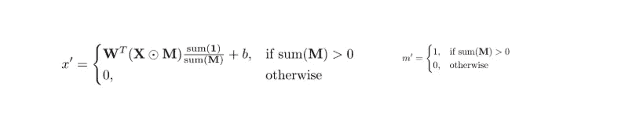
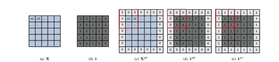
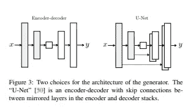
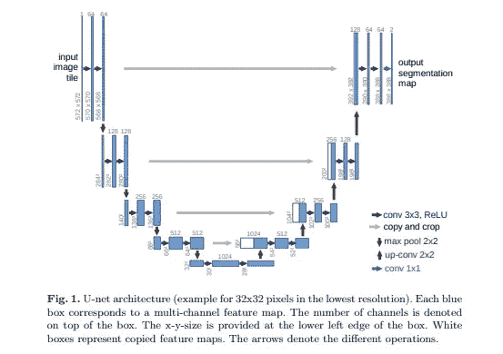

# 使用部分卷积修补不规则孔洞:论文摘要

> 原文：<https://medium.datadriveninvestor.com/inpainting-of-irregular-holes-using-partial-convolution-paper-summary-e836cd2c44ae?source=collection_archive---------0----------------------->

Courtesy: [Unsplash](https://unsplash.com/s/photos/abstract)

在我之前的 [**博客**](https://medium.com/analytics-vidhya/image-inpainting-and-its-evolution-a-brief-discussion-ae1d42431308) 中，我谈到了修复的基础知识，以及修复方法的进步如何展示了修复的美好未来。上述博客最后介绍了基于部分卷积的图像修复，以及它如何解决过去模型面临的各种问题。在这里，我将详细讨论使用部分卷积**来修复不规则孔洞的**[**图像的症结所在。**](https://arxiv.org/pdf/1804.07723.pdf)****

# ****什么是部分卷积？****

****部分卷积执行输出的标准化，以调整丢失数据的部分。**部分卷积层包括屏蔽和重新归一化的卷积操作，随后是屏蔽更新设置。**卷积时不考虑图像的补丁像素。****

****部分卷积定义为:****

********

****Partial Convolution, Courtesy: [Paper](https://arxiv.org/pdf/1804.07723.pdf)****

*****W=内核权重
X=当前滑动窗口的特征值
M = X
对应的二进制掩码(。)=逐元素乘法
1=所有元素为“1”且维数等于“M”的矩阵
b=偏差*****

****举个例子会更好理解。考虑大图像的一小部分 X:****

*****Xp0= X 完全被空洞区域包围
1p0=类似于“M”，定义的值为“1”，修补区域为“0”
1p 1 =类似于之前定义的* ***1*******

**********

*****Partial Convolution example, Courtesy: [Paper](https://arxiv.org/pdf/1811.11718.pdf)*****

********x' = Wt( Xp0。1p 0)sum(1p 1)/sum(1p 0)+b********

*   *****在第一次卷积中，仅考虑非补片像素，并且补片像素与卷积核权重的乘积被设置为“0”。*****
*   *****在上面示例中的红框之后， **Xp0** 与 **1p0** 进行逐元素相乘，并在 **1p1 的帮助下进行归一化。*******
*   *****使用项 **Sum(1)/Sum(M ),根据丢失像素的数量对输出和进行升级。*******
*   *****对于第一层之后的卷积，除了非面片特征的定义被更新为在其感受域中具有至少一个非面片输入像素的所有特征之外，遵循相同的事情。*****
*   ********感受野是影响旋绕输出像素的输入像素数量。********

# *****网络体系结构*****

*******UNet-like** 架构在原文中用于执行**【完井网络】**操作(此处[解释的【完井网络】](https://medium.com/analytics-vidhya/image-inpainting-and-its-evolution-a-brief-discussion-ae1d42431308))。不使用普通的 CNN，部分卷积层与**跳过链接**一起使用。由于架构很长，为了产生更好的结果，在后面的层中还需要微小的细节。该信息通过将来自第*n*编码器层的图像和遮罩与等效的解码器层连接起来进行传输，这是一个跳过链接的功能。*****

**********

*****Courtesy : [Paper](https://arxiv.org/pdf/1611.07004.pdf)*****

**********

*****A UNet example from this [paper](https://arxiv.org/pdf/1505.04597.pdf)*****

*****ReLU 用于编码阶段，α= 0.2 的 LeakyReLU 用于所有解码层之间。编码器包括跨距=2 的八个部分卷积层。内核大小为 7、5、5、3、3、3、3 和 3。通道的数量是 64、128、256、512、512、512 和 512。*****

******(我不会深入损失计算，因为它完全是数学和定量的)******

# *****额外好处:填充部分卷积*****

*****传统上接受的填充技术，如**零填充、反射填充、**和**复制填充**试图通过使用图像边界附近可用的数据值来填充。这些技术导致不真实的图像图案，因为仅使用了部分特征。为了解决这些问题，可以使用部分卷积进行填充，同时假设图像最外面的填充边界为一个补丁，并用加权数据值填充它。*****

*   ******你可以在 Nvidia 官方实施* [*网站*](https://www.nvidia.com/research/inpainting/) *尝试在线演示。******
*   ******我已经尝试在我的*[*Github*](https://github.com/Bunnyyyyy/PConv-Keras/blob/master/Mytest.py)*中实现代码。******
*   ******论文依次为:*[https://arxiv.org/abs/1804.07723](https://arxiv.org/abs/1804.07723)[https://arxiv.org/pdf/1505.04597.pdf](https://arxiv.org/pdf/1505.04597.pdf)[https://arxiv.org/pdf/1611.07004.pdf](https://arxiv.org/pdf/1611.07004.pdf)，*****

***** [## 编码器解码器序列:多长是太长？数据驱动的投资者

### 在机器学习中，很多时候我们处理的输入是序列，输出也是序列。我们称这样的一个…

www.datadriveninvestor.com](https://www.datadriveninvestor.com/2020/03/24/encoder-decoder-sequences-how-long-is-too-long/)*****