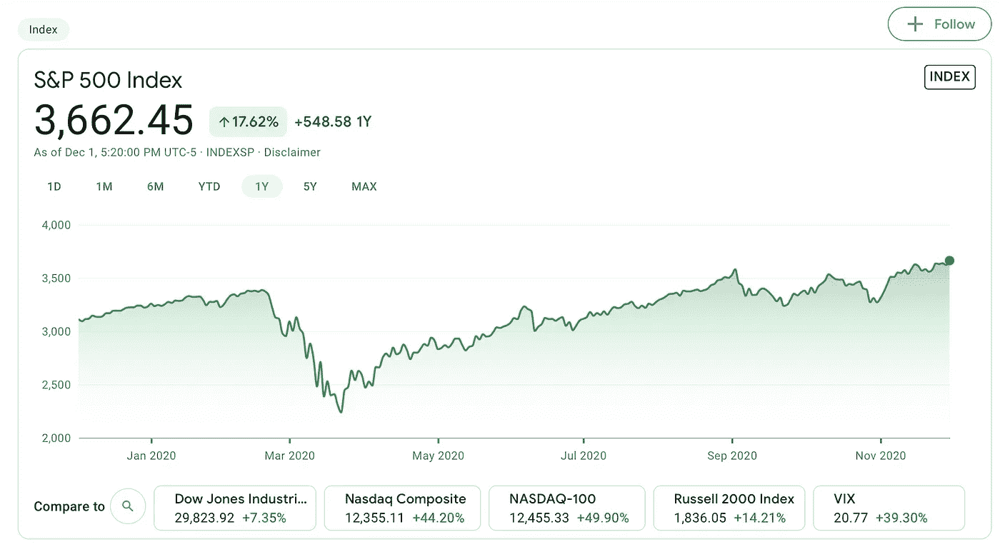
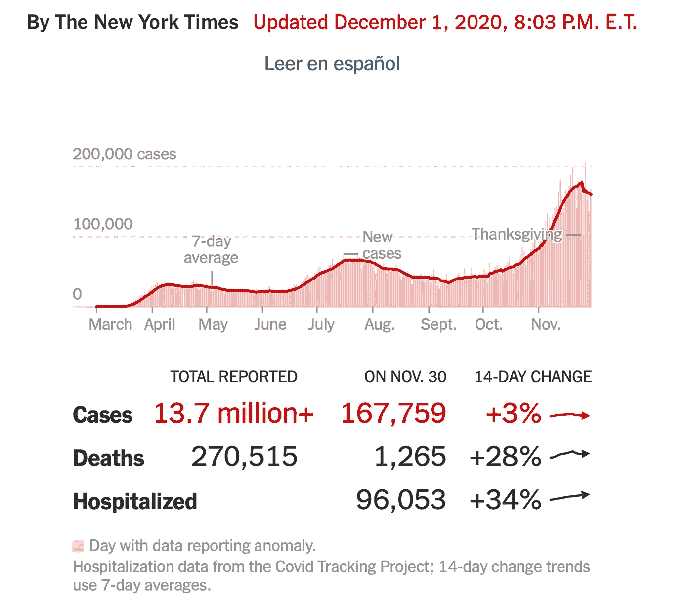
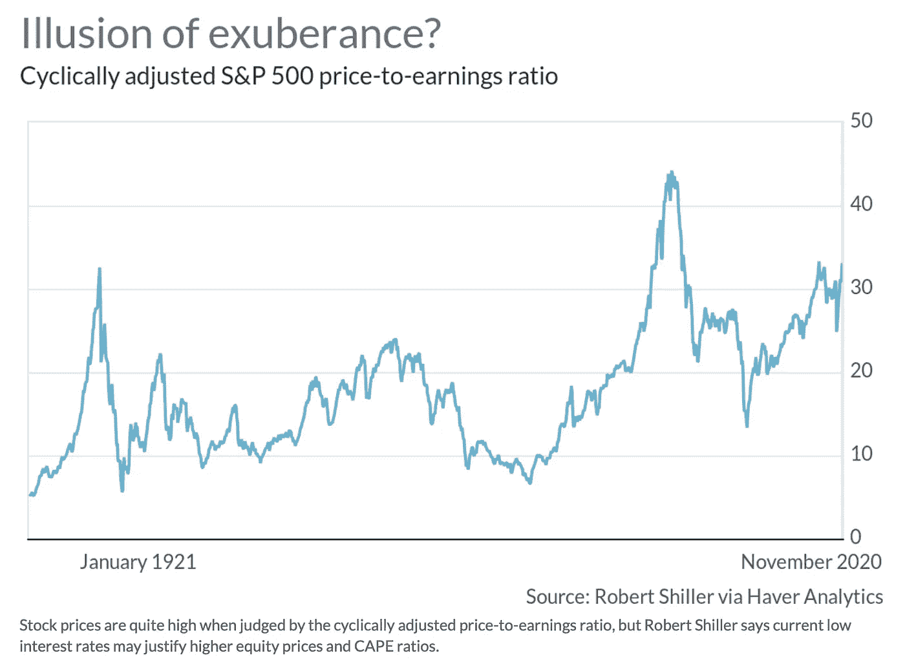

# 疯狂的股价有意义吗？

> 原文：<https://medium.datadriveninvestor.com/insane-stock-prices-make-sense-c04c94587320?source=collection_archive---------1----------------------->

## 根据诺贝尔奖得主罗伯特·席勒的说法，他们确实…

Photo by [**Matheus Bertelli**](https://www.pexels.com/@bertellifotografia?utm_content=attributionCopyText&utm_medium=referral&utm_source=pexels) from [**Pexels**](https://www.pexels.com/photo/woman-using-umbrella-with-lights-573238/?utm_content=attributionCopyText&utm_medium=referral&utm_source=pexels)

当疫情遭受重创的经济再创新低时，股市却在狂涨。但是诺贝尔奖获得者耶鲁大学经济学家罗伯特·希勒认为市场可能被合理估价。正是这位经济学家在网络泡沫达到顶峰时出版了他有先见之明的著作《非理性繁荣》(2000 年 3 月)。他又做了一次，在 2007 年泡沫达到顶峰之前，发布了他的修订版，其中有关于 2005 年房地产泡沫的新信息。

# **1。** **当前的股市……**

下图显示了去年 S&P500 股票指数的价格图表。这是在一场可怕的病毒性疫情病毒中发生的，这场病毒在不到一年的时间里已经杀死了超过 25 万美国人。尽管美国人口仅占世界人口的二十分之一，但这一数字约占世界死亡人数的五分之一。

S&P500 Stock index per Google/Finance (Author is using the web image under the Fair Use Doctrine)

尽管冠状病毒病例也在飙升，但股票市场仍在飙升，如下图所示。

Daily coronavirus case rate from NYT (Author is using the web image under the Fair Use Doctrine)

这毫无意义。

我写了几篇冷静、深思熟虑、见解深刻的文章，思考冠状病毒股票市场的出色表现:

 [## 这个市场要完蛋了！！！我现在应该投资吗？

### 对市场和投资的思考

medium.com](https://medium.com/datadriveninvestor/this-markets-gonna-die-should-i-invest-now-9084614439c0)  [## 这个市场是 F@#&*d！！！出口在哪里？？？

### 对市场和投资更冷静、更全面的思考

medium.com](https://medium.com/datadriveninvestor/this-market-is-f-d-wheres-the-exit-46c551e1b935)  [## 这个市场被操纵了

### 展示了这场持续 7 个月的疯狂反弹背后的原因

medium.com](https://medium.com/datadriveninvestor/this-markets-being-manipulated-8c5c0d8db7f4) 

反过来，希勒写了一篇文章，读起来像是大萧条时期一位银行家的遗书，这位银行家准备从他纽约高层办公楼外的窗台上跳下去:

 [## 罗伯特·希勒说，天价股票是有道理的

### 康涅狄格州纽黑文市(Project Syndicate)——世界股票市场并没有崩溃，这让很多人感到困惑

www.marketwatch.com](https://www.marketwatch.com/story/sky-high-stock-prices-make-sense-robert-shiller-says-11606838599) 

在这篇伪装成理性的文章中，席勒指出:

*“毫无疑问，资产市场在很大程度上是由心理和叙事驱动的。正如诺贝尔奖获得者丹尼尔·卡内曼所写，“熟悉产生喜欢”，继第一季度最初的新冠肺炎冲击之后，今年全球股市出现了几个熟悉的故事*

席勒指出，熟悉的投资叙事，如 FOMO(害怕错过)、V 型复苏和在家工作似乎在推动这个不寻常的市场中发挥了作用。

我拿席勒开玩笑。上面链接的席勒的文章值得一读。你会注意到他的文章无论是语气还是内容都不像长篇大论。席勒保持冷静和理性，即使在他准确预测泡沫破裂的时候，他已经准确预测了两次。他的书也值得你花时间。我强烈推荐非理性繁荣。

 [## 10 月份投资的最佳股票|数据驱动型投资者

### 根据最近的回报，这些股票在 10 月份及以后会有不错的表现。随着市场看到一点…

www.datadriveninvestor.com](https://www.datadriveninvestor.com/2020/10/19/the-best-stocks-to-invest-in-october/) 

# **2。** **海角比……**

席勒对市场为何没有处于泡沫区域的理由是，它相对估值较高，而不是不合理的过高定价，就像我多次换气过度一样。

席勒使用他自己的 CAPE 比率，即相对于每股实际收益的十年平均值来评估市场。这与更典型的收益比率明显不同，后者衡量的是同一报告期(通常是一个季度或三个月)的股价与收益之比。传统估值方法的问题在于收益波动性很大，并且会受到各种会减少收益的临时支出、收入或其他可能夸大收益的意外之财的影响。如果收益在很长一段时间内是平均的，那么所有这些不稳定的变量都会变平。这是席勒的创新，被称为周期性调整市盈率(CAPE)。

Shiller’s CAPE ratio historical chart (Author is using the web image under the Fair Use Doctrine)

席勒指出，美国 11 月的 CAPE 比率为 33，高于疫情之前的水平。让我们默默尖叫“因为这是泡沫！”。他指出，历史上只有几次海角如此之高。20 世纪 20 年代末(换句话说，就在大萧条之前)，以及 21 世纪初(就在网络泡沫破裂之前)。“因为这是个谜！”

席勒指出，中国的 CAPE 比率现在也高于疫情之前的水平，中国和美国股市都在科技、通信服务和非必需消费品行业占据很大比重。这些部门都从疫情中受益匪浅，符合新冠肺炎的说法，或许因此解释了它们的优异表现，以及它们国家的高海角比率。

# **3。** **利率…**

席勒强调的一个重要经济因素是低利率。这是我在每一篇较为冷静的文章中指出的。我强烈建议你去阅读我的文章，而不是诺贝尔奖获得者的文章。

正如我之前在自己的文章中提到的，低利率抬高了股票等其他资产的价值。席勒指出，这与低利率“推高了 CAPE 比率”是一回事。当股价快速上涨时，CAPE 比率会上升。土豆土豆。

希勒还解释了一个非常重要的金融机制，解释了为什么利率下降时股票和其他资产价格会上涨。通常用于评估资产价值的贴现未来收益模型使用适用于未来收益的贴现率。贴现率是基于利率的。如果贴现率下降是因为利率下降，那么如果所有其他变量保持不变，资产价值就会增加。

希勒然后介绍了另一个有用的工具，他称之为 ECY，或超额海角收益率。ECY 的计算方法是反转 CAPE 比率，然后减去 10 年期实际利率。这一结果是衡量投资者愿意为股票、股票、债券和货币市场或利息回报支付多少钱的指标。如果 ECY 很高，那么股票对投资者更有吸引力(他们愿意为股票支付更多)。

利用这一 ECY 指标，席勒回顾了不同地区的历史，发现股票比债券更有吸引力。

# **4。** **诺奖或杜德……**

你可以听一听 2013 年诺贝尔经济学奖得主、耶鲁大学经济学教授的观点。或者你可以听 duuude。

希勒声称，他的 ECY 指标表明，股票实际上是有吸引力的，值得他们现在的高价格，尽管疫情。现在的市场价格并不荒谬。

席勒没有注意到我在每篇文章中指出的市场操纵。特朗普正在滥用他所有的总统旋钮和杠杆来玩弄货币供应，向市场注入大量资金，以压低利率，我们知道利率会抬高股价。

席勒假设利率低于正常的市场机制。但事实并非如此。利率被人为降低了。被川普。

我们中的任何一个处于知识光谱的两端，一个是高尚的一端，另一个是贵族……真的知道股票市场会发生什么吗？

号码

我会因为一个精英的分析而改变我长期买入并持有的投资策略吗？不，我现在不会冲进市场，也不会因为我的悲观而大量抛售。

我会继续持有，即使我身体的每一根神经都告诉我市场即将下跌(全年都没有)。尽管市场疯狂，我也会购买特定公司的股票(在特朗普灾难性的任期内，我买了几次特斯拉和亚马逊)。

我继续向希勒致以最崇高的敬意，并继续极力推荐他的书，尤其是《非理性繁荣》。但这是他的挚友、智力陪衬者和死对头杰里米·西格尔(Jeremy Siegel)和他的《长期股票》一书，也是我投资哲学的基础。两本都读读挺好的。但是对你们所有人来说，首先要阅读 duuudely 的文章。；)

# **5。** **谢谢……**

感谢您的阅读。请分享。如果你喜欢这篇文章，请点击此处查看相关的双重故事:

 [## 这个市场要完蛋了！！！我现在应该投资吗？

### 对市场和投资的思考

medium.com](https://medium.com/datadriveninvestor/this-markets-gonna-die-should-i-invest-now-9084614439c0)  [## 这个市场是 F@#&*d！！！出口在哪里？？？

### 对市场和投资更冷静、更全面的思考

medium.com](https://medium.com/datadriveninvestor/this-market-is-f-d-wheres-the-exit-46c551e1b935)  [## 这个市场被操纵了

### 展示了这场持续 7 个月的疯狂反弹背后的原因

medium.com](https://medium.com/datadriveninvestor/this-markets-being-manipulated-8c5c0d8db7f4) 

## 访问专家视图— [订阅 DDI 英特尔](https://datadriveninvestor.com/ddi-intel)