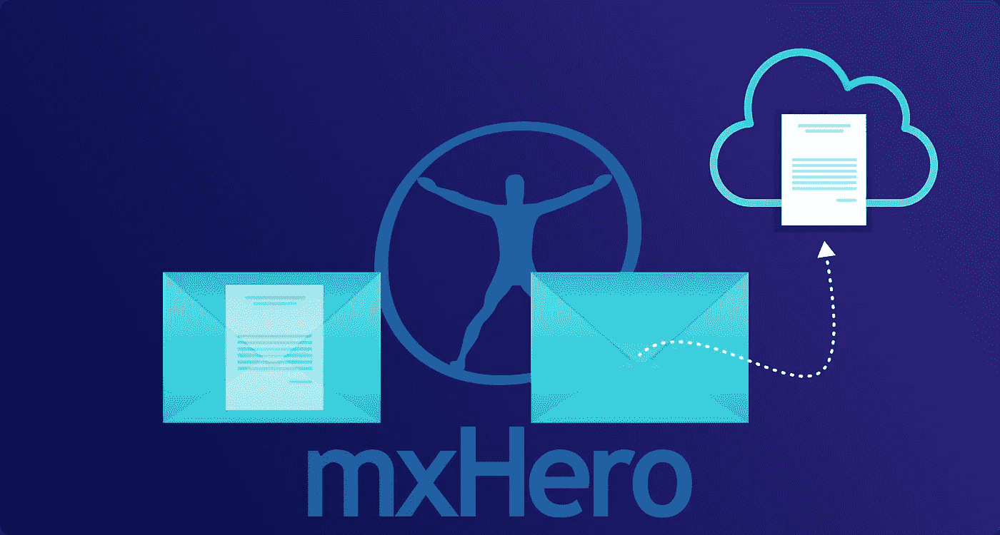
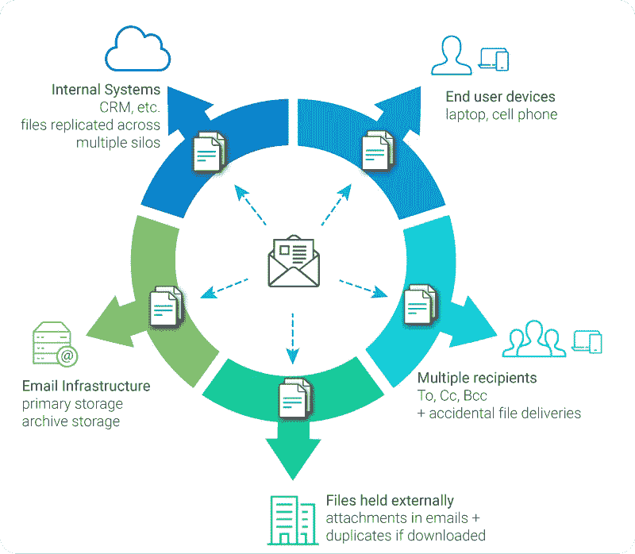
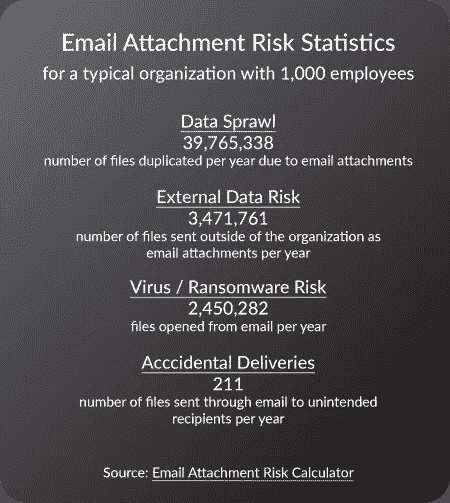
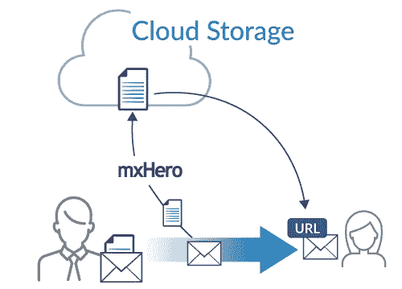
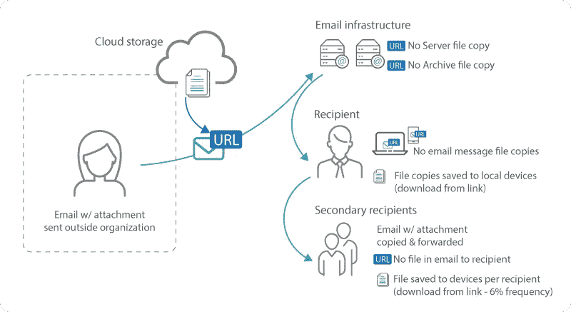
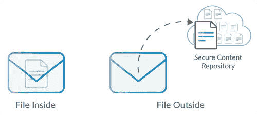
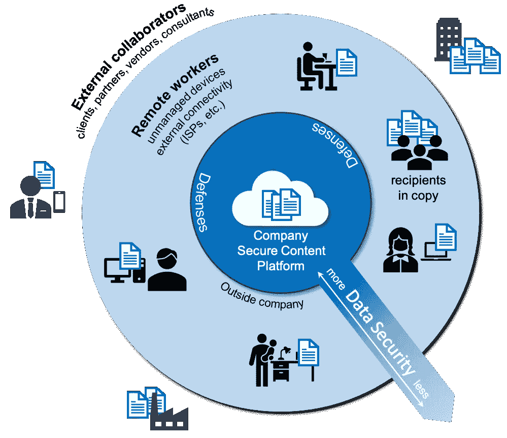
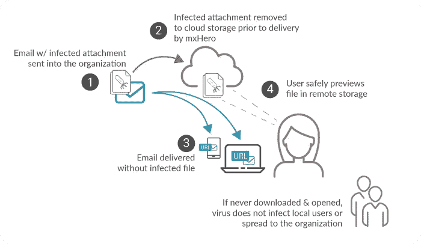
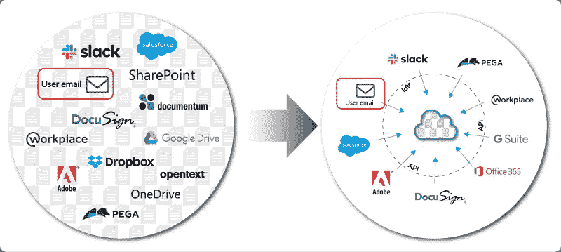

# 从里到外:为什么 mxHero 正在颠覆电子邮件

> 原文：<https://medium.datadriveninvestor.com/inside-out-why-mxhero-is-upending-email-14bd35c2c4dc?source=collection_archive---------17----------------------->

*电子邮件是企业中的头号威胁，因为核心设计缺陷加剧了当今的网络安全格局。MxHero 通过将电子邮件与现代云内容管理平台相结合来修复电子邮件，而不会中断最终用户。*

亚历克西斯·帕纳吉迪斯和唐纳德·r·哈蒙斯

MxHero moves email content into cloud content platforms

mxHero 在执行任务。在过去的十年里，我们一直致力于改变世界上最普遍的文件共享技术的工作方式。我们在换邮箱。

就像任何真正值得做的事情一样，这是一项艰巨的任务，但回报将惠及所有人。挑战是巨大的。电子邮件是个庞然大物，在 T2 有 40 亿活跃用户。甚至强大的脸书也站在它的阴影下。改变这种规模的东西是一项英勇的事业；因此，我们的公司名称 mx hero(DNS MX 记录的“MX”，指向一个域的电子邮件服务器的地址)。

今天的电子邮件简直要了我们的命。作为头号攻击媒介，它是计算机病毒进入我们的医院、急救服务、我们的企业和家庭的主要原因。电子邮件传播的病毒锁定重要系统，阻止我们的紧急救援人员和医生[拯救生命](https://www.aha.org/center/cybersecurity-and-risk-advisory-services/ransomware-attacks-hospitals-have-changed)。作为数据蔓延的头号原因，电子邮件是国家支持的攻击的目标，我们现在知道这些攻击已经突破了负责保护我们的政府机构。也许最糟糕的是，它迫使学校、医疗研究公司和整个社会每年将数十亿亿的有限资源用于保护他们的网络免受破坏性勒索软件和其他破坏——数十亿的资源被用于教育我们的年轻人、开发疫苗、运营我们的政府、保护我们的环境和经济的迫切需要。

Email is data sprawl on a viral scale. Email creates a new copy of itself (message & files) at every stage in its delivery, typically 5x to 10x per recipient.

几年前，我们 mxHero 看到了一种帮助拯救世界免遭电子邮件屠杀的方法。一些聪明人在之前就已经指出了方向[，但是基于云的技术越来越多的被接受最终使之成为可能。mxHero 面临的挑战是为电子邮件创建一个不会破坏它的“修复程序”。随着电子邮件成为广泛使用的互联网最古老的技术之一，用户习惯将是最大的挑战。需要的用户更改越少，采用的机会就越大。](https://en.wikipedia.org/wiki/Internet_Mail_2000)

Source: [mxHero Attachment Risk Calculator](https://tools.mxhero.com/roi)

为了避免电子邮件继续对我们的集体社会造成破坏，在不完全放弃这种媒介的好处的情况下，我们可以从解决文件附件带来的问题开始，即大量内容重复和最终用户的直接匿名访问。通过解决这两个问题，我们可以减少数据蔓延和恶意内容直接进入易受攻击用户的可能性。

mxHero 开发的是云存储技术和电子邮件之间的数字桥梁。随着电子邮件及其附件的发送和接收，在电子邮件到达目的地之前，电子邮件附件会自动移动到组织的云存储服务中。重要的是，这个过程是集中配置的，不需要用户采取任何行动。结果是，发送或接收的每个文件都安全地保存在一个存储库中，并作为安全的云存储链接而不是标准的附件来交付。

MxHero automatically moves, auto-files, and auto-secures attachments (sent & received) in an organization's cloud storage service without end-user software or effort.

虽然在概念上很简单，但这种设计以最小的用户中断解决了上面提到的两个挑战。通过将文件从电子邮件转移到中央云存储库中，我们确保文件在电子邮件交付链的每一步都不再重复。由于电子邮件在发送到收件人设备之前可能会自我复制五次或更多次，并且可能会转发给更多的收件人，因此 mxHero 确保云存储系统中只存在文件的一个副本。最重要的是，对该单个副本的访问仍然处于发送者的严格控制之下。

Sharing files through email with links greatly reduces data sprawl when compared to standard attachments. Files are only distributed if a recipient downloads.

将电子邮件附件转移到云存储中，可以有效地将电子邮件翻个底朝天。存储在电子邮件内部的文件现在从电子邮件外部存储和传送。与标准的电子邮件文件处理相比，这种模式的优势是深远的，有些优势并不明显。

Inside-Out: Getting content outside of email for greater data security

如果没有猖獗的文件复制，潜在的敏感数据将不再触手可及。遭到破坏的电子邮件服务器、归档或收件人邮箱将不再授予对附件的完全和无限制的访问权限— *，即使该电子邮件是在组织*之外发送的。这意味着我们不再需要信任我们发送电子邮件的每个人的安全。长期以来，电子邮件迫使我们生活在“你的违规就是我的违规”的模式下。确保通过电子邮件共享的所有文件都通过安全的云存储共享，可以确保我们的内容在我们的控制下持续交付，无论我们的电子邮件到了哪里。

The further away data gets from the organization, the less control. Keeping data in a central, secured repository is paramount to data security.

将电子邮件文件附件移动到云存储也有助于保护用户免受攻击。电子邮件成为如此有效的攻击媒介的原因之一是，它为网络犯罪分子提供了一种将恶意数据包直接发送到用户桌面(设备)的手段。尽管组织在用户和恶意电子邮件之间设置了尽可能多的防御层，但攻击仍然存在，只需一次成功的入侵就能对整个组织构成严峻挑战。将潜在的恶意文件从电子邮件中移出并移入云存储，使用户能够在实际打开文件并在其本地设备上释放病毒代码之前，首先从远处安全地预览文件的内容。给予用户安全预览的机会被证明是一种特别有效的防御，因为它受益于终端用户行为和人机互补性。研究表明，在大约 88%的情况下，用户更喜欢预览文件附件的便利性，而不是首先保存它们并在本地打开它们的多个步骤。此外，允许用户安全地参与网络安全利用了人类的洞察力，这些洞察力甚至可能逃脱最有希望的人工智能防御。最后，在云存储中停止一个文件给系统另一个机会来检查和限制对文件的访问，一旦它被确定是有害的。标准的电子邮件附件则不同，它们可能通过多台设备直接发送给每个收件人，只有在打开时才能被检查到，而且一旦检测到攻击，基本上完全超出了组织的控制能力。

Ensuring that attachments are moved to remote cloud storage for safe preview keeps potentially malicious files away from unsuspecting users. Interestingly, 88% of the time, users prefer to preview files than download and open locally — a user preference that favors cybersecurity by keeping malicious code away from user devices.

用云存储链接替换电子邮件附件是一个变化，尽管很小，因为最终用户不需要付出任何努力。在多年与各种公司的合作中，一些用户甚至抵制对长期工作流程的最小改变。但是，作为技术领导者，我们应该坚持下去，因为好处是巨大的，不仅对组织如此，对用户也是如此—大文件支持、自动版本控制、交付撤销、监管链可见性、存储减少，更不用说个人用户安全了。无论如何，鉴于技术在现代社会中的核心作用以及我们当前脆弱性的高昂成本，是时候更新我们使用数字工具的方式，不仅为我们自己的组织，也为整个社会的利益而发展。

The proliferation of applications that operate on their own copy of data creates an impossible data security problem. Email is the single most prolific in terms of data sprawl. A better model separates systems into those of engagement and record. In an ideal architecture, apps (systems of engagement) access data stored in a single, well-defended system of record. See [The Content Management & Security Paradox — Content Convergence for the Enterprise](https://medium.com/datadriveninvestor/the-content-management-security-paradox-content-convergence-for-the-enterprise-dffdf006650f?source=friends_link&sk=4562c73144a2d8c9f444133e4034a40a)