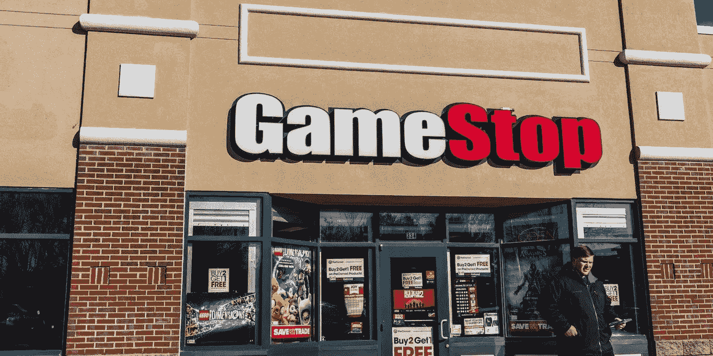

# 在股市疯狂的一周内

> 原文：<https://medium.datadriveninvestor.com/inside-the-crazy-week-of-the-stock-market-b2385f804528?source=collection_archive---------41----------------------->

## GameStop、AMC、黑莓、诺基亚等。，更疯狂了！

GameStop

最近一周，围绕 GameStop 和 AMC 股票有很多动作。这种情况涉及的利益相关者是散户和亿万富翁对冲基金。

Reddit 上的许多人发起了一场运动，将它贴在对冲基金上。对冲基金多年来从公众身上赚了大量的钱，并利用他们的基金操纵市场。

互联网上的人们聚在一起，意识到到底发生了什么，并利用它。GameStop 在疫情上市之初的价值约为每股 4 美元。1 月 28 日，触及 468 美元。

如果你在钱一文不值的时候买入，在这个疯狂的高点退出，你的钱会增加 100 倍。

据《福布斯》报道，“大部分 moonshot 是由散户投资者推动的，他们利用 Reddit 的 [WallStreetBets](https://www.bloomberg.com/news/articles/2020-02-26/reddit-s-profane-greedy-traders-are-shaking-up-the-stock-market) 等在线论坛组织协调一致的推动，损害了 Melvin Capital Management LP 等对冲基金的利益。”

这是美国团结的完美范例。数以百万计的美国人加入了这场运动，从富人那里拿走钱，回馈给散户投资者。

一位名叫史蒂文·科恩(Steven Cohen)的亿万富翁对冲基金经理经营着梅尔文资本(Melvin Capital)，他因 GameStop 的空头头寸损失了数十亿美元，并在收到威胁后删除了自己的 Twitter 账户(伦敦金融新闻)。

当 Robinhood 等券商限制用户可以购买的股票数量时，许多散户投资者失去了行动的动力，最终增加了卖家与买家的数量。

Redditors 希望每个人都有“钻石手”,并拒绝出售他们的头寸，即使他们下跌了。这是一周以来人们和对冲基金之间的交锋。

解决这一潜在问题的一些办法包括，券商取消对希望投资这些特定“模因股”的交易员的限制。另一个解决方案是，散户投资者挤走大量对冲基金，赚了很多钱。

在某个时间点，炒作将会平静下来，一切将恢复正常，但在此之前，交易员和投资者可以预计会看到大量的波动，特别是在收益季节。过去一周，美国大部分地区团结起来，并激励年轻人开始投资。