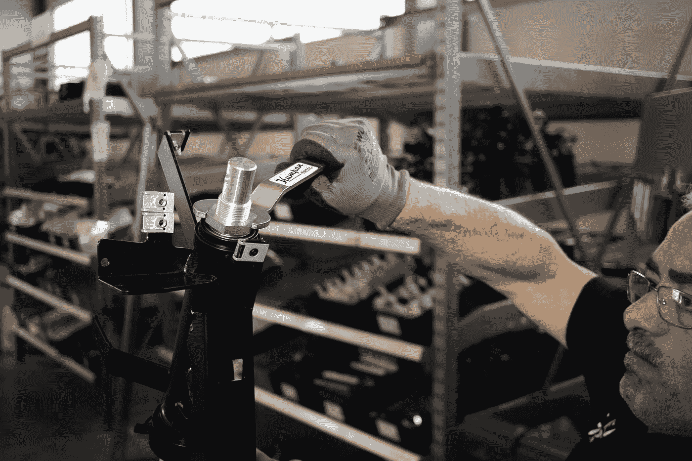
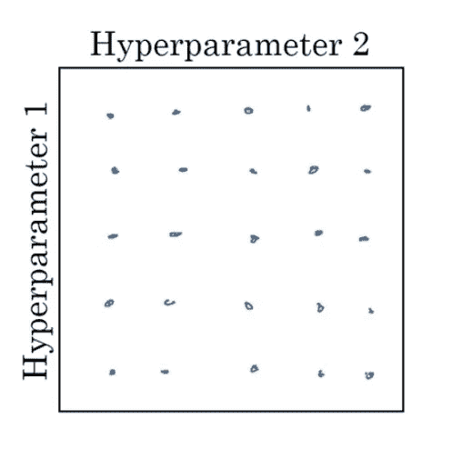
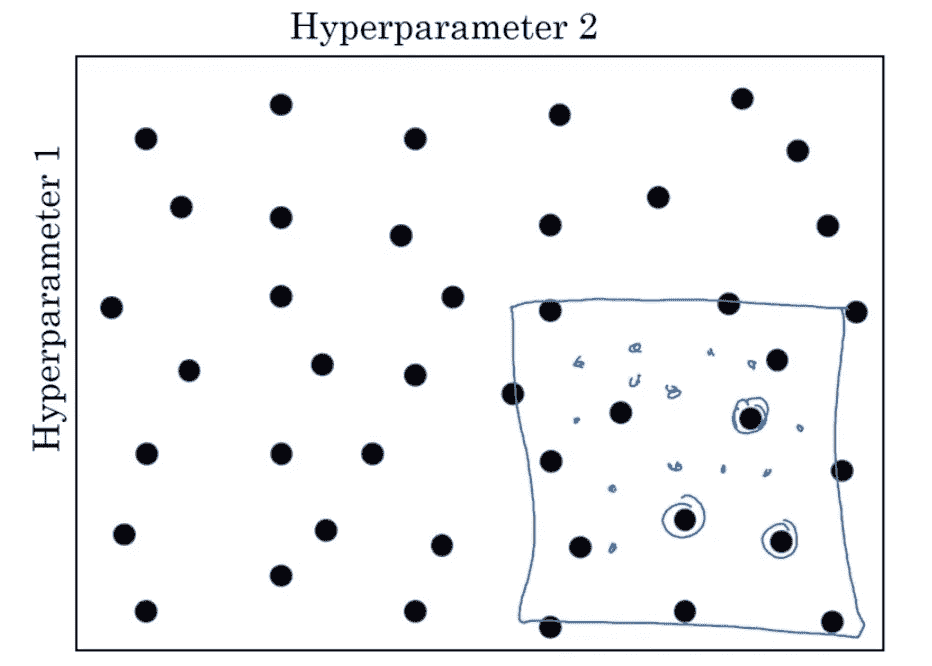
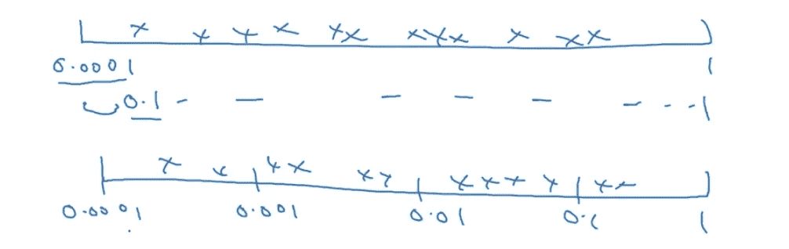

# 洞察如何调整您的超参数

> 原文：<https://medium.datadriveninvestor.com/insights-to-how-to-tune-your-hyper-parameters-12345d44d1c4?source=collection_archive---------8----------------------->

## 深度学习

## 调整超参数以获得最佳精度的指南。



Photo by [Kumpan Electric](https://unsplash.com/@kumpan_electric?utm_source=medium&utm_medium=referral) on [Unsplash](https://unsplash.com?utm_source=medium&utm_medium=referral)

被困在付费墙后面？点击[这里](https://d3nyal.medium.com/insights-to-how-to-tune-your-hyper-parameters-12345d44d1c4?sk=d552f1814f92af9d0d48357768f88fe2)阅读完整故事与我的朋友链接！

这篇文章实际上是一个系列的连续体，专注于对深度学习的构建块的基本理解。以前的一些文章是，如果你需要赶上:

[](https://medium.com/towards-artificial-intelligence/want-to-optimize-your-model-use-learning-rate-decay-8ab3ce68addc) [## 想优化你的模型？使用学习率衰减！

### 随着时间的推移调整你的学习速度参数会有很大的不同！让我们看看怎么做。

medium.com](https://medium.com/towards-artificial-intelligence/want-to-optimize-your-model-use-learning-rate-decay-8ab3ce68addc) [](https://medium.com/analytics-vidhya/want-your-model-to-converge-faster-use-rmsprop-a28afc2b112b) [## 想让你的模型收敛更快？使用 RMSProp！

### 这是另一种用来加速训练的技术。

medium.com](https://medium.com/analytics-vidhya/want-your-model-to-converge-faster-use-rmsprop-a28afc2b112b) [](https://medium.com/towards-artificial-intelligence/model-overfitting-use-l2-regularization-9f7ca4aadb19) [## 模型过度拟合？使用 L2 正规化！

### 用这个来增强你的深度学习模型！

medium.com](https://medium.com/towards-artificial-intelligence/model-overfitting-use-l2-regularization-9f7ca4aadb19) 

深度学习是人工智能的一个分支，我们让模型自己学习特征以获得结果。我们不硬编码任何逻辑，或任何算法，它会自动尝试功能之间的不同关系，并选择支持正确预测的最佳关系集。

现在，我们实际上没有让模型盲目尝试，但是我们有几个超参数。为了解释超参数，我们可以举一个孩子在 IPad 上玩的例子。你不能控制他/她在上面玩什么或看什么，但是你可以控制孩子在上面花多少时间。以类似的方式，我们可以调整这些超参数，以使模型在产生预测结果的基础上对特征进行评级。

现在，在处理深度学习和机器学习时，你需要处理大量的超参数，调整它们可能是一个巨大的麻烦。

# 超参数

这篇文章暗示，对于任何超参数，它们可以是:

*   学习率:度
*   势头:年
*   Adam 优化器(1，2，∑)
*   层数
*   隐藏单元的数量
*   学习率衰减
*   小批量

## 学习率

阿尔法，学习率，是其中最重要的。Beta、动量、隐藏单元的数量和 Alpha 之后的小批量都很重要。

## 这些怎么选？

在机器学习的早期，人们习惯于使用表格网格来选择和尝试这些超参数的不同值。



Image by Author

嗯，这种方法是可以的，直到我们有少量的 hyper 参数需要调整，但当我们有大量的 hyper 参数时，这种方法将需要更多的时间。

# 然后呢？

我们尝试随机选择的值！这样做有一个基本原因。您不知道哪个超参数的值更适合您试图解决的问题类型。

[](https://www.datadriveninvestor.com/2020/11/19/how-machine-learning-and-artificial-intelligence-changing-the-face-of-ecommerce/) [## 机器学习和人工智能如何改变电子商务的面貌？|数据驱动…

### 电子商务开发公司，现在，整合先进的客户体验到一个新的水平…

www.datadriveninvestor.com](https://www.datadriveninvestor.com/2020/11/19/how-machine-learning-and-artificial-intelligence-changing-the-face-of-ecommerce/) 

## ***粗到细***

另一个好办法是“ ***粗到精*** 方案。

这种方法是，假设我们有一个随机设置的网格值，在获得一些结果后，我们发现某个特定区域的值比其他区域的值表现得更好，然后我们放大该区域并进行更深入的分析，最终获得最佳的超参数集！


before



after

## 但是你在多大范围内调整你的超参数呢？

在调优过程中随机发现值时，在正确的范围内搜索值是很重要的。



Image by Author

上面一个是当我们使用 0.1 和 1 之间的标度中 90%的值时，下面一个是当我们划分并给每个标度指定位置时。

## 执行

```
R = -4 * np.random.rand()
å = 10^r
```

这里的' ***np*** '就是 **numpy** 。 ***r*** 的值可以是-4 到 0 之间的任何值。于是，*就会在 10^-4 到 1 之间的任何地方。*

# *结论*

*在本文中，我们讨论了使用恒定的学习速率如何会使我们的模型性能更差，因此，我们讨论了机器学习实践者广泛使用的一种技术来解决这个问题，并根据模型的需要来改变学习速率。*

# *进一步阅读*

*[](https://medium.com/towards-artificial-intelligence/deep-learning-for-weather-classification-fe877cdc721c) [## 用于天气分类的深度学习

### 在不同的天气状态之间分类！

medium.com](https://medium.com/towards-artificial-intelligence/deep-learning-for-weather-classification-fe877cdc721c) [](https://medium.com/swlh/deep-learning-for-house-number-detection-25a45e62c8e5) [## 用于门牌号检测的深度学习

### 让我带你走一遍。

medium.com](https://medium.com/swlh/deep-learning-for-house-number-detection-25a45e62c8e5) [](https://medium.com/quick-code/deep-learning-for-cats-vs-dogs-classification-309463f3fc46) [## 针对猫 vs 狗分类的深度学习！

### 区分猫狗的循序渐进指南！

medium.com](https://medium.com/quick-code/deep-learning-for-cats-vs-dogs-classification-309463f3fc46) 

# 联系人

如果你想了解我最新的文章和项目，请通过媒体关注我。以下是我的一些联系人详细信息:

*   [领英](https://www.linkedin.com/in/d3ni/)
*   [GitHub](https://github.com/D3nii?tab=repositories)
*   [推特](https://twitter.com/danyal0_o)

> 快乐学习。:)*