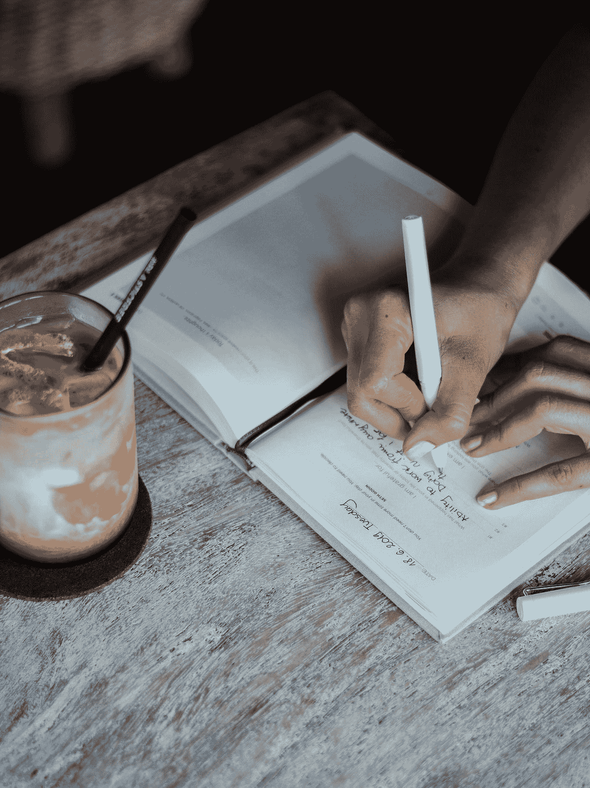

# 为什么鼓舞人心的赞赏话语很重要

> 原文：<https://medium.datadriveninvestor.com/inspirational-words-of-appreciation-may-4-2020-da54b6533b7e?source=collection_archive---------5----------------------->

## 为父母，青年，和人类与职业运动员特雷弗霍夫曼

Photo by [My Life Journal](https://unsplash.com/@mylifejournal?utm_source=medium&utm_medium=referral) on [Unsplash](https://unsplash.com?utm_source=medium&utm_medium=referral)

鼓舞人心的赞赏话语很重要。

它们有什么用？谁需要感激或欣赏，更好的是，向他们周围的真实的人表达？运动员、父母和人类是否认为欣赏不再是一件事了？

这个世界比以往任何时候都更有权利。

人们不工作也想要成功、内心平静和健康。

却不享受这个过程。

我们中的许多人并不喜欢这种经历，但我们正试图用一个结果来证明自己。

今天是星期天。在过去的几天(或几周)里，我想不出有哪一次我表达过对我的兄弟、朋友或家人的感谢。当我在我的[实践感恩](https://www.trevorhuffman.com/2020/05/practicing-gratitude/)日志中反思我的行为时，我意识到感恩有两个层面:

> 内在的反思和觉知。
> 
> 用鼓舞人心的赞赏话语来表达。

为什么运动员、人类和父母应该练习感恩的艺术——尤其是对他们在日常生活中遇到的人说出这些话？

首先，我们可以改变 25%的幸福水平。内心的平静会增加。压力减小。还因为我们可以通过自我意识和开始小小的行为改变(比如感恩日记)成为我们渴望的样子。

一个快乐、感恩的运动员和人类做得更多。经历更多。最终，获得更多。

 [## 良好的生活是习惯的形成|数据驱动的投资者

### 过度思考是过度紧张。仅仅几个简单的习惯就会在一天中产生巨大的影响。那是…

www.datadriveninvestor.com](https://www.datadriveninvestor.com/2020/01/17/a-good-life-is-habit-forming/) 

我的感恩实践现在正在创造一种动力，向生活中帮助过我的人表达我的感谢。

就现在。这是秘制酱。

我们只有现在了。

# 今天你可以给谁打电话，发短信，或者当面感谢谁？

# “谢谢你 __________”是一件很容易，但却很难记住的事情。

练习感恩的艺术增加了我们对爱、玩耍、自由和内心平静的积极感受，正如为体验而不是结果而比赛为运动员创造了更有意义的记忆。

赢得经验就像教你的孩子通过每天 21 天的篮球挑战来[培养自控能力一样简单。](https://www.patreon.com/trevorhuffman_athletic_edge?fan_landing=true)

赢得冠军或成功你的运动，你的生意，或你的人际关系永远不会发生，除非拥抱你经历的时刻。现在才是最重要的。一分一秒，你开始练习自我意识、欣赏和感激的励志词汇——这让你体验到大多数人似乎无法理解的感受和情绪。

“我很感激你，”这是教练、运动员或父母对他们的团队、教练或家人(或者陌生人)说的最有力的话。实践感恩已经被证明可以改变一个人的幸福、健康和生产力。

我的目标是训练和指导感恩的父母、人类和运动员。

你感谢你的父母开车带你去看体育比赛吗？对他们来说，牺牲他们的时间和精力来支付团队，俱乐部和旅行？

你是一个对最低工资的教练、裁判和锦标赛、3x3 Gus Mackers 和 AAU 游戏的支持人员不感激的父母吗？

你是一个情绪失控的家长吗？你把他们的焦虑、沮丧和梦想都放在了一个孩子身上，这个孩子只是想参加一项运动，更好地参加一项运动，并学习如何在他们的运动中做到最好？

# 玩耍的定义:

*   *不及物动词:忙于娱乐或消遣的活动。*
*   *不及物动词:参加一项运动或比赛*。

# 今天我要感谢谁？今天我要向谁表达我的感激之情呢？

我感谢那些花时间来挑战我的思维、我的习惯和我认为我有能力在生活中经历的事情的表兄弟姐妹、朋友、家人和导师。

我非常感谢我的妈妈，我的爸爸，我的堂兄约翰·埃文斯和我度过了退休生活，我的哥哥达蒙帮我度过了星期天的恐惧(持续了一年的每一天)，我的哥哥杰瑞米允许我参加体育运动，并教他的女儿们如何通过仪式提高他们的表现。我感谢特拉维斯·托马斯对我的教导。

体育运动中充满力量和鼓舞人心的赞美之词帮助我们庆祝我们的日常经历，这就是我们必须关注的——今天尽我们最大的努力。不去想明天。或者我会得到什么奖学金。或者我的孩子篮球打得有多好。

享受这种体验吧。不要试图用一个结果来证明自己。

## 这是我的[健身家庭篮球训练](https://www.youtube.com/watch?v=B-vhAH-9bUQ)，它帮助大多数球员，从年轻人到成年人和位置发展他们的游戏和健身水平。

*我的一些篮球想法是从终极篮球老师那里偷来的(他并不知道)——[詹姆斯·克利尔](https://amzn.to/2xrjOas)，(我是亚马逊的会员，所以如果你买了这本书，我就交费了，所以感谢这个小提示)我最喜欢的关于培养下一级习惯的作家之一！

> >//如果你想和我一起成长——加入、支持(每月 1 美元)或开始我的 21 天在线篮球俱乐部挑战，请访问我的 Patreon 社区:[俱乐部](https://www.patreon.com/trevorhuffman_athletic_edge?fan_landing=true)。

> >//加入[霍夫曼篮球](http://www.facebook.com/huffmanbasketball) L 脸书页面。

> >//加入[时事通讯](https://mailchi.mp/fdc3300e1a3a/pro-athletes-best-sports-blog-post-game)，获取 THRIVE 播客、采访和下一个创作。

# 感谢你阅读我的关于感谢信的文章，更多文章，请从这里开始。