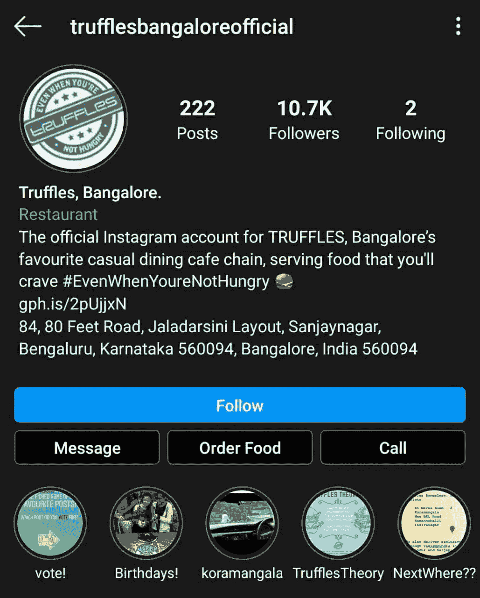

# Instagram 可以重新想象超本地商务

> 原文：<https://medium.datadriveninvestor.com/instagram-could-reimagine-hyperlocal-commerce-78a205e5e8ed?source=collection_archive---------15----------------------->

Instagram 可能成为餐馆在与食品聚合商的斗争中身穿闪亮盔甲的骑士。

不，IG 还没有开始送餐。

它正在做一些更具破坏性的事情。

餐馆现在可以在 IG 上创建一个数字店面。

他们可以雇佣美食博主/搞笑有影响力的人来提高参与度和吸引追随者。

并使用“点餐”选项让首选合作伙伴处理送货事宜。

他们可以节省大约 5%支付给聚合商的探索/广告费用。

(有趣的是，在 1 月 20 日， [Swiggy](https://www.linkedin.com/company/swiggy-in/) 将某些餐厅的佣金提高了约 5%)

此外，对于像松露这样的著名餐厅，聚合器可以竞争成为“最佳”合作伙伴。

 [## 天才企业家有他们超能力的智力来源？数据驱动的投资者

### 看起来确实如此，所以让这些资源为你服务吧...都是成功的企业家——想想谢尔盖·布林和…

www.datadriveninvestor.com](https://www.datadriveninvestor.com/2020/04/08/genius-entrepreneurs-had-their-super-power-sources-of-intelligence/) 

IG 胜出，因为它将用户保留在自己的网站上，并收集“更多”的用户数据。餐馆节省&可以努力改善他们的食品配送经济。

[Rebel Foods(前 Faasos)](https://www.linkedin.com/company/rebel-foods/) 目前其 2/3 的订单来自聚合商。现在会有一部分来自 IG 吗？

云厨房会更倾向于在 IG 上推出吗？

别忘了，IG 的母公司，[脸书](https://www.linkedin.com/company/facebook/)，与 [Jio](https://www.linkedin.com/company/jio/) 合作，显示出在食品杂货领域战胜[大篮子](https://www.linkedin.com/company/bigbasket/) / [Grofers](https://www.linkedin.com/company/grofers/) 的早期迹象。

对聚合者意味着什么？is 如何影响他们(已经很差的)单位经济？

当我们谈论食物时，这同样可以扩展到任何超本地商业用例。凭借 Stripe/Razorpay 提供的无缝支付体验，Instagram 可能会在超本地交付领域大获全胜。

— — — — — — — — — — — —

这里表达的观点是我个人的，并不代表我现在或过去的雇主的观点。

**访问专家视图—** [**订阅 DDI 英特尔**](https://datadriveninvestor.com/ddi-intel)