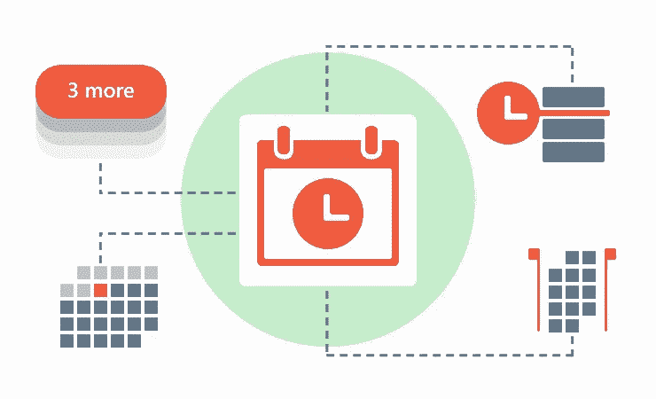
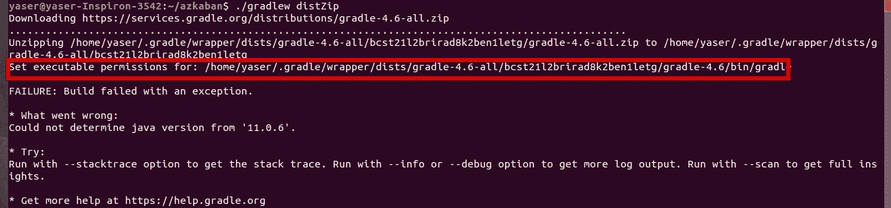
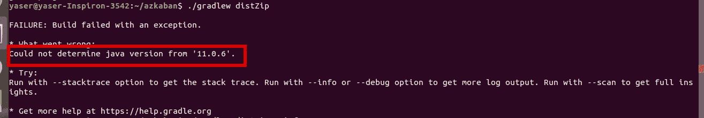
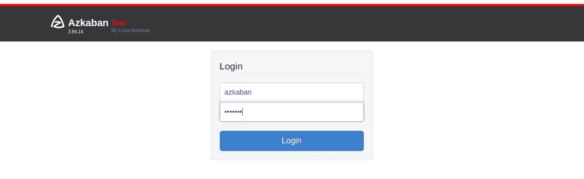

# 在 Ubuntu 上安装阿兹卡班

> 原文：<https://medium.datadriveninvestor.com/install-azkaban-in-ubuntu-d0d9ca5d8a7a?source=collection_archive---------3----------------------->

本文将带您完成在您的 Ubuntu 18.04.4 LTS 机器上安装 Azkaban 3.84.14 的步骤。



[image source](https://codinginfinite.com/creating-scheduler-task-seconds-minutes-hours-days/)

# 阿兹卡班是什么？

不，这不是哈利波特里的监狱！！！

阿兹卡班是 LinkedIn 创建的调度程序。它主要用于调度大数据作业，如 Hadoop 工作流。它提供了一个易于使用的 web 用户界面来维护和跟踪您的工作流程。它还支持 REST APIs，以便与代码中的调度程序进行交互。

简而言之，它以一种更酷的方式完成 crontab 的工作，而不必担心复杂的 crontab 语法，并使用一个基于 web 的漂亮 UI 来配置调度。
更多关于[阿兹卡班](https://azkaban.github.io/azkaban/docs/latest/)的信息。

# 为什么是阿兹卡班？

在众多受欢迎的调度程序中，如 O [ozie](https://oozie.apache.org/) 、[气流](https://airflow.apache.org/docs/stable/scheduler.html)、[指挥](https://netflix.github.io/conductor/)等。我发现阿兹卡班是最“容易使用”的调度程序。它的 UI 相当直观。它的 solo 服务器模式(见下文)可用于简单的用例，如调度简单的机器学习管道。

# 为什么不遵循阿兹卡班的官方文档呢？

好吧，文档有点混乱，你最终会看到错误。所以我用自己的方式进行了试验，研究了一下，最后终于能够成功安装了。这是我今天写这篇文章的原因之一，这样你就不必面对我经历过的同样的问题。

# 装置

阿兹卡班有三种安装模式:独立的“单服务器”模式、较重的双服务器模式和分布式多执行器模式。

[](https://www.datadriveninvestor.com/2020/01/16/software-development-process-how-to-pick-the-right-process/) [## 软件开发过程:如何选择正确的过程？数据驱动的投资者

### 软件是任何企业组织成功的生命线。没有软件的帮助，一个…

www.datadriveninvestor.com](https://www.datadriveninvestor.com/2020/01/16/software-development-process-how-to-pick-the-right-process/) 

我们今天将安装“**单人服务器模式”**。如果只是想尝试一下，这种模式很有用。它也可以用于小规模用例，而其他模式主要用于生产环境。

让我们从分步安装指南开始:

**从 GitHub 克隆阿兹卡班库**

```
git clone https://github.com/azkaban/azkaban.git
```

**构建**

```
cd azkaban
./gradlew distZip
```

在**之后，您可能会遇到两个错误。/gradlew distZip** 命令。
第一个可能是以下错误:



要解决这个问题，您需要使用下面的命令向错误消息中显示的**渐变路径**(红色突出显示)授予可执行权限:

```
chmod +x <your gradle path>
```

对我来说，我必须做

```
chmod +x /home/yaser/.gradle/wrapper/dists/gradle-4.6-all/bcst21l2brirad8k2ben1letg/gradle-4.6/bin/gradle
```

您可能遇到的第二个错误如下所示:



这是因为 **gradlew** 有 **Java** 依赖，我们下载的 git repo 有 **gradlew** **4.6** 支持 Java 8 而不是 Java 11。
我的解决方案是**移除 Java 11** 并**安装 Java 8** 。
我按照[这个线程](https://askubuntu.com/questions/84483/how-to-completely-uninstall-java)移除了 Java 11，用下面的命令安装了 Java 8。

```
sudo apt update
sudo apt install openjdk-8-jdk
```

如果你解决了上面的错误或者不必面对它们，那么下一步就是使用命令**解压阿兹卡班 solo 服务器文件**:

```
unzip azkaban-solo-server/build/distributions/azkaban-solo-server-3.84.14.zip
```

你会得到一个名为**阿兹卡班-solo-server-3.84.14** 的新文件夹

这就是设置部分！！！为了访问网络用户界面，我们需要启动 solo 服务器。
文件**azkaban-solo-server-3 . 84 . 14/bin/start-solo . sh**和**azkaban-solo-server-3 . 84 . 14/bin/shut down-solo . sh**分别用于启动和停止服务器。

**启动服务器**

```
cd azkaban-solo-server-3.84.14
bin/start-solo.sh
```

> 注意:**CD azkaban-solo-server-3 . 84 . 14**是**重要的**步骤**否则**抛出**异常**。

一个名为 **soloServerLog__{timestamp}的新文件。out** 在当前目录下创建，所有日志都存储在该目录下。对我来说是**soloServerLog _ _ 2020–05–01+14:02:54 . out**
To**查看日志，**你可以使用下面的命令替换为在你的系统中创建的适当的日志文件名。

```
tail -f soloServerLog__2020-05-01+14:02:54.out
```

日志的最后几行必须如下所示:


**进入用户界面**

要访问 UI，打开任何浏览器，现在阿兹卡班 solo 服务器正在运行，并转到[http://localhost:808](http://localhost:8081/)1
瞧！！！你的用户界面必须看起来像这样



**用户名**和**密码**最初默认为**。
要更改凭证，您可以编辑**azkaban-solo-server-3 . 84 . 14/conf/azkaban-users . XML***文件。***

*****最后，完成后停止服务器*****

```
***bin/shutdown-solo.sh***
```

# ***在我们结束之前***

***我计划设计一个每隔 *n* 分钟接收(下载)音频文件的管道。使用 Azkaban，我计划安排一项工作，收集所有下载的音频文件，并使用我的深度学习模型转录(转换为文本)。希望我们稍后会谈到这一点。***

# **摘要**

**我们不费吹灰之力就成功安装了阿兹卡班的单人服务器模式。在后面的一些文章中，我将介绍如何在阿兹卡班安排机器学习流水线。**

**今天就到这里，希望你喜欢。**

# **参考**

**[](https://azkaban.github.io/azkaban/docs/latest/#building-from-source) [## 阿兹卡班 3.0 文档

### Azkaban 是在 LinkedIn 实现的，解决了 Hadoop 的作业依赖问题。我们有需要磨合的工作…

阿兹卡班. github.io](https://azkaban.github.io/azkaban/docs/latest/#building-from-source)**