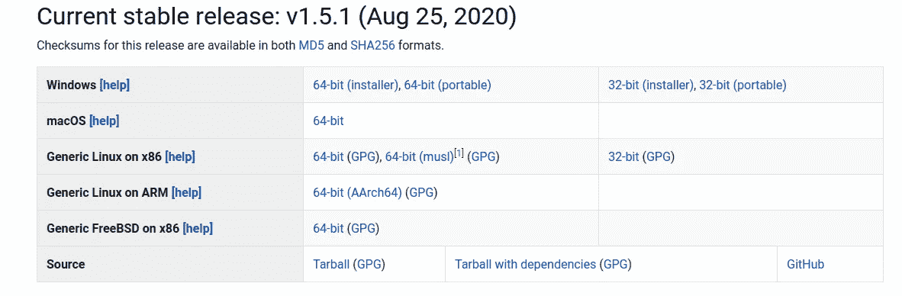
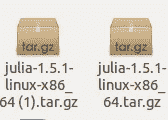
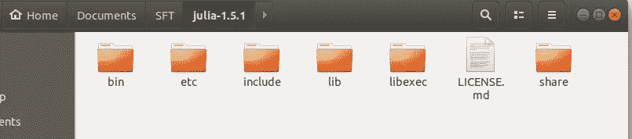
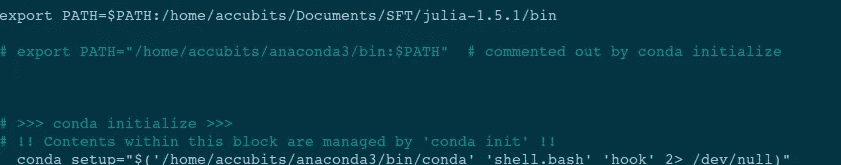
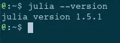
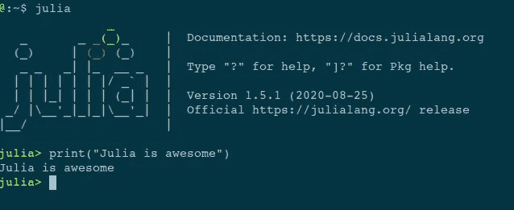
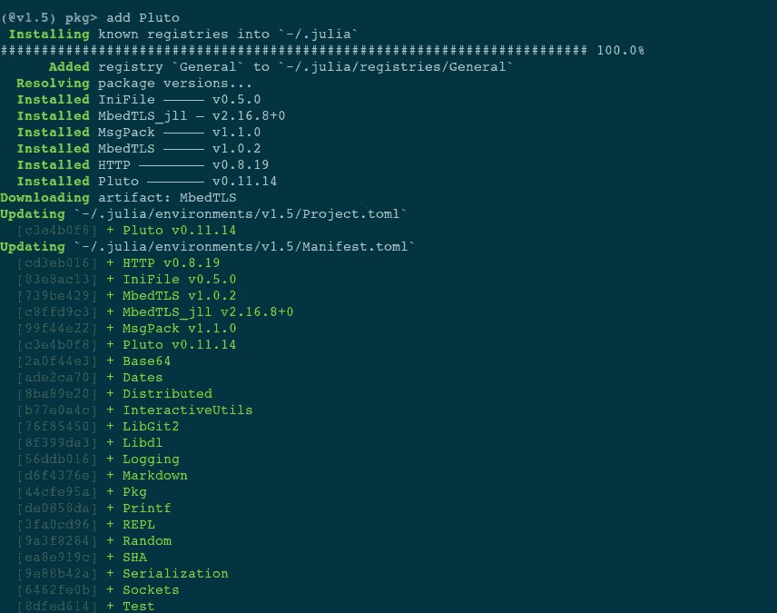
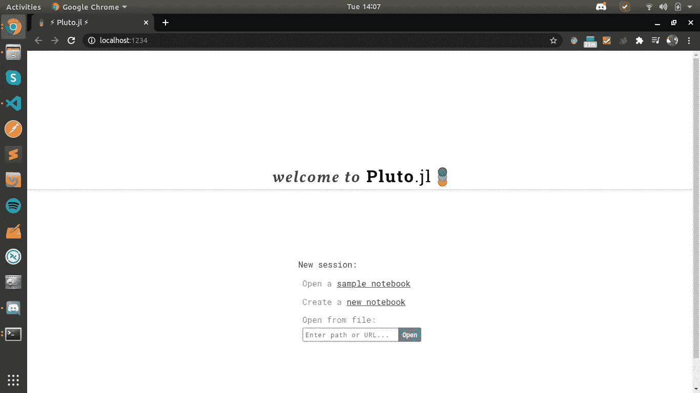

# 在 Ubuntu 上安装 Julia 语言和 Julia 笔记本

> 原文：<https://medium.datadriveninvestor.com/installing-julia-language-on-ubuntu-57c9057cce26?source=collection_archive---------24----------------------->

[Source](https://towardsdatascience.com/the-serious-downsides-to-the-julia-language-in-1-0-3-e295bc4b4755)

## 朱莉娅语言

Julia 语言是
*快速
*动态
*可复制
*可组合
*通用
*开源

没有关于 Julia 的进一步介绍和细节，我们将看到如何设置 Julia 在 Ubuntu OS 中工作。

 [## 战略或战术规划？软件工程师的未来之路|数据驱动的投资者

### outer hout(2018)在他的书《软件设计哲学》中提到了一些原则，以便更深入地挖掘…

www.datadriveninvestor.com](https://www.datadriveninvestor.com/2019/04/22/strategic-or-tactical-programming-the-road-ahead-for-software-engineers/) 

## [计] 下载

第一步是我们必须下载朱莉娅。对于结帐，这个[链接](https://julialang.org/downloads/)

 [## 朱莉娅语言

### 如果你喜欢朱莉娅，请考虑让我们在 GitHub 上主演，并传播这个消息！Star 我们为您提供几种方式…

julialang.org](https://julialang.org/downloads/) 

这里您可以看到当前的稳定版本是 1.5.1

Generated By Author

因为我们正在寻找 Linux 操作系统，所以在 x86 上的通用 Linux 上单击 64 位，然后它将开始下载 tar 文件。可能是这样的。

Generated By Author

现在提取它并保存到一个目录中。然后你可以看到这个

Generated By Author

现在复制 bin 的路径，并将其添加到 bashrc 中。
用这个命令
`sudo nano ~/.bashrc`在命令终端打开你的 bashrc

Generated By Author

在保存并关闭它之后，您必须使用这个命令来获取它。
`source ~/.bashrc`

现在朱莉娅已经准备好出发了。关闭终端，然后再次打开。

现在检查`julia --version`

Generated By Author

现在，您也可以在命令行中开始处理 Julia。在命令终端键入 julia，然后开始工作。

Generated by Author

现在您可以安装软件包了。要进入软件包管理器，只需按`]`键。然后你会看到颜色的变化。现在用`add pluto`命令安装冥王星。

Generated By Author

现在要启动笔记本，只需退出包管理器，进入朱莉娅壳牌。现在使用这个命令。
1)`import Pluto`2)`Pluto.run( )`

现在，您可以在本地主机 1234 上开始使用 julia 笔记本了。

Generated By Author

从[我的 github repo](https://github.com/raoofnaushad/introduction_to_julia) 查看非常有用的 Julia 语法和助手

 [## raoofnaushad/Julia 简介

### Julia 语言入门。为 raoofnaushad/introduction _ to _ Julia 开发做出贡献，创建一个…

github.com](https://github.com/raoofnaushad/introduction_to_julia) 

希望这对你有用。感谢阅读。谢谢你

**访问专家视图—** [**订阅 DDI 英特尔**](https://datadriveninvestor.com/ddi-intel)