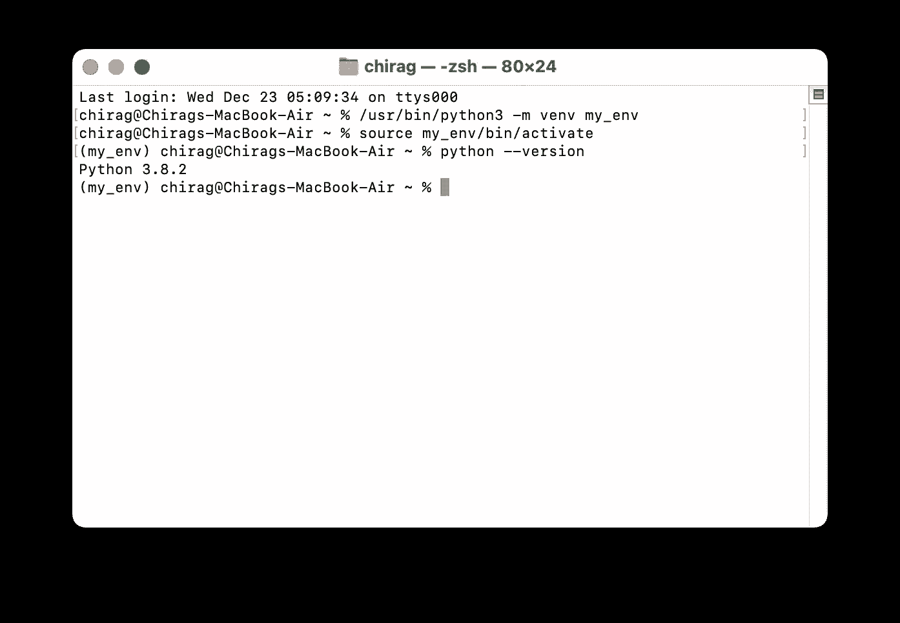
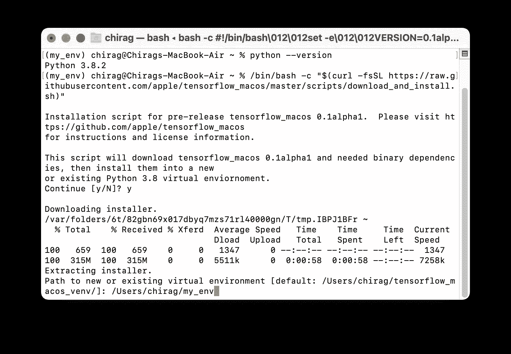
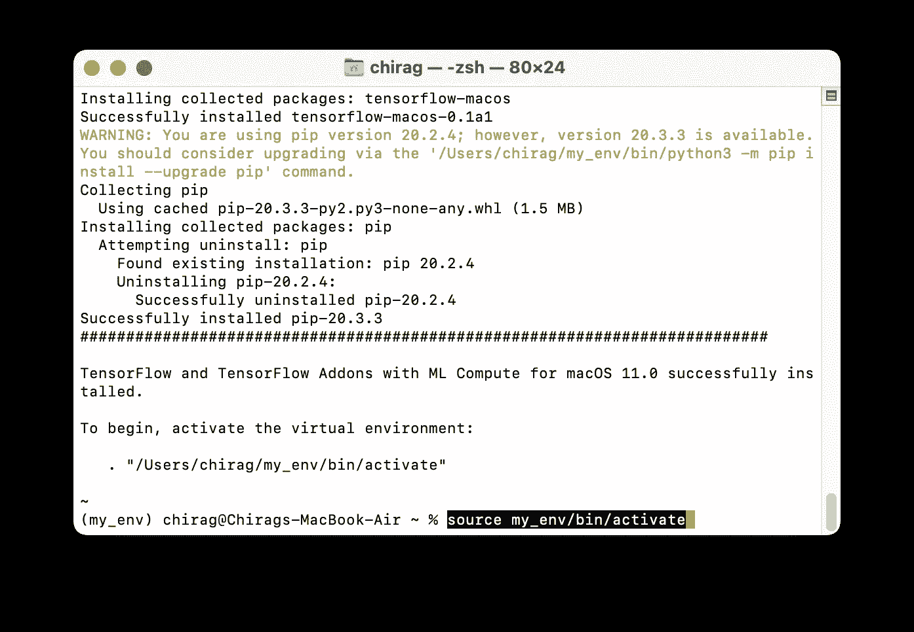
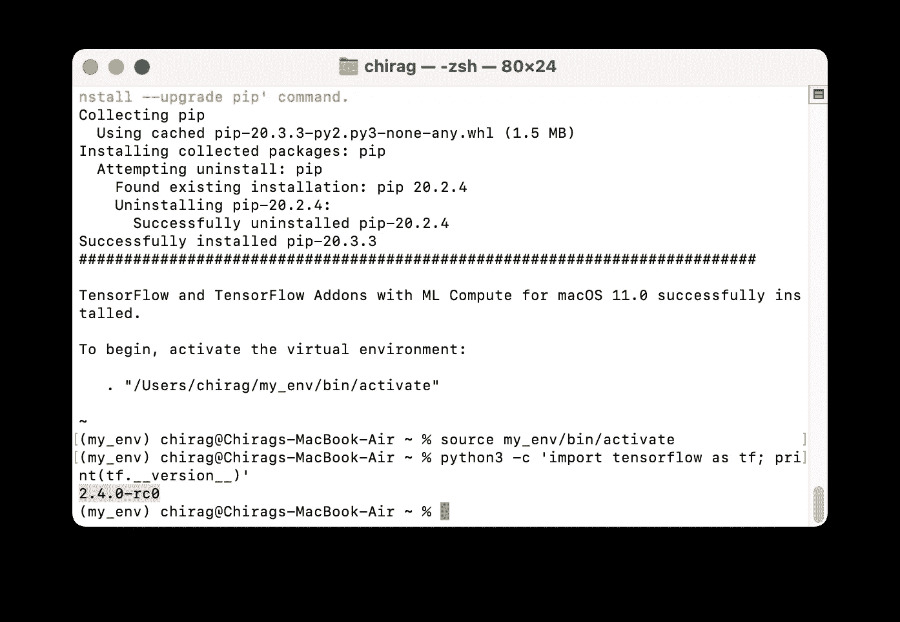
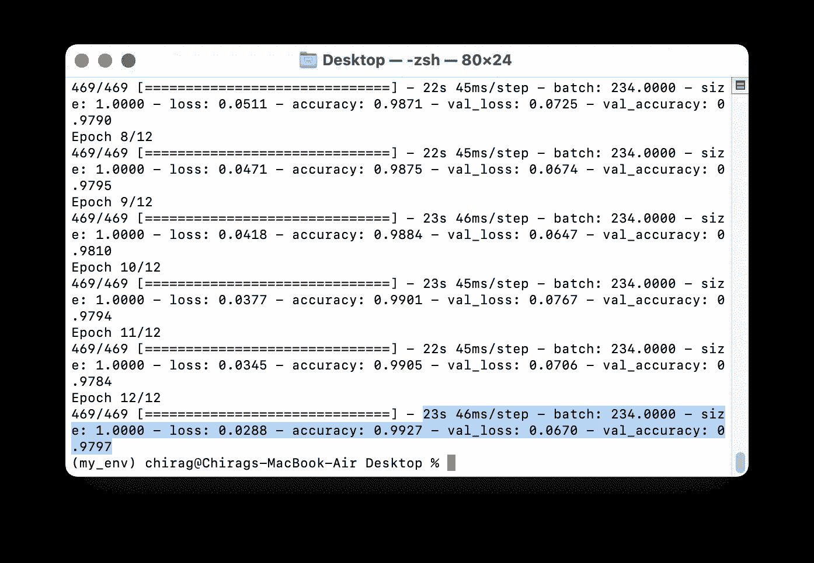
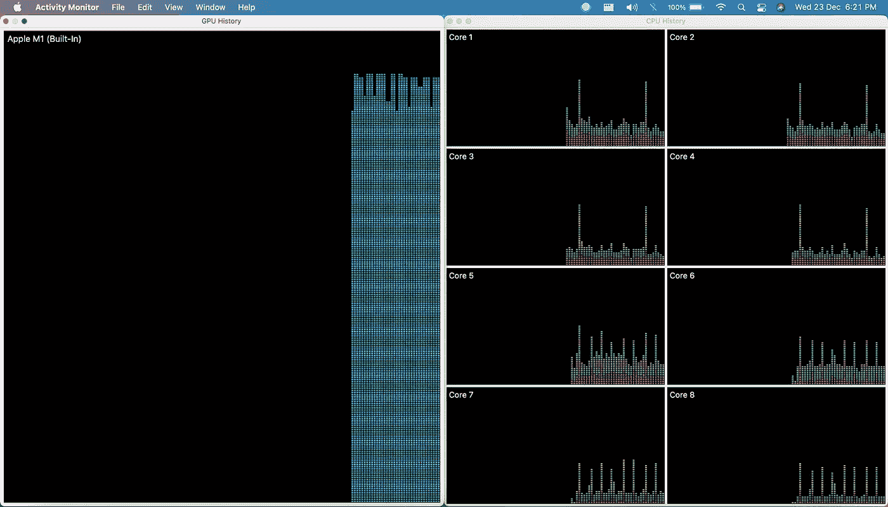
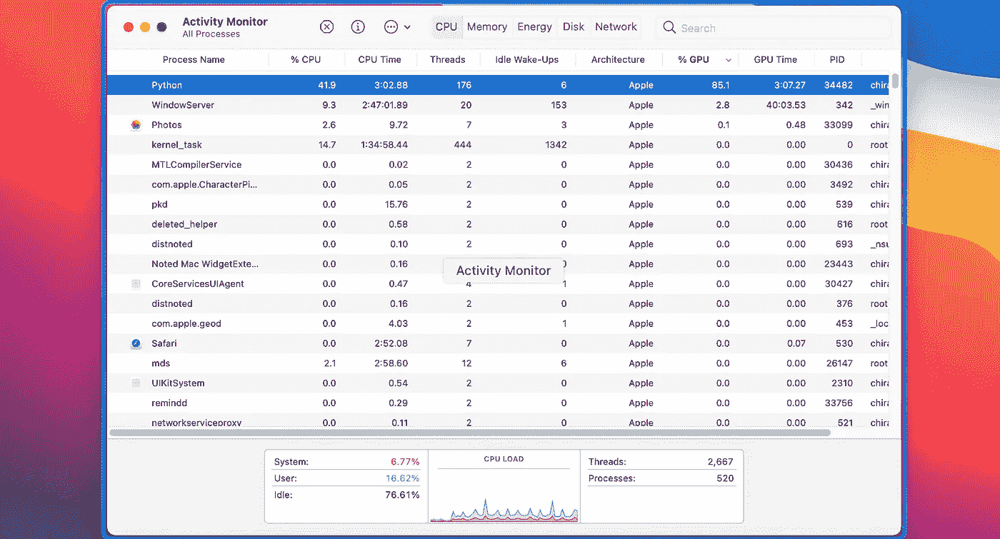

# 在不使用 CUDA 的 MacOS 11.0 上为基于英特尔和 M1 的 MAC 安装 TensorFlow 2.4

> 原文：<https://medium.datadriveninvestor.com/installing-tensorflow-2-4-on-macos-11-0-without-cuda-for-both-intel-and-m1-based-macs-a1c4edf1dbab?source=collection_archive---------1----------------------->


两个流行的深度学习框架 TensorFlow 和 PyTorch 通过 [CUDA 工具包](https://developer.nvidia.com/cuda-zone)支持 [NVIDIA 的](https://developer.nvidia.com/)GPU 进行加速。这给 MAC 上的深度学习开发带来了问题。

**但现在不是了！**

随着其基于 ARM 架构的定制硅芯片的最新发布，苹果公司宣布了一个新的 ***ML Compute*** 框架，该框架可用于 ML 和 DL 模型的加速训练，利用 Apple Macs ***上现有的 GPU，而无需 CUDA 支持。***

我们现在有了 Tensorflow 2.4 的 [***Mac 优化版***](https://github.com/apple/tensorflow_macos) ，我们可以将其安装在旧的基于英特尔的 Mac 电脑和最近推出的基于 M1 芯片的 MacBooks 上。

有人声称*，在几个流行的神经网络基准上对优化的 TensorFlow 库进行的测试显示，与标准代码相比，训练时间“显著加快”，在苹果新的 M1 硬件上优化的库的性能提高了 7 倍。*

让我们看看如何在我们的 Mac 计算机上安装和测试这个最新的 Tensorflow 库。

> 请注意，在开始安装之前，请确保您已经更新到最新的 macOS 11.0 (Big Sur)并且在系统中安装了 Python 3.8(可从 Xcode 命令行工具中获得)。

打开终端，按照如下所示的步骤操作。

**第一步。用 Python 3.8 创建一个虚拟环境**

从终端本身，转到您想要安装该环境的目录，然后键入以下命令。

*注意，我将它安装在主目录(/Users/chirag/)中。*

```
python3 -m venv my_env
```

这将使用 **Python 3.8 创建一个新的虚拟环境“ ***my_env*** ”。**在下面的步骤中进行 Tensorflow 安装时，我们需要指定该环境的路径。

> 要检查是否安装了所需的版本，即 Python 3.8，您可以激活此环境，然后通过键入以下命令进行确认。
> 
> **source my _ env/bin/activate
> python-version**



**步骤二。运行安装脚本**(取自 [apple/tensorflow_macos](https://github.com/apple/tensorflow_macos) 资源库)

```
/bin/bash -c "$(curl -fsSL [https://raw.githubusercontent.com/apple/tensorflow_macos/master/scripts/download_and_install.sh](https://raw.githubusercontent.com/apple/tensorflow_macos/master/scripts/download_and_install.sh))"
```

安装时，它会要求您提供现有 Python 环境的路径。指定您在步骤 1 中创建的环境的路径。

对于我的系统，路径如下。

```
/Users/chirag/my_env
```



这将把 Tensorflow2.4 安装到我们系统的虚拟环境“my_env”中

**第三步:激活环境。**

```
source my_env/bin/activate
```



**第四步:检查 TensorFlow 安装是否成功。**

通过键入以下命令，进入 python shell 并导入 Tensorflow。

```
python3 -c 'import tensorflow as tf; print(tf.__version__)'
```



如您所见，没有任何错误，我们得到了输出。**这意味着我们已经成功安装了 MacOS 优化版的 Tensorflow！**

[](https://www.datadriveninvestor.com/2020/11/19/how-machine-learning-and-artificial-intelligence-changing-the-face-of-ecommerce/) [## 机器学习和人工智能如何改变电子商务的面貌？|数据驱动…

### 电子商务开发公司，现在，整合先进的客户体验到一个新的水平…

www.datadriveninvestor.com](https://www.datadriveninvestor.com/2020/11/19/how-machine-learning-and-artificial-intelligence-changing-the-face-of-ecommerce/) 

## **使用 Tensorflow 安装测试深度学习模型:**

我还将向您展示如何在 CNN 深度学习模型架构上测试和基准测试您的性能。代码摘自在[https://github.com/apple/tensorflow_macos/issues/25](https://github.com/apple/tensorflow_macos/issues/25)的讨论

*确保您的环境仍然处于激活状态。如果没有，请键入:*

```
source my_env/bin/activate
```

**步骤 a)使用 pip** 安装*tensor flow _ datasets****模块***

```
pip install tensorflow_datasets
```

步骤 b)在你的代码编辑器中创建一个新文件 ***test.py*** 。**粘贴写在**下面的代码，保存文件。

```
import tensorflow.compat.v2 as tf
import tensorflow_datasets as tfds

tf.enable_v2_behavior()

from tensorflow.python.framework.ops import disable_eager_execution
disable_eager_execution()

from tensorflow.python.compiler.mlcompute import mlcompute
mlcompute.set_mlc_device(device_name='gpu')

(ds_train, ds_test), ds_info = tfds.load(
    'mnist',
    split=['train', 'test'],
    shuffle_files=True,
    as_supervised=True,
    with_info=True,
)

def normalize_img(image, label):
  """Normalizes images: `uint8` -> `float32`."""
  return tf.cast(image, tf.float32) / 255., label

batch_size = 128

ds_train = ds_train.map(
    normalize_img, num_parallel_calls=tf.data.experimental.AUTOTUNE)
ds_train = ds_train.cache()
ds_train = ds_train.shuffle(ds_info.splits['train'].num_examples)
ds_train = ds_train.batch(batch_size)
ds_train = ds_train.prefetch(tf.data.experimental.AUTOTUNE)

ds_test = ds_test.map(
    normalize_img, num_parallel_calls=tf.data.experimental.AUTOTUNE)
ds_test = ds_test.batch(batch_size)
ds_test = ds_test.cache()
ds_test = ds_test.prefetch(tf.data.experimental.AUTOTUNE)

model = tf.keras.models.Sequential([
  tf.keras.layers.Conv2D(32, kernel_size=(3, 3),
                 activation='relu'),
  tf.keras.layers.Conv2D(64, kernel_size=(3, 3),
                 activation='relu'),
  tf.keras.layers.MaxPooling2D(pool_size=(2, 2)),
#   tf.keras.layers.Dropout(0.25),
  tf.keras.layers.Flatten(),
  tf.keras.layers.Dense(128, activation='relu'),
#   tf.keras.layers.Dropout(0.5),
  tf.keras.layers.Dense(10, activation='softmax')
])
model.compile(
    loss='sparse_categorical_crossentropy',
    optimizer=tf.keras.optimizers.Adam(0.001),
    metrics=['accuracy'],
)

model.fit(
    ds_train,
    epochs=12,
    validation_data=ds_test,
)
```

步骤 c)执行这个脚本。

```
python test.py
```

这将开始在 12 个时期的 MNIST 数据集上训练 CNN 模型。

您可以更改 batch_size 或尝试模型架构，并在讨论页面上报告您的结果。

以下是我的系统在以下配置下的结果:

**MacBook Air 2020 (M1 芯片- 16GB RAM- 8 核 CPU- 7 核 GPU)**



*   23 秒/时代
*   46 毫秒/步
*   97.9%的最终准确度

CPU 和 GPU 的使用情况如下:



这是苹果硬件上 ML 执行新时代的开始。看看 Mac 上的机器学习的未来会是什么样子将会很有趣！

> 以上是我对这篇文章的看法。
> 
> 如果你喜欢这篇文章，或者在下面的回复框中有任何问题或建议，请告诉我。谢谢大家！
> 
> 与我联系:[https://www.linkedin.com/in/chiragdaryani/](https://www.linkedin.com/in/chiragdaryani/)

## 访问专家视图— [订阅 DDI 英特尔](https://datadriveninvestor.com/ddi-intel)