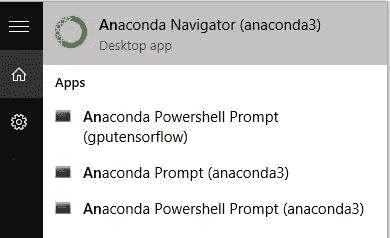
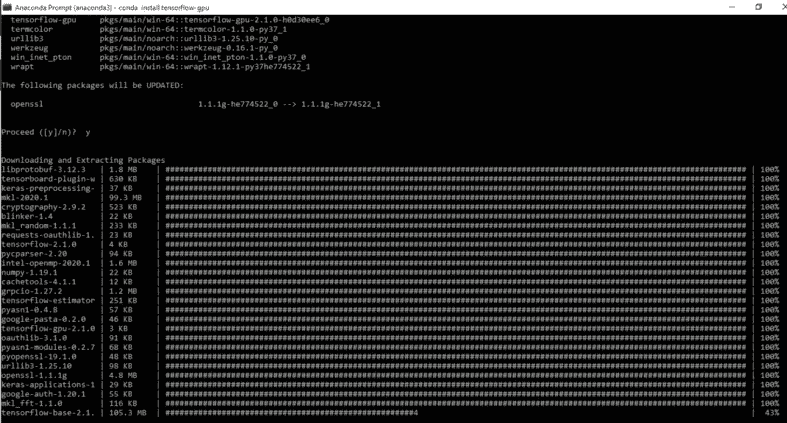
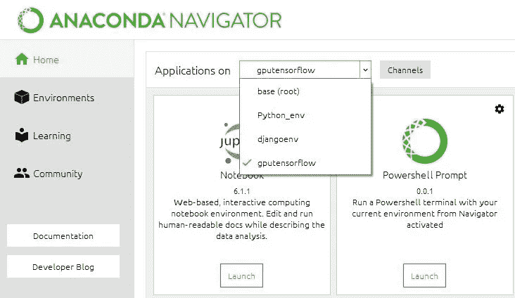
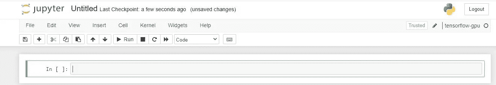

# 在 Windows 上使用 Anaconda 安装和运行 Tensorflow-GPU

> 原文：<https://medium.datadriveninvestor.com/installing-tensorflow-gpu-using-anaconda-on-windows-ac23b66d05f1?source=collection_archive---------0----------------------->


## 如何在 Windows 10 上安装 Tensorflow-GPU

要求；Anaconda，一台装有 Windows 10 操作系统、互联网连接和至少 1GB 数据的电脑。

## **1。运行蟒蛇**

如果你没有安装 Anaconda，你可以从[这里](https://www.anaconda.com/products/individual)下载，安装然后在 Windows 搜索栏中搜索 Anaconda。运行 Navigator 和 Anaconda 提示符。



## 2.创造环境

您可以通过在 Anaconda 提示符下键入以下命令来创建一个新环境。

```
conda create -n ***gputensorflow*** python=3.7
```

*对于本文来说，环境名是 gputensorflow，我们正在安装 python 版*，您可以选择任何环境名。

## **3。激活环境**

```
conda activate ***gputensorflow***
```

4.**安装 ipykernel**

要安装内核，请输入以下命令；

```
pip install ipykernel
```

然后:

```
python –m ipykernel install --user --name ***gputensorflow* ** --display-name “***gputensorflow”***
```

## 5.**安装 Tensorflow-GPU**

```
conda installtensorflow-gpu
```

Anaconda 安装了 Tensorflow-GPU 和一些库。这可能比其他安装需要更长的时间。



## 6.重启你的电脑*(可选)*

## 7.运行 Anaconda 和 TensorFlow 环境

当您打开 Anaconda Navigator 时，单击“Applications on”旁边的箭头，然后单击您的环境。



## 8.推出 Jupyter 笔记本

你应该有这样的东西👇



好了，你现在可以用 TensorFlow 创建你的神经网络和其他东西了。您也可以安装其他库。

我希望这篇文章是有帮助的，如果你在遵循这些步骤时遇到了任何挑战，你可以在 Twitter 上直接给我发消息，或者在回复部分发表评论。