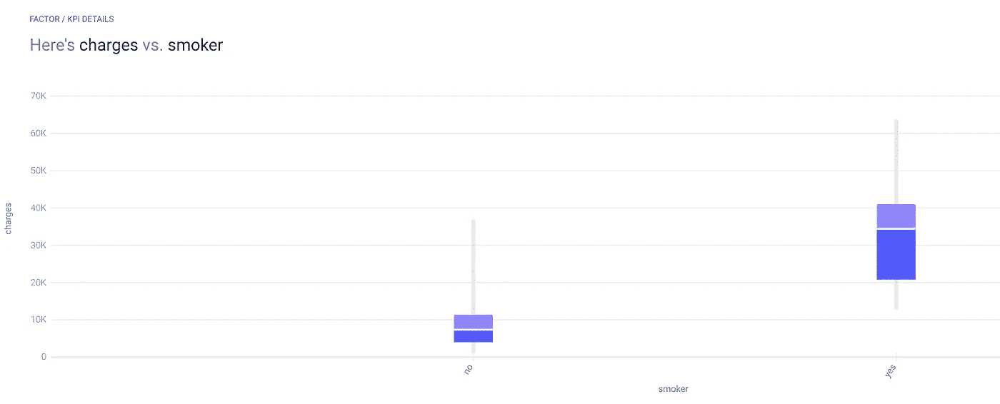
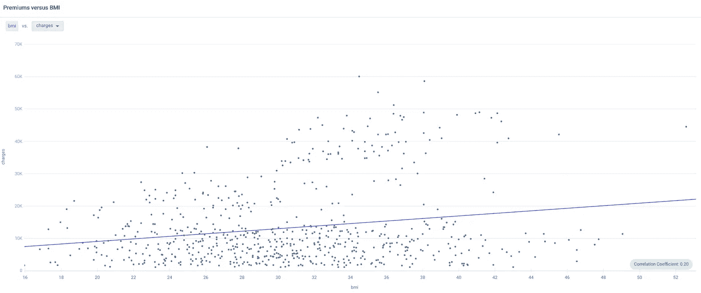
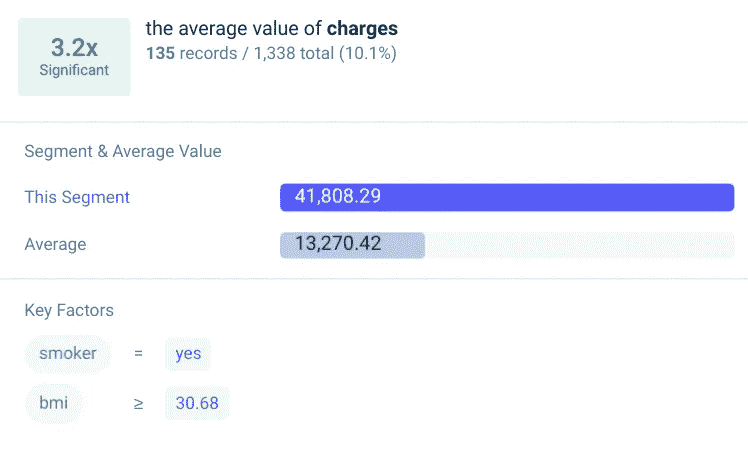

# 健康保险费正在飞速上涨——以下是如何保持低水平的方法

> 原文：<https://medium.datadriveninvestor.com/insurance-premiums-are-rocketing-heres-how-to-keep-yours-low-49286637d313?source=collection_archive---------31----------------------->

## 三个简单的建议。

Photo by [Bermix Studio](https://unsplash.com/@bermixstudio?utm_source=medium&utm_medium=referral) on [Unsplash](https://unsplash.com?utm_source=medium&utm_medium=referral)

保险公司正处于一个痛苦的世界，因为今年保费收入的下降幅度是大衰退时期的 3 倍。

与此同时，随着成本转移到消费者身上，健康保险费预计将上涨 40%。保费因人而异，事实证明，有些因素是你可以控制的。

我研究了美国人口普查局的一个保险数据集  ，寻找影响保费的属性。之前，我分析了一个[保险流失数据集](https://medium.com/dataseries/predicting-churn-on-insurance-data-9ddb621b24c1)，发现保险流失的一个主要原因就是高保费。

以下是如何降低你的健康保险费。

 [## 新的健康技术如何让我们活过 100 岁？数据驱动的投资者

### 不久前，我们都在看一台黑色电视，不得不带着天线跑遍整个公寓，以确保…

www.datadriveninvestor.com](https://www.datadriveninvestor.com/2020/08/12/how-new-health-technology-makes-us-live-past-100-years/) 

# 1.不要抽烟🚭

吸烟每年杀死超过 48 万美国人[⁴](https://www.cdc.gov/tobacco/data_statistics/fact_sheets/fast_facts/index.htm)——是 2020 年新冠肺炎最坏情况估计的两倍。

保险公司知道这一点，他们让吸烟者为他们致命的习惯付出昂贵的代价。将数据上传到分析工具 [Apteo](http://apteo.co) 中，我们可以看到，不吸烟者平均支付 7435 美元的合理保费，而吸烟者平均支付 34440 美元的惊人保费。

教训:减少香烟，减少你的溢价。

# 2.保持苗条🥗

肥胖每年杀死大约 325，000 名美国人[⁵](https://pubmed.ncbi.nlm.nih.gov/10546692/)——比美国在二战中的死亡人数还要多。肥胖并不便宜，保费与身体质量指数正相关。

下面，我们可以看到，身体质量指数 25 以下(不超重)的个人支付的最高*保费约为 3 万美元，而一般保费不到这个数字的三分之一。与此同时，身体质量指数超过 25 岁(超重)的个人支付的最高保费约为 6 万美元，平均水平要高得多。*

身体质量指数和保费之间的关系没有吸烟和保费之间的关系那么密切，但保持在健康的范围内总是更好。

# 3.考虑医疗保险👴

由于越来越多的人在年老时死亡——不管是什么原因导致的死亡——老年人倾向于支付更高的保险费。

医疗保险是一项针对 65 岁及以上人群的联邦医疗保险计划，医疗保险 A 部分对许多人是免费的。如果 Medicare 不适合您，请货比三家，寻找适合您需求的合适保障级别。

# 如何削减你的保费五倍

在我分析的数据集中，肥胖吸烟者支付的保险费比平均水平高 3.2 倍。

由于这是所有*顾客的平均值，我还比较了肥胖吸烟者和非肥胖不吸烟者，发现**肥胖吸烟者支付的保险费是非肥胖不吸烟者的 5.2 倍。***

总之，通过改变习惯和考虑其他计划，你可以大幅降低保费。

## 访问专家视图— [订阅 DDI 英特尔](https://datadriveninvestor.com/ddi-intel)