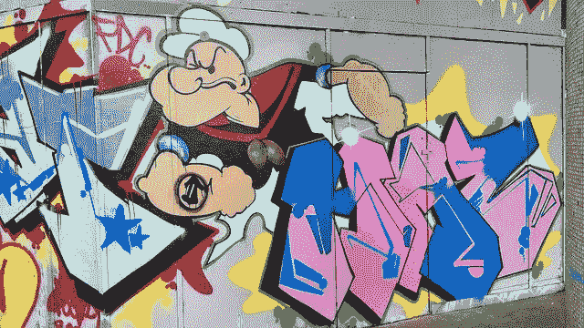

# 知识产权与“大力水手”奇案

> 原文：<https://medium.datadriveninvestor.com/intellectual-property-and-the-curious-case-of-popeye-1fb6932551e8?source=collection_archive---------4----------------------->

知识产权描述了对非实物形式的权利的保护。版权和版权保护保护一种法律地位，这种地位独立于它们被印在其上的物品的材料可用性。(在印刷出版物中，无论谁拥有材料副本，都不拥有其中表达的思想，这些思想仍然是开发它们的作者的财产)。

让我们退一步说:十八世纪初，聚集在行会中的商人为了保护自己的利益，创立了不公平竞争的纪律。这种特殊的纪律很快也扩展到图书和文学系统，但在 19 世纪中期，行会解散，并被自由主义制度所取代，在这种制度下，不公平竞争的纪律直接保护个体竞争者的私人利益。一旦引入了属地原则，根据这一原则，保护知识产权的法律在其所属的国家是有效的，国家法律就被分成了两种模式，一种是受法国大革命影响的欧洲大陆的民法模式，另一种是受工业革命影响的盎格鲁-撒克逊普通法模式。

 [## 在创业之旅中，拥抱学习|数据驱动的投资者

### 好像建立一个数百万美元的公司还不够困难，企业家必须额外照顾他们的…

www.datadriveninvestor.com](https://www.datadriveninvestor.com/2018/10/16/on-the-entrepreneurial-trek-embrace-the-learning/) 

世界知识产权组织(*世界知识产权组织*)第 2 条通过知识产权界定了与文学、艺术和科学作品、表演者表演、唱片、广播、人类活动所有领域的发明、科学发现、工业设计、商标、贸易和服务标志、名称和商号、防止不公平竞争有关的权利，以及与工业、科学、文学和艺术领域的知识活动有关的所有其他权利。实质上，它代表了一套权利，旨在保护人类独创性的作品，这些作品可分为三大类:创造性独创性作品(版权)、显著标志(商标)以及技术和设计创新(专利)。

每个人对他所创作的科学、文学和艺术作品所产生的精神上和物质上的利益，有权享受保护。这些利益对应于个人权利和世袭权利:前者涉及被承认为自己作品的作者或技术和设计创新的创造者的不可剥夺的道德权利，没有时间限制；而后者则与对一个人自己的创造性活动成果的经济利用相联系，是可以传播的，并且有一个有限的期限。

版权的概念比著作权的概念要广泛得多，因为它不仅赋予作者对其创作的作品的一系列承袭权利，而且赋予作者精神权利，通过这些权利，即使作者放弃了承袭权利，他也可以保持对作品的某种控制。版权的字面意思是“复制的权利”，但它通常与“禁止复制”的不同含义一起使用，目的是向任何人传达未经合法作者事先同意禁止以任何方式复制智力作品。

版权主要保护智力创作作品，商标保护工业产权的表现形式，工业产权包括商标和其他显著标志、地理标志、原产地名称、设计和模型、发明、实用新型……。(《工业产权法》第 1 条)；商标作为企业及其商品和/或服务在公众消费者面前的独特和代表性的标志，具有内在的经济价值，因此，其身份受到的保护比版权所涵盖的智力作品受到的保护更大。

这种尽职的检查是一个相当奇怪的事情的必要前提。

漫画中最著名的吃菠菜的人，大力水手，或者在意大利，大力水手，在欧洲的版权于 2009 年 1 月 1 日到期，正好是其著名创作者埃尔齐·西格尔去世 70 年后。然而在美国，版权将于 2024 年 1 月 1 日到期。

在遵守《伯尔尼公约》的欧洲国家和美国，对作者身份得到确认的作品有相同的版权期限，即作者的整个一生和他死后 70 年。

在匿名或假名作品的情况下，保护是不同的，因为在欧洲，保护期是从首次出版起 70 年，而在美国，保护期是从首次出版起 95 年或从创作起 120 年。

除了已知或匿名作者的情况之外，还有第三种情况，即被定义为 ***【受雇用】*** 的作品，这些作品是在雇佣关系过程中产生的，在这种情况下，作品的著作权属于作品的委托人，而不是其实际创作者！

埃尔齐·克赖斯勒·西格(1894-1938)在函授绘画课程后，于 1916 年成功地在《芝加哥先驱报》上发表了一篇关于查理·卓别林喜剧表演的连环漫画。美国出版商威廉·蓝道夫·赫斯特注意到了他的才华，他是赫斯特公司的创始人，赫斯特公司还拥有一家大型连环画发行公司和全球 5000 多家报纸。

1919 年，西格尔受雇于纽约的金特写辛迪加，为《纽约日报》创作了漫画系列“**顶针剧场*”。该系列的主角是奥维尔家族，由他的孩子奥利维亚(奥利维亚，大力水手未来的女朋友)、卡斯特(但丁·贝托利奥)和他的父母科尔和娜娜·奥维尔组成。水手大力水手将在 10 年后的 1929 年 1 月 17 日登场:Castor Oyl 正在寻找一个在海上长途航行中陪伴他的船员，因此雇佣了一个单独的水手大力水手，对他来说，狼吞虎咽一盒菠菜就足以获得超人的力量并打败任何敌人。本应在海上任务结束时消失的大力水手却成了工人阶级的偶像，工人阶级视他为在严重的经济危机时期(我们正处于 1929 年 10 月 29 日的华尔街股灾中)能够恢复希望的英雄。由于读者的许多要求，水手成为了该系列的主角，很快在世界范围内获得了成功和声誉。 ***大力水手被认为是一种受雇的工作。****

*拥有版权的公司 King Features Syndicate 正设法将其“产品”排除在欧洲公共领域之外，将其形象与商标法联系起来，制作 Segar 的设计，就像商品一样，并确保任何人不得不使用其形象，都会招致公开的商标侵权。大力水手的产业，从书籍、玩具到连锁快餐和菠菜罐头，每年给国王功能辛迪加带来超过 15 亿英镑的授权任务；因此，不言而喻，该公司将试图通过任何手段阻止该角色的自由使用。作为监管的结果，版权和商标之间的界限将越来越模糊，版权最初是为了不同的目的而创建的，以鼓励创作作品的生产，商标是消费者区分竞争产品和服务的“灯塔”，是公司维护其声誉的“堡垒”。*

*版权所有*

****Raffaella Aghemo，律师****