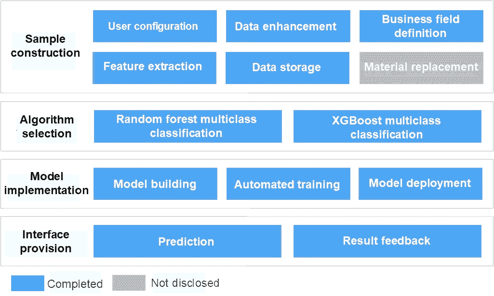
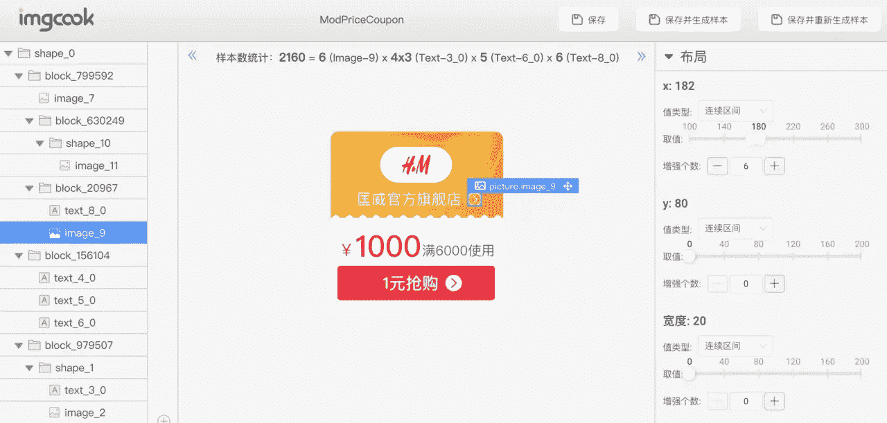
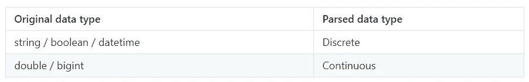
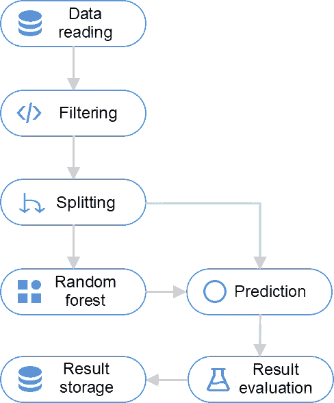
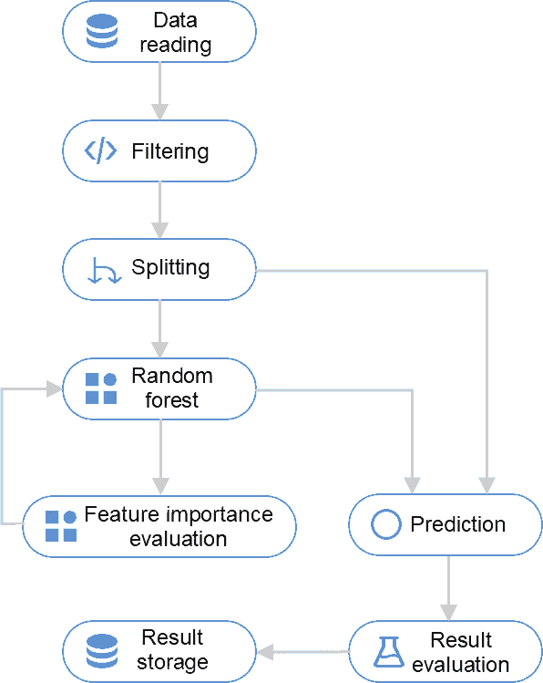
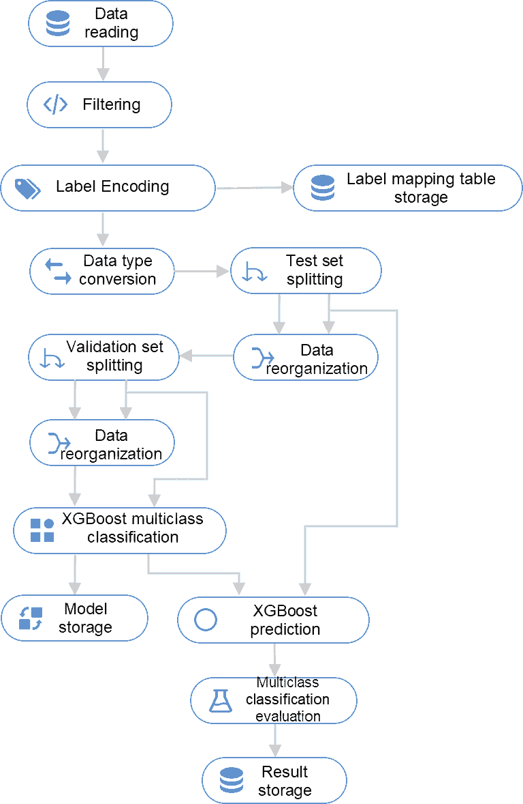
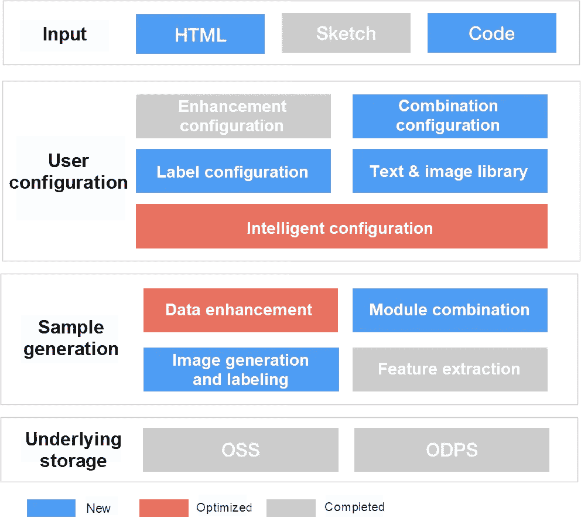

# 从设计文件智能生成前端代码:业务模块识别

> 原文：<https://medium.datadriveninvestor.com/intelligently-generate-frontend-code-from-design-files-business-module-recognition-b3a205b02667?source=collection_archive---------23----------------------->

*作者赖斯*

作为阿里巴巴前端委员会四大技术方向之一，前端智能项目在 2019 双 11 购物节期间创造了巨大的价值。前端智能项目为淘宝和天猫的新模块自动生成 79.34%的代码。在此期间，R&D 团队经历了许多困难，并就如何解决这些困难进行了许多思考。在“从设计文件智能生成前端代码”系列中，我们讨论了前端智能项目背后的技术和思想。

# 概观

业务模块也称为业务组件，是提供特定业务功能的代码单元。我们的移动应用程序中的推广页面包含许多业务模块。如果我们能够从这些页面中识别和提取业务模块，我们就可以将业务模块用于各种目的，比如代码重用和业务字段绑定。因此，业务模块识别服务是前端智能项目的基础部分。

业务模块识别服务面向前端页面，不同于面向中端和后端系统的基本组件识别和表单识别。它用于从移动应用程序中显示的前端页面的视觉设计文件中识别业务模块。通常，设计文件提供了许多可直接识别的信息，如文本内容和图像大小。

考虑到一个业务模块的 UI 结构往往比较复杂，我们没有选择图像深度学习来实现业务模块识别。相反，我们从设计文件的领域特定语言(DSL)中提取预定义的特征值，并使用传统机器学习的多类分类来实现业务模块识别。业务模块识别服务可以返回关于已识别业务模块的信息，包括它们在可视化设计文件中的类别和位置。

下图显示了实现业务模块识别的整个过程。它包括以下步骤:

*   **样本构建**:根据用户配置和自定义数据增强规则，在 UI 层增强设计文件，生成视觉上多样化的样本。之后，根据预定义的业务字段提取和存储特征值。
*   **算法选择**:选择一个传统的机器学习多类分类算法。
*   **模型实现:**在阿里巴巴的机器学习平台上建立模型并进行相关算法工程，进行自动化的模型训练和部署。
*   **接口提供:**提供基于模型的预测和结果反馈功能。

Fig: Overall process

# 在 D2C 建筑中的地位

下图显示了业务模块识别服务位于材料识别层，该层位于从设计到编码(D2C)技术的分层架构中。业务模块识别服务提供了从设计文件的 DSL 中识别业务模块的能力。其他服务(如业务字段绑定和业务逻辑生成)可以在后续的代码生成过程中使用已识别的业务模块。

Fig: Hierarchical architecture of D2C technology

# 样本结构

机器学习是基于大量真实数据的训练过程。一个好的样本库可以让模型训练事半功倍。培训业务模块识别的样本来自设计文件。一个业务模块可能只有几个设计文件，这限制了我们可以获得的样本数量。首先，我们必须解决样本不足的问题。

## 数据增强

我们使用数据增强来解决这个问题。有一组默认的和可配置的数据增强规则。我们可以根据元素在实际场景中的潜在变化，调整设计文件中每个元素的属性，如元素是否可以隐藏或允许的字符数，并根据这些属性定义自定义参数。这样，我们可以控制构造的样本之间的差异。

我们可以使用这些参数来排列和组合属性，以生成大量不同的设计文件 DSL。这些设计文件的 DSL 互不相同，既有随机的，也有规律的，让我们可以获得大量的样本。

下图显示了用于配置数据增强的页面。DSL 树和呈现区域位于页面的左侧和中间。数据增强配置区域位于右侧。这些参数分为以下几类:

*   **属性增强:**大小、位置、隐藏或可见、前景色、背景色和内容
*   **增强方法:**连续范围和指定枚举值

Fig: Page for configuring data enhancement

## 特征抽出

在我们获得了大量的增强视觉 DSL 后，如何生成样本？我们需要的样本必须是表格数据，这是传统机器学习所需的输入格式。样本是一个特征向量。因此，我们需要从 DSL 中提取特征。

根据以前的模型训练经验，我们发现某些 UI 信息对于确定模块类别至关重要。因此，我们将 UI 信息抽象、定制和提取为特征，例如 DSL 中包含的宽度、高度、布局方向、图像数量和字符数量。通过抽象各种 UI 信息，我们获得了 40 多个视觉特征。

除了视觉特性，我们还添加了定制的业务特性。也就是说，我们根据特定的业务规则，将一些元素定义为与业务相关的元素，比如价格和人气。然后，我们将这些元素抽象为十个业务特性。在这个过程中可以使用定制的业务规则，这可以通过正则表达式匹配来实现。

视觉特征和商业特征形成特征向量。我们通过向特征向量添加分类标签来获得样本。

# 算法和模型

我们算法的输入是从设计文件中提取的标准化 DSL。目标是识别 DSL 属于哪个业务模块，这可以通过多类分类来实现。基于这种思想，我们从大量增强的 DSL 中提取特征，并生成数据集来训练模型。我们使用算法平台提供的各种组件建立了多类分类模型。

## 随机森林

**模型构建**

首先，我们建立了一个随机森林模型作为多类分类模型；因为随机森林模型运行速度快，自动化过程流畅。几乎不需要额外的运算来满足算法工程要求。此外，随机森林模型对特征处理没有很多要求。它可以自动处理连续和离散变量。下表描述了自动分析数据类型的规则。

Table: Rules for automatically parsing data types in the random forest model

因此，我们可以快速建立一个简单的模型，如下图所示。

Fig: Random forest model used online

**参数整定**

我们发现随机森林模型偶尔会对样本库的数据失去信心。即正真的置信水平低，模型被置信阈值卡住。特别是对于看起来相似的样本，比如两个相似的模块，下图显示随机森林模型在确定它们的分类时遇到了困难。

Fig: Similar modules

我们调整了随机森林模型的参数来解决这种缺乏信心的问题，包括每棵树的随机样本数和最大树深以及 ID3 比率、Cart 和 C4.5 树类型。我们还预先集成了特性选择组件。但是，表现还是不尽如人意。如下图所示，在将特征重要性评估结果手动反馈到特征选择和模型训练过程后，我们获得了理想的结果。然而，这种反馈操作无法集成到自动化培训过程中，因此我们决定不采用这种方法。

Fig: Random forest model used in the parameter tuning process

**离散特征问题**

虽然随机森林模型可以自动处理离散变量，但它不能处理不包含在定型集中的离散值。为了解决这个问题，我们必须确保每个离散特征的所有值都包含在训练集中。因为有多个离散的特征，这个问题不能用简单的分层抽样来解决。这也是应用随机森林模型时的一个痛点。

这些是我们用随机森林模型做的。综上所述，随机森林模型简单，易用，能快速出结果。可以满足大部分业务场景的识别需求，成为业务模块识别服务的算法 1.0。然而，由于其算法上的缺陷，我们后来引入了另一个叫做 XGBoost 的模型。

## XGBoost 多类分类

**模型构建**

XGBoost 通过使用 boosting 技术提高了树的准确性，这比我们的数据集中的随机森林算法性能更好。但是算法平台上的 XGBoost 模型涉及到很多非标准流程。为了实现自动工作流，我们构建了下图所示的模型。

Fig: XGBoost model

**预处理**

XGBoost 模型需要更多的预处理，包括:

*   **标签编码:**在预处理过程中对标签进行编码。XGBoost 只支持从 0 到比类别数小 1 的标签值。然而，出于映射的目的，我们存储的标签值是来自算法平台的类别 id，而不是 0 到 N，甚至可能不是连续的整数。因此，我们需要使用一个标签编码组件来编码标签值，以满足 XGBoost 的要求。
*   **标签映射表存储:**在存储器中保存标签映射表。预测接口使用这个映射表来翻译平台上定义的类别，因此需要额外的存储。
*   **数据重组:**从训练集中检索缺失标签，以防止随机分裂算法将训练集中的标签分裂成不完整的数据集。数据重组会在一定程度上干扰模型，但在数据很少的极端情况下会起作用。

XGBoost 模型在处理测试数据时表现出足够的信心，从而降低了设置阈值的难度。预测结果也能满足我们正确识别业务模块的需要。此外，它支持自动化。因此，XGBoost 模型成为我们未来优先考虑的传统训练模型。

## 挑战:食品

值得注意的是，我们无法全面收集当前模块库之外的所有视觉样本。这就像试图收集 70 亿人的面部照片，以便在阿里巴巴建立一个内部人脸识别系统。样本池外的缺失数据导致我们遗漏了一个隐藏的分类——负样本分类。这也导致了 out-of-distribution (OOD)问题:样本库之外的数据导致的预测不准确的问题。这个问题的症状是在分类结果中有过多的假阳性。

这个问题在我们的场景中很难解决，因为很难收集所有的阴性样本。本节描述了我们为缓解这一问题而采取的一些措施。

**阈值设置**

我们使用分类模型提供的置信度(prob)作为确定分类结果是否有效的参考。如果置信度高于阈值，则分类结果被认为是有效的。这种方法在经验上是有意义的，并且在实践中有效地避免了大多数 OOD 假阳性。

**逻辑控制**

我们可以使用逻辑关系来识别算法模型中的一些 OOD 误报。在我们看来，在 DSL 树的同一路径上不可能有多个相同的模块。否则，树是自嵌套的。因此，如果在一条路径上识别出多个相同的模块，我们可以通过置信度来选择识别结果。这个逻辑帮助我们过滤掉大多数误报。

**负样本反馈**

我们提供反馈服务，允许用户上传有识别错误的 DSL，这些错误将被添加并存储为负面样本。使用负样本重新训练模型可以解决 OOD 问题。

目前只能依靠逻辑和用户反馈来规避 OOD 问题，但在算法层面还没有解决。这是我们计划在下一阶段解决的问题。

**模型部署**

算法平台允许用户将模型公开为在线接口，即将模型部署为预测服务。用户可以使用 imgcook 调用接口，一键部署模型。为了使训练和部署过程自动化，我们还致力于算法工程，这里不做描述。

# 预测和反馈

预测服务的输入是从设计文件中提取的 JSON 格式的 DSL。输出是业务模块信息，包括设计文件中的 id 和位置。

在调用算法平台的预测接口之前，我们添加了逻辑过滤，包括:

**大小过滤**:如果模块大小偏差很大，DSL 将不会进入预测逻辑，被视为不匹配。

*   **分级过滤**:对于叶子节点(即纯文本或纯图像)，我们不认为这些节点有业务意义，所以也将其过滤掉。

结果反馈过程包括自动结果检测和用户反馈。目前，用户只能上传预测结果错误的样本。

淘宝 99 大卖首次上线使用业务模块识别服务。模型、预处理和 OOD 避免过程最终导致以下结果:在商业场景中高达 100%的识别准确率。(不计算纯模型准确率。)

# 未来的工作

## 算法优化

**解决难题**:如前所述，OOD 问题是一个没有理想解的难题。关于如何解决这个问题，我们有一些想法，并计划在未来进行尝试。

**基于 DNN 的损失函数优化**:基于手动 UI 特征构建深度神经网络(DNN)。通过优化损失函数，我们可以增大不同类别之间的距离，同时减小同一类别内的距离。我们可以在优化模型上设置一个距离阈值来识别 OOD 数据。

**自动生成负样本的优化:**在 XGBoost 算法的基础上，增加一个预分类二叉分类模型来区分训练集内外的数据，并据此优化生成负样本的随机范围。我们需要做更多的研究来找到实现这一目标的具体方法。

**深度学习**:人工特征提取虽然快速有效，但在泛化能力上无法与卷积神经网络(CNN)等深度学习方法相比。因此，我们将在未来尝试使用基于图像的算法来提取 UI 特征向量。这样，我们可以计算向量距离或使用二进制分类模型来比较输入数据和相应 UI 组件之间的相似性。

除了上面提到的算法，我们还会在深度学习领域进行更多的尝试。

## 样本生成平台

目前，我们的样本生成存在配置效率低、支持的算法少等问题。因此，我们计划优化设计，并为样本生成添加更多功能。下图显示了提议的样本生成平台的主要特性。

Fig: Features on the sample generation platform

**源扩展:**目前我们通过提取设计文件的 DSL，将特征保存为 MaxCompute 表数据来生成样本。在未来的业务场景中，我们还希望从 HTML 和前端代码中生成样本。无论输入源是什么，数据增强层都有许多相似之处。我们将设计一个通用的、增强的算法，并向公众发布。

**算法扩展:**最终样本可以是用于多类分类的带有特征值的表格数据，或者是用于目标检测模型的 Pascal VOC 和 COCO 格式的图像和标签数据。

**增强智能:**目前，用户可能会发现样本生成功能配置复杂且难以使用。在某些情况下，由于不正确的操作，生成的样本无法使用。因此，我们期望提高数据增强的智能性，以最大限度地减少用户操作，并帮助他们快速生成有效样本。

总之，优化算法和提供样本生成平台作为产品将是我们下一阶段的主要工作。

# 原始来源:

 [## 从设计文件智能生成前端代码:业务模块识别

### 阿里巴巴 F(x)团队 2021 年 2 月 3 日 69 作为前端委员会的四大技术方向之一…

www.alibabacloud.com](https://www.alibabacloud.com/blog/intelligently-generate-frontend-code-from-design-files-business-module-recognition_597259)