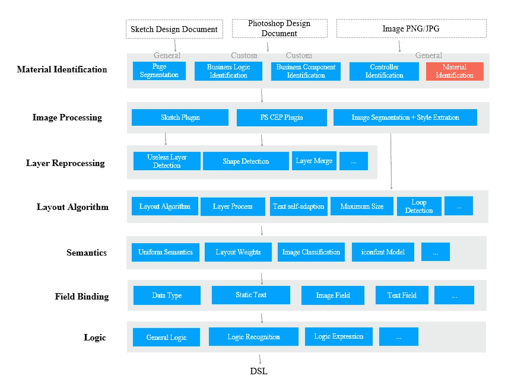

# 从设计文件智能生成前端代码:表单和表格识别

> 原文：<https://medium.datadriveninvestor.com/intelligently-generate-frontend-code-from-design-files-form-and-table-recognition-e4b4669f06a4?source=collection_archive---------30----------------------->

*作者田可*

作为阿里巴巴前端委员会四大技术方向之一，前端智能项目在 2019 双 11 购物节期间创造了巨大的价值。前端智能项目为淘宝和天猫的新模块自动生成 79.34%的代码。在此期间，R&D 团队经历了许多困难，并就如何解决这些困难进行了许多思考。在“从设计文件智能生成前端代码”系列中，我们讨论了前端智能项目背后的技术和思想。

# 概观

在前端智能领域，尤其是中端和后端智能领域，表单和表格识别起着举足轻重的作用。中端和后端开发工作主要由表单和表格开发组成。因此，如果可以在几秒钟内从设计文件中智能地生成表单和表格的代码，生产率将会大大提高。本文描述了如何为窗体和表格生成代码。

# D2C 识别能力:技术架构

在表单/表格识别中使用了组件识别、布局算法和材料属性识别等技术。

材料识别层在整体架构中的位置如下图所示。

Fig: Technical architecture of D2C recognition capabilities

# 演示:为表单和表格生成代码

要为通用前端组件(如表单和表格)生成代码，您需要获取一个快照，粘贴它，然后单击 Recognize 图标。如果字段文本的语言不是英语(例如，中文)，字段将被翻译成英语，并以小写字母显示。

Fig: Form recognition demonstration

Fig: Table recognition demonstration

# 表格识别技术:机制

表单和表格识别包括以下步骤:

1)使用对象检测技术检测所有类型的组件及其坐标。

2)使用文本识别技术识别所有文本字段及其坐标，并使用自动翻译技术将其翻译成英语。

3)使用代码转换器从步骤 1 中获得的组件信息和步骤 2 中识别的文本信息中提取各种属性，例如表单或表格的布局、标签、类型和字段。

# 对象检测+文本识别

我们训练了更快的 RCNN 初始 V2 模型，并用它在目标检测中进行预测。有关更多信息，请参见从设计文件智能生成前端代码:基本组件识别。在文本识别期间使用通用的文本识别技术来检测文本内容和坐标。本文不描述细节。

下图中，红框表示待检测对象，绿框表示待识别文本。

# 代码转换器

本文重点介绍如何使用代码转换器从表单或表格中提取各种属性。

## 将绝对坐标转换为行和列

首先，为了便于信息处理，将待检测对象和待识别文本的绝对坐标转换为行和列。行和列的特定数据结构是二维数组，其中第一维是列，第二维是行。算法逻辑包括以下步骤:

*   垂直排序所有已识别的具有绝对坐标的方框。
*   遍历垂直排序的盒子列表，将同一行的盒子放在一个数组中，然后将它们水平排序成一行。
*   按顺序将所有行放入一个数组中，以生成一个由行和列组成的二维数组。

## 确定窗体和表格的布局

窗体或表格的布局可以根据前面的行和列信息来确定。

表单具有二维布局，与通过组件识别获得的行和列信息一致。因此，通过组件识别获得的行和列信息可以在嵌套循环中直接映射到表单协议。表格是一维的，只要确定了表头就可以确定表格的结构。因此，我们可以直接使用通过文本识别获得的行和列的二维数组的第一行作为表头。

## 计算表单和表格字段的值

确定表单或表格的布局后，我们可以计算字段值和类型。

表单字段的值是通过将标签翻译成英文并以小写字母表示获得的。如何提取标签？标签位于表单字段的左侧或顶部是常识。因此，算法逻辑是首先提取表单字段左边的标签。如果操作失败，从表单字段顶部提取标签。

在表格中，表格字段是表格标题。从通过文本识别获得的行和列的二维数组中提取第一行后，可以获得表头的值。例如，您可以通过执行基于长度的筛选来过滤掉少于三个字段的行，从而仔细检查第一行是否是表头。

## 确定表单和表格字段的类型

表单可能有各种字段类型，如输入字段、复选框和单选按钮。一个表可能有明文字段和链接。因此，我们必须确定表单和表格字段的类型。

表单域的类型是从通过对象检测获得的信息中获得的，因为对象检测任务之一是提取表单域的类型。

表格字段的类型也从通过对象检测获得的信息中获得。每个表列中的字段属于同一类型。因此，只需要获得每一列中第一个字段的类型。

## 计算表格的其他属性信息

自动提取上述信息大大减少了工作量。使用以下方法提取更多属性信息:

*   递归识别:输入字段被识别后，可以将其提取出来并传递给另一个模型进行识别——例如，验证它是被禁用的还是必需的。
*   在其他位置提取文本信息:例如，可能有占位符或默认值。

# 前景

在今年的 Apsara 大会上，Daniel Zhang 表示，大数据和计算能力是数字经济的燃料和引擎。目前在前端行业，组件化正在形成，海量的组件可以作为大数据。而且行业内的计算能力也在不断提升。我们将见证人工智能技术如何革新前端开发的模式。

# 原始来源:

 [## 从设计文件智能生成前端代码:表单和表格识别

### 阿里巴巴 F(x)团队 2021 年 2 月 2 日 67 作为前端委员会四大技术方向之一的…

www.alibabacloud.com](https://www.alibabacloud.com/blog/intelligently-generate-frontend-code-from-design-files-form-and-table-recognition_597253)