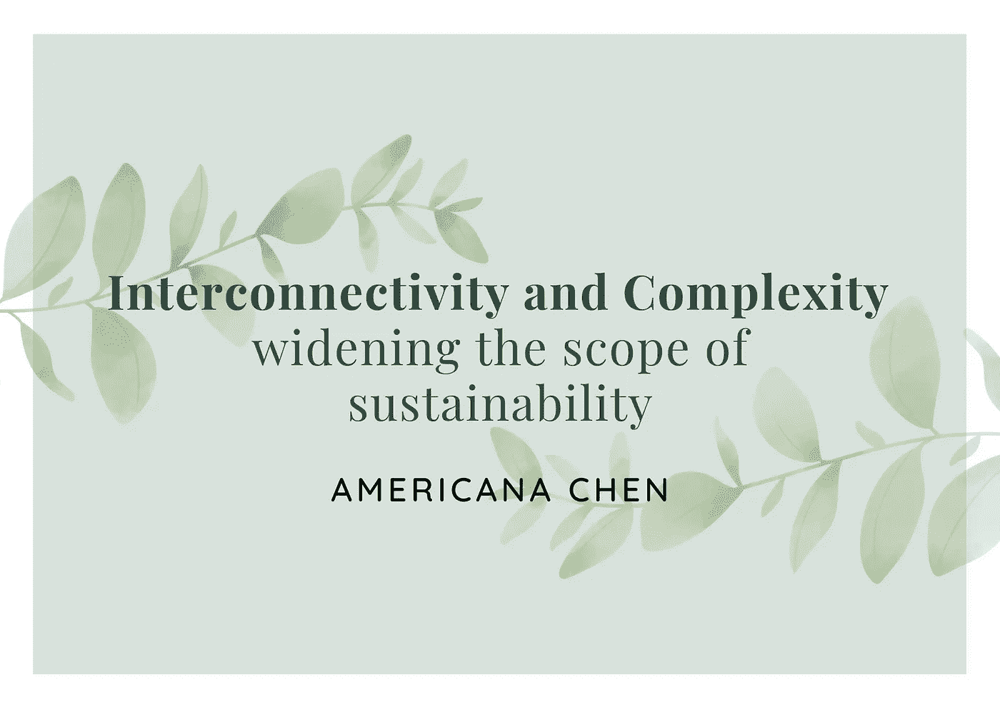
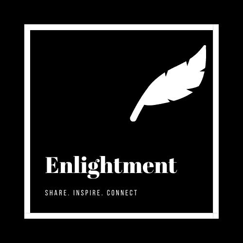

# 互联性和复杂性——扩大可持续性的范围

> 原文：<https://medium.datadriveninvestor.com/interconnectivity-and-complexity-widening-the-scope-of-sustainability-6b20a43d81ec?source=collection_archive---------22----------------------->

Image created by Americana using Canva

如今，我们在任何地方、任何时候、任何新闻标题上都可以听到可持续发展。但是我们如何定义可持续发展的范围呢？听完[可持续发展峰会](https://www.facebook.com/InstituteISD/)后，我建议该定义的一个重要组成部分是**“互联性”。**

从本质上来说，可持续发展关注的是“我们”和“环境”之间的相互作用，而“相互联系”的特征则蕴含在两者之中。

# 什么定义了“环境”？

当谈到可持续发展和气候变化时，你首先想到的是什么？

## 碳排放。

近年来，全球精英逐渐意识到气候变化是一个紧迫的问题，我们需要立即解决并采取行动应对。我们已经看到在减少碳排放方面的广泛努力。例如，今年早些时候，英国成为第一个通过净零排放法律并在 2020 年前实现“净零”的主要经济体，这意味着承诺将温室气体净排放量减少 1990 年水平的 80%。

的确，碳排放是导致气候变化的最广为人知的污染源，然而，我相信新冠肺炎疫情也关注了我们以前忽略的其他问题。

> “联合国秘书长清楚地表明了新冠肺炎和人为气候变化之间的联系，他指出，人类和牲畜对动物栖息地的持续侵占，有可能使我们面临更致命的疾病。”

我们必须认识到这样一个事实:动物、健康和生态环境都是相互关联的。因此，当考虑气候变化和可持续性时，环境的每个组成部分都应该被考虑在内。

# 什么定义了“我们”？

谁负责促进可持续发展？

监管机构？非政府组织？企业？

事实上，从政策制定者、学者到个体家庭，每个人都需要承诺和参与，以推动更可持续的未来。需要达成社会参与和共识，单个政党的努力不足以带来具体而持久的变化。想想政府提高碳税的规定:如果企业没有意识到其业务的潜在环境风险，并且不想牺牲其成本竞争力，他们可以想出成百上千种方法来避免这些纳税义务。从另一个角度来看，如果消费者不愿意或抵制采用可持续的生活方式或改变他们的消费模式，企业就没有动力实施可持续的商业做法。

因此，我们需要的是一种范式转变，一种社会各方之间的互利协议，以推动更美好、更可持续的未来。

# 生物多样性——一个日益受到关注的问题

最近吸引更多关注的一个方面是生物多样性，它完美地说明了这样一个事实，即**动物是可持续发展的重要组成部分**，我们必须付出更多努力来保护它们。

Image source: unsplash @artofhoping

以香港为例，其生物多样性承诺面临的最大挑战是脆弱和濒危物种的非法交易。走私动物很普遍，而且是以极其残忍的方式进行的。***2018 年 1 月，香港海关在香港机场查获 658 只海龟，残忍地装在人贩子的托运行李中，估计价值 64000 美元。***

作为通往 mainland China 的门户，**香港所需的立法工作难度要大得多**，不幸的是，香港政府没有采取积极有效的措施。**由于贸易量大、许可证发放不严和量刑过轻，现行法律的执行力度不够。**

非法养殖是另一个需要解决的问题。濒危物种持有许可证是根据持有的动物数量发放的。因此，存在非法饲养和交易它们的机会，同时仍然能够保持持有数量不变。

野生动物犯罪问题不仅在香港严重，世界自然基金会报告称，2007 年至 2013 年，南非偷猎犀牛的数量从 13 只增加到 1004 只，增幅高达 7，700%。

事实上，治理在应对这种生物多样性威胁方面极其重要。尽管如此，我确实认为我们也必须后退一步，回想一下“互联性”。走私濒危物种的动机是经济回报，如果没有足够的意识到生物多样性丧失对生态系统的长期后果和致命影响，野生动物犯罪可能仍然是政府非常难以解决的问题。

# 我们怎样才能扭转这种下降趋势呢？—来自芬兰的教训

芬兰的方法是一个成功的模式:**清晰的治理结构和全社会的坚定承诺帮助它成为促进生物多样性、森林保护等方面的领先国家。**2014 年，芬兰在多方利益攸关方国家可持续发展委员会中就协会对可持续发展的承诺进行了谈判。**它的实施允许任何个人、企业以实际行动参与到迈向 2030 年议程的进程中。**

> 芬兰的《2020 年自愿国家审查》指出,"芬兰参与机制和共同所有权的悠久传统是多年来演变而来的。国家可持续发展委员会继续为政府和广泛的利益攸关方提供平台，共同推进芬兰社会的可持续发展。”

**通过加大在教育方面的努力，进一步促进了青年的参与。各种支持措施也鼓励私营部门做出贡献。**

image source: unsplash [@ozgut](https://unsplash.com/@ozgut)

芬兰迈向可持续发展之旅的一个特殊方面是其**森林保护实践**。芬兰的社区与森林有着密切的个人关系。E 每个人都对森林保护有些兴趣，正是通过这种“**相互联系**”才促使芬兰在**通过认证、商业森林的自然管理和保护来平衡森林的可持续性和利用。**

**强有力的政府承诺是一个至关重要的组成部分，通过率先参与并确保多个利益相关方之间的沟通，其可持续发展进程已经超过了最初的目标。**政府还在准备一份长期国家路线图，将芬兰的官方发展援助增加到国民总收入的 0.7%。

## 我们能从芬兰学到什么？

**芬兰的成功向我们表明，政府不断评估可持续发展政策的积极作用以及全社会的承诺是迈向可持续发展的决定性因素。**

# 结束语

新冠肺炎给了我们一个惨痛的教训，但是尽管我们面临着各种挑战，从好的方面来看，这提高了公众对健康、动物和环境之间相互联系的认识。通过采取更加全面和结构化的方法来促进可持续发展，我相信在可预见的未来，我们将会看到“我们”和“环境”之间更加紧密的结合。

***访问***[***【www.enlightmentblog.com】***](http://www.enlightmentblog.com)***获取更多有见地、有素质的有志大学生撰写的文章。***

# Enlightment 简介:

[**Enlightment**](http://www.enlightmentblog.com)**是一个博客和网络平台**，围绕分享、激励和联系的主题而构建。它旨在促进全球有抱负的大学生之间的思想交流。

该平台继续提供由有抱负的学生创作的高质量内容，可以分发这些内容以激励他人，帮助大学生培养分析和创新思维。我们也渴望建立社区，为有相似兴趣、志向或来自同一所大学的学生牵线搭桥。

> 今天就加入我们，享受无广告、无订阅的无缝阅读体验。

## 关注我们/连接到:

脸书:[https://www.facebook.com/Enlightmentblog](https://www.facebook.com/Enlightmentblog)
insta gram:[@ enlightmentblog 2021](https://www.instagram.com/enlightmentblog/)
Linkedin:[https://www.linkedin.com/company/enlightment-blog](https://www.linkedin.com/company/enlightment-blog)