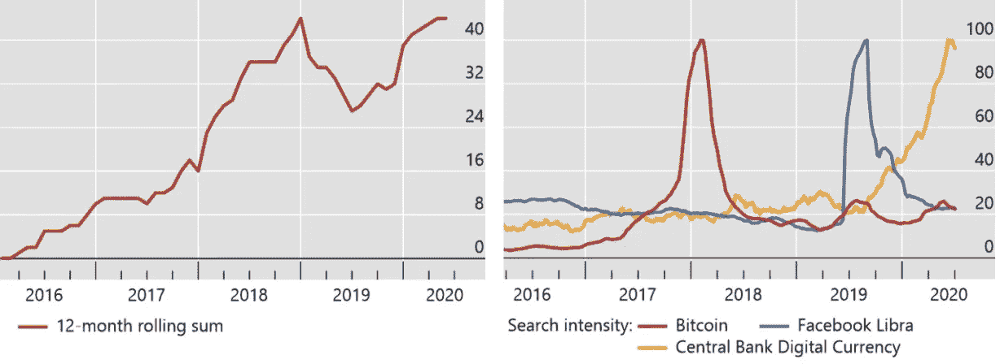
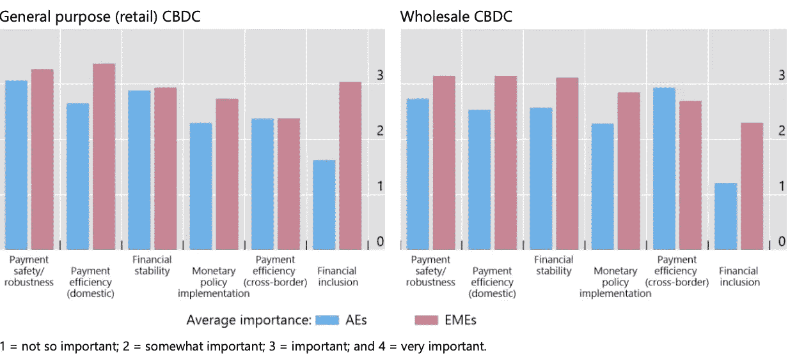
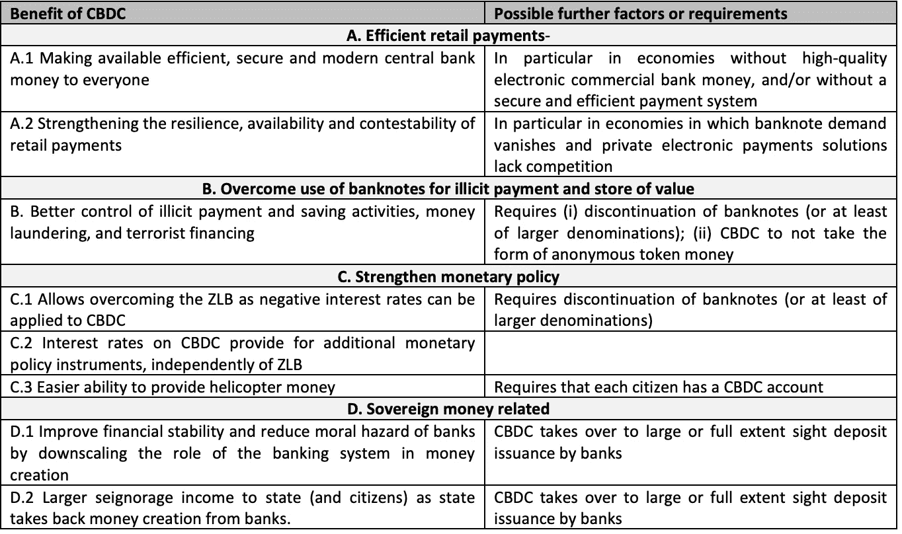
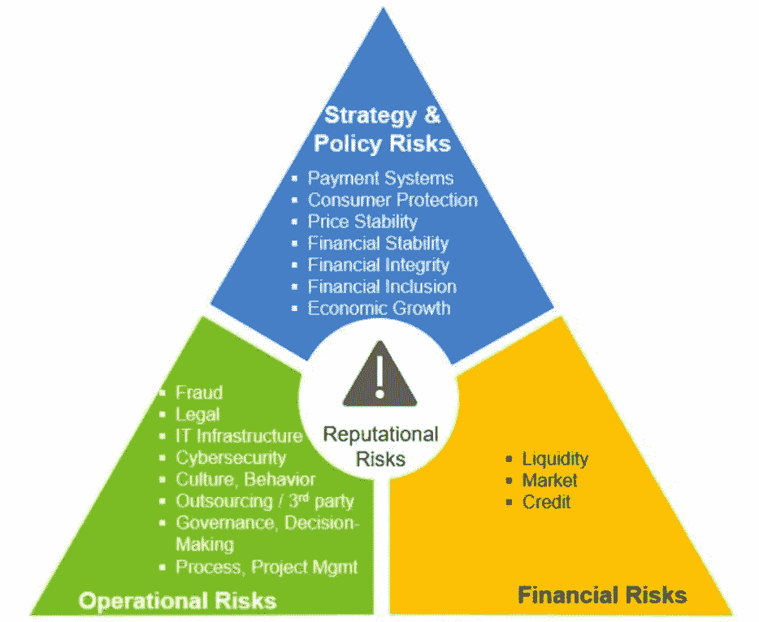

# 对央行数字货币的兴趣仍在继续

> 原文：<https://medium.datadriveninvestor.com/interest-in-central-bank-digital-currencies-continues-ba818a20f163?source=collection_archive---------14----------------------->

学术界和政府中央银行对研究中央银行数字货币(CBDC)的认识和兴趣持续不减。

关于 CBDC 谷歌搜索的演讲和报道数量

来源:[国际清算银行](https://www.bis.org/publ/work880.pdf)

各中央银行和国际货币基金组织(基金组织)、欧洲中央银行(欧洲央行)和国际清算银行(国际清算银行)等全球金融机构撰写了许多咨询文件、报告和分析。事实上，国际清算银行指出，截至 2020 年 7 月，36 家央行已经对发行自己的 CBDC 的“利弊”进行了深入分析。国际清算银行总结了各国央行寻求发行 CBDC 的各种理由。

发行 CBDC 的动机

来源: [CPMI 中央银行调查；野猪等人(2020 年)。](https://www.bis.org/publ/work880.pdf)

国际清算银行还审查了三个引入 CBDC 的司法管辖区:

中国——据报道，该国正在混合使用集中式和分布式账本技术(DLT ),旨在与实物现金一起使用。大多数中国公民已经通过支付宝或微信支付支付，所以这些可能是中国 CBDC 需要克服的竞争*而不是*现金。中国人已经公开表示，他们希望对经济中流通的现金有更深入的了解，并知道“谁、什么、在哪里、什么时候”花掉了这些钱。在那里，匿名消费似乎是不被允许的！

瑞典——鉴于许多瑞典商店不接受现金，而且瑞典人很少使用现金支付交易，瑞典央行正在使用 R2·科达公司进行瑞典 CBDC 的概念验证。目前的意图是交易将保持匿名。

加拿大——这很有意思，因为之前有人用数字字节写道，加拿大人声称他们无意发行 CBDC。然而，作为一种应急措施，正在进行广泛的试验，以防随着现金使用量的下降，或者为了应对私人密码或稳定密码迫使他们做出反应，公民希望采用一种方法。加拿大银行也证实，它将无法访问数字零售交易，因此谁和花了什么的匿名将保持不变

欧洲央行撰写的一篇论文提出，CBDC 可以被视为货币的第三种形式，第一种是存放在央行的隔夜存款，第二种是纸币。CBDC 面临的一个主要制约因素是，它让许多可能抵制变革的现有参与者失去了中介作用。欧洲央行的报告还强调了引入 CBDC 的一些潜在优势

概述一些与 CBDC 相关的好处，以及相关因素或要求

资料来源:[欧洲中央银行。Eureop.eu](https://www.ecb.europa.eu/pub/pdf/scpwps/ecb.wp2351~c8c18bbd60.en.pdf)

国际货币基金组织的一份工作报告——“零售央行数字货币研究调查”——热衷于强调这一点；"*考虑 CBDC 的大多数主要央行和货币当局*"撰写本报告"*不是为了倡导零售 CBDC 发行，而是为了评估最近的研究、央行实验和正在进行的讨论*。本报告认为，央行探索 cbdc 的原因主要是:

提高金融包容性；

维持中央银行在货币体系中的相关性。

尽管有这些原因，但还有其他目标，如实际处理现金所需的安全性和成本，提高国家和全球支付的效率，以帮助打击邪恶活动，以更有针对性的方式发行“直升机现金”的能力，同时还能够引入负利率作为刺激支出的方式。

然而，国际货币基金组织的报告确实指出了央行在采取行动之前可能希望考虑的某些风险

CBDC 风险前景

来源:货币基金组织

当许多中央银行绞尽脑汁考虑发行 CBDC 的“为什么”时，中国人民银行(PBC)已经开始行动了。中国目前正在测试其 CBDC，在香港、澳门、上海和北京等多个地区进行小额零售交易，以期未来所有公民都可以使用这种新的中国数字货币。

2019 年夏天，Libra 的推出将数字货币的想法提上了许多银行董事会的议程。不出所料，从那以后，新冠肺炎和[在使用现金方面的大幅下降](https://ethz.ch/en/news-and-events/eth-news/news/2020/08/blog-wattenhofer-cash-is-dead.html)给人增添了浮躁。尽管发行和使用 CBDC 无疑有很多好处，但许多政府会谨慎行事，可能只会在迫于公民压力或来自其他国家的竞争(首先将本国货币数字化)时才会采取行动。鉴于全球数字化的无情推进，CBDC 无疑可以帮助金融业变得更具包容性，并提高我们的收入、借贷和支付效率。