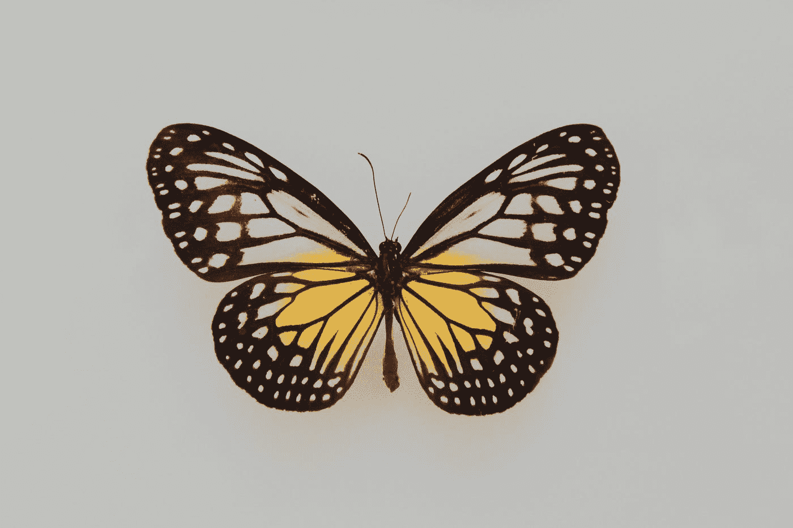
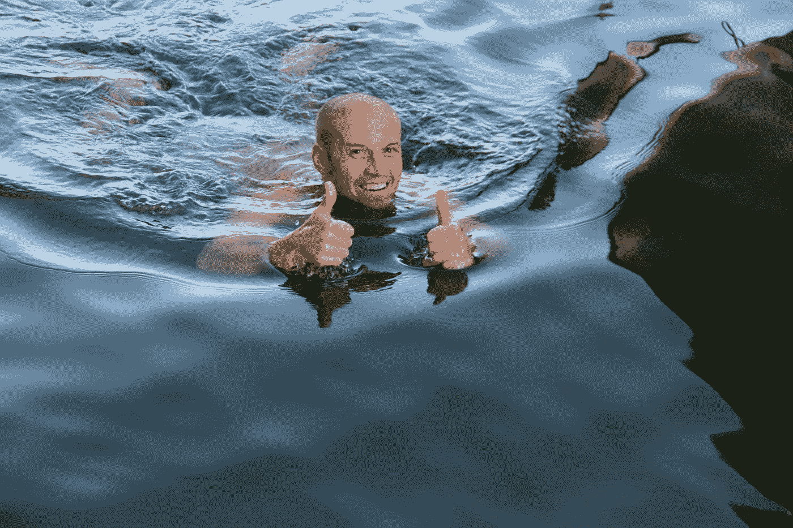

# 有趣的事实我打赌你从来不知道处理压力的 7 步程序

> 原文：<https://medium.datadriveninvestor.com/interesting-facts-i-bet-you-never-knew-about-the-7-step-program-to-handle-stress-13a192d44985?source=collection_archive---------8----------------------->

## 作为一名 12 年、两次获得 NBA 最有价值球员的职业运动员和一名希望帮助你找到自己优势的主教练，从运动动机到人生课程

Photo by [Markus Spiske](https://unsplash.com/@markusspiske?utm_source=medium&utm_medium=referral) on [Unsplash](https://unsplash.com?utm_source=medium&utm_medium=referral)

作为一名前职业运动员和现任职业主教练，每场比赛都充满紧张和压力。如何应对这种压力是体育界面临的最大挑战之一。但是，无论你是一名有抱负的运动员、作家、首席执行官、创业者、父母、雇员还是教练，对于我们如何利用和适应压力都有一些话要说。

*像 fam 这样的，一定有更好的办法吧？*

在篮球中，有一句谚语，“奶油总是会升到顶端……”是啊，也许当比赛正在进行的时候。在电视转播(或非电视转播)比赛的关键时刻，关键人物、需要的比赛或必须的停顿可以激发出我的球员的最佳状态。但是如果我们不是在玩电视游戏，我们该如何利用压力呢？

> 我们如何带着目标感和喜悦来玩我们的生活游戏，保持对那一刻的依恋，但又不试图控制结果？

这就是自我意识的神奇之处。

顺便说一句，你知道吗，如果蝴蝶过早地从它们的蛹(或者被称为毛毛虫的自我消化的肠囊)中脱离出来，它们将不会长得足够强壮来飞行。

是的，如果你不让他们挣扎着自己出去，他们可能会死。我想象大多数蝴蝶集中精力，拼命挣扎，拼命挣扎，就像它们的生命依赖于此一样，试图从恶心、难闻的毛毛虫粘液囊里爬出来。

就像著名的橄榄球教练卢·霍尔茨说的那样…

> “负荷的大小并不重要，重要的是你如何承担。”

# **压力(名词)的定义:由不利或苛刻的环境导致的精神或情感紧张或紧张的状态。**

> 压力(动词):承受压力或紧张。

如果没有压力和紧张，我永远也不会在竞技篮球的世界里崛起。即使我有时无法控制压力，我也试图保持在一个表达和快乐的地方；将我内心的声音与我的行动结合起来。

 [## 成功人生的 25 种自我提升方式|数据驱动的投资者

### “我活得越久，学到的就越多。学的越多，体会的越多，知道的越少。”―米切尔·莱格兰德时间到…

www.datadriveninvestor.com](https://www.datadriveninvestor.com/2019/03/12/25-self-improvement-ways-for-a-successful-life/) 

无论如何我都不是完美的。我焦虑不安。抑郁症。我受伤了，完全失去了注意力。感恩。但我总是利用压力，不管是通过自己设定的时间限制、写作截止日期还是紧张的情况，来集中注意力、全神贯注、尽最大努力完成工作。

## 作为一名职业运动员的生活教会了我理解何时何地、为什么以及如何处理压力可以帮助我们成长。

> 根据南加州大学的一项研究，普通人每天有 70，000 个想法。根据一些专家的说法，这些想法中有 80-90%是无用的。

80-90%的想法可能会导致更多的压力。但是为什么让他们去呢？蝴蝶是一个很好的案例研究，它解释了为什么学习管理压力的斗争实际上可以让我们变得更强大，更有成效，并帮助我们成长——如果我们意识到这一点的话。

Photo by [Fleur](https://unsplash.com/@yer_a_wizard?utm_source=medium&utm_medium=referral) on [Unsplash](https://unsplash.com?utm_source=medium&utm_medium=referral)

## 个人成长是以我们自己健康的方式穿过压力重重的茧。

如果不懂得如何处理生活中的压力和紧张，我们就无法独自战胜生活中的逆境。

妈妈，看在上帝的份上，让你的孩子失败吧(但还是要爱他们)。

爸爸，你也是。

为克里斯·盖奇的个人成长干杯。

感谢蝴蝶词的启发。

*这是我的七步计划(从世界上最聪明的人那里偷来并混在我自己的轶事中):*

# 第一步:关注你能控制的，而不是你不能控制的

你知道有一件事会让大多数人的皮质醇激素(压力过大产生的有害物质)上升到不健康的水平吗？

> 担心控制你不能控制的事情！

## 我知道这是一个戏剧性的讽刺。

但是控制实际上意味着什么呢？生活中我们能控制什么，不能控制什么？

这里有一些例子。我可以控制…

如果我今天写。如果我锻炼。如果我学会了。如果我交流的话。如果我呼吸。如果我感谢宇宙。如果我听了。如果我祈祷。如果跟踪我的习惯。如果我遛狗。如果给我妈妈打电话。如果和咖啡店里盯着我看的那个女人说话。

“如果我 _ _ _ _ _ _ _ _”语句。

这是一个可控的。

但是像大多数人一样，我们的自我想要控制事情。它需要被认可。它并不总是想要对我们最好的，事实上，它通常想要阻力最小的道路。因此，它没有走上更高的道路，专注于你能控制的事情，而是让你像一只饥饿的鳄鱼在啃猴子的大脑一样旋转。

如果你的陈述不是以“如果我”开头，而是以“the ______”开头，那么你就是在担心一个不可控的。

# 斯蒂芬·柯维在他的《影响圈与关注圈》中谈到了这一点

*   **关注圈**:天气、经理、换工作、通勤时长、飞机上母亲的婴儿在你旁边哭、飞机上坐在你旁边使用两个扶手的家伙、早上五点在飞机上通过扬声器系统大声说话的飞行员……你懂了。
*   **影响圈:**我们的表现，在飞机上母亲的婴儿哭泣时做我们的工作，戴上我们的耳机以便我们阅读，而飞行员或有扶手的人试图窃取我们的注意力，学习我们新的关键技能，我们的个人成长，我们学习的速度…

如果你在谈论、分享、讨论、辩论、抱怨、担忧、思考或关注你影响范围之外的任何事情，你属于哪个圈子——“如果我 ____”

如果你在一个错误的圈子里，你就以错误的方式承受压力，你的自我意识需要受到打击。

Photo by [Serge Kutuzov](https://unsplash.com/@serge_k?utm_source=medium&utm_medium=referral) on [Unsplash](https://unsplash.com?utm_source=medium&utm_medium=referral)

# 第二步:提前思考，期待变化

作为职业教练或运动员，这是一个艰难的决定。当一切都很顺利的时候，你自然就放松了。当你高高在上时，变得自满是人的天性。但是如果我们记得一切都在变化。我们处于不断的变化之中。我们的生活在不断变化。这些变化发生在微时刻，或者一天一次，或者一个月一次，也可能像水滴落在石头上一样，一年后石头就会碎。

如果我们只关注我们能控制的，并记住我们如何在今天和明天为自己创造积极的变化，我们会对接下来发生的事情准备得更充分，压力更小。

# 第三步:你的关系网就是你的净资产

这听起来像是说唱歌词，但很有道理。当我们担心、烦恼和沉思未知时，压力会使皮质醇上升到不健康的水平。当我们不认识团队、公司、行业或社区中的任何人时，不确定性就会增加。我在 14 年里在 7 个国家生活过，对这一点太了解了。每当我住在一个新的国家，我都必须重新开始这个神圣的过程，并试图与我的视频家伙，秘书，总裁，首席执行官，球迷，我的控球后卫，陌生人，我的健身中心的人交谈，找到志同道合的朋友，老实说，这真的很难做到。

这是我的弱点之一。

我觉得我的压力会上升到不健康的水平，原因之一是我在欧洲的新角色中感到孤立。还有未知。不确定性。如果我们认为我们在公司、团队、城市、工作、组织、非营利组织、宿舍或我们目前居住的社区内外没有其他选择，我们的压力会增加而不是减少。

Photo by [Aw Creative](https://unsplash.com/@awcreative?utm_source=medium&utm_medium=referral) on [Unsplash](https://unsplash.com?utm_source=medium&utm_medium=referral)

# 第四步:不断学习，让自己对团队更有价值

这一条非常直截了当，与你自己创造改变和控制你所能控制的一致。我总是为我的生活制定一个个人成长计划——无论是写作，还是教练，还是健身，或者让生活被动财务健康。我总是，总是，总是把我的习惯和成长计划写下来(我用过不同类型的习惯跟踪和目标设定系统)。

学习对于减轻压力至关重要，因为它向我们展示了新的途径，打开了新的大门，并提高了我们在工作场所的固有价值。

> "我们过分强调的原因之一是我们在学习上落后了。"—杰伊·谢蒂

# 第五步:无焦点方法

作为一名作家，我通常在大约 60-90 分钟的深度工作时间内工作(深度专注，没有分心)，然后我起床散步，或吃饭，或听音乐，有 15-20 分钟的空闲时间。深度工作模式意味着深度聚焦模式。

然后解放思想，做一些轻松的事情。让大脑恢复。

在篮球教练中，我设计了一个练习计划，允许 45-60 分钟的高强度专注和深度训练，然后我在 10-15 分钟内进行有趣的投篮练习和游戏(解放大脑)，然后我再用 15-35 分钟的高强度练习来完成这些练习。

# 消除自我施加的压力

改变你承受压力的方式。如果你认为压力是不好的和消极的，那么你的经历也会是不好的和消极的。如果你认为你可以应对压力，并利用它来激励你专注、工作、高效，那么你会更好地应对压力。

# 第七步:充满感激

呼吸是这个七步列表中最难执行的事情之一。这是我们没有尽可能做或关注的事情。可以设置呼吸习惯提醒吗？能不能让空气填饱肚子，慢下来？

你知道深呼吸(深呼吸，慢慢数到五，保持呼吸，慢慢倒数)和感恩一起可以增加 25%的幸福感吗？

我希望这七个步骤帮助你在压力中成长。

哟，范姆，享受游戏(的生活)。你永远不知道会发生什么。

干杯，

[特雷弗·霍夫曼](https://medium.com/u/5e7157084b29?source=post_page-----13a192d44985--------------------------------)

## *非常感谢 Jay Shetty 和 Kris Gage 撰写并分享他们对这些主题的想法。