# 来自 CES 2020 的有趣创新

> 原文：<https://medium.datadriveninvestor.com/interesting-innovations-from-ces-2020-a48ae202f80b?source=collection_archive---------13----------------------->

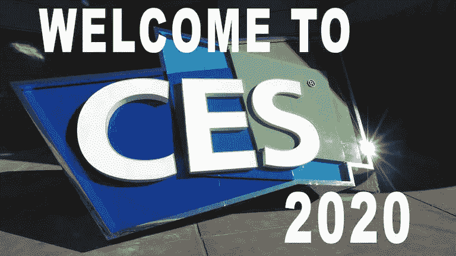

似乎在过去的几年里，сES 展览已经用我们能感到惊讶的一切让我们感到惊讶。但是没有！

会飞的汽车，就像电影《回到未来》里那样？这样的概念已经被许多人反复证明过。此外，优步非常认真地谈论了他们在 2016 年在这一领域的计划，即优步高架项目。这些机器的首次测试将于 2020 年开始，他们计划于 2023 年在达拉斯和洛杉矶投入运营。

 [## 人工智能和虚拟现实的融合-你能期待什么|数据驱动的投资者

### 在技术领域，融合是合乎逻辑的一步。就在几十年前，你可能需要一个专门的…

www.datadriveninvestor.com](https://www.datadriveninvestor.com/2018/08/30/the-convergence-of-ai-rv-what-you-can-expect/) 

# 自动驾驶仪

在今年 1 月 7 日的 CES 大会上，现代决定展示这样的发展并不陌生，并描绘了他们的未来愿景。为了了解这个问题的细节和许多公司的做法，我们会说它甚至不是一个原型，它只是图纸，以及未来可能会或可能不会成为现实的模型。到目前为止，这只是展示技术，仅此而已,“技术”这个词在这里值得一读，带有一丝讽刺意味。这些只是草图，而不是将投入使用的真正原型。
这个课题的所有发展都有很多共同点:这是垂直起降的电动交通工具，计划飞行高度在城市上空 500-700 米，时速可达 300 公里，距离约 300 公里。事实上，它是避免城市交通堵塞的快速交通工具。与现有直升机的根本区别是，将有更多的降落地点，但首先，有可能使用直升机停机坪。与相同的直升机相比，这种飞行的成本不会很高，它们很可能是供 4-5 人乘坐的小型固定路线出租车。

现代公司展示的这个项目是在优步服务下开发的。甚至提供了一个为汽车服务的城市车站。你可以在“现代的未来移动愿景”图片中看到这个计划。你可以在官方[现代博客](https://www.hyundai.news/eu/brand/hyundai-unveils-human-centered-future-mobility-vision-at-ces-2020/)上获得更多细节。

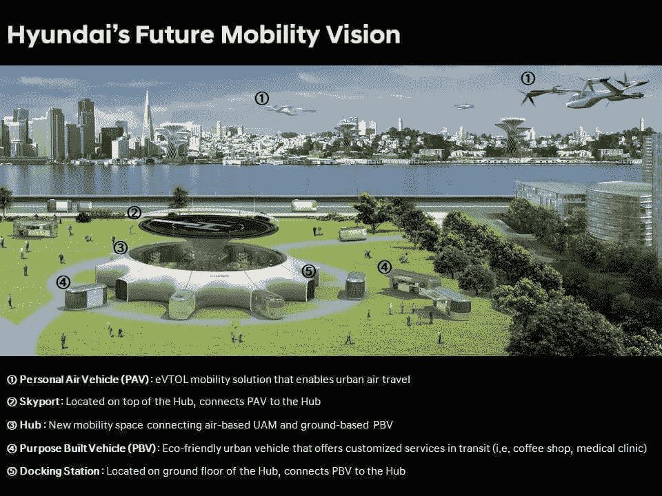

但这仍然只是一个项目，仅此而已。当我们在实践中看到类似的东西时，很难说清楚。从逻辑上讲，这种交通工具应该是自动驾驶出现在大国所有道路之后的下一个里程碑。这一点经常被遗忘，因为在人们看来，他们只需要创造技术，监管机构会很乐意允许这种机器出现在道路上。在 2020 年 CES 的第一天，许多公司都专注于降低自动驾驶所需组件的成本，从相机到激光雷达。例如，中国 DJI 展示了它在这方面的成就，令人印象深刻。Livox 的一家子公司建造了可以扫描 500 米空间的传感器，这超出了人眼的范围。但新的发展更简单，它是常规激光雷达的替代品。DJI 的解决方案工作距离高达 260 米，扫描 4 个波段，比今天使用的标准激光雷达快得多。价格的问题呢？这是最有趣的——它是当前具有类似功能的激光雷达成本的 5%。这是他们想展示给我们的维度。行业进入了准备提供廉价和高质量解决方案的时刻。许多公司都参与到这场竞赛中来，突破已经为期不远了。在接下来的几年里，自动驾驶仪部件的成本会显著降低，但这并不意味着自动驾驶仪本身的成本会普遍降低。它将允许在机器上安装大量的传感器，使它们更加安全。

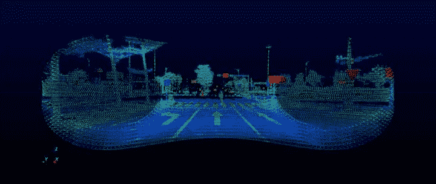

值得指出的是，激光雷达是由许多公司开发的。例如，博世在 CES 上展示了它的激光雷达版本。除了一个响亮的声明，它将比当前系统的成本低几倍之外，没有提到具体的成本。您可以在[博世官网](https://www.bosch-presse.de/pressportal/de/en/safety-to-the-power-of-three-bosch-completes-sensor-portfolio-for-automated-driving-205440.html)上查看更多详情。

有趣的是，埃隆·马斯克是激光雷达的一贯反对者。特斯拉使用雷达和摄像头，这限制了汽车的能力和未来自动驾驶的质量。如果马斯克的做法不改变，那么明年特斯拉的自动驾驶将落后于市场。今年激光雷达的特点非常惊人，可以降低负责自动驾驶的计算机的成本。他们有更多的时间来分析道路，因为他们从远距离读取信息。而这也是技术成本的降低。

继续汽车的主题，我们不能不说是什么让大家感到惊讶——索尼汽车的发布，即使它只是一个概念。这款轿车的名称是[索尼视觉 S](https://www.sony.net/SonyInfo/vision-s/) ，旨在展示该公司的技术、内饰设计和各种传感器。这是一种由日本品牌的工程师和设计师设计的轮子上的实验室。

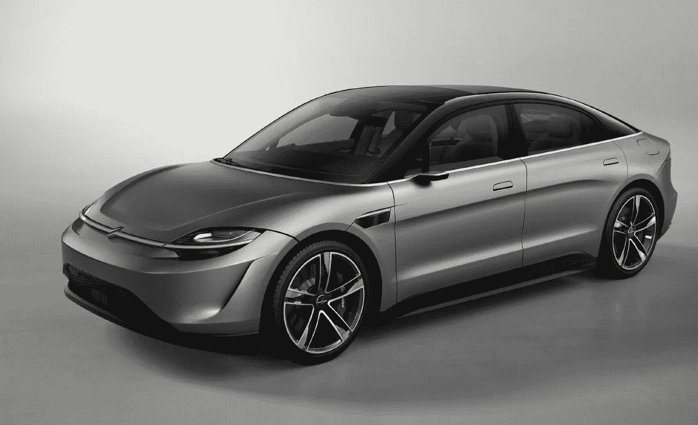

你猜怎么着？结果对索尼来说挺有意思的，看看车的照片。

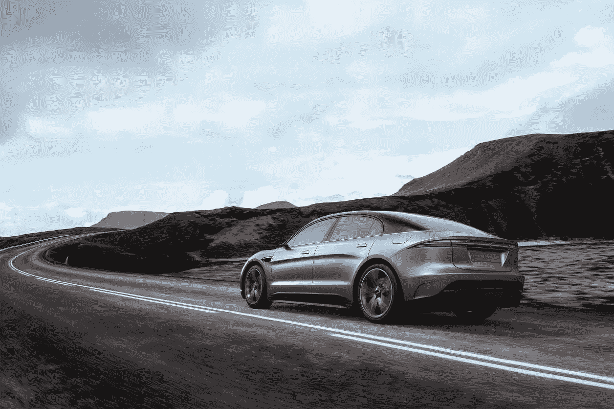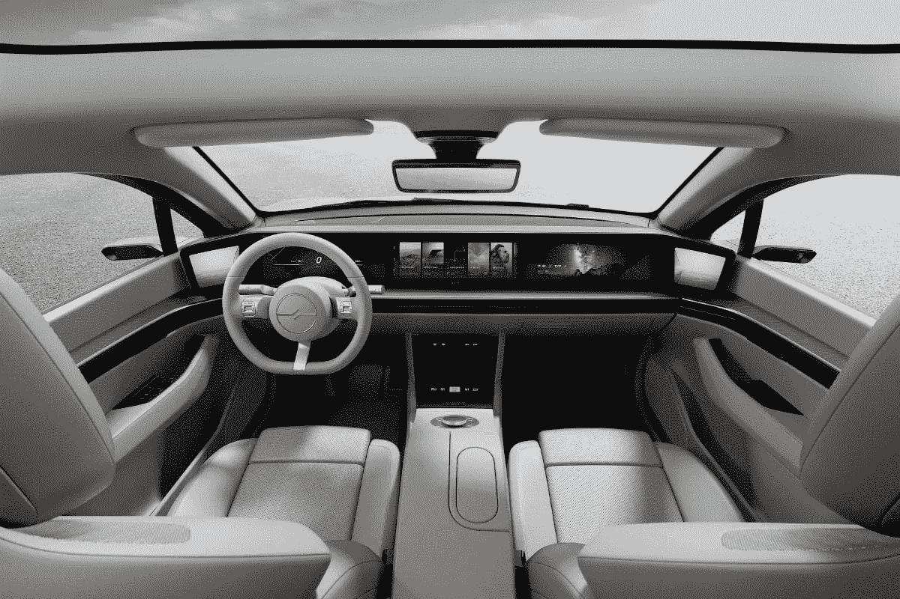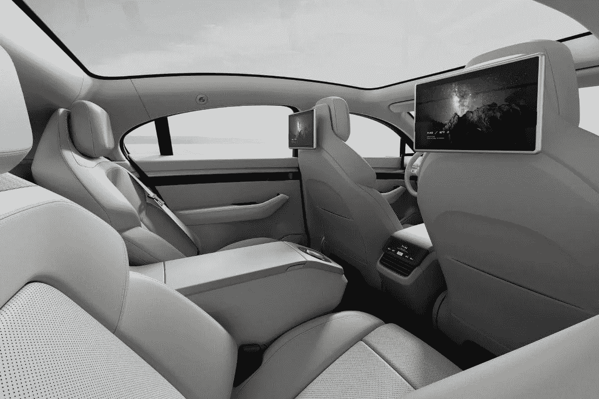

我们不知道你，但这款车让我们感到惊讶，这种惊讶的原因是大公司今天可以投资创造自己的汽车。这项技术已经变得更加容易获得。另一方面，拥有资源和适当组织工作的能力的公司可以完成这项任务。很明显，索尼雇佣了专家，他们并没有从零开始构建他们的概念。但事实本身就很神奇，不是吗？

# 个人是宇宙的中心。设备是为人服务的，而不是相反。

你永远不会指望大公司的战略会有大的转变，但在三星的 CES 开幕式上，有人说，这个人和他们经历的应该是这十年的焦点。如果一块好的铁没有引起任何感觉，只是完成它的工作，那么它是不够的。它应该成为一个人的生活方式，给他们情感。听起来模糊？
但是演讲者一遍又一遍地重复——地球上的城市人口正在增加，如果今天几乎一半的人生活在城市，那么在 2050 年这将是 68%的人。公寓不仅仅是变成你的个人空间，你可以在这里做饭、睡觉、娱乐、运动、抚养孩子，甚至还可以组织一些小生意。我们的住房发生的变化没有被注意到，而我们使用的技术还没有考虑到这种变化。它在意识形态上落后于新人类的需求。
看小 Ballie 机器人，应该会成为你的居家好帮手。这非常让人想起星球大战中的机器人，机器人 BB-8。

不值得非常认真地对待这一发展，这是对未来的挑战。这样的机器人可以成为你在房子里的“手”，控制各种设备，保证安全。最主要的是，它是移动的，可以在你家周围移动，有条件地“看到”某些情况，并发送其他设备来纠正它们。
但三星和该行业的战略发展方向是创造能够帮助你、训练你并在你身边的虚拟助手。
数字化身是所有系统的未来。三星展示了一些 AR 眼镜，它们的特点和想法类似于微软的 Hololens。你看到一个助手，可以从事体育运动，如果你使用额外的设备，他们会告诉你如何正确地做每件事。

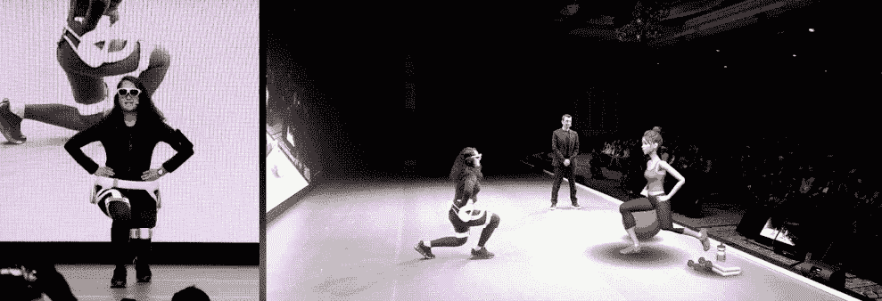

最近我们经常听到的 VR 或 AR 正在消亡的说法是一种过于基本的观点。这些技术的应用将被发现，并被广泛使用。例如，我们看到了虚拟现实如何让几乎完全丧失视力的人看到东西。这个孩子看到了他的母亲，这引起了一阵激动。这就是三星试图寻找的——与科技相关的情感。这听起来很老套，因为许多人已经尝试并正在尝试这样做，但这里的方法是系统的。这家庞大的公司已经朝着这个方向发展，它正在努力实现自己的愿景。

# 笔记本电脑领域的创新

戴尔在 CES 2020 上也给了我们惊喜。他们展示了 Dell Duet 双屏笔记本电脑、概念 Ori 折叠屏电脑，以及“世界上最无边框”的 XPS 13 和 Latitude 9510，采用 2 合 1 格式，电池续航时间为 30 小时。

*   XPS 13

戴尔最小的 13 英寸超极本变得更加无边框:尺寸缩小了 2%，屏幕增加到 13.4 英寸，变得更加“方形”:16:10 的宽高比传统的 16: 9 更适合工作。

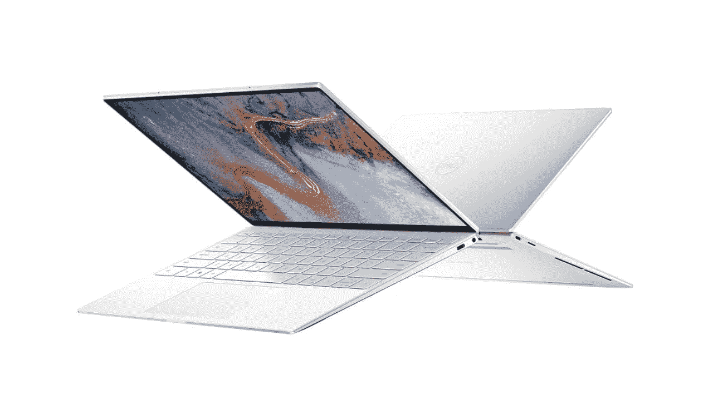

该笔记本电脑运行英特尔第十代 Ice Lake 处理器，即酷睿 i3、i5 或 i7。RAM 可以从 4 到 16 GB，SSD 可以从 128 GB 到 2 TB，单次充电的电池寿命增加到 19 小时。该公司的特色是与智能手机的快速连接。Dell Connect 允许一键式传输媒体文件、照片，并支持计算机和手机之间的其他同步方法。

*   纬度 9510

旗舰笔记本电脑以 2 合 1 的形式呈现，它可以 360 度转换，变成 15 英寸的平板电脑。戴尔承诺笔记本电脑单次充电可自主运行长达 30 小时:是企业用户的完美选择。

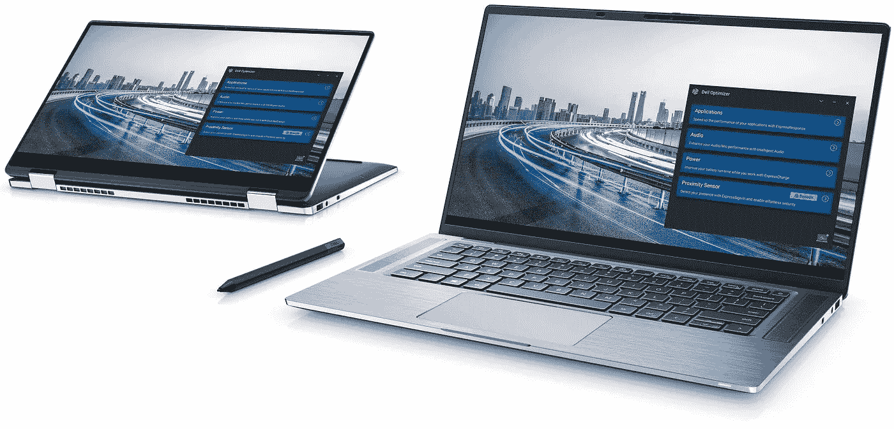

第二个特点，除了工作时间，就是人工智能。人工智能算法将允许你调整工作场景以节省能源，或者在使用某些应用程序时调整声音和屏幕设置。人工智能技术的结合将有助于改善用户体验:计算机将工作得更快、更久、更安全。

*   外星人 25

刷新率为 240 Hz，响应时间小于 1 ms 的游戏显示器是 25 英寸 IPS 矩阵，具有全高清分辨率和 16: 9 的标准纵横比。它支持 NVIDIA G-Sync 和 AMD FreeSync 垂直同步和图像优化技术。

*   概念

在展览会上，戴尔展示了两种未来计算机的概念。Concept Ori 收到了一个 13 英寸的显示器，可以对半弯曲。你可以像使用普通平板电脑一样使用它，或者将其对折，像笔记本电脑一样使用它来处理文档或输入文本。当笔记本电脑折叠时，它占用的空间最小。

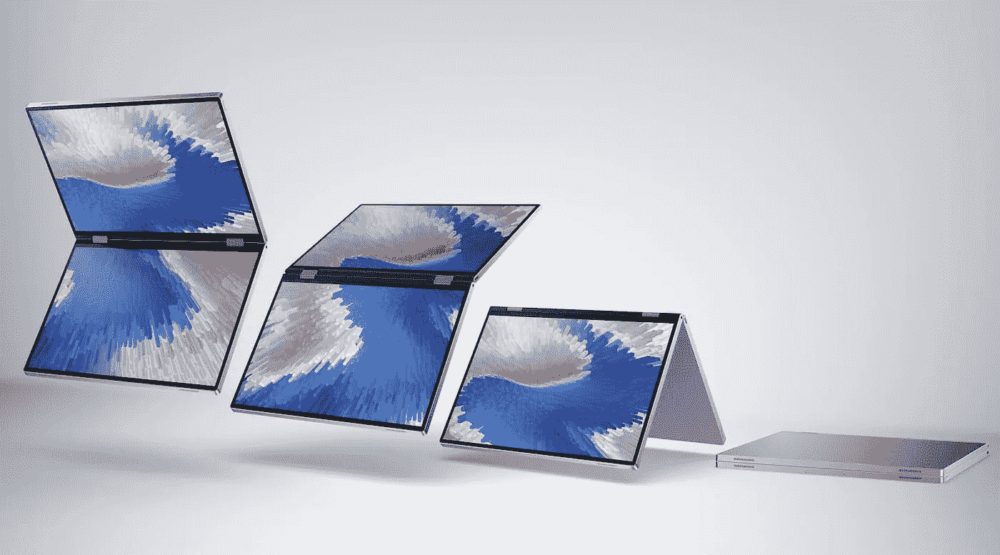

第二个 Concept Duet 在概念上与 Ori 类似，只是这一个有两个 13.4 英寸的触摸显示屏。它几乎是一台笔记本电脑，但不是通常的物理键盘，而是另一个屏幕。它还可以在多种模式下使用，例如，作为平板电脑同时在两个窗口中工作，或者作为笔记本电脑使用。只有使用键盘才能打开额外的窗口或菜单进行快速控制。

不可能把一天内发生的所有事情都挤进文章的小格式里。演讲内容包括 AI、以人为本、5G 等很多我们耳熟能详的词汇。但没有质的突破，从第一天开始就有一定的回味——有很多产品延续了早先奠定的趋势，太多不同准备状态的概念和原型，好像真正的产品已经结束了，你需要展示一些来自遥远未来的东西。而这些技术在未来一两年内大部分都不会出现在我们手里，根本起不到作用。这种与现实的分离开始增长，他们试图用尚不存在的东西来迷惑我们。有可能这是正确的，这种做法有生命权。但在我们看来，这里的平衡一如既往地重要，而我们在第一天根本没有注意到这一点。

*最初发表于*[*【https://geniusee.com】*](https://geniusee.com/single-blog/interesting-innovations-from-ces-2020)*。*