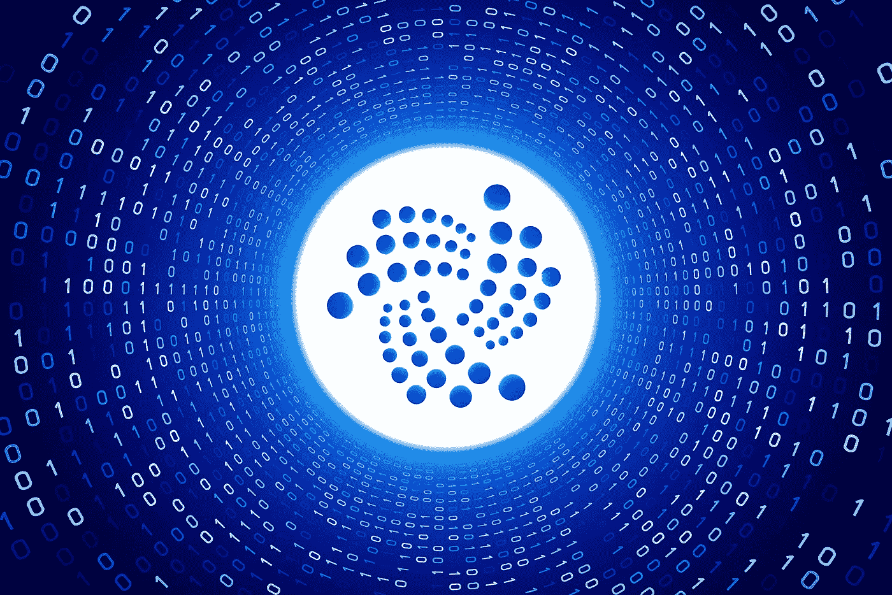

# Iota 和潘托斯的有趣更新

> 原文：<https://medium.datadriveninvestor.com/interesting-update-at-iota-and-pantos-8b70ec88501f?source=collection_archive---------19----------------------->

IOTA 与奥地利联邦 DLT 与物联网促进部合作

IOTA 与潘托斯和奥地利联邦部合作，旨在促进区块链和 DLT 在一个新的研究实验室内的互操作性。

以此，IOTA 发出信号，IoT 仍然是其优先考虑的问题之一，而其完整的协议更新越来越近。

# IOTA 支持区块链和物联网发展

在 2020 年 11 月 26 日发布的新闻稿中，由 Bitpanda 支持的潘托斯项目和 IOTA 与奥地利联邦数字和经济事务部合作，推出了新的克里斯琴·多普勒物联网区块链技术实验室(CDL-BOT)。

新的克里斯琴·多普勒实验室于 11 月 26 日星期四在维也纳由 Stefan Schulte 教授正式揭幕。Schulte 本人来自维也纳大学信息系统工程研究所。

据报道，新实验室将专注于区块链和物联网技术界面的研究活动。该设施的研究人员将寻求在分布式账本技术(DLT)协议和物联网应用之间实现稳健高效的互操作性的方法。

 [## IOTA 的突破是伴随 Coordicide 而来的吗？

### IOTA 技术不是基于“传统的”区块链，而是基于一种新的分布式账本技术(DLT)…

medium.com](https://medium.com/coinmonks/is-iotas-breakthrough-coming-with-coordicide-2532cfad295b) 

# 随着全面协议更新的临近，物联网仍是焦点

区块链和物联网技术都被认为是一些更重要的新技术。它们旨在推动第四次工业革命的实现。作为几项创新努力的一部分，科学家们正试图利用大数据和机器学习将世界转变为一个完全实现的数字空间。

 [## 供应链:物联网如何传递真相|数据驱动的投资者

### 现代供应链行业依靠一套极其强大的工具来满足客户需求…

www.datadriveninvestor.com](https://www.datadriveninvestor.com/2020/07/20/supp-lie-chain-how-iot-is-delivering-truth/) 

根据 IOTA 的博客帖子，IOTA 基金会董事会的联合创始人兼联合主席张秀坤·希内尔评论了最新的发展。席纳声明的一部分写道。

我们将与世界领先的学术机构维也纳大学和作为领先技术提供商的潘托斯大学合作，专注于数字资产的互操作传输和值得信赖的物联网，同时扩大我们的业务，尤其是在奥地利。

物联网仍然是 IOTA 的重点，即使它正在走向即将到来的全面协议更新。10 月，DLT 项目宣布了 IOTA streams 的最终 alpha 版本，该版本将用于促进物联网生态系统的无缝数据传输。

IOTA 基金会继续为其从协调员到协调员的转变奠定基础。通过这一步，网络将完全分散。根据 11 月的更新，IOTA 宣布其蛹第二阶段正在稳步前进。11 月份的一份早期更新强调了在实施花粉检测网络等领域的进展报告。

 [## IOTA 课程分析:IOTA 会倒在 BTC 吗？

### 看看我们的新平台:https://thecapital.io/

medium.com](https://medium.com/the-capital/iota-course-analysis-will-iota-fall-over-btc-f0438632c246) 

除了 IOTA 2.0，IOTA 还在多个行业和国家实施。例如，10 月，IOTA 的 Tangle 技术被台湾国立高雄大学的三名研究人员采用，以开发 BitTorrent 的改进版本。

我在每月的[时事通讯中分享了更多私密的想法，你可以在这里查看](https://mailchi.mp/bf8f8e8ed697/keep-in-touch-with-lukas)。请在评论中告诉我，并在各种社交媒体平台上加入我:

[推特](https://twitter.com/WiesfleckerL) ● [Instagram](https://www.instagram.com/lukaswiesflecker/) ● [脸书](https://www.facebook.com/lukaswiesfleckerr)●[Snapchat](https://www.snapchat.com/add/luggooo)●[LinkedIn](https://www.linkedin.com/in/lukas-wiesflecker-1b11251a5/)

无论你做什么，都要带着爱和激情去做！

## 访问专家视图— [订阅 DDI 英特尔](https://datadriveninvestor.com/ddi-intel)