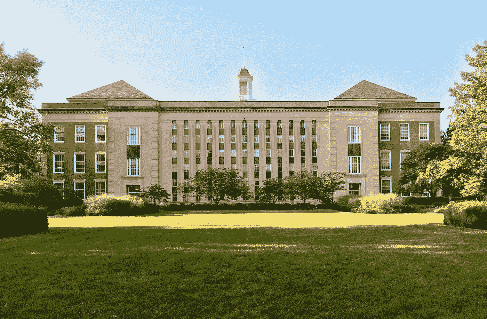

# 国际学生和 ICE:扼杀美国高校的摇钱树

> 原文：<https://medium.datadriveninvestor.com/international-students-and-ice-killing-the-cash-cow-for-americas-colleges-and-universities-21eba640f609?source=collection_archive---------5----------------------->

## 特朗普政府最近决定不允许外国学生留在美国参加在线课程，这将如何极大地影响美国高等教育

Photo by [Wes Hicks](https://unsplash.com/@sickhews?utm_source=medium&utm_medium=referral) on [Unsplash](https://unsplash.com?utm_source=medium&utm_medium=referral)

我们知道今天美国的一切似乎都在政治上两极分化。是的，我们现在知道，即使是疫情——一个多世纪以来世界上最大的健康危机——在美国也有了政治层面的影响。我们知道，在冠状病毒的几乎每个方面，从媒体对病例数“真正”意味着什么的报道，到重新开放经济的各个部分，再到戴上口罩，即使是可以被科学验证的事情，也常常被视为非常非常不同，这取决于你是“红队”还是“蓝队”然而，随着[新冠肺炎疫情](https://www.who.int/emergencies/diseases/novel-coronavirus-2019)在美国的恶化，我们现在似乎都知道冠状病毒袭击了某人或至少某个家庭。这使得疫情对我们整个社会来说都太真实了。

Photo by [Michael Marsh](https://unsplash.com/@muskratmike?utm_source=medium&utm_medium=referral) on [Unsplash](https://unsplash.com?utm_source=medium&utm_medium=referral)

冠状病毒的影响将以一种截然不同的方式冲击我们高等教育界的所有人。在过去的几周里，随着秋季学期和新学年的开始，所有大学教职员工和学生都在思考一个问题:“*我们这个秋季要做什么？*

虽然已经有一些学校宣布了他们秋季学期的计划(哈佛大学、耶鲁大学、罗格斯大学、南加州大学等将在秋季主要采用在线教学)，但更多机构的管理人员一直等到最后一刻才宣布他们的计划。而这种“等待游戏”目前确实不能被批判。这是因为正如我们从疫情开始以来所看到的，在过去的几个月里，出现了令人惊讶的事态发展，迫使即使是最好的计划也发生了变化！

现在，那些有“总统”或“财政大臣”头衔的人在全国各地的学院和大学里肯定能拿到高薪。然而，在当前的危机中，他们将会赚到丰厚薪酬的每一分钱。这是因为这数百名个人面临着可能是他们各自机构历史上最重要的决定——这些决定实际上是“生死”级的决定——对他们所有的学生和大学员工来说都是如此，对机构本身来说也是如此。他们所有决定的关键可以归结为三个选择:

1.  大学是否应该要求学生和教职员工在采取一些安全和社会距离措施的情况下进行面对面的教学？；
2.  大学应该使用在线和面对面教学的混合模式(所谓的“ [Hyflex](https://library.educause.edu/resources/2010/11/7-things-you-should-know-about-the-hyflex-course-model) ”解决方案)吗——谷歌一下，因为这已经成为当今高等教育的一个时髦词！)?；或者
3.  大学应该继续春季学期开始的工作，向所有课程——或者几乎所有课程——的在线教学转变吗？

 [## 空调是阿喀琉斯之踵，可能会削弱所有组织的重新开放计划

### 空气中弥漫着一种看不见的威胁，最近的证据显示，这种威胁很可能会引发严重且非常危险的后果…

medium.com](https://medium.com/the-kickstarter/air-conditioning-is-the-achilles-heel-possibly-undercutting-all-organizations-reopening-plans-7c27643fa3dc) 

然而，对于学院和大学在秋季学期如何开学以及开学时间有多长的问题，又增加了一个新的层面。这是政治压力的结果，要求在更“正常”的基础上重新开放学校——从 K-12 学校到高等教育的所有级别——至少有一些 F2F(面对面)教学。是的，这种政治压力来自最高层——T2 总统唐纳德·川普。2020 年 7 月 6 日，总统在推特上写道:

这种压力对州一级教育政策产生影响的一个主要例子是，在同一天，在州长罗恩·德桑蒂斯的命令下，[佛罗里达州教育部](http://www.fldoe.org/)[宣布了一项指令](http://www.fldoe.org/core/fileparse.php/19861/urlt/2020-EO-06-SlideDeck.pdf)，要求他所在州的所有小学和中学[必须在今年秋天](https://www.news4jax.com/news/local/2020/07/06/florida-education-commissioner-mandates-all-schools-must-reopen-campuses-in-fall/)重新开放面授课程(同样，我们已经看到[得克萨斯州的一项类似指令](https://www.texastribune.org/2020/07/07/masks-mandatory-texas-schools/)要求 K-12 学校“定期”重新开放)。对于高等教育来说，联邦政府在一项政策举措中明确表示，尽管主要机构已经做出选择，不再在秋季进行面对面的教学——许多其他机构也可能遵循这一道路，尽管政府不能“强制要求”大学课堂面授，但它有一项政策举措——实际上——几乎可以做到这一点。是的，就在同一天，2020 年 7 月 6 日，美国移民和海关执法局宣布对学生和交流访问者项目(SEVP)进行全面改革，这将影响成千上万在美国学习的外国本科生和研究生

> 美国国务院不会向秋季学期完全在线的学校和/或项目的注册学生发放签证，美国海关和边境保护局也不会允许这些学生进入美国。目前在美国参加此类项目的活跃学生必须离开美国或采取其他措施，如转到有面授指导的学校，以保持合法身份。否则，他们可能面临移民后果，包括但不限于启动驱逐程序。”— [*美国移民和海关执法局*](https://www.ice.gov/) *、* [*SEVP 修改 2020 年秋季学期期间参加在线课程的非移民学生的临时豁免*](https://www.ice.gov/news/releases/sevp-modifies-temporary-exemptions-nonimmigrant-students-taking-online-courses-during) *、【2020 年 7 月 6 日。*

从本质上讲，ICE 的指令将意味着其机构转向在线教学的外国学生将被迫回到他们的祖国参加他们的在线课程——这一举动立即引起了尖锐的批评，并在高等教育领域和国际学生中引起了混乱，他们将直接受到 ICE 政策变化的影响。

现在可以肯定的是，这是一个快速发展的情况，而且很有可能，即使学生签证计划的变化立即生效，也很可能会有许多法院对新规则的挑战，这些规则可能会阻止它们在秋季学期生效，更不用说强制执行了(哈佛已经提起诉讼以阻止 ICE 的行动)。尽管如此，这是一个极其严重的情况，因为拟议的签证变化将美国大学数十万外国学生的生活抛入不确定之中。

Photo by [Nathan Dumlao](https://unsplash.com/@nate_dumlao?utm_source=medium&utm_medium=referral) on [Unsplash](https://unsplash.com?utm_source=medium&utm_medium=referral)

# 分析

作为一名在学术界“内部”拥有多年经验的管理顾问和教授，有一件事我可以绝对肯定地告诉你:高等教育行业的领导层将会有巨大的阻力来推翻或修改 ICE 的决定。虽然是的，一些大学校长和董事会可能出于人道主义考虑，被他们的“更好的天使”所激励，为他们的国际学生说话，但主要的动力来自今天的大学经济学。这是因为 ICE 行动对全国各地的机构财务来说是一个潜在的毁灭性“身体打击”，大学面临不确定的收入流(来自住房、体育、学生费用等)，以及新的安全协议和流程导致的运营成本增加。为什么从美国学校流失一些——或者甚至相当一部分外国学生——会是如此严重的损失？这是因为人们可以合理地争辩说，近年来，国际学生已经成为学院和大学最好的——实际上是*最重要的“顾客”。*

我们国家在过去几年中产生的所有负面宣传，不仅来自我们的政治，还来自大规模枪击事件、警察暴力、贸易紧张局势等。甚至在疫情之前，美国就被认为是[导致赴美外国游客数量下降的主要因素。然而，一个持续增长的领域是来美国学习的外国学生，2019 年总数达到近 110 万人，这得益于美国高等教育“品牌”的实力。总的来说，今天的国际学生占美国高校总入学人数的 5.5%，他们为美国经济贡献了近 450 亿美元。](https://www.usatoday.com/story/money/2019/08/09/travel-international-visits-u-s-forecast-keep-falling/1942922001/)

然而，尽管外国学生只占学生总数的一小部分，但他们确实是当今高校管理中的一个关键因素。这是因为一个简单的统计数据。想想今天的公立大学，国际学生占学生总数的 12%，但他们贡献了这些机构总学费收入的近 30%。外国学生也被私立大学所吸引——尤其是顶尖的“名牌”学校。由于国际学生比国内学生更经常支付全额学费，他们对这些机构的收入构成也做出了不成比例的贡献。

Photo by [Frank Busch](https://unsplash.com/@frankbusch?utm_source=medium&utm_medium=referral) on [Unsplash](https://unsplash.com?utm_source=medium&utm_medium=referral)

学术界保守得很少的秘密是，在过去的十多年里，学杂费的上涨速度远远超过了通货膨胀的速度，对于国际学生来说，上涨的速度甚至更快。事实上，一些大学和整个公立大学系统甚至已经超出了向非本州学生收取国际学生费用的范围，[实施特殊定价](https://www.acenet.edu/Documents/International-Student-Funding.pdf)——对国际学生征收差异化的学费、附加费、费用等(T4 在《高等教育》杂志中戏称为“因是外国人而收取的[费用](https://www.insidehighered.com/news/2015/05/08/some-public-universities-are-charging-differentiated-tuition-rates-or-raising-fees)”)。因此，随着外国学生的增长，至少到目前为止，以及他们愿意为他们的美国教育支付高价，这些国际学生已经成为当今高等教育预算中的一棵“摇钱树”。实际上，国际学生已经成为一种可靠的方式来“补贴”国内学生的低成本教育。

这就是为什么我看到所有高等教育的领导人，以及他们的游说部门——并且*不低估华盛顿的学院和大学的影响，无论是个人还是集体——竭尽全力试图对 ICE 的命令进行重大修改，如果不是逆转的话。我认为高等教育的领导者会出于对国际学生的兴趣而这样做。外国学生对今天的大学环境做出了如此重大的贡献。由于疫情不是任何人的错(答案是，嗯，那是另一个问题……)，很难看出惩罚国际学生并强迫他们回到自己的国家(对他们的健康、福利、互联网连接等不太确定)有什么逻辑。).尽管如此，由于目前许多紧迫的公共政策、公共健康和经济问题都在发挥作用，这一机构指令可能会逃脱媒体应有的关注。*

如果这一行动被允许，我担心美国高等教育的未来。这是一种威胁存在。从短期来看，国际学生收入的损失对许多大学的预算来说确实是毁灭性的，这些大学甚至在 ICE 行动之前就已经陷入了困境。从长远来看，我担心美国高等教育的品牌将受到不可挽回的损害，因为对于许多世界上最优秀和最聪明的人来说，美国将只是“从地图上消失”，因为他们正在考虑如何进一步发展他们的教育和职业生涯。可能没有办法克服美国高等教育最终将面临的信心和信任的丧失。

所以，现在是行动的时候了。希望随着社交媒体上的抗议以及国会和特朗普政府面临的压力，采取行动扭转——或严重修改——这一行动。此外，由于这一决定可能对州立大学系统的预算产生影响，人们可以预期州长和其他州级领导人会反对 ICE 指令。教师们已经在代表他们的国际学生，是的，代表他们的机构大声疾呼。同样，“大学城”的领导人和普通市民也在大声疾呼，在那里，外国学生的流失和他们的支出可能会造成真正的负面经济影响。

事实上，这不仅仅是外国学生的问题，不可否认，他们背后没有强大的游说力量。相反，这是一个威胁到你自己孩子和你最喜欢的学院或大学的未来的问题。许多机构的经济活力和存在可能在很大程度上取决于来自遥远国度的学生的持续存在和参与，他们已经成为美国学院和大学的“摇钱树”。因此，红色、蓝色或紫色，这似乎是一个所有美国人在这个高度紧张、非常时期能够——也应该——达成一致的问题。

# **和我一起在媒体上写作**

想开始自己的写作之旅吗？想通过发布自己创作的文章来更好地建立个人品牌？考虑今天和我一起在媒体上写作，并使用这个链接:【https://davidwyld.medium.com/membership[。这样做，你将帮助支持我的写作，因为我收到你的媒介会员费的一部分。](https://davidwyld.medium.com/membership)

 [## 通过我的推荐链接加入媒体-大卫·怀尔德

### 作为一个媒体会员，你的会员费的一部分会给你阅读的作家，你可以完全接触到每一个故事…

davidwyld.medium.com](https://davidwyld.medium.com/membership) 

# 关于大卫·怀尔德

大卫·怀尔德([dwyld@selu.edu](http://dwyld@selu.edu/))是路易斯安那州哈蒙德市[东南路易斯安那大学](https://www.southeastern.edu/)的战略管理教授。他是管理顾问、研究员/作家、出版商、执行教育家和经验丰富的专家证人。

**大卫·怀尔德的社交媒体链接:**

*   上[脸书](https://www.facebook.com/david.wyld)
*   上 [LinkedIn](https://www.linkedin.com/in/david-wyld-4923707/)
*   在[推特上](https://twitter.com/GoodAdvicePub)