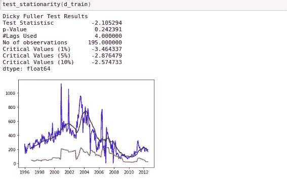

# 时间序列分析的迪基富勒检验结果解释。

> 原文：<https://medium.datadriveninvestor.com/interpreting-results-of-dicky-fuller-test-for-time-series-analysis-4bb1e98f242b?source=collection_archive---------1----------------------->

这个小故事解释了我们如何解释 dicky fuller 测试的结果，以了解时间序列数据的平稳性。

> 谷歌
> 
> 以美国统计学家大卫**迪基**和韦恩**富勒**的名字命名，他们在 1979 年开发了**测试，迪基** - **富勒测试**用于确定单位根**是否存在于自回归模型中**。

考虑一个时间序列数据，它只随时间而变化。因此，为了预测一个时间序列数据，有不同的模型是流行的时间序列分析。

1.  自回归
2.  移动平均数
3.  ARIMA

其中 ARIMA 模型是自回归、积分和移动平均的结合。

 [## 机器学习的外汇交易挑战|数据驱动的投资者

### 机器学习是人工智能的一个分支，之前占据了很多头条。人们是…

www.datadriveninvestor.com](https://www.datadriveninvestor.com/2019/02/18/the-challenge-of-forex-trading-for-machine-learning/) 

这是一个我用 ARIMA 模型预测的时间序列数据的例子。

Time Series Data

现在我必须验证平稳性，以便预测数据。

我写了一个函数来寻找两者都用的文具

1.  滚动平均值和标准差图表
2.  还有，迪奇·富勒测试

现在让我们看看迪基·富勒测试的验证结果。

Result of Dicky Fuller Test

从滚动平均值和标准差本身的图中，您可以了解到标准差和平均值变化相当高。

从迪基·富勒测试结果中也可以观察到一些解释

**ADF 检验中的零假设**是**数据不是平稳的**

1.  p 值最好小于 0.05，以便拒绝零假设，并认为数据是平稳的。

> 维基百科(一个基于 wiki 技术的多语言的百科全书协作计划ˌ也是一部用不同语言写成的网络百科全书ˌ 其目标及宗旨是为全人类提供自由的百科全书)ˌ开放性的百科全书
> 
> 在[统计假设检验](https://en.wikipedia.org/wiki/Statistical_hypothesis_testing)中，***p*-值**或**概率值**是在假设[零假设](https://en.wikipedia.org/wiki/Null_hypothesis)正确的情况下，获得至少与检验过程中实际观察到的[结果一样极端的检验结果的概率。](https://en.wikipedia.org/wiki/Realization_(probability))

1.  如果检验统计量< Critical Values =>拒绝零假设。
2.  如果检验统计>临界值= >无法拒绝零假设。

在我们的示例中，我们可以理解，我的测试统计值= -2.105294 大于临界值(5%) = -2.876479，因此数据不是稳定的。

现在我们必须转换数据，使数据更加稳定。

转换后的一个示例结果如下所示。

在这里，您可以评估小于临界值(5%)的检验统计量，并且 p 值远小于显著值 0.05%。从而拒绝零假设，并认为数据是稳定的。

使用 ARIMA 模型进行时间序列预测的完整代码可在 [GITHUB](https://github.com/raoofnaushad/ARIMA_SAMPLE) 中获得。

谢谢你看了我的故事。让我知道你的建议和改正。