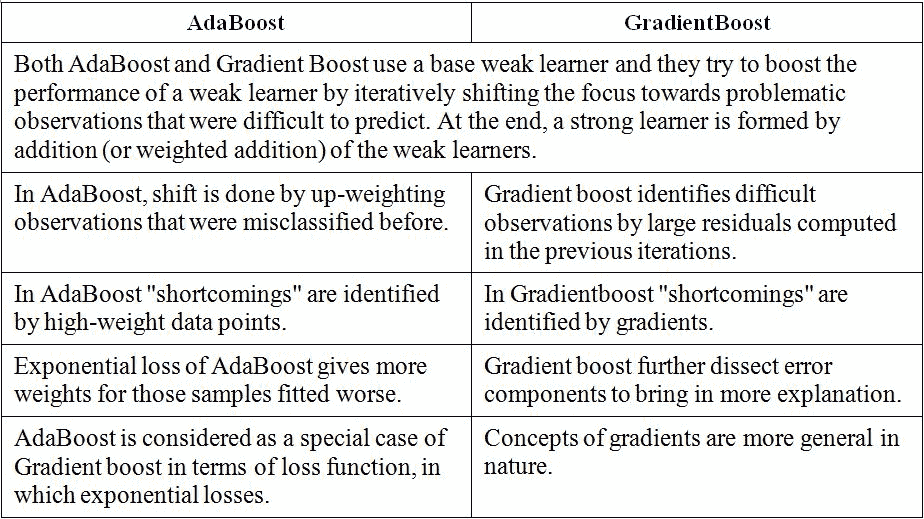

# 助推算法面试指南:第 1 部分

> 原文：<https://medium.datadriveninvestor.com/interview-guide-to-boosting-algorithms-part-1-133153714073?source=collection_archive---------3----------------------->

Photo by [Sebastian Herrmann](https://unsplash.com/@officestock?utm_source=medium&utm_medium=referral) on [Unsplash](https://unsplash.com?utm_source=medium&utm_medium=referral)

首先，这里有几个问题可以激发你对这个特定领域兴趣。

# **问题:**

1.  **AdaBoost 是更不容易还是更容易过度拟合？**
2.  **关于过度合身有哪些误解？**
3.  **梯度提升和 AdaBoost 有什么区别？**
4.  **在什么情况/用例中，我们更喜欢 XGBoost 算法？**
5.  **boosting 算法在 AI/ML 的世界里适合什么位置？**

就看上面的问题，然后思考一分钟。

一直读到最后，你会自己找到答案。

Photo by [Gary Butterfield](https://unsplash.com/@garybpt?utm_source=medium&utm_medium=referral) on [Unsplash](https://unsplash.com?utm_source=medium&utm_medium=referral)

# 指导您阅读本文的目录:

*   **升压简介**
*   **弱可学性的强度**
*   **Boosting 算法的中心思想**
*   **AdaBoost 是更少还是更容易过拟合？**
*   **关于过度合身的一些误解**
*   **梯度提升和 AdaBoost 有什么区别？**

# **助推简介:**

Boosting 是一种提高任何给定学习算法准确性的通用方法。

# **弱可学性的强度:**

一个概念类是可学习的(或强可学习的),如果给定对未知概念的实例源的访问，学习者能够以很高的概率输出除了任意小部分实例之外对所有实例都是正确的假设。

如果学习者能够提出一个仅比随机猜测稍好一点的假设，那么这个概念类就是弱可学的。

Photo by [Priscilla Du Preez](https://unsplash.com/@priscilladupreez?utm_source=medium&utm_medium=referral) on [Unsplash](https://unsplash.com?utm_source=medium&utm_medium=referral)

# **PAC 学习:**

一个概念类是 PAC 可学习的要求是非常严格的。

学习算法必须适用于类中的所有目标概念、所有输入分布以及精度和置信度(δ)参数的任何设置。

 [## 人工智能和监督资本主义|数据驱动的投资者

### 大科技，总是现在:人工智能推动的大科技，已经使购物，搜索，在你的…

www.datadriveninvestor.com](https://www.datadriveninvestor.com/2020/03/04/on-artificial-intelligence-and-surveillance-capitalism/) 

# **Boosting 算法的中心思想:**

推进方法的中心思想如下。

最初，我们可以使用弱学习算法，该算法给出的假设比随机猜测的性能稍好。

我们可以重复运行这个弱学习算法，尽管它可能返回相同的假设。

然而，如果我们修改分布，使得已经返回的假设不再有效，即，在新的分布下，它具有正好 1/2 的误差，那么弱学习算法需要为我们提供不同的假设。

Photo by [AbsolutVision](https://unsplash.com/@freegraphictoday?utm_source=medium&utm_medium=referral) on [Unsplash](https://unsplash.com?utm_source=medium&utm_medium=referral)

通过重复这样做，我们可以结合几个假设，产生一个误差较小的假设。

所有升压算法都利用这种高级方法。

# **AdaBoost 是更少还是更容易过拟合？**

在实际经验中，AdaBoost 对过拟合非常鲁棒，而 LPBoost(线性规划助推)更是如此(因为目标函数需要弱学习器的稀疏组合，这是一种能力控制的形式)。影响它的主要因素有:

*   “弱”学习器的“优势”:如果你使用非常简单的弱学习器，比如决策树桩(1 级决策树)，那么算法就不容易过度拟合。每当你尝试使用更复杂的弱学习器(如决策树或甚至超平面)时，你会发现过度拟合发生得更快。
*   数据中的噪声水平:AdaBoost 特别容易在噪声数据集上过度拟合。在这种设置中，正则化形式(RegBoost、AdaBoostReg、LPBoost、QPBoost)是优选的。
*   数据的维数:我们知道，一般来说，我们在高维空间中会经历更多的过拟合(“维数灾难”)，AdaBoost 在这方面也会受到影响，因为它只是分类器的线性组合，而分类器本身也会受到该问题的影响。是否和其他分类器一样倾向，很难确定。

Photo by [Glenn Carstens-Peters](https://unsplash.com/@glenncarstenspeters?utm_source=medium&utm_medium=referral) on [Unsplash](https://unsplash.com?utm_source=medium&utm_medium=referral)

*   当然，我们可以使用启发式方法，如验证集或 k-fold 交叉验证来设置停止参数(或不同变体中的其他参数)，就像您对任何其他分类器所做的那样。

# **关于过度合身的一些误解:**

就过拟合而言，AdaBoost 优于随机森林被错误地解释为。

事实上，根据理论(看 Breiman 的原始随机森林论文)，随机森林对过拟合是绝对免疫的，只要它的弱分类器不对数据过拟合。

# **渐变增强和 AdaBoost 有什么区别？**

*   两种方法都使用一组弱学习者。
*   他们试图把这些弱学习者变成强学习者。

Photo by [Kelly Sikkema](https://unsplash.com/@kellysikkema?utm_source=medium&utm_medium=referral) on [Unsplash](https://unsplash.com?utm_source=medium&utm_medium=referral)

*   梯度推进在学习过程中产生学习者。
*   它建立第一个学习器来预测样本的值/标签，并计算损失(第一个学习器的结果和真实值之间的差异)。
*   它将建立第二个学习器来预测第一步之后的损失。该步骤继续学习第三个、第四个…直到某个阈值。

*   AdaBoost 要求用户指定一组弱学习器(或者，它会在真正的学习过程之前随机生成一组弱学习器)。
*   它将学习如何添加这些学习者的权重，以成为一个强大的学习者。
*   每个学习器的权重是通过它对样本的预测是否正确来学习的。
*   如果一个学习者错误地预测了一个样本，那么这个学习者的权重就会降低一点。它将重复这样的过程，直到收敛。

请继续关注第二部分。继续读。

# 你的下一步是什么？

> 如果你喜欢这篇文章，点击下面的推荐会很有帮助！
> 关注我上 [*推特*](https://twitter.com/imPraveenPareek) *，*[*LinkedIn*](https://www.linkedin.com/in/praveenpareek/)*，* [*中*](https://medium.com/@praveen.pareek)
> 
> ***看我以前的帖子:*** [***变分自动编码器:Part-1***](https://medium.com/datadriveninvestor/variational-autoencoders-part-1-368bbc3d8aa)

 [## 可变自动编码器:第 1 部分

### 它们已经成为复杂分布的无监督学习的最流行的方法之一。他们尝试…

medium.com](https://medium.com/datadriveninvestor/variational-autoencoders-part-1-368bbc3d8aa) 

**访问专家视图—** [**订阅 DDI 英特尔**](https://datadriveninvestor.com/ddi-intel)