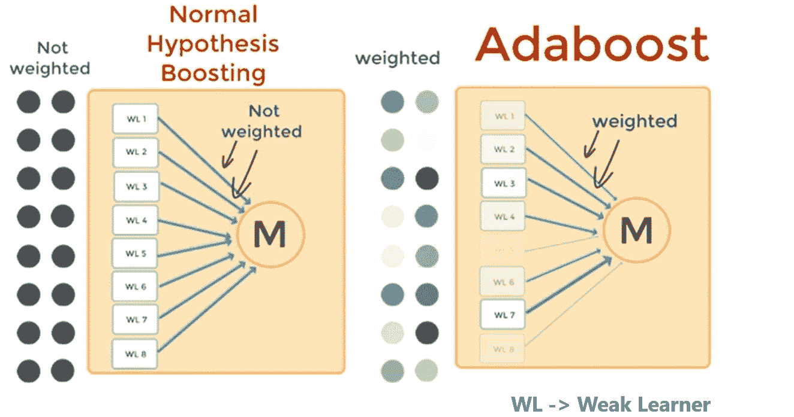

# 助推算法面试指南:第二部分

> 原文：<https://medium.datadriveninvestor.com/interview-guide-to-boosting-algorithms-part-2-c9778a242e85?source=collection_archive---------6----------------------->

Photo by [CoWomen](https://unsplash.com/@cowomen?utm_source=medium&utm_medium=referral) on [Unsplash](https://unsplash.com?utm_source=medium&utm_medium=referral)

指导您阅读本文的目录:

*   XGBoost:一个可扩展的树提升系统
*   关于 XGBoost 的更多信息
*   多方面的

# XGBoost:一个可扩展的树提升系统

机器学习和数据驱动的方法在许多领域变得非常重要。

*   智能垃圾邮件分类器通过从大量垃圾邮件数据和用户反馈中学习来保护我们的电子邮件
*   广告系统学会将正确的广告与正确的上下文相匹配
*   欺诈检测系统保护银行免受恶意攻击者的攻击
*   异常事件检测系统帮助实验物理学家发现导致新物理学的事件。

Photo by [Noble Mitchell](https://unsplash.com/@noble_m1tchell?utm_source=medium&utm_medium=referral) on [Unsplash](https://unsplash.com?utm_source=medium&utm_medium=referral)

推动这些成功应用的有两个重要因素:

> 使用捕获复杂数据依赖关系的有效(统计)模型和从大型数据集学习感兴趣模型的可扩展学习系统。

在实践中使用的机器学习方法中，梯度树提升是一种在许多应用中闪耀的技术。

注意:梯度树提升也称为梯度提升机器(GBM)或梯度提升回归树(GBRT)。

 [## 公平算法|数据驱动的投资者

### 许多人都有算法偏见。软件工程师关心算法偏差，因为我们关心…

www.datadriveninvestor.com](https://www.datadriveninvestor.com/2020/02/22/algorithms-for-fairness/) 

# 关于 XGBoost 的更多信息:

XGBoost 成功背后最重要的因素是它在所有场景中的可伸缩性。

该系统在单台机器上的运行速度比现有的流行解决方案快 10 倍以上，并且可以在分布式或内存有限的设置中扩展到数十亿个示例。

XGBoost 的可伸缩性得益于几个重要的系统和算法优化。

Photo by [Andy Kelly](https://unsplash.com/@askkell?utm_source=medium&utm_medium=referral) on [Unsplash](https://unsplash.com?utm_source=medium&utm_medium=referral)

这些创新包括:

*   一种新的树学习算法用于处理稀疏数据
*   理论上合理的加权分位数草图过程能够在近似树学习中处理实例权重。

并行和分布式计算加快了学习速度，从而加快了模型探索。更重要的是，XGBoost 利用了核外计算，使数据科学家能够在桌面上处理数亿个例子。

# 稀疏 BLAS CSC 矩阵存储格式:

[稀疏 BLAS CSC 矩阵存储格式](https://software.intel.com/content/www/us/en/develop/documentation/mkl-developer-reference-c/top/appendix-a-linear-solvers-basics/sparse-matrix-storage-formats/sparse-blas-csc-matrix-storage-format.html)

 [## 稀疏 BLAS CSC 格式

### MKL 通过数学例程来提高软件应用的性能，从而解决大型计算问题。

software.intel.com](https://software.intel.com/content/www/us/en/develop/documentation/mkl-developer-reference-c/top/appendix-a-linear-solvers-basics/sparse-matrix-storage-formats/sparse-blas-csc-matrix-storage-format.html) 

# 杂项:

# boosting 算法在 AI/ML 的世界中适合什么位置？

神经网络、逻辑回归、支持向量机，所有这些模型都回答了我们如何学习解决特定问题(以虹膜数据集、分类问题为例)。

Photo by [Brian Metzler](https://unsplash.com/@bmetzler2017?utm_source=medium&utm_medium=referral) on [Unsplash](https://unsplash.com?utm_source=medium&utm_medium=referral)

但在此之前应该问一个问题:**这个问题可解吗？**

**要回答这个问题:**我们用**的概念 PAC 学习。**

PAC 学习定量地定义了“问题是可解的/可学的吗？”

PAC:可能是大致正确的型号

Iris 数据集:使用逻辑回归→合理的低误差

这意味着对于这个特殊的问题，逻辑回归是一个强大的学习者。{如果它符合我们对阈值的定义，99%的性能(0.01 < 𝟄 with probability > 1-𝛅)}

对于更复杂的问题，强大的学习者需要更复杂{我们还需要更多的学习参数和更多的训练样本&我们可能还需要非常高的硬件要求}

Photo by [Kelly Sikkema](https://unsplash.com/@kellysikkema?utm_source=medium&utm_medium=referral) on [Unsplash](https://unsplash.com?utm_source=medium&utm_medium=referral)

如果我们没有上述情况，那么:

*   弱学习者来拯救。
*   弱学习者是比随机猜测表现稍好的算法。
*   如果一个问题能被学习能力强的人解决，那么学习能力差的人也应该能解决。
*   他们可以通过引入一种叫做助推机制的技术来实现。
*   构建多个模型，然后进行预测，然后我们以多数票通过。

# 你的下一步是什么？

> 如果你喜欢这篇文章，点击下面的推荐会很有帮助！
> 关注我上 [*推特*](https://twitter.com/imPraveenPareek) *，* [*领英*](https://www.linkedin.com/in/praveenpareek/) *，* [*中*](https://medium.com/@praveen.pareek)
> 
> ***看我之前的帖子:***[***Boosting 算法面试指南:Part-1***](https://medium.com/@praveen.pareek/interview-guide-to-boosting-algorithms-part-1-133153714073)

 [## 助推算法面试指南:第 1 部分

### Boosting 是一种提高任何给定学习算法准确性的通用方法。在这里我将讨论关于…

medium.com](https://medium.com/@praveen.pareek/interview-guide-to-boosting-algorithms-part-1-133153714073) 

**访问专家视图—** [**订阅 DDI 英特尔**](https://datadriveninvestor.com/ddi-intel)