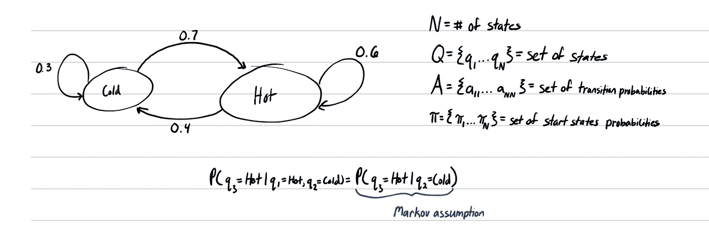
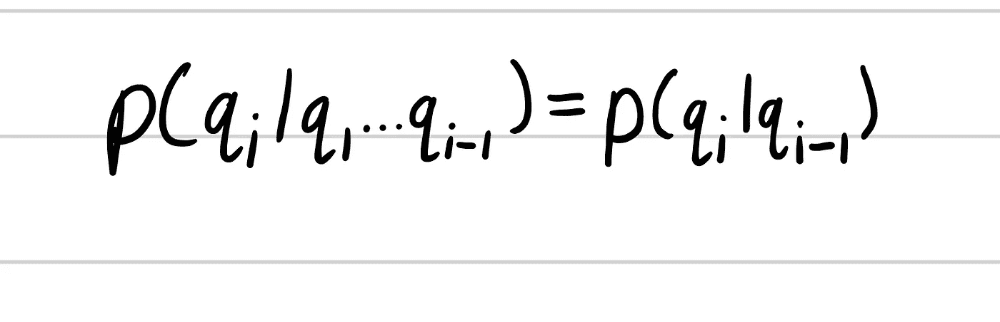
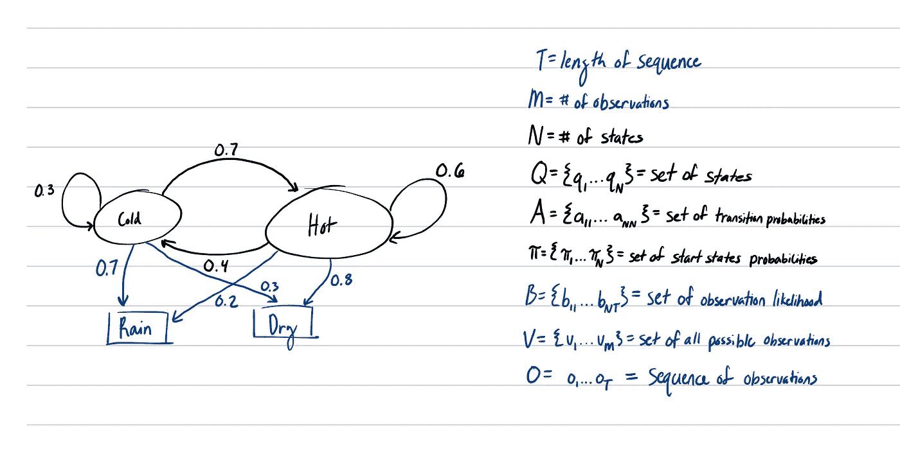
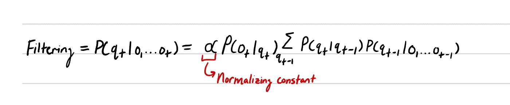
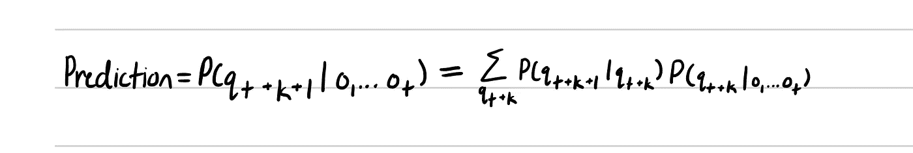
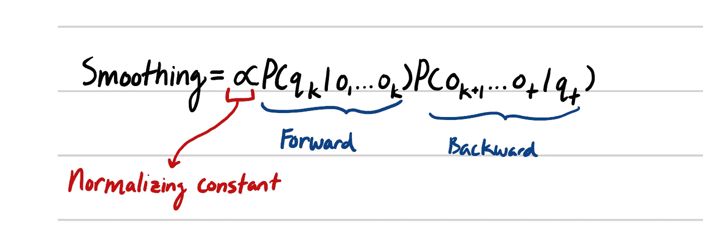

# 隐马尔可夫模型简介

> 原文：<https://medium.datadriveninvestor.com/intro-to-hidden-markov-models-34d99b81cd84?source=collection_archive---------8----------------------->

Photo by [Antoine Dautry](https://unsplash.com/@antoine1003?utm_source=unsplash&utm_medium=referral&utm_content=creditCopyText) on [Unsplash](https://unsplash.com/s/photos/math?utm_source=unsplash&utm_medium=referral&utm_content=creditCopyText)

在上一篇文章中，我们讨论了期望值最大化(EM)。在我给 EM 的例子中，我们有一些 2 个硬币的先验分布。硬币放在一个袋子里，从袋子里随机抽取。虽然我们不知道选择的是哪一枚硬币，但我们仍想尝试找到正面概率的最可能估计值。与其试图找到正面概率的最可能的估计值，不如我们想找到某个翻转序列中最可能的硬币序列。正如你可能从标题中猜到的，我们可以使用隐马尔可夫模型(HMM)来计算最可能的序列。

# 马尔可夫链

HMM 是基于马尔可夫链的。马尔可夫链是由 Q，A 和π，(Q，A，π)组成的三元组。q 是状态集，A 是从状态 I 到状态 j 的转移概率集，π是起始状态概率集。这个三元组有几个要求。状态 q 的转移概率之和必须等于 1。所有初始状态概率的总和也必须等于 1。马尔可夫链的和处理的是随机变量的概率序列。马尔可夫链中有一个主要的假设。马尔可夫假设假设未来的预测只依赖于当前的状态。

这里我们概述一个例子来展示马尔可夫链。这里的状态 Q 是晴天和雨天。转移概率是状态的箭头。虽然在图中没有定义，但我们将把起始状态概率定义为统一的，即 50%热，50%冷。我们还看到了马尔可夫假设的一个用例，其中状态 3 只依赖于状态 2，而不是状态 1 和 2。马尔可夫假设再次被定义为:

Markov Assumption

# **隐马尔可夫模型**

现在我们知道了马尔可夫链的基本原理，让我们开始定义隐马尔可夫模型(HMM)。HMM 是由 Q、A、π、V 和 b 组成的 5 元组。Q、A 和π与马尔可夫链的定义相同。v 是可能观察值的集合，B 是观察状态概率的集合。

为什么叫“隐”马尔可夫模型？之所以称之为“隐藏”马尔可夫模型，是因为观察结果是由某个“隐藏”状态或未被直接观察到的状态引起的。在下图中，雨和干是观察值，而冷和热是隐藏状态，我们不能直接观察到的状态。让我们通过扩展我们的马尔可夫链来看看这是如何工作的。

根据马尔可夫链的定义，所有黑色的文字和数字保持不变。蓝色文本和数字是 HMMs 的新增内容。在图中，蓝色的方框是观察值，蓝色的箭头是状态观察值的可能性。我们还没有定义 O 的 T，因为我们还没有观察序列。

所以，我们从马尔可夫假设中知道，P(q5|q1…q5) = P(q5|q4)，但是对于观察可能性呢？假设我们有 P(o5|q1…q5，o1…04)。我们知道与 o5 的唯一联系是 q5，所以我们可以把 P(o5|q1…q5，o1…04)化为 P(o5|q5)。

# 我们如何使用 HMM？

我们可以使用 hmm 执行 5 种主要计算。

**滤波/状态估计:**给定当前状态的观测历史，估计当前状态的概率。

**预测:**在给定当前观测历史的情况下，估计未来状态的概率。

**平滑:**给定到当前状态的观测历史和一些未来观测，估计当前状态的概率。

**学习:**学习转移概率。

**推理:**计算隐藏状态或隐藏状态序列。推理的一个例子是维特比算法。我们将在下一篇文章中讨论这个算法。

# **结论**

希望这是对隐马尔可夫模型的有益介绍。下一篇文章将讨论维特比算法，我们将用它来解决文章开头提到的硬币问题。我知道我在这篇文章中没有深入研究数学，如果你想让我展示我们如何得到过滤和预测的公式，请在下面留言。如果需要，我可以创建一个新的职位推导公式。一如既往，如果你喜欢这个帖子，请确保击碎鼓掌按钮，如果你喜欢这些风格的帖子，请确保关注我。