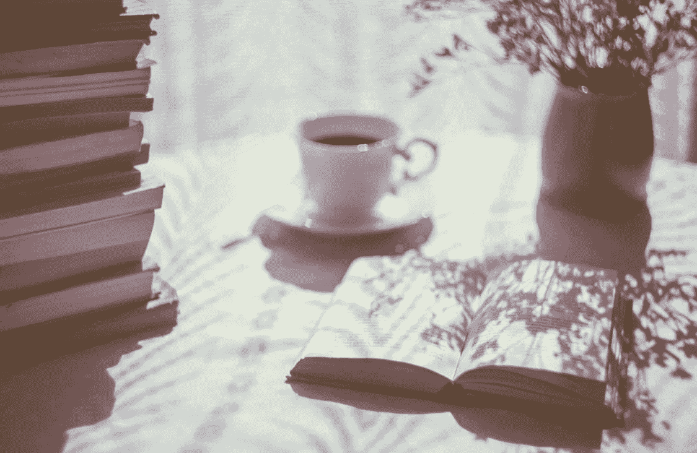

# 介绍 2020 年 22 本最具知识性和轰动性的自助书籍

> 原文：<https://medium.datadriveninvestor.com/introducing-22-of-the-most-sensational-and-informative-self-help-books-in-2020-7e288f111b59?source=collection_archive---------12----------------------->

freestocks-OfaDD5o8hpk-unsplash.jpg

我的成功很大程度上归功于我过去读过的自助书籍。有些书我已经读了十几遍了，还打算再读一遍。

令人难以置信的是，作者可以在少量的页面中包含如此多的信息。有时候我至少要通读两遍才能完全理解。我也倾向于写笔记，使用愿景板和与他人讨论。查看我的帖子[这里](https://link.medium.com/ljXJmYtP79)关于如何最大限度地利用任何自助书籍。

# 我最喜欢的 22 本自助书籍

*   [思考致富作者拿破仑·希尔](https://amzn.to/3i4YLLX)

## 图书描述

《思考致富》基于作者著名的成功法则，代表了拥有巨大财富和成就的杰出人士的智慧结晶。

*   [达伦·哈代的复合效果](https://amzn.to/337RTcp)

## 图书描述

没有噱头。不夸张。没有灵丹妙药。复合效应是基于决定塑造你的命运的原则。小小的日常决定要么会让你过上你想要的生活，要么会让你陷入灾难。

*   斯蒂芬·R·科维的《高效能人士的七个习惯》

## 图书描述

在《高效人士的 7 个习惯》一书中，作者斯蒂芬·R·科维提出了一个整体的、综合的、以原则为中心的方法来解决个人和职业问题。

*   哈尔·埃尔罗德的《奇迹的早晨》

## 图书描述

如果你明天醒来，你生活中的任何一个或每一个领域都开始改变，那会怎样？你会改变什么？奇迹的早晨已经改变了世界各地成千上万人的生活，向他们展示了如何以更多的能量、动力和专注来唤醒每一天，让你的生活更上一层楼。

*   [大卫·j·施瓦茨的《思考的魔力》](https://amzn.to/33c0n2x)

## 图书描述

数以百万计的读者通过大胆思考的魔力获得了成功的秘诀。实现你一直想要的一切:财务安全，权力和影响力，理想的工作，令人满意的关系，以及有意义的幸福生活。把你的目标定得很高…然后超越它们！

*   鲍勃·伯格和约翰·大卫·曼的《Go Giver》。

## 回顾

快速阅读世界上最伟大的推销员和一分钟经理的精神。伯格和曼恩以简单、随意的风格写作，提供了一个劳动者对古老格言“给予，你就会得到”的解释。”——出版商周刊

书名中提到的强有力的商业理念是“把重心从获取转移到给予，把他人放在第一位是商业成功和个人实现的关键。”…对这些概念以及如何使用它们的解释清晰而中肯。”—书目

 [## 振作起来:思维导图的故事|数据驱动的投资者

### 如果有一种方法可以让你振作起来，让你的事业/个人生活变得有意义，并继续前进…

www.datadriveninvestor.com](https://www.datadriveninvestor.com/2020/03/31/get-yourself-together-a-story-of-mind-mapping/) 

*   丹·米尔曼的《和平战士之路》

## 图书描述

励志和精神传奇:这部自传体小说是我们这个时代最受欢迎的精神故事之一。几十年来，世界各地的朋友和家人都分享这本书，教导和平战士的方式。作为一名和平战士的生活是一种冥想、正念、同情和接受的生活。

*   [戴尔·卡耐基《如何赢得朋友和影响他人》](https://amzn.to/36hwyiZ)

## 图书描述

戴尔·卡耐基坚如磐石、久经考验的建议帮助无数人在商业和个人生活中攀登成功的阶梯。有史以来最具开创性和永恒性的畅销书之一,《如何赢得朋友和影响他人》将教你:六种让人们喜欢你的方法，十二种让人们接受你的思维方式的方法，以及九种在不引起怨恨的情况下改变他人的方法

*   [乔治·s·克拉森著](https://amzn.to/30dUM9U)

## 图书描述

根据“巴比伦寓言”改编的《巴比伦最富有的人》被誉为关于节俭、财务规划和个人财富的最伟大的励志作品。用简单的语言，这些引人入胜和信息丰富的故事让你踏上了通往繁荣和随之而来的快乐的康庄大道。一本著名的畅销书，它为你的个人财务问题提供了理解和解决方案。里面揭示了获得金钱，保持金钱，并使金钱赚更多钱的秘密。

*   [约翰·C·麦斯威尔《成功人士是如何思考的》](https://amzn.to/3mVi2Dh)

## 图书描述

《华尔街日报》畅销书《成功人士如何思考》是当今快节奏世界的最佳读物。美国领导力专家约翰·C·麦斯威尔将教你如何更有创造力，何时质疑流行思维。你将学会如何在集中思维的同时捕捉大局。你会发现如何挖掘你的创造潜力，发展共同的想法，并从过去吸取教训，以更好地了解未来。有了这 11 个提高思考效率的关键，你会清楚地看到通往个人成功的道路。

*   托尼·罗宾斯的《唤醒内心的巨人》

## **书籍描述**

醒醒吧，把握你的人生！来自畅销书《内在力量、无限力量和金钱主宰游戏》的作者，美国顶尖表演科学的领导者安东尼·罗宾向你展示了他最有效的控制你的情绪、身体、人际关系、财务和生活的策略和技巧。

*   [罗伯特·清崎的《富爸爸穷爸爸》](https://amzn.to/2GeiUCd)

## 图书描述

《富爸爸穷爸爸》讲述了罗伯特和两个爸爸一起成长的故事，他的生父和他最好的朋友富爸爸的父亲，以及这两个人如何塑造了他对金钱和投资的看法。这本书打破了你需要高收入才能变得富有的神话，并解释了为钱工作和让钱为你工作之间的区别。

*   [被加里·维碾压](https://amzn.to/369XCQS)

## 图书描述

四次当选《纽约时报》畅销书作家的加里·维纳查克提供了新的经验和灵感，这些经验来自几十位有影响力的人和企业家的经历，他们拒绝了可预测的企业道路，而是通过建立繁荣的企业和非凡的个人品牌来追求自己的梦想。

*   [现在的力量由艾克哈特·托尔](https://amzn.to/30dwfl9)

## 图书描述

难怪《现在的力量》在全球销量超过 200 万册，并被翻译成 30 多种外国语言。这本书不仅仅是简单的原则和陈词滥调，它还带领读者踏上了一段鼓舞人心的精神旅程，去寻找他们真实和最深刻的自我，并达到个人成长和灵性的极致:发现真理和光明。

*   [蒂莫西·法里斯的《每周 4 小时工作制》](https://amzn.to/2EId0ZG)

## 图书描述

忘记旧的退休概念和其他的延期生活计划——没有必要等待，也有理由不等待，尤其是在不可预测的经济时期。无论你的梦想是逃离激烈的竞争，体验高端的世界旅行，还是在零管理的情况下获得每月五位数的收入，4 小时工作周都是蓝图。

查尔斯·杜希格的《习惯的力量》

## 图书描述

在《习惯的力量》一书中，屡获殊荣的商业记者查尔斯·杜希格带我们来到科学发现的激动人心的边缘，解释为什么习惯存在以及如何改变它们。杜希格将大量信息提炼成引人入胜的故事，将我们从宝洁公司的董事会带到 NFL 的场外，再带到民权运动的前线，展现了对人性及其潜力的全新理解。

*   [保罗笔下的炼金术士](https://amzn.to/2S5DiYG)

## 图书描述

保罗·柯艾略的杰作讲述了圣地亚哥的神秘故事，圣地亚哥是一个安达卢西亚的牧童，渴望旅行以寻找世间的宝藏。他的追求将带领他获得远不同于他想象的财富，也更令人满意。圣地亚哥的旅程教会我们倾听内心的声音，认识机遇，学会解读生活道路上的预兆，最重要的是，追寻我们的梦想。

*   [戴夫·霍利斯《走出自己的路》](https://amzn.to/36aRIix)

## 图书描述

《走出自己的路》是对那些对更充实的生活感兴趣的人的一个号召，这些人在前进的道路上，可能已经失去了他们的“为什么”,现在想知道如何释放他们的潜力或在他们爱的人面前表现得更好。作家戴夫·霍利斯努力拥抱成长，审视他所相信的谎言以及他为什么会这样想，在这个过程中，他成为了一个更好的人，无论是对自己还是对生活中对他来说最重要的人。你也可以。凭借魅力、幽默和适度的自嘲，霍利斯将激励你挑战自己在无悔人生旅途中遇到的谎言。

*   格兰特·卡尔多内的 10x 法则

## 图书描述

10 倍法则揭示了“大规模行动”的原则，允许你冲破商业陈词滥调和风险规避，同时采取具体步骤实现你的梦想。它还展示了为什么人们会陷入前三个行动，以及如何使 10X 规则成为一个纪律。明确从哪里开始，做什么，以及如何更加努力地跟进你采取的每个行动，以取得巨大的行动成果。

*   [戴尔·卡内基《如何停止担忧并开始生活》](https://amzn.to/338yDM1)

## 图书描述

有了戴尔·卡内基永恒的建议，600 多万人已经学会了如何消除生活中的恐惧和担忧，迎接无忧无虑的未来。在这本经典著作《如何停止担忧并开始生活》中，卡内基提供了一套实用的公式，你可以在今天付诸实践。这是一本充满教训的书，将持续一生，并使一生更快乐！

*   [理查德·科赫的 80/20 原理](https://www.amazon.com/gp/product/B00OH7BB2S/ref=as_li_tl?ie=UTF8&tag=jazzparks20-20&camp=1789&creative=9325&linkCode=as2&creativeASIN=B00OH7BB2S&linkId=b4c1c385f14d5da2671faf7a91236bc4)

## 图书描述

80/20 原则的不言而喻的推论是，你花在上面的时间实际上很少能丰富你的生活。但是，通过专注于少数几件重要的事情，你可以释放关键的 20%的巨大潜力，成倍增加你的幸福和成就感。当你学会如何系统地应用 80/20 原则时，你将最终拥有超越现代生活压力的力量:变得更加成功，享受更多的休闲、宁静以及与朋友和爱人的良好关系。

*   [原子习惯由詹姆士明确](https://amzn.to/3ibjrSu)

## 图书描述

不管你的目标是什么,“原子习惯”提供了一个行之有效的改进框架——每天都是如此。世界领先的习惯养成专家之一 James Clear 揭示了一些实用的策略，这些策略将教会你如何养成好习惯，改掉坏习惯，掌握那些能带来显著效果的微小行为。

## 奖金

*   [活一点:如何放慢脚步，活在当下由我来！(现已发售)](https://www.amazon.com/Breathe-Finding-Determination-Jazz-Parks-ebook/dp/B073TQ15RR)

## 图书描述

《活一点》是一本关于找时间、放慢节奏、学会活在当下的书。我渴望帮助他人放慢脚步，拥抱当下，找到成功、富足和真正的幸福。现在。你不必等着去感受成功。你不必等着看很多，你也不需要任何东西来快乐。

[点击此处订阅我的时事通讯](http://eepurl.com/gYKxaf)获取独家内容**关注自我提升、习惯培养、正念和时间管理策略。**

## **访问专家视图— [订阅 DDI 英特尔](https://datadriveninvestor.com/ddi-intel)**