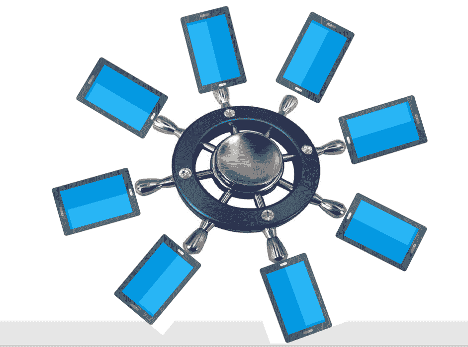
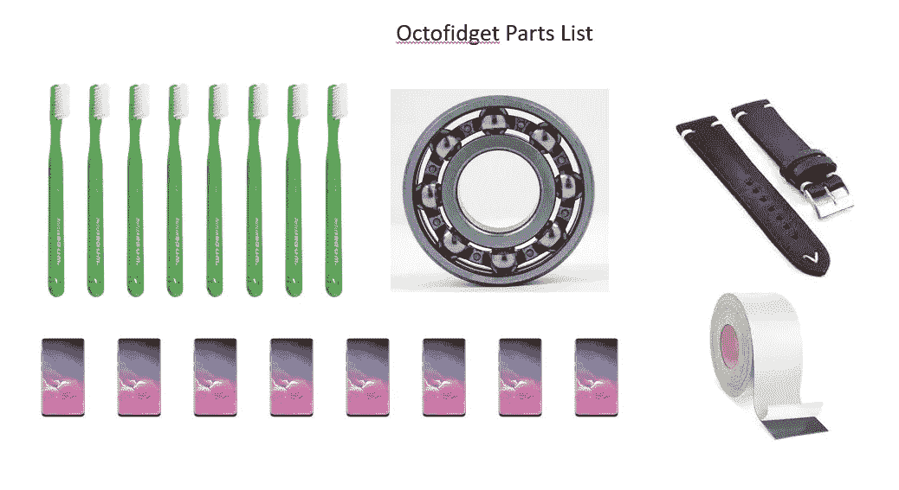

# 介绍 Octofidget 社交媒体多任务处理软件

> 原文：<https://medium.datadriveninvestor.com/introducing-the-octofidget-social-media-multitasker-2f33655217b?source=collection_archive---------24----------------------->

## 社交媒体 FOMO 的终结

Octofidget ‘Captain’s’ model. why stop at two devices when you can have eight?

在最近的一次常规通勤列车旅行中，我突发奇想，这要感谢一位拥有一些灵巧设备协调技巧的高效女商人。实际上，她并不那么令人印象深刻。她双手高举手机:一只手播放电影，另一只手发短信。她无缝地来回转移她的注意力，从她的电影，到无休止的拇指敲击。天啊。我是不是觉得她的手臂不会因为手臂脂肪的重量而断裂脱落？

但我突然明白了:如果这个女人能管理两部智能手机，为什么不能管理四部；为什么不是八个？想想看:假设人们只能同时管理一两部智能手机，而他们可以管理八部，这是对人类智力的严重低估。我们可以称之为“多任务处理”，正如一些人所说，如果呆在一个屏幕上不算是在工作，那么呆在八个屏幕上也不算是在工作:八乘以零等于零。生产力多任务理论到此为止。

> 注意力缺陷障碍的治疗方法

想想从 1 台设备到 8 台设备的“生产力”的指数级提升。一部智能手机在 4G 网络上的传输速度最高可达 15GB/小时，如果有八台设备，这一速度将提升至[120 GB/小时](https://www.businessinsider.com/google-stadia-data-usage-internet-streaming-requirements-2019-6)。5G 连接可以将容量从 4G-100 MB/秒成倍增加到 5G-10GB/秒，或快 100 倍。人们会变得像农场一样行走。

 [## 计划者让社交媒体保持正轨|数据驱动的投资者

### 如果想达到并保持最高效率，忙碌的人会坚持使用系统。这是 Tweepsmap 和…背后的前提

www.datadriveninvestor.com](https://www.datadriveninvestor.com/2019/03/11/schedulers-keep-social-media-on-track/) 

这个想法的美妙之处在于，实现这种改变生活的附属物的技术已经可以在无处不在的坐立不安旋转器中为我们所用，只需要稍加修改，就可以实现其最大化社交媒体摄入量的承诺。

> “在 4G LTE 连接下，下载一部两小时的电影大约需要 6 分钟。在 5G 网络上，同样的电影可以在 3.6 秒内下载完毕

这个理论很简单，仅仅是规模的问题，是技术的融合。可用的坐立不安纺纱是为了适应一个人的手掌，以满足溃烂的冲动。如果旋转器的直径增加到 12 英寸，它也能以同样的方式旋转，只是速度稍微慢一点。原型所需要的只是一个无线充电器、一些磁性垫、**一条皮革表带和八把牙刷**。

> “谁想看看真实的世界或者置身其中？那些只不过是诱饵口头禅。

比方说，一个 12 英寸的旋转器可以安装一个手掌或腕带来保持稳定，因为它可以同时支撑八个该死的智能手机的质量和旋转？这些手机将有一个磁性垫，将它们固定在牙刷(或豪华的“舵柄”辐条)上，终止于八个节点中的一个。无线低压电荷可以从集线器循环到每个节点，实现不间断的无意识娱乐。

Octofidget economy model shown with 8 frickin’ (optional) smartphones. Assembly required.

每个节点都有自己的音频通道，可以通过中央 festpad 进行循环。没有电线，没有麻烦。你是社交媒体的世界冠军。没有一个病毒式的帖子逃过你的注意。就在我们说话的时候，开发人员正在把全息护目镜和一到八个网格窗口结合起来。

Isn’t this bloody brilliant? an octopus with nine legs

章鱼的潜力是无限的。这可能是无聊和注意力缺陷障碍的终极疗法。这就是我们发起 Kickstarter 活动来筹集设计和开发资金的原因。该设备销售的所有利润将捐赠给章鱼社交媒体狂热推广计划，或 OSMOP，或类似的东西。八脚章鱼不识字，但它们肯定会上网。