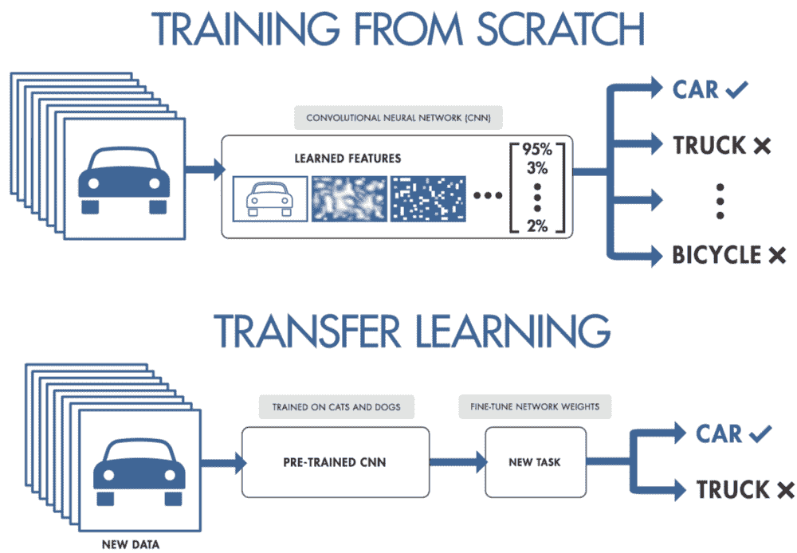

# 将迁移学习作为推动未来创新的下一个引擎

> 原文：<https://medium.datadriveninvestor.com/introducing-transfer-learning-as-your-next-engine-to-drive-future-innovations-5e81a15bb567?source=collection_archive---------6----------------------->

哈利·戴维森·雷加

随着越来越多的企业意识到深度学习带来的优势，人工智能爱好者开始准备好起飞，寻找最先进的技术作为未来的圣杯。**深度学习已经成为潜在创新的强大工具**得益于大量可访问的资源，使人工智能开发变得简单。

作为一名好奇的领导者，你可能已经开始了再造人工智能未来的旅程，并赶上了深度学习的潮流。在天才数据科学家和机器学习开发者的支持下，你想象自己站在基座上，准备改变技术如何影响数百万人生活的潮流。

 [## 深度学习用 7 个步骤解释-更新|数据驱动的投资者

### 在深度学习的帮助下，自动驾驶汽车、Alexa、医学成像-小工具正在我们周围变得超级智能…

www.datadriveninvestor.com](https://www.datadriveninvestor.com/2019/01/23/deep-learning-explained-in-7-steps/) 

现在，您已经想到了一个医疗保健行业的用例，专门用于计算机辅助诊断，这是以前从未有人做过的。您已经准备了必要的资源，如计算设备，并收集了相对较好的数据集，但是，您发现自己迷失在神经网络超参数的荒野中，不知道从哪里开始以及配置什么。

好消息是，你真的不需要从头开始构建你的神经网络。你现在可以利用过去强大的深度学习模型的力量，并将它们的知识转移到你自己的特定领域——这要归功于 ***转移学习*** 。

根据**吴恩达**在 2016 年神经信息处理系统会议(NIPS 2016)期间关于“使用深度学习构建人工智能应用的螺母和螺栓”的教程，迁移学习将取代其前身监督学习，成为机器学习商业成功的下一个驱动力。

迁移学习萌芽的关键动机是克服孤立的学习范式，因为传统学习和深度学习算法仅设计用于解决单独的特定任务，这不方便地需要大量数据。此外，获取用于监督学习训练的标记数据增加了进一步的复杂性。迁移学习利用预训练模型的能力来解决新问题，即使数据集相对较少。

现在，您已经将您的医疗保健行业用例分类为一个预测建模问题，使用多组医学图像作为您的数据输入。对于这个问题，一种常见的方法是使用深度学习模型，该模型针对大型和具有挑战性的图像分类任务进行预训练，如 ImageNet 1000 级照片分类竞赛，并使用您自己的超参数配置对其进行微调。

最近在医学成像方面的研究已经证明了预训练的**卷积神经网络** (CNN)作为医学图像特征提取器的潜力。基于 Lopez 和 Valiati 在 2017 年的研究，使用预训练的 CNN 作为结核病检测的特征提取器，不需要昂贵和耗时的训练步骤，也不需要大型数据集来实现相当好的结果。

**迁移学习作为深度学习相关问题的快速解决方案，已经显示出它的价值**。然而，它需要更多的研究和探索来解决围绕现有学习算法的更大问题，如回答迁移什么、何时迁移以及如何迁移的困难，以及负迁移和迁移界限的主要挑战。

**立即获得免费的机器人流程自动化(RPA)软件！** [下载这里](https://www.raxsuite.com/freedownload?utm_source=Medium%20Post&utm_medium=medium&utm_campaign=medium_footer)

参考资料:

 [## 在深度学习中通过真实世界的应用转移学习的综合实践指南

### 用知识转移的力量进行深度学习！

towardsdatascience.com](https://towardsdatascience.com/a-comprehensive-hands-on-guide-to-transfer-learning-with-real-world-applications-in-deep-learning-212bf3b2f27a)  [## 基于计算机视觉模型的 Keras 迁移学习

### 深度卷积神经网络模型可能需要几天甚至几周的时间在非常大的数据集上进行训练。一种方法…

machinelearningmastery.com](https://machinelearningmastery.com/how-to-use-transfer-learning-when-developing-convolutional-neural-network-models/)  [## 用于深度学习的迁移学习的温和介绍

### 迁移学习是一种机器学习方法，在这种方法中，为一项任务开发的模型被重新用作一项任务的起点

machinelearningmastery.com](https://machinelearningmastery.com/transfer-learning-for-deep-learning/) 

[https://www . research gate . net/publication/318919632 _ 预训练 _ 卷积 _ 神经网络 _ as _ feature _ extractors _ for _ tuberculosis _ detection](https://www.researchgate.net/publication/318919632_Pre-trained_convolutional_neural_networks_as_feature_extractors_for_tuberculosis_detection)