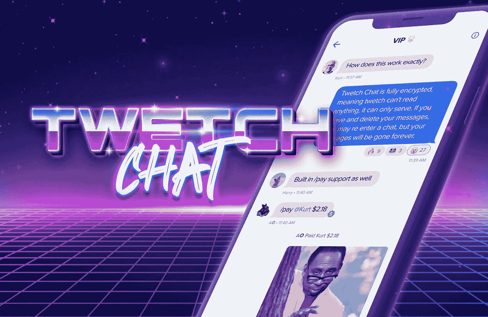
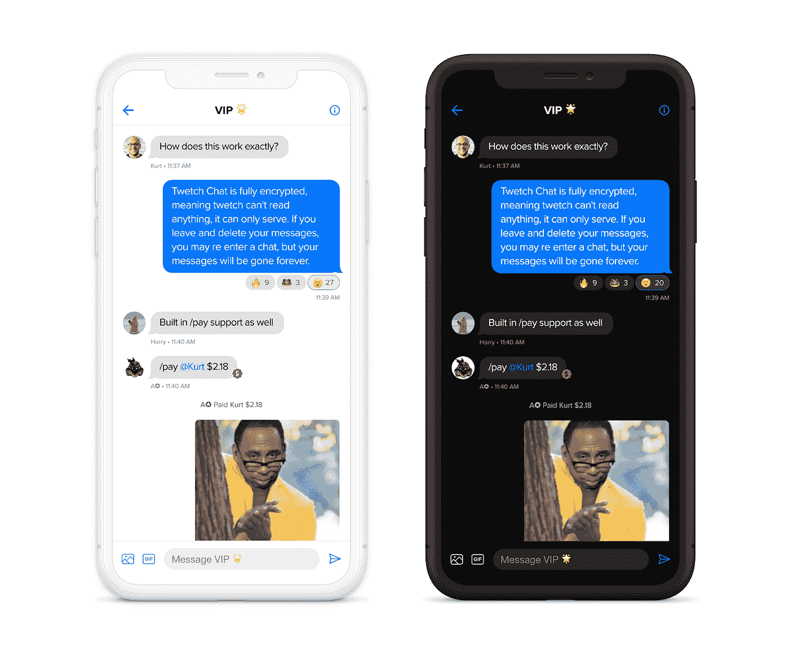
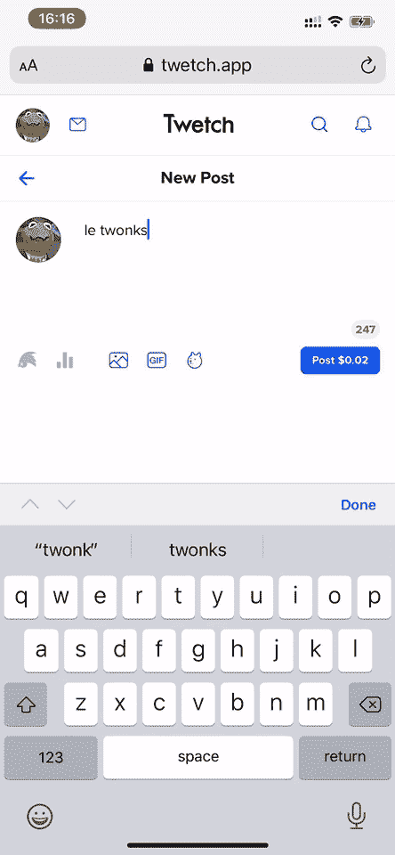

# 介绍 Twetch 聊天🗣——使用比特币加密信息

> 原文：<https://medium.datadriveninvestor.com/introducing-twetch-chat-encrypted-messages-using-bitcoin-cfe552cd354f?source=collection_archive---------0----------------------->

## 利用比特币技术构建下一代信息系统。

经过几个月的努力，我们自豪地宣布 [**Twetch Chat**](http://twet.ch/inv/frog) **公开发布。** Twetch Chat 利用比特币技术，因此您可以立即向朋友发送加密消息。👏

## **拥有您的数据并从您的内容中获利——加入 Twetch**

 [## Twetch 邀请

### 你被邀请去特威奇

twet.ch](https://twet.ch/inv/frog) 

Twetch Chat let’s you DM privately with your friends using Bitcoin-native cryptography!

# 等等，等等，特威奇是什么？

Twetch 是世界上发展最快的去中心化社交网络。我们正在开发前沿技术，让用户能够控制他们的数据，并从他们的内容中获利。

在 Twetch 上，每一次互动都是一次微交易，你的数据默认会被存档在比特币区块链上。你总是有一个副本，可以随时访问你的数据。这是我们今天在互联网和社交媒体上看到的邪恶数据收集和去平台化的解决方案。

我们的社区在整个过程中起到了真正的推动作用，并提供了一些令人惊叹的反馈。在很短的时间内，Twetch 公测已经收到了来自 69+个国家用户的**17000+次注册。🥰**

# 社交网络的未来

今年 3 月早些时候，我在 1000 人面前宣布我们打算为 Twetch 开发一个以隐私为中心的功能，今天我们将为所有 Twetch 用户推出聊天功能。我们探索了许多不同的方式来建立以隐私为中心的聊天体验，并利用了比特币的加密功能。这不是一件容易的事情，但是我们做到了，在这个过程中我们学到了很多。

> “Twetch chat 展示了世界在数据隐私、数据控制和数字身份方面的发展趋势。与传统互联网服务不同，Twetch 将密钥管理卸载到用户的账户(这是一个比特币钱包)。这是打破大型科技数据垄断的一步。提供在线身份允许用户完全控制他们创建的信息，使用他们的私钥在任何地方登录，并随身携带他们的数据(关注者、喜欢者、声誉)。”—乔希·佩蒂，Twetch.com 联合创始人

The Future of Social Networks — Coingeek London

# 使用比特币加密算法打造加密聊天体验

> “Twetch 加密允许用户控制他们的数据并从中获利，同时保护数据免受第三方(包括 Twetch 本身)的攻击。”——比特币开发者迪安·利特尔

**特性 Twetch 加密密钥**

登录 Twetch 后，用户将在其浏览器中自动生成一个唯一的随机 12 字种子，以及来自 m/0/0 派生路径的 Twetch 加密公钥。然后，12 个字的种子通过用户各自的支付邮件中提供的公钥被加密到用户的所有连接的钱包中，并与 Twetch 加密公钥一起保存在 Twetch 的服务器上，以便用户的钱包可以在以后对它们进行寻址和解密。在任何额外登录 Twetch 时，这 12 个单词的加密字符串将被提供给用户，供他们用各自的钱包解密。这使得 Twetch 能够利用高级加密功能，而无需保管我们用户的明文密钥或资金，使我们无法破解加密、监控我们的用户或拥有他们的金钱或密码。

**Twetch 加密聊天**

Twetch chat 依靠用户前面提到的 Twetch Encryption 公钥来安全分发存储在我们服务器上的 ECIES 加密的 AES 密码。当两个或更多参与者之间发起聊天时，聊天的发起者生成 AES 密码。然后，聊天发起者在浏览器中将密码加密为所有聊天参与者的公钥，并保存在 Twetch 的服务器上。加入聊天后，参与者可以解密 AES 密码，以便能够读取 AES 加密的消息并将其发送给聊天中的其他参与者。Twetch 在我们的服务器上存储完全加密的用户信息。如果一个用户从聊天中被删除，他们将无法再从我们的服务器恢复这些消息，如果所有参与者都离开聊天，所有消息都将被永久删除，并且不可恢复。

# **供稿人:**

[院长小](https://medium.com/u/e924d70904a8?source=post_page-----cfe552cd354f--------------------------------) —聊天加密

兰迪 — UX 设计

[城市纵火](https://medium.com/u/7639baf18874?source=post_page-----cfe552cd354f--------------------------------) —电影导演

[哈里森·贝克里奇](https://medium.com/u/63449a655498?source=post_page-----cfe552cd354f--------------------------------) —产品开发

[安东尼·J·卡瑞克](https://medium.com/u/55c2eb7a0a5a?source=post_page-----cfe552cd354f--------------------------------) —客户体验

约书亚·亨斯利 —软件开发

# **关注我们**

[加入 Twetch](http://twet.ch/inv/frog)

[推特](https://twitter.com/twetchapp)

[Instagram](https://www.instagram.com/twetchapp/?hl=en)

[脸书](http://facebook.com/twetchdat)

如果你喜欢你所看到的，请为这篇文章鼓掌👏👏👏