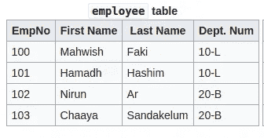

# 分层查询简介

> 原文：<https://medium.datadriveninvestor.com/introduction-for-hierarchical-queries-cbb8d04677cb?source=collection_archive---------6----------------------->

我们在生活中看到的大多数场景都与等级制度有关。诸如

*   组织层次结构
*   产品层次结构
*   类层次

**层次数据模型**用于对具有层次结构的数据进行建模。在分层数据模型中，数据被组织成一个**树状结构**。这种数据模型的主要特点是它包括与相同实体类型有关系的实体。例如，如果我们采用下面两个存储组织中雇员数据的表，manged _ by 表包括两个雇员实体之间的关系。如果我们分析 managed_by 表的结构，我们可以看到“ReportsTo”列(关系列)表示两个雇员实体之间的关系。EmpNo 列(子元素)中表示的雇员向 reports 列(父元素)中表示的雇员报告。

Photo by [Clint Adair](https://unsplash.com/@clintadair?utm_source=medium&utm_medium=referral) on [Unsplash](https://unsplash.com?utm_source=medium&utm_medium=referral)

分层查询是一种特殊类型的 SQL 查询，用于操作分层数据。在本文中，我将使用 oracle 数据库和下面的两个表来介绍分层查询。

[https://en.wikipedia.org/wiki/Hierarchical_database_model](https://en.wikipedia.org/wiki/Hierarchical_database_model)

managed_by

Oracle 有三个主要关键字用于分层查询。他们是

*   **通过**连接
*   **从**开始
*   **按**排列兄弟姐妹

# 连接方式

Connected by 关键字用于指定父实例和子实例之间的关系。如果我们以组织层级为例，connected by 可以用来指定员工和经理之间的关系。

Connected by 关键字不能用于查询具有循环关系的数据。如果使用它，将会出现以下错误。

" **ORA-01436:通过用户数据中的循环连接**"

为了减少这种错误，我们可以使用 NOCYCLE 关键字作为连接条件。

**从**开始

在大多数层次结构中有一个根元素是很常见的。根元素的特殊之处在于它没有父元素。不同的人用不同的方法来表示根元素，如。

*   向根元素的关系列添加特殊字符串。
*   保持根元素的关系列为空。

 [## 成为数据科学家所需的 8 项技能|数据驱动型投资者

### 数字吓不倒你？没有什么比一张漂亮的 excel 表更令人满意的了？你会说几种语言…

www.datadriveninvestor.com](https://www.datadriveninvestor.com/2019/02/07/8-skills-you-need-to-become-a-data-scientist/) 

START WITH 关键字用于指定层次结构的根行。在上面的示例中，根节点是 Director。

**按**排列兄弟姐妹

ORDER SIBLINGS BY keyword 用于指定查询结果的排序方式。

参考资料:

*   [https://docs . Oracle . com/CD/b 19306 _ 01/server . 102/b 14200/queries 003 . htm](https://docs.oracle.com/cd/B19306_01/server.102/b14200/queries003.htm)
*   https://en.wikipedia.org/wiki/Hierarchical_database_model