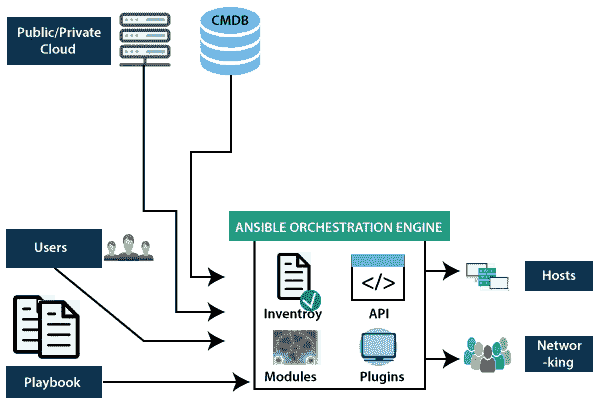

# Ansible 简介

> 原文：<https://medium.datadriveninvestor.com/introduction-to-ansible-785420f4921a?source=collection_archive---------3----------------------->

*“敏捷和开发运维是为了利用、集成、互动和创新”*


既然您已经来到这里学习 ansible，我将假设您已经掌握了 Linux 的工作知识。
所以我们滚吧！

**什么是 Ansible？**
它是一个开源的自动化平台，或者可以描述为一种简单的自动化语言，可以用来在剧本中完美地描述 It 应用基础架构。Ansible 可以轻松管理强大的自动化任务，并可以节省我们一些时间，它可以适应许多不同的工作流程和环境。

[](https://www.datadriveninvestor.com/2020/05/12/private-equity-investors-need-to-keep-up-with-data-analytics/) [## 私募股权投资者需要跟上数据分析|数据驱动的投资者

### 如果你有一把钥匙，可以打开商业成就和职业成功的捷径，你会不会用它…

www.datadriveninvestor.com](https://www.datadriveninvestor.com/2020/05/12/private-equity-investors-need-to-keep-up-with-data-analytics/) 

Ansible 是**简单的** :
剧本提供了人类可读的自动化。编写可行的行动手册不需要特殊的编码技能。因此，任何感到害怕并有疑问的人，无论我们是否需要成为一名优秀的程序员，答案都是否定的。任何人都可以编写可行的剧本。它让 ansible 快速提高工作效率。

Ansible 是**强大的** :
Ansible 可以很容易地用于部署应用，用于工作流自动化和网络自动化。它可以轻松地执行整个应用程序生命周期。另外，ansible 是使用无代理架构构建的。Anisble 使用的网络协议是 SSH。


[www.ansible.com](http://www.ansible.com)

现在谈一谈可行的体系结构，它涉及两种类型的机器，一种是控制节点，另一种是被管理节点。或者可以理解为主从概念。
控制节点或主节点可能在管理员的笔记本电脑中，所有从节点或受管节点都在主机文件中键入，存在于我们从外部源安装的 ansible 包的清单文档中。
现在，行动手册中提到的所有任务都在清单中提到的所有主机上执行。
剧本用扩展名—”表示。yaml 和剧本是包含一个或多个剧本的文件。
现在，什么是戏？一出戏包含一系列要在主持人身上完成的任务。
每个任务都包含一系列模块，它是一段代码。它是我们工具箱中的一个工具。Ansible 有数百个有用的模块，可以执行各种各样的任务，如调用 API、安装软件，从而减少了人工工作。
其架构中另一个重要的东西是*插件。可以将它们添加到 ansible 中，以扩展和适应新的用户和平台。*



[**Javatpoint**](http://www.javatpoint.com)

**ansi ble 的用例:**

1.  交付:没有简单的自动化平台，就不能简单地创建 CI/CD 管道。可翻译的剧本使我们的应用程序得到正确部署。
2.  安全性:为了将站点范围的安全性与自动化流程集成，我们可以在 Ansible 中定义安全性。它是所部署的一切不可或缺的一部分。
3.  供应:应用程序必须部署在系统上，ansible tower 可以帮助执行供应系统的过程，无论我们是使用 kickstart 文件还是从模板创建虚拟机或云实例。
4.  应用程序部署:一旦应用程序用 ansible 定义，并用 ansible tower 管理，团队就可以有效地管理从开发到生产的整个应用程序生命周期。

现在转到安装部分:

Ansible 需要安装在控制器节点上。安装起来很简单。托管节点不需要安装 ansible。ansible 的先决条件是 Python2。检查它是否已安装，如果已安装，它的当前版本是什么:

```
[root@mtmintsrv001 ~]# yum list installed python
Loaded plugins: langpacks, product-id, search-disabled-repos, subscription-
 : manager
Installed Packages
python.x86_64 2.7.5–76.el7 [@anaconda](http://twitter.com/anaconda)/7.6[root@aotasrvapp ~]# yum install -y ansibleThe above command is used to install ansible package.[root@aotasrvapp ~]# vim /home/ansible/inventories/hosts.iniaotasrvapp  ansible_user=root ansible_host=10.164.48.129 #ansible_connection=local## Group for application servers
[appservers]
aotasrvapp
```

可行的控制节点需要通过网络联系被管理的主机。它可以通过使用 SSH 连接来实现。

```
[root@aotasrvapp ~]# ssh-keygen
Generating public/private rsa key pair.
Enter file in which to save the key (/root/.ssh/id_rsa):
/root/.ssh/id_rsa already exists.
Overwrite (y/n)? y
Enter passphrase (empty for no passphrase):
Enter same passphrase again:
Your identification has been saved in /root/.ssh/id_rsa.
Your public key has been saved in /root/.ssh/id_rsa.pub.
The key fingerprint is:
SHA256:iQT6NKTvrlaClXOnx7XY24p5TF+qNaHKVrjuakOTsGc root@aotasrvapp
The key’s randomart image is:
+ — -[RSA 2048] — — +
| o |
| + . |
| o.o . |
| =+.o…. |
| o =o=.=S..  |
|. o.E = =. .. |
| *.o =.+oo |
| ..o.o++.+. |
| ..oo*B.oo |
+ — — [SHA256] — — -+[root@aotasrvapp ~]# ssh-copy-id 10.164.48.129
/usr/bin/ssh-copy-id: INFO: Source of key(s) to be installed: “/root/.ssh/id_rsa.pub”
/usr/bin/ssh-copy-id: INFO: attempting to log in with the new key(s), to filter out any that are already installed
/usr/bin/ssh-copy-id: INFO: 1 key(s) remain to be installed — if you are prompted now it is to install the new keys
root@10.164.48.129’s password:Number of key(s) added: 1Now try logging into the machine, with: “ssh ‘10.164.48.129’”
and check to make sure that only the key(s) you wanted were added.
```

上面的步骤用于创建一个 ssh 密钥，然后将其复制到我们想要运行 ansible playbook 的所有控制节点上。

因此，直到这一部分，我们已经涵盖了一些基本的理论部分，以及安装。在下一部分，我们将继续讨论这个问题的一些更实际的方面。

***保持学习！***

**访问专家视图—** [**订阅 DDI 英特尔**](https://datadriveninvestor.com/ddi-intel)