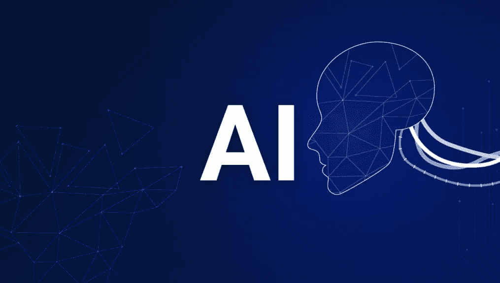
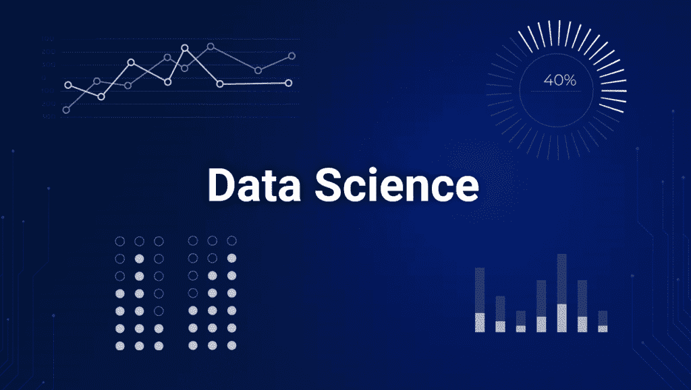
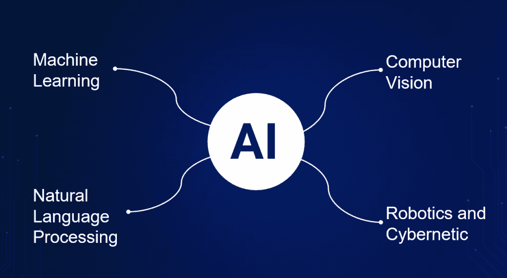
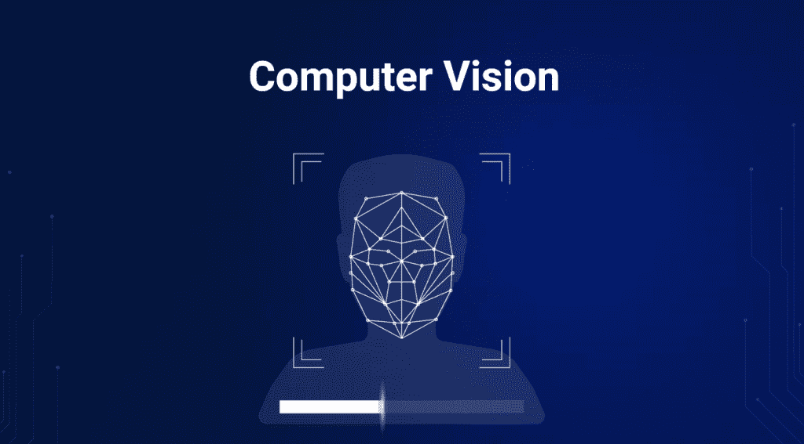
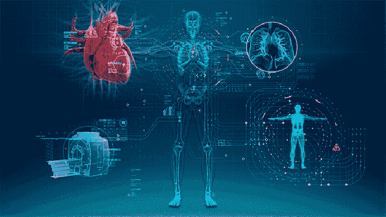
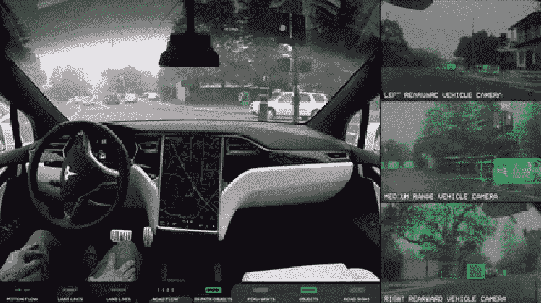
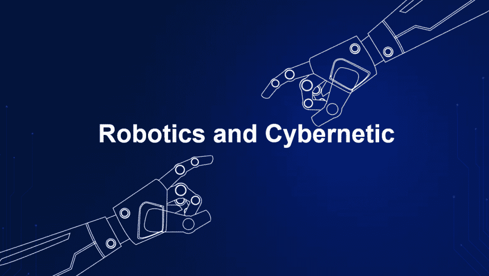
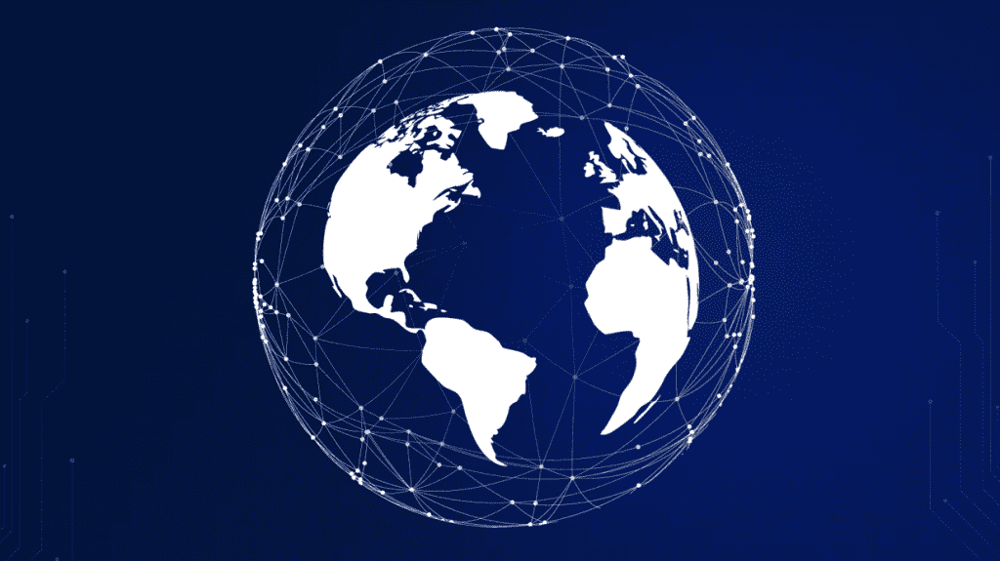

# 人工智能导论

> 原文：<https://medium.datadriveninvestor.com/introduction-to-artificial-intelligence-843922930613?source=collection_archive---------6----------------------->

# AI 是什么？

为了理解人工智能(AI)的重大概念，还记得电影*《终结者》*就更简单化了。如果你没有看，我建议你看🙂

在这部电影中，主要演员阿诺德·施瓦辛格扮演了一个来自未来的电子人。这个机器人是高级人工智能的伟大代表。它看起来和行为都像人类，有能力看到和理解人类做什么和说什么，也有能力像人类一样移动。

上述电子人特征代表了当前人工智能研究和发展的关键领域(R&D)。更准确地说，这些人工智能学科是:

*   机器学习
*   计算机视觉
*   自然语言处理
*   机器人和控制论(R&C)

# 什么是数据科学？

数据科学(DS)和 AI 在当今社会并不鲜见混淆。有时，DS 和 AI 被视为同一事物的两个不同名称。但事实并非如此。

DS 侧重于使用统计模型和程序从数据中获得结论。它涉及各种底层数据操作(清理和验证数据……)，从而产生更准确的统计模型，并由此产生更准确的结果。DC 的一些常见应用是市场营销、广告、商业分析等。

 [## 挑战你对人工智能和社会看法的 4 本书|数据驱动的投资者

### 深度学习、像人类一样思考的机器人、人工智能、神经网络——这些技术引发了…

www.datadriveninvestor.com](https://www.datadriveninvestor.com/2019/02/28/4-books-on-ai/) 

另一方面，人工智能专注于大量领域的自动化(医疗保健、制造、机器人等)。).人工智能使用其先进的算法(如神经网络)，以便使机器能够通过处理大量的数据样本来做出自己的决定并采取行动(类似于人类)。

# 人工智能领域

正如已经提到的，人工智能的重点是在大量的情况和环境下模仿类似人类的行为。因此，很容易通过以下方式将人工智能域映射到人类点:

*   机器学习=大脑/思维
*   计算机视觉=看见
*   自然语言处理=语言理解
*   机器人学和控制论=运动

后续章节将通过行业中的其他示例更详细地解释这些领域。

# 机器学习

**顾名思义:**

> 机器学习是人工智能(AI)的一种应用，它为系统提供了自动学习和根据经验改进的能力，而无需显式编程。机器学习专注于开发可以访问数据并使用数据进行自我学习的计算机程序。
> 
> 学习的过程始于观察或数据，如例子、直接经验或指导，以便在数据中寻找模式，并根据我们提供的例子在未来做出更好的决策。主要目的是让计算机在没有人类干预或帮助的情况下自动学习，并相应地调整行动。

确切地说，人工智能与其他人工智能领域相互结合。它代表了人工智能算法从数据中学习模式并在以前没有看到的数据中识别它们的能力。为了学习，机器算法对数据进行迭代，并使用统计学试图理解不同数据点之间的潜在模式。根据我们拥有的数据和我们用来识别数据中模式的策略(算法), ML 可以分为:

*   监督学习
*   无监督学习
*   半监督学习
*   强化学习

**监督学习**:

> 能够将过去学到的知识应用到新的数据中，使用标记的例子来预测未来的事件。从对已知训练数据集的分析开始，学习算法产生一个推断函数来对输出值进行预测。经过充分训练后，该系统能够为任何新输入提供目标。学习算法还可以将其输出与正确的预期输出进行比较，并找出错误，以便相应地修改模型。

**无监督学习**:

> *当用于训练的信息既未分类也未标注时使用。无监督学习研究系统如何从未标记的数据中推断出描述隐藏结构的函数。该系统不会计算出正确的输出，但它会探索数据，并可以从数据集进行推断，以描述来自未标记数据的隐藏结构。*

**半监督学习**:

> *介于监督和非监督学习之间，因为它们同时使用标记和未标记的数据进行训练——通常是少量的标记数据和大量的未标记数据。使用这种方法的系统能够显著提高学习精度。通常，当获取的标记数据需要熟练的相关资源来训练它/从中学习时，选择半监督学习。否则，获取未标记的数据一般不需要额外的资源。*

**强化学习**:

> *通过产生动作与环境互动并发现错误或奖励的学习方法。试错搜索和延迟奖励是强化学习最相关的特征。这种方法允许机器和软件代理自动确定特定上下文中的理想行为，以便最大化其性能。代理人需要简单的奖励反馈来学习哪一个动作是最好的；这就是所谓的强化信号。*

# 个性化购物

你有没有想过亚马逊和类似的电子商务解决方案是如何知道你对哪些产品感兴趣的？正如你所想，他们了解的原因在于他们从你那里收集的大量数据，以及预测你最有可能购买的产品的高级人工智能模型。

当你在搜索寻找下一个想要订购的商品时，后台的亚马逊收集了一切。比如你最先点了哪个产品，你有没有点过推荐产品里的什么东西，你喜欢/评分/评论/分享了哪些产品，你在某个页面停留了多长时间等等很多(全部+历史)。利用这些信息(加上来自其他用户的相同信息)和高效的人工智能模型，他们可以预测你接下来想要购买的产品以及价格。在某些情况下，他们可能比你自己更了解你。

# 金融

提前知道股票市场的价格是不是很棒？如果你能预测到这一点，你很可能会成为世界上最富有的人之一。

AI 也常用在这个领域。经纪人正在积极依赖人工智能算法来帮助他们决定如何处理某些股票。与人类不同，机器可以在几分之一秒内处理大量信息。利用这种潜力，加上人工智能算法，可以以一定的信心(概率)对未来的股票价格进行实时预测。

# 社会化媒体

无论你在哪里，无论你在互联网上做什么，你的每一步(点击，搜索，喜欢，评论等。)有记录。当你用谷歌搜索时，比如在脸书上，在 Instagram 上，一切都会被记录下来。为什么？好吧，当你有了数据，你可以做任何事情。在这种情况下，使用谷歌、脸书和亚马逊等高科技公司存储的所有数据，可以预测你最喜欢他们平台上的什么。比如买哪个产品，看哪个帖子等等。

他们中的大多数人也利用这些数据来投放对你来说可行的广告。作为一家公司，谷歌从广告中获得收入，并免费提供大部分服务，只是为了收集更多关于你的信息。俗话说:“如果你不付钱，你就是产品。”。

# 计算机视觉

**顾名思义:**

> 计算机视觉是一个跨学科的科学领域，研究如何让计算机获得对数字图像或视频的高级理解。从工程的角度来看，它寻求将人类视觉系统可以完成的任务自动化。

在大多数情况下，CV 使用一种特定类型的人工智能算法，称为神经网络。在 CV 中使用的这种类型的网络的最流行的变体是卷积神经网络。他们有能力在图像和视频中寻找模式，并由此解决(或优化)大量的日常问题。CV 今天的重点是物体检测和识别。

# 卫生保健

通常，人们认为一些领域专家是不可替代的。一个例子可能是医生。但是，事实是，这不是一个案例。使用人工智能，你可以取代几乎所有领域的专家。

几年前，组织了一场比赛，在这场比赛中，机器与几十名医生就某一类型疾病的诊断进行比赛。比赛结束时，计算所有医生的平均分数，并与机器分数进行比较。结果显示，在很短的时间内，机器的得分比医生高得多。一个类似的例子可以应用于该领域的几乎每个专家，并与人类的表现进行比较。

# 艺术

除了处理金融、医疗、用户和其他数据以给出某种预测，人工智能还可以以艺术的方式使用。比如作曲，创作抽象艺术等。

这是如何工作的？有一些人工智能算法(神经网络)能够模仿艺术家创作艺术品的方式。通过这种方法，他们能够创造新的艺术，将一种艺术风格转化为另一种形象，创作音乐。莫扎特风格等。

# 自动驾驶

自动驾驶汽车是不需要人类驾驶员来操作车辆的汽车。他们配备了摄像头、不同类型的传感器和先进的软件，使他们能够自己驾驶。它们通常被称为无人驾驶汽车。最著名的生产自动驾驶汽车的公司是特斯拉。

# 自然语言处理

**顾名思义:**

> *自然语言处理(NLP)是语言学、计算机科学、信息工程和人工智能的一个子领域，涉及计算机和人类(自然)语言之间的交互，特别是如何编写计算机程序来处理和分析大量自然语言数据。*

换句话说，NLP 领域试图理解人类如何处理和理解语言，以及随之而来的所有复杂性(讽刺、情感……)。主要问题是人类的语言并不总是精确的。它根据国籍、俚语和许多不同的变量而变化很大，这些变量可能会影响一个人如何构建他们的句子(并说出来)。一些 NLP 应用包括情感分析、语音识别、自然语言生成等。

# 聊天机器人

客户支持领域采用的一些应用。如今，在你和真人谈论你的相关问题之前，你会首先被重定向到人工智能机器人，它会自然地回答你的一些问题。如果它没有这样做，你将被转移到正规运营商。

在某些情况下，你可以完全说出来，或者通过聊天框与聊天机器人交流，他/她会解决你的问题。从公司的角度来看，这大大削减了支持费用。

# 音乐一代

你有没有想过滚石乐队、鲍勃·迪伦或者贝多芬的下一首曲子会是什么样的？利用先进的人工智能模型，今天可以根据一个或多个艺术家以前的记录生成新的作品。这种算法模仿音乐家作曲的风格，然后生成以前不存在的作品。这表明，人工智能并不仅仅局限于自动化，还可以用于创意产业。

# 机器人与控制论

**机器人的定义:**

> *机器人学是一门科学和工程学科，专注于理解和使用人工的、具体化的能力。在这个领域工作的人(机器人专家)来自机械工程、电子工程、信息工程、计算机科学和其他领域。在工程方面，机器人专家处理机器人的设计、建造、操作和使用，特别是通过计算机系统进行控制、感觉反馈和信息处理。在科学方面，机器人专家研究机器人的环境和设计如何影响它的工作表现。*

**控制论的定义:**

> 控制论是探索调控系统的跨学科方法——它们的结构、约束和可能性。诺伯特·维纳在 1948 年将控制论定义为“对动物和机器中的控制和交流的科学研究”换句话说，它是关于人类、动物和机器如何相互控制和交流的科学研究。

从上面提到的两个定义，你可以得出结论，这两个领域是紧密相连的。控制论的重点是理解复杂系统，尤其是具有某种反馈回路的系统。与机器人不同，它并不严格专注于工程。控制论试图理解经济、生物学、社会学等领域的过程。

机器人技术主要集中在如何制造可操作机器的工程领域。它着眼于如何设计电子，传感器，新颖的机制等。与控制论的互联来自于所有的机器都有某种类型的处理(反馈)回路。与控制论不同，机器人学主要集中在纯工程领域。

# 军队

机器人技术主要用于生产目的(汽车工业、食品工业等)。通过使用机器人系统，我们这个时代的新兴产业是军事。通过使用机器人，将没有必要把人类士兵送上战场。相反，自动化机器可以远程控制，或者完全自主。今天最受欢迎的机器人制造商之一是波士顿动力公司。

他们正在创造先进的机器人系统，能够适应崎岖的地形，随着时间的推移学习和改进，以完成既定的任务。这一领域(与其他领域相结合)的军事用途的另一个例子是无人机。这些类型的军用无人机配备了强大的火力，用于在没有人类生命危险的情况下进行战争。

# 最后的想法

正如你所看到的，人工智能在许多领域都有大量的应用。正如任何具有巨大潜力的技术一样，它既可以用在好的方面，也可以用在不好的方面。所以，问题是，我们能经受住“终结者”的预言或人类最大的增长吗？或许介于两者之间？让我们把这个留给创造性的思维游戏和想象力。最终，时间会证明一切。

*原载于 2020 年 1 月 24 日*[*【https://www.nvukobrat.com】*](https://www.nvukobrat.com/engineering/artificial-intelligence/artificial-intelligence-introduction/)*。*